# AI Agent Semantic Markup Guide v1.0
<!-- SECTION_ID SemMarkup_MainTitle -->

**Objective:** This guide provides AI Agent (referred to as "You") with strict rules for using semantic markup (Anchors and Supertokens) in project artifacts (Markdown, JavaScript/TypeScript/JSDoc). Adherence is critical for accuracy, coherence, and machine readability of all project artifacts.

**Your Core Directive:** Consistently apply these rules for generating, analyzing, and modifying project artifacts.

```mermaid
graph TD
    A0["AI Agent Semantic Markup Guide v1.0<br>(SECTION_ID SemMarkup_MainTitle)"] --> A1;
    A0 --> B1;

    A1["1. Anchors: Core Concepts & Rules<br>(SECTION_ID SemMarkup_Anchors_Core)"] --> A1_1;
    A1 --> A1_2;
    A1 --> A1_3;
    A1 --> A1_4;

    A1_1["1.1. Anchor: Definition<br>(SECTION_ID SemMarkup_Anchor_Def)"];
    A1_2["1.2. Anchor Name: Definition & Structure<br>(SECTION_ID SemMarkup_AnchorName_DefStruct)"];
    A1_3["1.3. Anchor: Operational Principles<br>(SECTION_ID SemMarkup_Anchors_OpPrinciples)"] --> A1_3_1;
    A1_3 --> A1_3_2;
    A1_3 --> A1_3_3;
    A1_3 --> A1_3_4;
    A1_3 --> A1_3_5;
    A1_3 --> A1_3_6;
    A1_4["1.4. Anchor: Artifact-Specific Formats<br>(SECTION_ID SemMarkup_Anchor_ArtifactFmts)"] --> A1_4_1;
    A1_4 --> A1_4_2;

    A1_3_1["1.3.1. Format Consistency<br>(SECTION_ID SemMarkup_AnchorPrinciple_FormatConsistency)"];
    A1_3_2["1.3.2. Strategic Placement<br>(SECTION_ID SemMarkup_AnchorPrinciple_StrategicPlacement)"];
    A1_3_3["1.3.3. Hierarchical Structure<br>(SECTION_ID SemMarkup_AnchorPrinciple_HierarchicalStructure)"];
    A1_3_4["1.3.4. Name Uniqueness<br>(SECTION_ID SemMarkup_AnchorPrinciple_Uniqueness)"];
    A1_3_5["1.3.5. Maintenance on Modification<br>(SECTION_ID SemMarkup_AnchorPrinciple_Maintenance)"];
    A1_3_6["1.3.6. Usage for Linking & Context<br>(SECTION_ID SemMarkup_AnchorPrinciple_LinkingAndContext)"];

    A1_4_1["1.4.1. Markdown (Docs, Specs, Reqs, Arch)<br>(SECTION_ID SemMarkup_AnchorFmt_Md)"];
    A1_4_2["1.4.2. TypeScript/JSDoc (Code)<br>(SECTION_ID SemMarkup_AnchorFmt_TsJsDoc)"];

    B1["2. Supertokens: Core Concepts & Rules<br>(SECTION_ID SemMarkup_Supertokens_Core)"] --> B1_1;
    B1 --> B1_2;
    B1 --> B1_3;
    B1 --> B1_4;
    B1 --> B1_5;

    B1_1["2.1. Supertoken: Definition<br>(SECTION_ID SemMarkup_Supertoken_Def)"];
    B1_2["2.2. Supertoken Name: Definition & Structure<br>(SECTION_ID SemMarkup_SupertokenName_DefStruct)"];
    B1_3["2.3. Supertoken: Operational Principles<br>(SECTION_ID SemMarkup_Supertokens_OpPrinciples)"] --> B1_3_1;
    B1_3 --> B1_3_2;
    B1_3 --> B1_3_3;
    B1_3 --> B1_3_4;
    B1_3 --> B1_3_5;
    B1_4["2.4. Supertoken: Artifact-Specific Formats<br>(SECTION_ID SemMarkup_Supertoken_ArtifactFmts)"] --> B1_4_1;
    B1_4 --> B1_4_2;
    B1_5["2.5. Supertoken Lexicon (Examples & Intended AI Action)<br>(SECTION_ID SemMarkup_Supertoken_Lexicon)"];

    B1_3_1["2.3.1. Format Consistency<br>(SECTION_ID SemMarkup_SupertokenPrinciple_FormatConsistency)"];
    B1_3_2["2.3.2. Strategic Placement<br>(SECTION_ID SemMarkup_SupertokenPrinciple_StrategicPlacement)"];
    B1_3_3["2.3.3. Semantic Clarity & Uniqueness (of Lexicon)<br>(SECTION_ID SemMarkup_SupertokenPrinciple_SemanticClarity)"];
    B1_3_4["2.3.4. Maintenance on Modification<br>(SECTION_ID SemMarkup_SupertokenPrinciple_Maintenance)"];
    B1_3_5["2.3.5. Actionable Nature<br>(SECTION_ID SemMarkup_SupertokenPrinciple_ActionableNature)"];

    B1_4_1["2.4.1. Markdown (Docs, Specs, Reqs, Arch)<br>(SECTION_ID SemMarkup_SupertokenFmt_Md)"];
    B1_4_2["2.4.2. TypeScript/JSDoc (Code)<br>(SECTION_ID SemMarkup_SupertokenFmt_TsJsDoc)"];
```



---

## 1. Anchors: Core Concepts & Rules
<!-- SECTION_ID SemMarkup_Anchors_Core -->

### 1.1. Anchor: Definition
<!-- SECTION_ID SemMarkup_Anchor_Def -->
*   **Is:** Structured string label embedded in artifacts.
*   **Purpose:**
    1.  **Identify:** Uniquely identifies a logical block of content/code.
    2.  **Navigate:** Enables you to find and reference blocks.
    3.  **Link:** Facilitates explicit links between artifacts (e.g., requirement -> code).
    4.  **Contextualize:** Helps you maintain/restore context for large data, especially for `sparse attention`.
    5.  **Structure:** Reflects artifact structure for your analysis (dependencies, coverage).

### 1.2. Anchor Name: Definition & Structure
<!-- SECTION_ID SemMarkup_AnchorName_DefStruct -->
*   **Is:** Unique identifier within an Anchor.
*   **Structure:** `[ArtifactTypePascalCase]_[Level1NameCamelCase]_[Level2NameCamelCase_Optional]...`
    *   **Example:** `Spec_UserProfile_UpdatePassword_ValidationRules`
    *   **Your Interpretation:**
        *   **Segment 1 (`ArtifactTypePascalCase`):** First segment before `_`. Categorizes artifact/code element.
            *   Markdown: `Doc`, `Spec`, `Req`, `Arch`, `Test`, `Data`.
            *   Code: `Module`, `Class`, `Interface`, `Enum`, `Type`, `Function`, `Method`, `Property`, `Const`, `Block`.
        *   **Subsequent Segments (`LevelNameCamelCase`):** Segments after `ArtifactTypePascalCase`, `_` separated. Denote semantic name and hierarchy. Use English `CamelCase` (or `PascalCase` for first semantic segment).

### 1.3. Anchor: Operational Principles
<!-- SECTION_ID SemMarkup_Anchors_OpPrinciples -->

#### 1.3.1. Format Consistency
<!-- SECTION_ID SemMarkup_AnchorPrinciple_FormatConsistency -->
*   **Directive:** Generate and recognize Anchors STRICTLY per formats in 1.4.
*   **Violation:** Leads to your misidentification.
*   **Expected:** All project Anchors are uniform and correct.

#### 1.3.2. Strategic Placement
<!-- SECTION_ID SemMarkup_AnchorPrinciple_StrategicPlacement -->
*   **Directive:** Place Anchors ONLY for **key, logically complete blocks**. Avoid anchoring trivial/granular elements.
*   **Criteria:**
    *   Block is a major structural unit (document section, class, function).
    *   Block encapsulates important business logic, requirement, or architectural decision.
    *   Block is a potential target for cross-referencing.
*   **Expected:** All semantically and structurally significant blocks are anchored. No "noise" from redundant Anchors.

#### 1.3.3. Hierarchical Structure
<!-- SECTION_ID SemMarkup_AnchorPrinciple_HierarchicalStructure -->
*   **Directive:** Anchor Name MUST reflect block's hierarchy via `Type_Level1_Level2...` structure. Include parent semantic block names.
*   **Example:** `Method_Billing_PaymentProcessor_ValidateInput`.
*   **Expected:** Anchor Names correctly encode hierarchy for your structural analysis.

#### 1.3.4. Name Uniqueness
<!-- SECTION_ID SemMarkup_AnchorPrinciple_Uniqueness -->
*   **Directive:** Each Anchor Name MUST be **globally unique** within the project.
*   **Your Generation Process:**
    1.  Formulate candidate Anchor Name.
    2.  Verify its uniqueness (requires access to an anchor index/tool).
    3.  If not unique, modify (e.g., add specific parent context) until unique.
    4.  Report non-your-fault conflicts.
*   **Expected:** No duplicate Anchor Names. Unambiguous block identification.

#### 1.3.5. Maintenance on Modification
<!-- SECTION_ID SemMarkup_AnchorPrinciple_Maintenance -->
*   **Directive:** On content/code modification, you MUST correctly handle associated Anchors.
*   **Your Actions:**
    1.  **Preserve:** If block's meaning/hierarchy is unchanged, Anchor remains.
    2.  **Update Name:** If block's core meaning (reflected in Anchor Name) changes, update Anchor Name. Attempt to update all known references to old Anchor Name.
    3.  **Delete:** If anchored block is deleted, delete Anchor. Attempt to identify/report broken references.
    4.  **Move:** If block hierarchy changes, update Anchor Name.
*   **Expected:** All project Anchors are current. Minimized broken references.

#### 1.3.6. Usage for Linking & Context
<!-- SECTION_ID SemMarkup_AnchorPrinciple_LinkingAndContext -->
*   **Directive:** Actively use existing Anchors for cross-referencing and to retrieve relevant context for tasks.
*   **Reference Format (Markdown example):** `Details in <!-- REF_ANCHOR Spec_UserProfile_DataModel -->` (You MUST recognize `REF_ANCHOR`).
*   **Your Actions:**
    1.  When generating docs/comments, if an anchored concept/element is mentioned, link to its Anchor.
    2.  For tasks tied to an Anchor (e.g., "Implement `Req_OrderProcessing_CreateOrder`"), use this and related Anchors to find all relevant information.
*   **Expected:** Improved artifact coherence. More accurate, context-aware task execution by you.

---

### 1.4. Anchor: Artifact-Specific Formats
<!-- SECTION_ID SemMarkup_Anchor_ArtifactFmts -->

#### 1.4.1. Markdown (Docs, Specs, Reqs, Arch)
<!-- SECTION_ID SemMarkup_AnchorFmt_Md -->
*   **Placement:** Anchor in HTML comment `<!-- ANCHOR [AnchorName] -->`.
*   **Headings:** Comment on the same line, after heading text.
    ```markdown
    ## User Authentication <!-- ANCHOR Spec_UserAuthentication -->
    Primary user authentication flow.

    ### Success Scenario <!-- ANCHOR Spec_UserAuthentication_SuccessScenario -->
    Details of successful login.
    ```
*   **Blocks w/o Headings (or for granularity):** Comment on new line before block.
    ```markdown
    <!-- ANCHOR Req_Performance_ResponseTime -->
    *   System must respond to 95% of requests within 200ms.
    ```

#### 1.4.2. TypeScript/JSDoc (Code)
<!-- SECTION_ID SemMarkup_AnchorFmt_TsJsDoc -->
*   **Preferred:** JSDoc tag `@anchor [AnchorName]` in JSDoc comment.
    ```typescript
    /**
     * @description Auth module.
     * @anchor Module_AuthService
     */
    // ... code ...

    /**
     * @description Service for auth.
     * @anchor Class_AuthService
     */
    export class AuthService {
      /**
       * @description Authenticates a user.
       * @anchor Method_AuthService_AuthenticateUser
       */
      public async authenticateUser(credentials: UserCredentials): Promise<boolean> { /* ... */ }
    }
    ```
*   **Logical Blocks (if JSDoc unsuitable):** Line comment `// ANCHOR [AnchorName]` before block.
    ```typescript
    public async complexOperation(): Promise<void> {
      // ANCHOR Block_AuthService_ComplexOp_DataPrep
      // ... data preparation code ...
    }
    ```

---

## 2. Supertokens: Core Concepts & Rules
<!-- SECTION_ID SemMarkup_Supertokens_Core -->

### 2.1. Supertoken: Definition
<!-- SECTION_ID SemMarkup_Supertoken_Def -->
*   **Is:** Concise, high-impact keyword or very short phrase embedded in artifacts.
*   **Purpose:**
    1.  **Signal Importance:** Alerts you to critical information, states, properties, or requirements associated with the immediate context.
    2.  **Direct Attention:** Guides your focus to specific aspects needing special handling or consideration.
    3.  **Imply Action:** Often implies a specific action, verification step, or adherence to a particular standard from your side.

### 2.2. Supertoken Name: Definition & Structure
<!-- SECTION_ID SemMarkup_SupertokenName_DefStruct -->
*   **Is:** The keyword/phrase itself, representing a specific semantic concept.
*   **Structure:** `UPPER_SNAKE_CASE`. Must be from a predefined lexicon (see 2.5).
    *   **Example:** `CRITICAL_REQUIREMENT`, `SECURITY_SENSITIVE_CODE`.
*   **Your Interpretation:** You MUST recognize these exact strings as Supertokens and understand their predefined meaning and implied action.

### 2.3. Supertoken: Operational Principles
<!-- SECTION_ID SemMarkup_Supertokens_OpPrinciples -->

#### 2.3.1. Format Consistency
<!-- SECTION_ID SemMarkup_SupertokenPrinciple_FormatConsistency -->
*   **Directive:** Generate and recognize Supertokens STRICTLY per formats in 2.4.
*   **Violation:** Leads to your misinterpretation of critical signals.
*   **Expected:** All project Supertokens are uniform and correctly identified by you.

#### 2.3.2. Strategic Placement
<!-- SECTION_ID SemMarkup_SupertokenPrinciple_StrategicPlacement -->
*   **Directive:** Place Supertokens **immediately preceding or within** the specific text/code line(s) they qualify. Use sparingly and only for genuinely critical aspects.
*   **Criteria:**
    *   The information/code has non-obvious critical implications (security, performance, compliance).
    *   A specific action or heightened scrutiny is required from you.
*   **Expected:** Supertokens highlight genuinely critical elements, guiding your processing effectively.

#### 2.3.3. Semantic Clarity & Uniqueness (of Lexicon)
<!-- SECTION_ID SemMarkup_SupertokenPrinciple_SemanticClarity -->
*   **Directive:** Each Supertoken in the Lexicon (2.5) has a distinct, unambiguous meaning and implied action. Do not introduce new Supertokens; use only those defined.
*   **Expected:** You consistently interpret each Supertoken according to its definition.

#### 2.3.4. Maintenance on Modification
<!-- SECTION_ID SemMarkup_SupertokenPrinciple_Maintenance -->
*   **Directive:** On content/code modification, you MUST correctly handle associated Supertokens.
*   **Your Actions:**
    1.  **Preserve/Move:** If the qualified code/text is modified but retains the critical property, the Supertoken remains/moves with it.
    2.  **Delete:** If the critical property no longer applies due to changes, delete the Supertoken.
    3.  **Add:** If modifications introduce a new critical aspect, add the appropriate Supertoken from the lexicon.
*   **Expected:** Supertoken markup remains accurate and relevant after modifications.

#### 2.3.5. Actionable Nature
<!-- SECTION_ID SemMarkup_SupertokenPrinciple_ActionableNature -->
*   **Directive:** Most Supertokens imply a specific focus or action from you. Refer to the Lexicon (2.5) for these implied actions.
*   **Expected:** Your behavior (generation, analysis, validation) is measurably influenced by the presence and type of Supertokens.

---

### 2.4. Supertoken: Artifact-Specific Formats
<!-- SECTION_ID SemMarkup_Supertoken_ArtifactFmts -->

#### 2.4.1. Markdown (Docs, Specs, Reqs, Arch)
<!-- SECTION_ID SemMarkup_SupertokenFmt_Md -->
*   **Placement:** Inline, immediately before the relevant text, enclosed in `||SUPERTOKEN_NAME||`.
    ```markdown
    ||CRITICAL_REQUIREMENT|| This system must achieve 99.99% uptime.
    The user password hashing must follow <!-- REF_ANCHOR Arch_Security_PasswordHashingStandard -->. ||SECURITY_SENSITIVE_IMPLEMENTATION||
    ```
*   **Alternative (if inline is difficult, for block-level):** `**SUPERTOKEN:TOKEN_NAME**` at the start of a line or paragraph.
    ```markdown
    **SUPERTOKEN:MANUAL_REVIEW_PRIORITY_HIGH**
    This entire section requires careful manual review due to recent legal changes.
    ```

#### 2.4.2. TypeScript/JSDoc (Code)
<!-- SECTION_ID SemMarkup_SupertokenFmt_TsJsDoc -->
*   **Preferred (for elements like functions, classes, properties):** JSDoc tag `@supertoken SUPERTOKEN_NAME`. Multiple tags allowed.
    ```typescript
    /**
     * @description Processes sensitive payment data.
     * @anchor Method_PaymentService_ProcessPayment
     * @supertoken SECURITY_SENSITIVE_CODE
     * @supertoken PCI_DSS_RELEVANT
     * @param paymentDetails - The payment information.
     */
    public async processPayment(paymentDetails: PaymentInfo): Promise<void> { /* ... */ }
    ```
*   **Inline/Block (for specific lines or logic blocks):** Line comment `// ||SUPERTOKEN_NAME||` immediately before or on the same line as the relevant code.
    ```typescript
    // ||PERFORMANCE_CRITICAL_SECTION_START||
    for (let i = 0; i < data.length; i++) {
        // ...
    }
    // ||PERFORMANCE_CRITICAL_SECTION_END||

    if (userInput.unsafe) { // ||INPUT_VALIDATION_REQUIRED||
        throw new Error("Unsafe input detected");
    }
    ```

---

### 2.5. Supertoken Lexicon (Examples & Intended AI Action)
<!-- SECTION_ID SemMarkup_Supertoken_Lexicon -->
*(This list is illustrative and MUST be expanded/customized for the project)*

*   **`CRITICAL_REQUIREMENT`**
    *   **Is:** Marks a non-negotiable functional or non-functional requirement.
    *   **Your Action:** Ensure 100% compliance in generated code/specs. Flag any potential deviations or implementation challenges to operator.
*   **`SECURITY_SENSITIVE_CODE`**
    *   **Is:** Code handling sensitive data (PII, financial), authentication, authorization, or cryptographic operations.
    *   **Your Action:** Apply highest security scrutiny during generation/review. Prioritize secure coding practices. Cross-reference with `SecurityCodingGuidelines.md` (if available, use Anchor).
*   **`SECURITY_SENSITIVE_IMPLEMENTATION`**
    *   **Is:** Text describing an implementation detail critical for security.
    *   **Your Action:** Ensure code implementing this accurately reflects the described security measures.
*   **`PERFORMANCE_CRITICAL_SECTION`**
    *   **Is:** A block of code whose execution speed significantly impacts overall system performance.
    *   **Your Action:** Optimize for speed and efficiency. Avoid I/O-bound or blocking operations if possible. Profile if tools are available.
*   **`DATA_INTEGRITY_CRITICAL`**
    *   **Is:** Point in logic or data handling where data consistency and correctness are paramount.
    *   **Your Action:** Implement robust validation, transaction management (if applicable), and error handling to prevent data corruption.
*   **`TODO_AI_REFACTOR`**
    *   **Is:** Code segment identified for your refactoring capabilities.
    *   **Your Action:** Analyze the specified code. Propose and (upon confirmation) apply refactoring based on best practices, improved clarity, or specific instructions provided.
*   **`MANUAL_REVIEW_REQUIRED`**
    *   **Is:** Section/code/decision requiring human review and approval.
    *   **Your Action:** Complete your automated tasks for this section, then explicitly flag it for human oversight. Do not consider it "done" until human approval.
*   **`REGULATORY_COMPLIANCE_IMPACT`**
    *   **Is:** Functionality or data handling that falls under specific regulatory laws (e.g., GDPR, HIPAA, PCI_DSS).
    *   **Your Action:** Ensure implementation adheres to the named regulation(s). Cross-reference with relevant compliance documentation.
*   **`DEPRECATED_FEATURE`**
    *   **Is:** Marks functionality that is outdated and planned for removal.
    *   **Your Action:** Avoid using this feature in new code. If modifying, consider alternatives. If generating documentation, clearly mark as deprecated.
*   **`EXTERNAL_API_CALL`**
    *   **Is:** Code that interacts with an external system/API.
    *   **Your Action:** Implement robust error handling, retries, and consider timeouts. Ensure adherence to the external API's contract.
*   **`STATE_MUTATION_POINT`**
    *   **Is:** Code that modifies a significant application state.
    *   **Your Action:** Ensure state changes are predictable, atomic (if necessary), and side-effects are understood/documented.
