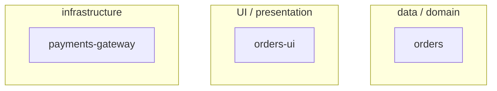
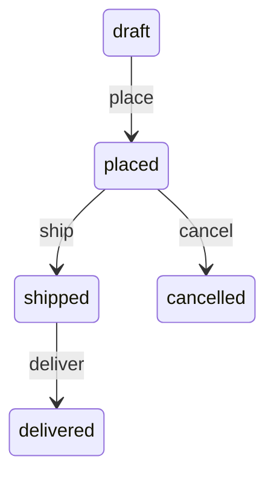
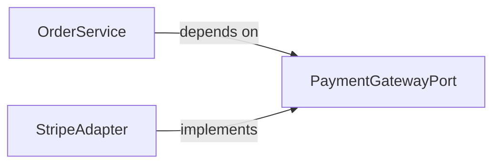
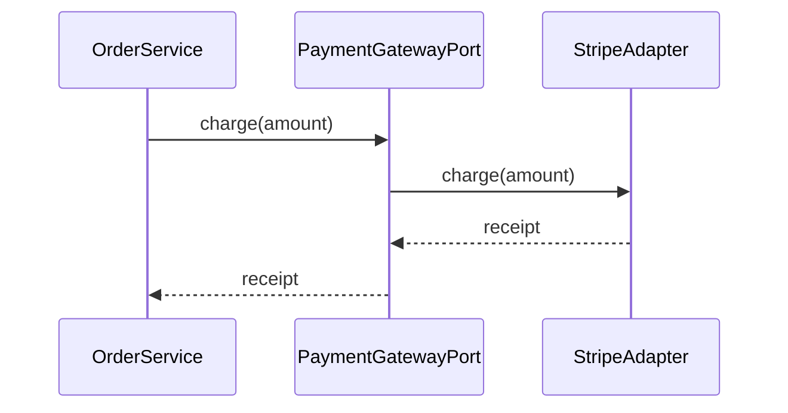
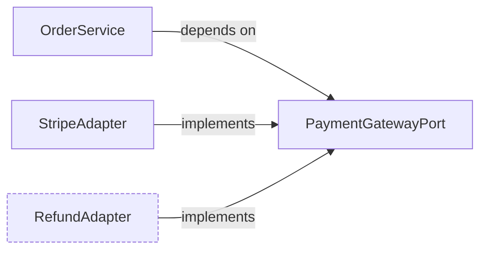

# Golden Module Diagram Ladder — worked example (module flow)

> **Назначение:** эталон СОСТАВА и МЕСТА каждой обязательной диаграммы module-флоу
> (`module.directive.xml` `STEP_1_MODULE_MAP` … `STEP_4_CONTRACTS_DBC`, плюс дельта-рунг на
> `STEP_6_FINAL_HIERARCHY` для refine/pivot), не формата произвольного текста вокруг неё.
> Показывает, какую диаграмму каждый шаг рисует в чате как ASCII ДО Approval Check, и в какую
> форму (mermaid, то же место в спеке) она превращается на STEP_6_FINAL_HIERARCHY.
> **Синхронизация:** при изменении диаграммной обвязки `module.directive.hbs` (STEP_1–STEP_4,
> STEP_6) или `formats/entity-inventory-format.xml` / `formats/entity-surface-format.xml` /
> `formats/dbc-contracts.xml` / `formats/pivot-formats.xml` — обновить этот файл (тот же принцип,
> что NFC-06 для `golden-chat-output.example.md`).
> **Потребление:** `READ_AND_USE_DIRECTIVE` в каждом из STEP_1–STEP_4, перед тем как шаг рисует
> свою диаграмму, — агент сверяет форму и место со СВОИМ рангом ниже, не копирует вымышленные
> имена сущностей буквально.
>
> ⚠️ **ASCII здесь — потому что markdown-файл не может вызвать виджет.** Это не значит «рисуй
> ASCII в живом чате». Медиум по `AX_VISUAL_TRANSPORT`-эквиваленту сценария: интерактивный чат с
> доступным `mcp__visualize__show_widget` рисует эти диаграммы виджетом; ASCII ниже — запасной
> эталон состава и структуры блока, не предписание формата.

---

## Сценарий (вымышленный, правдоподобные данные)

Скоуп `shop` (product), декомпозиция на модули; сущность `Order` внутри модуля `orders`;
контракт списания средств через платёжный шлюз.

---

### Ранг 1 — `STEP_1_MODULE_MAP`: оси декомпозиции

Вопрос: как биты скоупа `shop` раскладываются по `AX_SEPARATION_OF_CONCERNS` (данные/домен ↔ UI ↔
инфраструктура). Рисуется ПЕРЕД тем, как оператору предлагается подтвердить границы модулей.

**ASCII (чат):**

```
                     Scope: shop
        ┌────────────────┼────────────────┐
   data/domain           UI          infrastructure
        │                 │                 │
     [orders]      [orders-ui]     [payments-gateway]
```

**Mermaid (в `## Module Map` секции scope-спеки, per `SCOPE_SPEC_MODULE_MAP_UPDATE`):**



_Подпись (форма без ID — декомпозиция не иллюстрирует одно конкретное требование, per
`DIAGRAM_CAPTION_FORMAT`): три модуля, по одному на ось — ни один не пересекает границу._

---

### Ранг 2 — `STEP_2_ENTITY_INVENTORY`: ER-набросок (модуль `orders`, ≥2 связанных сущностей)

Инвентарь модуля `orders` называет `Order` и `OrderLine` — `OrderLine` ссылается на `Order`
(1:N). Две связанные сущности — порог для обязательного наброска (одна сущность или несвязанные
сущности эту диаграмму пропускают).

**ASCII (чат):**

```
Order ──1:N──▶ OrderLine
  - id (PK)      - id (PK)
  - customerId   - orderId (FK)
  - status       - sku, qty
```

**Mermaid (в `## Entity Inventory`, прямо под таблицей):**

```mermaid
erDiagram
  ORDER ||--o{ ORDER_LINE : has
  ORDER { string id PK; string customerId; string status }
  ORDER_LINE { string id PK; string orderId FK; string sku; int qty }
```

_Строка заказа не существует без заказа — владение однозначно — SHOP-REQ-4._

---

### Ранг 3 — `STEP_3_ENTITY_SURFACE`: state-диаграмма (сущность `Order`, Lifecycle ≥3 переходов)

`Order.Lifecycle` — не «создан → удалён», а полноценный автомат: `draft` → `placed` → `shipped` →
`delivered`, с веткой `cancelled`. Четыре состояния, три+ перехода — порог пройден.

**ASCII (чат):**

```
[draft] ──place──▶ [placed] ──ship──▶ [shipped] ──deliver──▶ [delivered]
              │
           cancel ──▶ [cancelled]
```

**Mermaid (под буллетом `Lifecycle` в `### Order` секции Entity Surfaces):**



_Отмена возможна только до отгрузки — `shipped` не имеет пути в `cancelled` — SHOP-REQ-5._

---

### Ранг 4 — `STEP_4_CONTRACTS_DBC`: граф Port/Adapter/Service (Module Contracts)

Модуль `orders` определяет `OrderService`, зависящий от `PaymentGatewayPort`; шлюз реализован
`StripeAdapter`. Направление зависимости — к стабильности (Port стабильнее и Service, и Adapter).

**ASCII (чат):**

```
OrderService ──depends on──▶ PaymentGatewayPort ◀──implements── StripeAdapter
```

**Mermaid (в `## Module Contracts`, над свёрнутым `<details>` с телом контрактов):**



_`OrderService` не знает про `StripeAdapter` — обе стороны говорят только с Port — SHOP-REQ-6._

---

### Ранг 5 — `STEP_4_CONTRACTS_DBC`: цепочка вызовов (Call Chain, ≥2 абстракции в инвентаре)

Новый рунг (решение 2026-08-20,
`specs/ai-skills/research/2026-08-20-visualization-chain.research.md`). Модуль `orders` инвентарём
называет ≥2 абстракции (`Order`, `OrderService`, `PaymentGatewayPort`, `StripeAdapter`) — порог
пройден. Отвечает на вопрос, который граф зависимостей (ранг 4) не закрывает: не «кто от кого
зависит», а «кто кого вызывает и в каком порядке» для главного сценария — списание за заказ.

**ASCII (чат):**

```
OrderService     PaymentGatewayPort     StripeAdapter
    │  charge(amount)     │                    │
    │────────────────────▶│  charge(amount)    │
    │                     │───────────────────▶│
    │                     │◀───────────────────│  receipt
    │◀────────────────────│  receipt           │
```

**Mermaid (в `## Module Contracts`, сразу после графа зависимостей ранга 4, per `CALL_CHAIN_FORMAT`):**



_Путь списания за заказ — сервис не ждёт ответа от `StripeAdapter` напрямую — SHOP-REQ-6,
SHOP-REQ-7._

**Табличная альтернатива** (равноправная форма для линейного сценария, per `CALL_CHAIN_FORMAT` —
не штрафуется относительно `sequenceDiagram`):

| Step | Participant        | Action         | Data    |
| ---- | ------------------ | -------------- | ------- |
| 1    | OrderService       | charge(amount) | amount  |
| 2    | PaymentGatewayPort | charge(amount) | amount  |
| 3    | StripeAdapter      | receipt        | receipt |
| 4    | PaymentGatewayPort | receipt        | receipt |

---

### Ранг 6 — `STEP_6_FINAL_HIERARCHY`: дельта (только `refine-module` / `pivot`)

Новый рунг (решение 2026-08-20), парный текстовой дельте `CHANGE_MANIFEST`. Сценарий: модуль
`orders` дорабатывается — добавляется возврат средств через `RefundAdapter`, реализующий тот же
`PaymentGatewayPort`. Неизменная часть (ранги 1–5 выше) НЕ перерисовывается — дельта показывает
только добавленный узел и добавленные шаги.

**ASCII (чат) — граф композиции, новый узел помечен:**

```
OrderService ──depends on──▶ PaymentGatewayPort ◀──implements── StripeAdapter
                                     ▲
                                     └──implements── RefundAdapter (добавлено)
```

**Mermaid (в `## Module Contracts`, рядом с `CHANGE_MANIFEST`, per `DELTA_DIAGRAM_FORMAT`):**



_Композиционная дельта — `RefundAdapter` добавлен, остальное не тронуто — SHOP-REQ-8._

**Добавленные шаги цепочки вызовов** (продолжение ранга 5, не переписывание — только новые
строки):

| Step          | Participant        | Action         | Data   |
| ------------- | ------------------ | -------------- | ------ |
| 5 (добавлено) | RefundAdapter      | refund(amount) | amount |
| 6 (добавлено) | PaymentGatewayPort | refund(amount) | amount |

_Возврат — добавленный хвост цепочки, шаги 1–4 не переписаны — SHOP-REQ-8._

---

**Итог состава:** 6 рангов на нетривиальный модуль (плюс дельта на refine/pivot), 6 разных
вопросов (оси / связи данных / жизненный цикл / граница контракта / порядок вызовов / что именно
изменилось) — ни один не дублирует другой, ровно как `AX_COMPREHENSION_LADDER` в agent-inbox не
допускает двух диаграмм на один и тот же вопрос. Отсутствие любого рунга на модуле, где его порог
пройден (не одна сущность, не двухсостояньевый lifecycle, не пустой Module Contracts, ≥2
абстракции для Call Chain, `refine`/`pivot` для дельты) — пробел, который STEP_6_FINAL_HIERARCHY
не должен обнаруживать первым. Этот полный состав — обязательный пол для НОВЫХ module-спек;
модуль, написанный до появления рангов 5–6, не становится задним числом невалидным из-за их
отсутствия.
