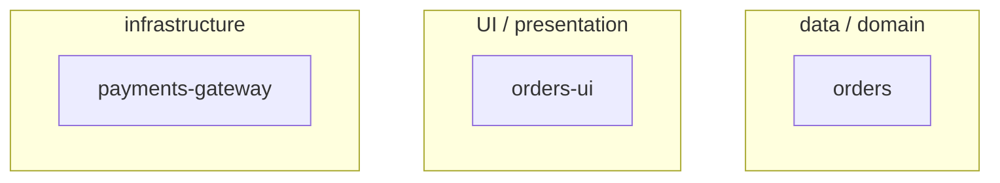
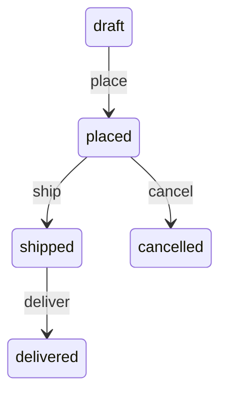
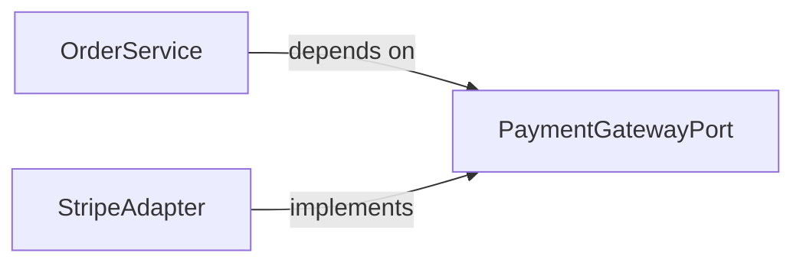

# Golden Module Diagram Ladder — worked example (module flow)

> **Назначение:** эталон СОСТАВА и МЕСТА каждой обязательной диаграммы module-флоу
> (`module.directive.xml` `STEP_1_MODULE_MAP` … `STEP_4_CONTRACTS_DBC`), не формата произвольного
> текста вокруг неё. Показывает, какую диаграмму каждый шаг рисует в чате как ASCII ДО Approval
> Check, и в какую форму (mermaid, то же место в спеке) она превращается на STEP_6_FINAL_HIERARCHY.
> **Синхронизация:** при изменении диаграммной обвязки `module.directive.hbs` (STEP_1–STEP_4) или
> `formats/entity-inventory-format.xml` / `formats/entity-surface-format.xml` /
> `formats/dbc-contracts.xml` — обновить этот файл (тот же принцип, что NFC-06 для
> `golden-chat-output.example.md`).
> **Потребление:** `READ_AND_USE_DIRECTIVE` в каждом из STEP_1–STEP_4, перед тем как шаг рисует
> свою диаграмму, — агент сверяет форму и место со СВОИМ рангом ниже, не копирует вымышленные
> имена сущностей буквально.
>
> ⚠️ **ASCII здесь — потому что markdown-файл не может вызвать виджет.** Это не значит «рисуй
> ASCII в живом чате». Медиум по `AX_VISUAL_TRANSPORT`-эквиваленту сценария: интерактивный чат с
> доступным `mcp__visualize__show_widget` рисует эти диаграммы виджетом; ASCII ниже — запасной
> эталон состава и структуры блока, не предписание формата.

---

## Сценарий (вымышленный, правдоподобные данные)

Скоуп `shop` (product), декомпозиция на модули; сущность `Order` внутри модуля `orders`;
контракт списания средств через платёжный шлюз.

---

### Ранг 1 — `STEP_1_MODULE_MAP`: оси декомпозиции

Вопрос: как биты скоупа `shop` раскладываются по `AX_SEPARATION_OF_CONCERNS` (данные/домен ↔ UI ↔
инфраструктура). Рисуется ПЕРЕД тем, как оператору предлагается подтвердить границы модулей.

**ASCII (чат):**

```
                     Scope: shop
        ┌────────────────┼────────────────┐
   data/domain           UI          infrastructure
        │                 │                 │
     [orders]      [orders-ui]     [payments-gateway]
```

**Mermaid (в `## Module Map` секции scope-спеки, per `SCOPE_SPEC_MODULE_MAP_UPDATE`):**



_Подпись: три модуля, по одному на ось — ни один не пересекает границу._

---

### Ранг 2 — `STEP_2_ENTITY_INVENTORY`: ER-набросок (модуль `orders`, ≥2 связанных сущностей)

Инвентарь модуля `orders` называет `Order` и `OrderLine` — `OrderLine` ссылается на `Order`
(1:N). Две связанные сущности — порог для обязательного наброска (одна сущность или несвязанные
сущности эту диаграмму пропускают).

**ASCII (чат):**

```
Order ──1:N──▶ OrderLine
  - id (PK)      - id (PK)
  - customerId   - orderId (FK)
  - status       - sku, qty
```

**Mermaid (в `## Entity Inventory`, прямо под таблицей):**

```mermaid
erDiagram
  ORDER ||--o{ ORDER_LINE : has
  ORDER { string id PK; string customerId; string status }
  ORDER_LINE { string id PK; string orderId FK; string sku; int qty }
```

_Подпись: строка заказа не существует без заказа — владение однозначно._

---

### Ранг 3 — `STEP_3_ENTITY_SURFACE`: state-диаграмма (сущность `Order`, Lifecycle ≥3 переходов)

`Order.Lifecycle` — не «создан → удалён», а полноценный автомат: `draft` → `placed` → `shipped` →
`delivered`, с веткой `cancelled`. Четыре состояния, три+ перехода — порог пройден.

**ASCII (чат):**

```
[draft] ──place──▶ [placed] ──ship──▶ [shipped] ──deliver──▶ [delivered]
              │
           cancel ──▶ [cancelled]
```

**Mermaid (под буллетом `Lifecycle` в `### Order` секции Entity Surfaces):**



_Подпись: отмена возможна только до отгрузки — `shipped` не имеет пути в `cancelled`._

---

### Ранг 4 — `STEP_4_CONTRACTS_DBC`: граф Port/Adapter/Service (Module Contracts)

Модуль `orders` определяет `OrderService`, зависящий от `PaymentGatewayPort`; шлюз реализован
`StripeAdapter`. Направление зависимости — к стабильности (Port стабильнее и Service, и Adapter).

**ASCII (чат):**

```
OrderService ──depends on──▶ PaymentGatewayPort ◀──implements── StripeAdapter
```

**Mermaid (в `## Module Contracts`, над свёрнутым `<details>` с телом контрактов):**



_Подпись: `OrderService` не знает про `StripeAdapter` — обе стороны говорят только с Port._

---

**Итог состава:** 4 диаграммы, 4 разных вопроса (оси / связи данных / жизненный цикл / граница
контракта) — ни одна не дублирует другую, ровно как `AX_COMPREHENSION_LADDER` в agent-inbox не
допускает двух диаграмм на один и тот же вопрос. Отсутствие любой из четырёх на нетривиальном
модуле (не одна сущность, не двухсостояньевый lifecycle, не пустой Module Contracts) — пробел,
который STEP_6_FINAL_HIERARCHY не должен обнаруживать первым.
