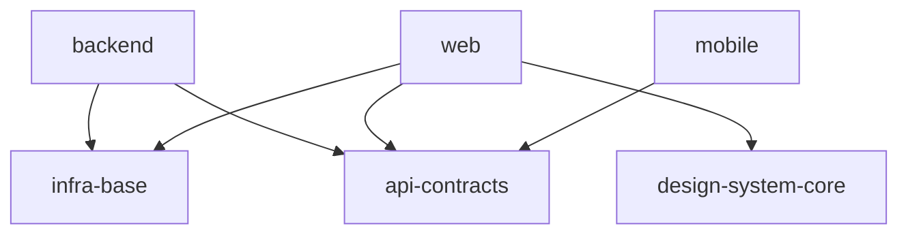

# SDD Directives

Spec-Driven Development. Two **orthogonal tracks** converge at task-scaffolding. Each directive runs in **its own isolated session** and produces a self-contained artifact.

## Flow

```
              Project setup (what exists)
              ┌───────────────────────────────────────┐
              │ setup (portal + scope graph)          │
              └───────────────────────────────────────┘
                                │
                                ▼
              Scope discovery (per scope)
              ┌───────────────────────────────────────┐
              │ discovery (any scope-type)            │──┐
              └───────────────────────────────────────┘  │
                                                         │
              Module decomposition (library/product)     │
              ┌───────────────────────────────────────┐  │
              │ module-decomposition (optional)       │──┤
              └───────────────────────────────────────┘  │
                                                         ├──> task-scaffolding ──> task-execution ──> audit
```

| Directive                            | Track                        | Input                                                        | Output                                                              |
| ------------------------------------ | ---------------------------- | ------------------------------------------------------------ | ------------------------------------------------------------------- |
| `setup.directive.xml`                | project                      | operator intent (vision + scope graph + optional infra-base) | `specs/README.md` (Vision + Scope Graph)                            |
| `discovery.directive.xml`            | scope                        | scope name + scope-type + operator intent                    | `specs/<scope>/<scope>.spec.md` (living, branches by scope-type)    |
| `module-decomposition.directive.xml` | scope (library/product only) | scope spec                                                   | `specs/<scope>/<module>/<module>.spec.md` + Module Map в scope-spec |
| `task-scaffolding.directive.xml`     | convergence                  | scope graph + all scope specs                                | `tasks/<scope>/README.md` (Cascade Table from graph) + task tickets |
| `task-execution.directive.xml`       | execution                    | one ticket + cascade rules                                   | Filled Execution Log round + code/config changes                    |
| `audit.directive.xml`                | verification                 | DONE round + code                                            | Ephemeral findings → routed to spec/ticket per Audit routing table  |

## Scope Model

### Что такое scope

**Scope** — архитектурно когерентная единица, заслуживающая собственного Golden DX, архитектурных решений и deployment target. Тест «scope vs module»:

- Scope: отдельный runtime / deployment / стек / UX-surface. Примеры: `backend` (Node service), `web` (React SPA), `mobile` (Swift), `infra-base` (shared tooling).
- Module: внутренняя часть scope'а, не имеющая отдельного deployment. Примеры: `auth`, `payments`, `orders` внутри `backend`.

### Naming-конвенция scope'ов

| Паттерн                     | Назначение                                                      |
| --------------------------- | --------------------------------------------------------------- |
| `infra-<specifics>`         | Infrastructure scope (infra-base, infra-golang, infra-frontend) |
| `design-system-<specifics>` | Shared UI library scope                                         |
| `api-contracts`             | Cross-scope API contracts (OpenAPI / gRPC / proto)              |
| `<plain-name>`              | Product scope (backend, web, mobile, desktop)                   |

### scope-type таксономия

Каждый scope-spec содержит поле `scope-type`. Тип определяет шаблон spec и допустимые секции:

| scope-type       | Обязательные секции                                                                                 | Недоступные секции                                      |
| ---------------- | --------------------------------------------------------------------------------------------------- | ------------------------------------------------------- |
| `infrastructure` | Vision, Tool Stack (Decision Log), Dev Workflow, File Structure, Effective Rules                    | Golden DX, Entity Inventory, DbC, Architecture Variants |
| `contracts`      | Vision, Versioning policy, Interfaces (schema/OpenAPI/proto), Compatibility matrix                  | Architecture Variants, DbC в полном виде                |
| `library`        | Vision, Golden DX, Public API surface, DbC                                                          | UX-сценарии, deployment concerns                        |
| `product`        | Vision, Project Type, Golden DX, Requirements Gate, Architecture, модули через module-decomposition | —                                                       |

### Граф зависимостей и cascade

Scope-граф в `specs/README.md` содержит явные рёбра `depends-on`. Cascade Table для каждого scope = union effective rules от всех достижимых scope'ов в графе зависимостей + target-scope rules + module rules + task rules (5-тировая иерархия вместо жёстких 4 тиров).

Cascade материализуется в `tasks/<scope>/README.md` как Cascade Table — генерируется автоматически из графа, не пишется руками.

### Audit routing table

Audit работает как subagent. Findings маршрутизируются:

| Тип finding'а                | Действие                                                  |
| ---------------------------- | --------------------------------------------------------- |
| `CLOSED_WORLD_DRIFT`         | spec edit (добавить entity в Inventory) или ticket reopen |
| `COMPLETENESS_GAP`           | ticket reopen — Round N                                   |
| `RUNTIME_BACKING_VIOLATION`  | spec edit (deferred scope) или ticket reopen              |
| `RULES_COMPLIANCE_VIOLATION` | ticket reopen Round N                                     |
| `RULES_CASCADE_MISMATCH`     | ticket update (Activation Plan)                           |
| `BDD_COVERAGE_MISMATCH`      | ticket reopen или ticket update                           |
| `EXECUTION_LOG_INCOMPLETE`   | ticket update / reopen                                    |
| `INSIGHT_BACKFLOW`           | spec edit (scope или module spec)                         |
| `STALE_AFTER_PIVOT`          | reopen/refine соответствующего scope                      |
| `TASK_ID_DRIFT`              | code-fix через ticket reopen                              |
| `operator-acknowledged risk` | Decision Log entry в scope-spec                           |

**Audit output discipline:**

- Output формат — **компактный AI-to-AI inline** (per `AUDIT_SESSION_SUMMARY_FORMAT`): один `@audit` header + по одной строке на finding с pipe-delimited key=value полями. Без markdown-таблиц и декораций. Сделано так, чтобы следующий агент (или operator's tooling) парсил за один проход.

  Образец:

  ```
  @audit task=TSK-04 round=3 mode=per-task status=FAIL counts=B1·M2·m0·I1
  F-01 | sev=B | type=CLOSED_WORLD_DRIFT | conf=H | loc=src/payments/adapter.ts:42 | src=specs/backend/payments/payments.spec.md#2 | route=spec-edit | act=добавить `IdempotencyKey` в Entity Inventory
  F-02 | sev=M | type=RULES_COMPLIANCE_VIOLATION | conf=H | loc=src/payments/adapter.ts:100 | src=ai/directives/coding/typescript-rules.xml#AX_STRICT_NULL | route=ticket-reopen | act=добавить null-guard
  ```

  Только `act=` — operator-facing prose (Russian per policy). Всё остальное — English токены.

- **PASS audit без reopen** → ephemeral block в chat, файлы не пишутся.
- **FAIL audit ИЛИ любой finding с routing на ticket reopen** → audit append'ит `## Audit Rounds` секцию в **сам ticket file** (per `AX_REOPEN_ROUNDS_IN_TICKET` + `TICKET_AUDIT_ROUND_FORMAT`). Внутри секции — тот же компактный grammar, обёрнутый в fenced code block. Round-history живёт рядом с Execution Log rounds, которые она вызвала. Append-only — старые audit rounds immutable.
- Отдельной директории `audits/` нет (deprecated с v3.0). Долгосрочная история = git diff соответствующих spec и ticket файлов.

## Read first

Before invoking any directive, read `ai/knowledge.xml` — it contains selection signals (Triggers, SkipWhen, Keywords, Preconditions) for picking the right directive.

## Principles

- **Isolated sessions.** Each directive runs in its own session. Do not merge directives into a single pass — isolation breaks and context noise accumulates.
- **Stateless artifacts.** Each session's final artifact is 100% self-contained. The next session reads only the artifact, not the conversation history.
- **Closed-world fidelity.** Implementation must not introduce entities absent from the spec. Any deviation is an audit candidate.
- **Decision Log.** Architectural decisions with risks or alternative choices are recorded with rationale **in the operator's own words**. Stable `D-NNN` IDs, extensible format, supersession without deletion of older entries.
- **Rules cascade (5 tiers).** Rules are declared across the scope graph dependency chain: `traversed-scopes` (union from all reachable scopes via depends-on edges) → `target-scope` → `module` → `task`. Effective set per task = union of all present tiers, with later tiers overriding earlier on collisions. Cascade Table is materialized per-scope in `tasks/<scope>/README.md`; per-task effective set is baked into each ticket.
- **Hierarchical tasks.** `tasks/` mirrors scope hierarchy: project-level README at the root with high-level (cross-scope) DAG, per-scope READMEs with intra-scope DAG and detailed tracker, cross-scope integration tasks under `tasks/_integration/`.
- **Compact tickets.** Project-wide content (file-header convention, baseline Completion Rule, Execution Log template, post-task audit hint) lives once in `tasks/README.md`, not duplicated into every ticket. Tickets carry only task-specific Meta + BDD + Verification + Test Coverage + the round-structured Execution Log instance.
- **Task-IDs are stable.** Project-wide unique sequential `TSK-NN`. Files touched by tasks carry a `// @file: / @consumers: / @tasks:` line-comment header (per `AX_FILE_HEADER_TASK_TRACEABILITY`); `@tasks:` is append-only, IDs only, never paths. Multiple IDs per file are expected when more than one task touched a file.
- **Append-only logs.** Execution Log structured by rounds; on reopen a new `### Round N` section is appended; prior rounds are immutable.
- **Reopen vs new task.** A task is reopened (rather than a new bugfix ticket spawned) when the contract holds: same BDD scenarios, same Target Files, internal cause (rules update, refinement, late-detected bug). New scenarios or expanded scope require a new task. Operator triggers reopen; execution agent never decides unilaterally.
- **Spec updates only via proposal.** Execution agent records `Insight: ... Suggested spec update: ...` in the Execution Log. Audit converts these into `INSIGHT_BACKFLOW` findings. Operator approves and applies. Specs are never edited by execution.
- **Mandatory rules linkage.** Every effective rule reference in any source must resolve to an existing file under `ai/directives/<category>/<rule>.xml`. If anything is missing, scaffolding aborts.
- **Agent neutrality.** Directives surface trade-offs objectively and do not push a single viewpoint. The agent does not auto-agree with the operator: it asks for justification, surfaces risks, and refuses to record a choice without explicit rationale.
- **Phase gates by operator.** The agent signals phase readiness (`READY_TO_ADVANCE`), but only the operator closes the phase. Phase Progress is shown every round.
- **Frame stack discipline.** Discovery and module-decomposition track dialogue as an explicit frame stack (`AX_STACK_BASED_FLOW`, `AX_FRAME_EXIT_DISCIPLINE`). Sub-topics open nested frames; status vocabulary is `OPEN`/`BLOCKED`/`READY_TO_RETURN`/`READY_TO_ADVANCE`/`DEFERRED`. Pop on resolution with a Return Summary; indefinite drilling is forbidden.
- **Evidence hygiene.** Facts / Assumptions / Hypotheses are separated explicitly (`AX_EVIDENCE_HYGIENE`). Conflation is the most common path to false confidence.
- **Uncomfortable questions.** Every meaningful intake frame includes ≥1 question that exposes hidden assumptions, degradation paths, or trust boundaries (`AX_UNCOMFORTABLE_QUESTIONS`). Skipping = false consensus.
- **DX first.** For product / library scopes the Golden DX Example precedes Design Variants (`AX_DX_FIRST`). DX shape varies by Project Type: API DX for library / sdk, UX-flow for app, CLI DX for cli-utility.
- **Runtime Backing posture, explicit and early.** Product / library scope specs declare posture per major capability (`not-implemented` | `simulation` | `real-runtime`) inside §Requirements & Constraints (`AX_RUNTIME_BACKING_EXPLICIT`). Trust boundaries requiring a real runtime hook are listed. Early posture prevents downstream phases from misclassifying simulation seams as real implementations.
- **Versioning per directive.** Each directive carries its own `ver` in the root tag. Bump on behavior-affecting changes. History lives in VCS.

## Roles, agents, and activation

Directives govern agents. When directive prose mentions an «agent», «auditor», or similar role, it means: the agent operating under a specific directive. The mapping is:

| Phrase in prose                      | Means                              | Activated by                         |
| ------------------------------------ | ---------------------------------- | ------------------------------------ |
| «setup agent»                        | agent under `setup`                | `setup.directive.xml`                |
| «discovery agent» / «DX Designer»    | agent under `discovery`            | `discovery.directive.xml`            |
| «module-decomposer»                  | agent under `module-decomposition` | `module-decomposition.directive.xml` |
| «scaffolding agent» / «task planner» | agent under `task-scaffolding`     | `task-scaffolding.directive.xml`     |
| «execution agent» / «implementer»    | agent under `task-execution`       | `task-execution.directive.xml`       |
| «auditor» / «audit agent»            | agent under `audit`                | `audit.directive.xml`                |
| «operator»                           | human triggering directives        | —                                    |

When a directive says «activate the `<name>` directive» or «run the `<name>` directive», it means: open a fresh isolated session and load that directive file. Cross-directive axiom references take the form `AX_<NAME>` in `<directive-name>`.

## Modes per directive

Each phase directive auto-detects its operating mode from the operator's intake **and from the presence of `specs/README.md`** (the Project Portal — see «Project Portal» section below). Ambiguity halts the directive with a binary clarifying question — modes are NEVER assumed silently.

| Directive              | Modes                                                 | Detection signal                                                                                                                                               |
| ---------------------- | ----------------------------------------------------- | -------------------------------------------------------------------------------------------------------------------------------------------------------------- |
| `setup`                | (idempotent)                                          | Portal absent → init. Portal exists + intake → update. Portal exists + empty intake → `H_NO_INTENT`.                                                           |
| `discovery`            | `greenfield` / `refine` / `pivot`                     | No scope spec → greenfield. Spec exists + verb decides refine vs pivot; ambiguous → HALT.                                                                      |
| `module-decomposition` | `initial` / `add-module` / `refine-module`            | No module rows in scope spec §Module Map → initial. Existing rows + «add module X» → add-module. Existing rows + «refine X» → refine-module. Ambiguous → HALT. |
| `task-scaffolding`     | `initial` / `extend-dag`                              | No `tasks/` → initial. `tasks/` exists + clear extension target → extend-dag. Reads `specs/README.md` first to detect scope graph.                             |
| `task-execution`       | (single mode — atomic per task)                       | —                                                                                                                                                              |
| `audit`                | `per-task` / `epic-level` (existing `AX_AUDIT_MODES`) | Operator passes one Task-ID → per-task. List of IDs or scope → epic-level.                                                                                     |

**Key rules across all directives:**

- **`specs/README.md` is the authoritative Project Portal.** Primary owner: `setup`. Narrow exception (per `AX_PORTAL_PRIMARY_OWNER`): `discovery` may append one placeholder row tagged `🚧 (awaiting setup sync)` when creating a brand-new scope — reconciled into a full row on the next `setup` run. Any other edit by another directive = audit finding.
- **Code is never read by phase directives** (`AX_SPEC_IS_SOLE_SOURCE`). Spec is the only source of truth. The single exception is `audit`.

## Project Portal (specs/README.md)

`specs/README.md` — единственный entry point в проект. Primary owner: `setup.directive.xml`. Narrow exception: `discovery` при создании нового scope может append'нуть одну placeholder-строку `🚧 (awaiting setup sync)`. `setup` при следующем запуске reconcile'ит placeholder в полноценную строку. Никакая другая директива не редактирует этот файл.

Структура:

````markdown
# <project-name>

## Vision

<Одно предложение — зачем существует проект. Только в application проектах.>

## Scope Graph


````

## Scopes

| Scope                                                    | Type           | Spec | Description                           |
| -------------------------------------------------------- | -------------- | ---- | ------------------------------------- |
| [`infra-base`](./infra-base/infra-base.spec.md)          | infrastructure | ✅   | TS + pnpm + vitest + biome + lefthook |
| [`api-contracts`](./api-contracts/api-contracts.spec.md) | contracts      | ✅   | REST API v1 между backend и клиентами |
| [`backend`](./backend/backend.spec.md)                   | product        | ✅   | Node.js IMAP-сервис                   |
| [`web`](./web/web.spec.md)                               | product        | 🚧   | React SPA                             |

```

Строки в таблице добавляются так:
- `discovery` при создании нового scope append'ит placeholder-строку `🚧 (awaiting setup sync)` — scope становится виден в Portal до следующего `setup`.
- На ближайшем `setup` placeholder reconcile'ится в полноценную строку (со ссылкой на готовый spec и описанием).
- Оператор может вручную запустить `setup` в любой момент — Portal идемпотентен.

## Pivot mechanics

Pivot mode in `discovery` is the formal mechanism for evolving an existing scope's foundational decisions:

- The scope spec is **reworked in place** — old content is removed from spec body, not marked `superseded` inline.
- Each rework gets a self-contained Decision Log entry: `Was → Now`, `Why`, `Risk`, `Supersedes`, `Pre-rework state` (git commit-sha for predecessor state).
- §Pivot Invalidation List enumerates downstream artifacts that became stale: module specs to refine, tasks to reopen, rules to revisit.
- Downstream phases react: `module-decomposition` runs `refine-module` for listed modules; `task-execution` reopens listed tasks (new round); `audit` raises `STALE_AFTER_PIVOT` findings for unaddressed items.

Git is the version control mechanism. Old spec states live in git history; the Decision Log entry alone is enough for downstream phases to reconstruct context without reading git.

## Session isolation

**Strict rule:** no two phase directives coexist in one session. The artifact-based handoff requires a clean context boundary between phases. Mixing produces:

| Pair | Why forbidden |
|---|---|
| `setup` + anything | Portal authorship and scope-graph decisions need a clean room |
| `discovery` + anything | `AX_SPEC_IS_SOLE_SOURCE` forbids reading code (and `specs/` in greenfield) while drafting; later phases require reading them |
| `discovery` + `module-decomposition` | module-decomposition reads the final scope spec; discovery is still mutating it |
| `module-decomposition` + `task-scaffolding` | scaffolding reads specs; module-decomposition is still mutating them |
| `task-scaffolding` + `task-execution` | execution starts implementing while planning is unfinished — scope creep |
| `task-execution` + `audit` | self-audit by the same agent is biased; audit needs a fresh-eyes context boundary |

Allowed within ONE session:
- the directive itself + its referenced rule files (`ai/directives/<category>/<rule>.xml`);
- the directive itself + the spec/ticket artifacts it consumes;
- one directive in `epic-mode` over multiple targets (e.g., `audit` over a list of task-IDs per `AX_AUDIT_MODES`).

## File access discipline

**Open referenced files directly via the Read tool. Do NOT search-then-read.**

All paths in directives, specs, tickets, and cascade tables are canonical addresses — not hints. When a directive references `ai/directives/<category>/<rule>.xml` or any other artifact, the Read tool with that exact path is the only tool needed.

Why this matters: the SDD meta-directory `ai/` starts with a dot. Many tool environments (sandboxes, search utilities, IDEs with default filters) exclude hidden directories. An agent that runs `find` or `glob` before `Read` may get an empty result and falsely conclude the file is missing — when it simply wasn't searched. Read directly bypasses this entirely: it succeeds with content, or fails with a clear error you can escalate.

Discipline:
- Path is given → Read it. No verification step beforehand.
- Read fails → escalate via `[!] BLOCKED` with the exact failing path. Do NOT fall back to `find` / `glob` / `grep` looking for alternatives.
- Path is unknown (rare in SDD context — usually paths are explicit in cascade / ticket / spec) → only then is search appropriate.

## Output paths

**Portal (primary owner: `setup`):**
- `specs/README.md` — Project Vision + Scope Graph. Primary owner: `setup.directive.xml`. Narrow exception для placeholder append'а — см. секцию выше.

**Per-scope specs (owned by `discovery`):**
- `specs/<scope>/<scope>.spec.md` — scope spec (living; structure зависит от `scope-type`).

**Module specs within scope (owned by `module-decomposition`, только для library/product):**
- `specs/<scope>/<module>/<module>.spec.md` — module specs с closed-world inventory и DbC contracts.

**Tasks:**
- `tasks/<scope>/README.md` — scope-level tracker: Cascade Table (derived from scope graph), DAG, Tracker.
- `tasks/<scope>/<scope>.task-NN.md` — task tickets.
- `tasks/<scope>/<module>/<module>.task-NN.md` — module-level tickets (когда модули в scope).
- `tasks/_integration/` — cross-scope integration tickets.

## Rule directories

Each category has its own README listing currently-available and planned rule files. Categories cascade through the scope graph.

| Category | Purpose | Currently available |
|---|---|---|
| [`coding/`](../coding/README.md) | language + framework rules (HOW to write code) | `typescript-rules.xml` |
| [`testing/`](../testing/README.md) | test framework usage | `node-test.xml`, `vitest-rules.xml` |
| [`architecture/`](../architecture/README.md) | composition pattern rules | _(none yet — `ports-adapters.xml` planned)_ |
| [`quality/`](../quality/README.md) | cross-cutting code quality | `eslint-rules.xml` |
| [`vcs/`](../vcs/README.md) | repository management (mandatory in infrastructure scopes) | [`git.xml`](../vcs/git.xml) — mandatory |
| [`runtimes/`](../runtimes/README.md) | runtime setup per package-manager choice | `nodejs-npm-rules.xml` |
```
