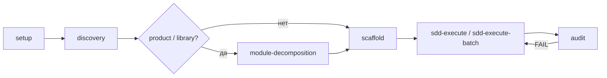

# SDD — Spec-Driven Development

> 🧭 **Начать стоит с [единого гайда по SDD Flow](../../../docs/sdd-flow.md)** — там сценарии по шагам,
> от новичка до продвинутого, с диаграммами. Здесь — справочник директив и потока.

Фреймворк для разработки через спецификации. Каждая директива запускается в **изолированной сессии** и производит самостоятельный артефакт. Директивы читаются агентами напрямую (см. скиллы `ai/skills/sdd-*`).

## Поток


```mermaid
flowchart LR
    A[setup] --> B[discovery]
    B --> C{product / library?}
    C -->|да| D[module-decomposition]
    C -->|нет| E
    D --> E[scaffold]
    E --> F["sdd-execute / sdd-execute-batch"]
    F --> G[audit]
    G -->|FAIL| F
```

```
setup ──► discovery ──► module-decomposition? ──► scaffold ──► sdd-execute (orchestrator) ──► audit
           (per scope)    (library/product only)                │
                                                                 ├─► phase-subagent (P1, P2, ...)
                                                                 │   under phase-execution-protocol
                                                                 └─► audit-subagent
```

Параллельно основному потоку: `sdd-critic` (критика спек/тасков до исполнения), `sdd-check`
(read-only верификация дерева), `sdd-continue`/`sdd-fix` (итерация).

## Директивы

| Директива                            | Что делает                                                                  | Входные данные              | Выходные данные                           |
| ------------------------------------ | --------------------------------------------------------------------------- | --------------------------- | ----------------------------------------- |
| `setup.directive.xml`                | Создаёт/обновляет портал проекта — Vision и Scope Graph (sole owner)        | Намерение оператора         | `specs/README.md`                         |
| `discovery.directive.xml`            | Проектирует scope: vision, архитектура, инструменты; режимы greenfield/refine/pivot | Название scope + scope-type | `specs/<scope>/<scope>.spec.md`           |
| `module-decomposition.directive.xml` | Декомпозирует scope на модули (только library/product)                      | scope-spec                  | `specs/<scope>/<module>/<module>.spec.md` |
| `scaffold.directive.xml`             | Строит DAG task-тикетов с Phases Overview, BDD, правилами per phase          | Все scope-specs             | `tasks/README.md`, `tasks/<scope>/*.task-NN.md` |
| `phase-execution-protocol.xml`       | Выполняет ОДНУ фазу одного тикета (диспетчится `sdd-execute` оркестратором) | Phase ID + ticket + Handoff | Изменения в Target Files фазы + лог-блок  |
| `audit.directive.xml`                | Проверяет выравнивание: spec ↔ тикет ↔ код; маппит finding-ы на фазы         | Закрытый Round + код        | Вердикт + `phases_to_fix`                 |
| `critic.directive.xml`               | Оркестратор многораундовой критики спек/тасков (min 3 / max 5 раундов)      | Артефакт (спека/таск)       | Доработанный артефакт / вердикт CLEAN     |
| `critic-protocol.xml`                | Изолированный критик-сабагент: read-only, только артефакт + родительская спека | Артефакт                  | Находки (отчёт)                           |
| `fix.directive.xml`                  | Findings → классификация → план → фиксы → reopen → execute → verify          | Находки (ревью/аудит/check) | Исправления + переоткрытые тикеты         |
| `interview-protocol.xml`             | Движок интервью оператора: coverage map, один вопрос за сообщение            | scope-type + focus          | Закрытая карта покрытия + ответы          |
| `visual-vocabulary.xml`              | Cheat-sheet диаграмм: ASCII в чате / mermaid в спеках                        | Контекст авторинга          | Выбор диаграммы                           |
| `svelte-ui-discovery.directive.xml`  | Компонент-спека `.ui.spec.md` из Figma SVG (component-level, дополняет flow) | Имя компонента + SVG        | `specs/<scope>/components/<name>.ui.spec.md` |

Оркестрация — через SKILL-ы (`sdd-execute`, `sdd-execute-batch`). Они читают только заголовок тикета + Phases Overview и диспетчат phase-subagent-ов; никогда не выполняют сами.

## Scope Model

**Scope** — архитектурно когерентная единица со своим runtime / deployment / стеком / UX-surface.

| scope-type       | Пример scopes                | Ключевые секции спека                               |
| ---------------- | ---------------------------- | --------------------------------------------------- |
| `infrastructure` | `infra-base`, `infra-golang` | Tool Stack, Dev Workflow, Verification Commands     |
| `contracts`      | `api-contracts`              | Interfaces, Versioning Policy, Compatibility Matrix |
| `library`        | `design-system-core`         | Golden DX, Public API, DbC                          |
| `product`        | `backend`, `web`, `mobile`   | Vision, Requirements Gate, Architecture, Modules    |

## Правила

Правила организованы в три категории. Каждый тикет декларирует фазы (`## 2. Phases Overview`), а каждая фаза содержит свой `Rules:` bullet-список — отфильтрованный subset, релевантный именно этой фазе.

| Категория | Директория               | Назначение                       |
| --------- | ------------------------ | -------------------------------- |
| Coding    | `ai/directives/coding/`  | Как писать код (язык + паттерны) |
| Testing   | `ai/directives/testing/` | Как писать тесты (фреймворк)     |
| Infra     | `ai/directives/infra/`   | Как конфигурировать инструменты  |
