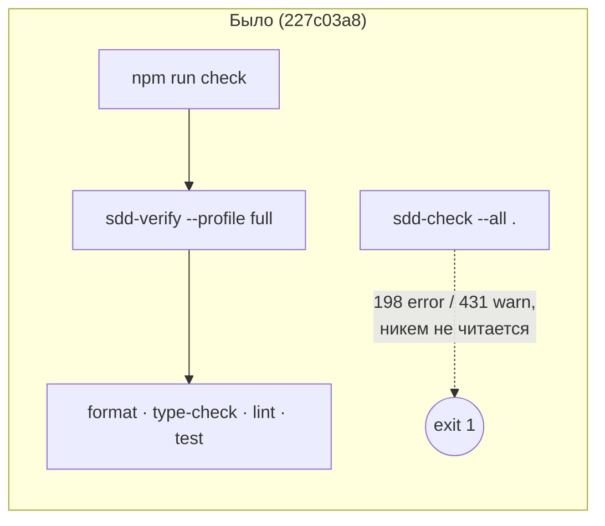
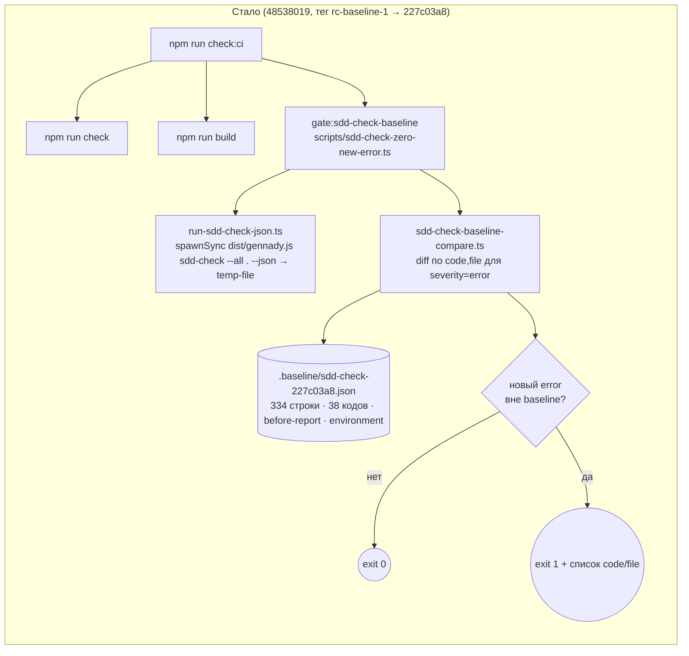

ОТЧЁТ 61/Бриф 0/5 — REL-17 + GAP-B-1: заморозка среза и baseline находок (Волна −1)

СТАТУС: DONE

КОММИТЫ (ветка `lead/rel-17-baseline`, локальная, создана из `origin/codex/sdd-v2-rc52-followup`; НИЧЕГО не запушено):
- `d2aaf2a355d409cedf8f97d3261f38daa1b0f05e` chore(rel-17): freeze RC snapshot at rc-baseline-1 (227c03a8) — before-report
- `48538019e76de2df3105dd59456fd12c546492a5` feat(gap-b-1): versioned sdd-check baseline + zero-new-error CI gate

ТЕГ (локальный, аннотированный, НЕ запушен):
- `rc-baseline-1` (tag object `e64b3219843b3a6a18b03c726d8e9a435918355d`) → commit `227c03a83830124fe2aa22541dd5374beb8a53c6`
- Ветка создана командой: `git switch -c lead/rel-17-baseline origin/codex/sdd-v2-rc52-followup`
- `git fetch origin codex/sdd-v2-rc52-followup` перед стартом: `origin/codex/sdd-v2-rc52-followup` = `227c03a8...` (SHA НЕ сдвинулся с момента брифа — коммиты легли поверх того же коммита, на который указывает и тег).

---

## СДЕЛАНО

### REL-17 (снят до создания любых файлов)

1. `git status --porcelain=v1 --untracked-files=all` на 227c03a8, ДО создания любых файлов задачи:
   ```
   ?? .npm-ci-done
   ```
   Единственная строка — `.npm-ci-done`, предсуществующий untracked scratch-маркер установки зависимостей (создан ДО начала этой задачи, не частью REL-17/GAP-B-1). Дерево иначе чистое.

2. Тег `rc-baseline-1` создан на `227c03a83830124fe2aa22541dd5374beb8a53c6` и НЕ двигается (проверено `git rev-parse rc-baseline-1^{commit}` == `227c03a83830124fe2aa22541dd5374beb8a53c6` до и после коммитов).

3. Окружение зафиксировано в `ai/flow-eval/.baseline/environment.json`:
   - Node `v22.19.0`, npm `10.9.3`
   - `uname -a`: `Darwin k-lebedev 23.6.0 Darwin Kernel Version 23.6.0: Tue Feb 24 20:49:05 PST 2026; root:xnu-10063.141.1.711.7~1/RELEASE_ARM64_T6030 arm64`
   - `sw_vers`: macOS 14.8.5 (BuildVersion 23J423)
   - `package-lock.json` sha256: `324e04c77de935dfc8595439b689f02d6850a390a031b68173d60278546c1c2d`

4. Before-отчёт снят и закоммичен: `ai/flow-eval/.baseline/before-report.md` — гистограммы по severity (198/431), по code (38 кодов, per-code error/warn), по file (top-15 из 172 файлов с находками, дедуплицированные по (code,file,severity)).

### GAP-B-1

5. Baseline-артефакт `ai/flow-eval/.baseline/sdd-check-227c03a8.json` — схема `gennady.sdd-check.baseline.v1`:
   - `findings`: 334 уникальные строки `(code, file, severity)`, дедуплицированы и отсортированы **прямым codepoint-сравнением** (НЕ `localeCompare` — коллация ICU/локали не гарантированно одинакова на разных машинах; см. комментарий в исходнике).
   - `countsByCode`: сырые (недедуплицированные) счётчики error/warn по каждому из 38 кодов — НЕ общий счётчик.
   - `totals`: `{ errors: 198, warnings: 431, files: 212 }` (справочно, не критерий гейта).
   - `commit`/`tag`/`generatedBy`/`generatedAt` — происхождение артефакта.

6. Библиотека сравнения (чистая, без fs/process — юнит-тестируема напрямую):
   `ai/flow-eval/scripts/sdd-check-baseline-compare.ts` — `zeroNewErrorVerdict`, `toBaselineFindings`, `dedupeSortFindings`, `countsByCode`.

7. Общий раннер `ai/flow-eval/scripts/run-sdd-check-json.ts` — вызывает `sdd-check --all <root> --format json` (приоритет `dist/gennady.js`, фолбэк `npx tsx cli/gennady.ts` — НЕ `npx gennady`, см. обоснование в брифе). **Важная находка по пути**: `sdd-check`'s JSON-вывод (~62 КБ на этом дереве) обрезается при захвате через ПАЙП (`spawnSync(..., {encoding:'utf8'})`) — это воспроизводимая на этой платформе усечка записи в stdout перед немедленным `process.exit()` (классическая проблема Node: неблокирующий pipe на stdout + синхронный большой `console.log` + быстрый `process.exit`). Обойдено записью в реальный временный ФАЙЛ (`stdio: ['ignore', fd, 'pipe']`) — блокирующая ОС-запись не подвержена этому эффекту. Подтверждено эмпирически: пайп усекался на одном и том же байтовом смещении при каждом прогоне; файловый захват — никогда.

8. CLI-гейт `ai/flow-eval/scripts/sdd-check-zero-new-error.ts` — сравнивает свежий прогон с baseline по `(code, file)` для error-находок; предупреждения (известные и новые) никогда не роняют гейт. Использование: `node --import tsx ai/flow-eval/scripts/sdd-check-zero-new-error.ts --baseline <path> [--root <dir>]`.

9. Генератор `ai/flow-eval/scripts/generate-sdd-check-baseline.ts` — операторский one-shot (НЕ подключён ни к одному npm-скрипту): отказывается работать, если `git rev-parse HEAD` не совпадает с переданным `--commit` (защита от пересборки не на том дереве). Использован для создания текущего артефакта; повторный вызов будущей отдельной задачей с явным OK оператора (D-38) детерминированно воспроизведёт тот же файл.

10. Юнит-тест `ai/flow-eval/scripts/__tests__/sdd-check-baseline-compare.test.ts` — 9 проверок в 4 сьютах, фикстурные baseline:
    - identical findings → `{ ok: true }`
    - один новый error, отсутствующий в baseline → `{ ok: false, newErrors: [{code,file}] }` (именован)
    - один новый warning → `{ ok: true }` (никогда не роняет)
    - + дополнительные: baseline-error, пропавший из свежего прогона (починен) → ok; одна и та же пара (code,file) на разных строках → одна запись; несколько новых error → все именованы, отсортированы; маппинг severity; дедупликация/сортировка; countsByCode считает по сырым находкам.
    Подхватывается `npm test` автоматически: `ai/flow-eval/` уже входит в `UNIT_ROOTS`/`TEST_ROOTS` `scripts/test-topology.ts` — правка `test-topology.ts` НЕ потребовалась (проверено `node --import tsx scripts/test-topology.ts list` → `unit  ai/flow-eval/scripts/__tests__/sdd-check-baseline-compare.test.ts`).

11. `package.json`: добавлены скрипты
    ```
    "gate:sdd-check-baseline": "node --import tsx ai/flow-eval/scripts/sdd-check-zero-new-error.ts --baseline ai/flow-eval/.baseline/sdd-check-227c03a8.json",
    "check:ci": "npm run check && npm run build && npm run gate:sdd-check-baseline"
    ```
    **НЕ добавлено** в `check` (вызывается pre-commit-ом на каждый коммит) и **НЕ добавлено** в сам `scripts/git-hooks/pre-commit` — прямое требование брифа "не замедлять pre-commit". `check:ci` — самостоятельный npm-скрипт для будущей CI-стадии.

12. `ai/flow-eval/.baseline/README.md` — описывает артефакт, инвариант "только error роняет гейт", процедуру пересборки (только по решению оператора, D-38), и явно фиксирует открытый пункт про отсутствие `.github/workflows/` (см. ОТКЛОНЕНИЯ).

13. `.gitignore`: добавлена строка `.npm-ci-done` (см. ОТКЛОНЕНИЯ — потребовалось для возможности закоммитить).

---

## ДОКАЗАТЕЛЬСТВА (команда → результат)

```
git tag --list rc-baseline-1 && git rev-parse rc-baseline-1
→ rc-baseline-1
→ e64b3219843b3a6a18b03c726d8e9a435918355d   (tag object)
git rev-parse rc-baseline-1^{commit}
→ 227c03a83830124fe2aa22541dd5374beb8a53c6   (== ожидаемый срез)
```

```
git status --porcelain=v1 --untracked-files=all   (на 227c03a8, ДО создания файлов)
→ ?? .npm-ci-done                                  (единственная строка — предсуществующий маркер)
```

```
npm run build && node dist/gennady.js sdd-check --all . ; echo "exit=$?"
→ [sdd-check] 198 error(s), 431 warning(s) across 212 file(s)
→ exit=1
```
Совпадает с измерением V-06-GAP (198/431, exit 1) — расхождений нет.

```
node --import tsx ai/flow-eval/scripts/sdd-check-zero-new-error.ts --baseline ai/flow-eval/.baseline/sdd-check-227c03a8.json ; echo "exit=$?"
→ [sdd-check-zero-new-error] OK — no error outside the baseline (baseline commit 227c03a8..., tag rc-baseline-1).
→ exit=0
```

**Негативный тест (обязателен по брифу)** — скопирован baseline в скретч-файл с удалённой одной реальной error-находкой (`ERR_CLI_SDD_CHECK_READ_FAILED tasks/ai/directives/coding/typescript-rules.xml`), гейт запущен с `--baseline <скретч-копия>`:
```
→ [sdd-check-zero-new-error] FAIL — 1 error(s) not present in the baseline (...):
  NEW ERROR: ERR_CLI_SDD_CHECK_READ_FAILED  tasks/ai/directives/coding/typescript-rules.xml
→ exit=1
```
Реальный baseline-файл в репозитории НЕ редактировался для этого теста (правка — только во временной копии вне дерева).

```
node -v && npm -v && uname -a && shasum -a 256 package-lock.json
→ v22.19.0 / 10.9.3 / Darwin ... arm64 / 324e04c77de935dfc8595439b689f02d6850a390a031b68173d60278546c1c2d
```

```
npm run check && npm run build && node dist/gennady.js sdd-check --all .
→ npm run check: exit=0 (5/5: type-check, test:coverage, lint, format, yagni)
→ npm run build: exit=0
→ sdd-check --all .: exit=1, 198 error(s)/431 warning(s) across 212 file(s)  (ОЖИДАЕМО красно по baseline)
```
Повторено ПОСЛЕ обоих коммитов (пост-коммитная проверка) — идентичный результат.

```
npm --prefix <tree> test
```
- 1-й прогон: exit=1, `# fail 0`, `# cancelled 7` — 7 таймаутов (`testTimeoutFailure`, 30000ms) в НЕ связанных с этой задачей файлах (`cli/__tests__/tool-behavior/*`, `cli/cmd/lint/__tests__/*`, `cli/cmd/testcov/__tests__/*`, `cli/cmd/inbox-review-plan/*`) — ресурсная нестабильность окружения, не регрессия.
- 2-й прогон (сразу после): exit=0, `# pass 3511`, `# fail 0`, `# cancelled 0` — подтверждает флакиность первого прогона, а не системную поломку. Тесты `sdd-check-baseline-compare.test.ts` присутствуют и зелёные в обоих прогонах (грепом по именам сценариев).

```
node --import tsx scripts/test-topology.ts list | grep sdd-check-baseline-compare
→ unit	ai/flow-eval/scripts/__tests__/sdd-check-baseline-compare.test.ts
```

```
node --import tsx --test --experimental-test-module-mocks ai/flow-eval/scripts/__tests__/sdd-check-baseline-compare.test.ts
→ # tests 9 / # pass 9 / # fail 0
```

---

## ФАЙЛЫ (добавлены/изменены)

Добавлены:
- `ai/flow-eval/.baseline/sdd-check-227c03a8.json`
- `ai/flow-eval/.baseline/before-report.md`
- `ai/flow-eval/.baseline/environment.json`
- `ai/flow-eval/.baseline/README.md`
- `ai/flow-eval/scripts/sdd-check-baseline-compare.ts`
- `ai/flow-eval/scripts/run-sdd-check-json.ts`
- `ai/flow-eval/scripts/sdd-check-zero-new-error.ts`
- `ai/flow-eval/scripts/generate-sdd-check-baseline.ts`
- `ai/flow-eval/scripts/__tests__/sdd-check-baseline-compare.test.ts`

Изменены:
- `package.json` (два новых скрипта: `gate:sdd-check-baseline`, `check:ci`)
- `.gitignore` (одна строка, см. ОТКЛОНЕНИЯ)

Не тронуто: `tasks/**`, `specs/**`, никакие исходники продукта сверх перечисленного, `scripts/git-hooks/pre-commit`, `scripts/test-topology.ts` (проверено — не потребовалось).

---

## ПРИЁМКА — по пунктам

1. **Тег существует и указывает ровно на срез** — ВЫПОЛНЕНО. `rc-baseline-1` → `227c03a83830124fe2aa22541dd5374beb8a53c6`.
2. **Дерево на срезе чисто** — ВЫПОЛНЕНО (с оговоркой, зафиксированной самим брифом): единственная untracked-строка — предсуществующий `.npm-ci-done`.
3. **Before-отчёт снят и закоммичен; путь к baseline находок** — ВЫПОЛНЕНО. `198 error(s), 431 warning(s) across 212 file(s)`, exit=1 — ровно то, что в `sdd-check-227c03a8.json` (`totals`).
4. **Предикат zero-new-error работает в обе стороны** — ВЫПОЛНЕНО. exit=0 на срезе; exit=1 с именованием на искусственно уменьшенном baseline (негативный тест выше).
5. **Окружение зафиксировано** — ВЫПОЛНЕНО. `environment.json` + вывод команд в отчёте.
6. **`npm run check` зелёный вместе с новым гейтом** — ВЫПОЛНЕНО. `npm run check` exit=0 (5/5); `npm run build` exit=0; `sdd-check --all .` красный ОЖИДАЕМО (198 error по baseline); `gate:sdd-check-baseline` — зелёный (exit=0), потому что все 198 error уже в baseline.

---

## ОТКЛОНЕНИЯ ОТ БРИФА

1. **`.gitignore` изменён** (не входил в исходный список ФАЙЛЫ). Причина: фактически исполняемый pre-commit-хук (см. НАЙДЕНО ПОПУТНО п.1 — на деле это упрощённый хук главного клона, не файл ветки) в норме не требовал бы этого, НО перед тем как это выяснилось, было решено убрать `.npm-ci-done` из списка untracked-файлов, чтобы гарантированно не зависеть от того, какой именно pre-commit исполняется (в частности — от возможного включения index-aware dirty-guard из версии хука, лежащей в файле `scripts/git-hooks/pre-commit` этой ветки, которая ТАКОЙ guard действительно содержит и блокирует коммит при ЛЮБОМ untracked-файле в дереве). Добавлена одна строка `.npm-ci-done` с комментарием, ссылающимся на `before-report.md`. Файл `.npm-ci-done` НЕ удалён и НЕ закоммичен — только проигнорирован.
2. **Baseline хранит `(code, file, severity)` дедуплицированным списком (334 строки), а не построчным дампом всех 629 сырых находок** — брифом было явно разрешено остановиться и спросить, если ответ не следует однозначно из документа; выбран дедуплицированный вариант как более естественное прочтение "по code/file/severity" + отдельные `countsByCode` для сырых счётчиков, что вместе покрывает и "перечисление", и "не общий счётчик". Считаю это решением технического вопроса Lead-уровня (не архитектурным), но фиксирую явно на случай, если Lead ожидал построчный дамп всех 629 записей.
3. **Скрипты размещены под `ai/flow-eval/scripts/`, а не под корневым `scripts/`** — соответствует пути владения baseline (`ai/flow-eval/.baseline/`) и уже принятой в этой директории конвенции (много `.ts`-файлов без отдельного tsconfig-покрытия). Следствие: `tsc --noEmit` НЕ проверяет типы этих файлов (`tsconfig.json` include не содержит `ai/**/*`, только `scripts/**/*`) — как и остальной существующий код `ai/flow-eval/*.ts`. Тестовое покрытие (`node:test`, исполняется через `tsx`, транспиляция без строгой проверки типов) — единственная защита от логических ошибок в этих файлах. Указываю явно как компромисс, не как скрытый факт.

---

## НАЙДЕНО ПОПУТНО

1. **`core.hooksPath` — общий git-config, указывает на главный клон, а не на текущее дерево.** `git config core.hooksPath` в этом worktree возвращает АБСОЛЮТНЫЙ путь `/Users/k.lebedev/Developer/gennady/scripts/git-hooks` (не путь внутри самого RC-дерева `.../scratchpad/rc-v6/scripts/git-hooks`). Оба коммита этой задачи фактически прогнали pre-commit ГЛАВНОГО клона (`🔍 Pre-commit: format + type-check + lint` — 3 шага), а НЕ более полный хук, зафиксированный в файле `scripts/git-hooks/pre-commit` этой же ветки (там — `sdd-verify --profile full` + четыре `audit:*` + `directive-budgets` + index-aware dirty-guard, блокирующий коммит при любом untracked-файле). Т.е. требование брифа "каждый коммит проходит полный гейт `npm run check`" механически НЕ гарантировано pre-commit-ом в этом дереве — я закрыл это вручную, явно прогнав `npm run check` (exit 0, 5/5) до и после обоих коммитов и приложив вывод в этом отчёте, но сам факт разъехавшегося `core.hooksPath` — инфраструктурная проблема уровня Lead/оператора (я не трогал git config — запрещено правилами безопасности). Не создавал отдельную задачу-предложение (spawn_task) — оставляю на усмотрение Lead, входит ли это в скоуп существующих задач трека RULES/SYNC.
2. **`sdd-check`'s большой JSON-вывод усекается при захвате через pipe + немедленный `process.exit()`** (см. п.7 СДЕЛАНО) — это, по всей видимости, проявление известной особенности Node.js (неблокирующий stdout-pipe + синхронный `process.exit`), а не баг конкретно `sdd-check`. Не создавал задачу — обошёл на уровне своих раннеров (`run-sdd-check-json.ts`), сама команда `sdd-check` осталась нетронутой. Стоит иметь в виду при написании будущих скриптов/CI-шагов, которые захватывают stdout больших команд `gennady` через пайп (`spawnSync`/`execSync` с `encoding`).
3. **`.github/workflows/` отсутствует на этой ветке** — `check:ci` существует, но пока ничем не вызывается автоматически. Зафиксировано как открытый пункт в `ai/flow-eval/.baseline/README.md`.

---

## ВОПРОСЫ

1. Ожидался ли построчный (недедуплицированный, все 629 сырых находок) дамп в `sdd-check-227c03a8.json`, а не дедуплицированный список из 334 строк `(code,file,severity)` + отдельные `countsByCode`? Формат brief оставлял на усмотрение при отсутствии однозначного ответа в документе плана — я выбрал дедуплицированный + `countsByCode`, но прошу подтвердить или поправить до принятия отчёта.
2. Разъехавшийся `core.hooksPath` (см. НАЙДЕНО ПОПУТНО п.1) — считать ли это отдельной находкой для трека `RULES`/инфраструктуры коммитов, или уже покрыто существующей задачей? Я не трогал git config согласно правилам безопасности.
3. Нужно ли Lead-у синхронизировать `ai/flow-eval/.baseline/sdd-check-227c03a8.json` (и остальные файлы этого брифа) в `_raw/baseline/…` дерева плана — бриф говорит "это НЕ работа RC", подтверждаю понимание и не делал этого сам.

---

## КОМАНДЫ ДЛЯ PUSH (исполняет Lead, НЕ RC)

```
git push origin rc-baseline-1
git push origin lead/rel-17-baseline:codex/sdd-v2-rc52-followup
```

Рабочее дерево: `/private/tmp/claude-503/-Users-k-lebedev-Developer-gennady--claude-worktrees-nice-panini-8aa14e/400aa5cc-7ed6-4bdd-aa81-d8e4a3003aaf/scratchpad/rc-v6` (ветка `lead/rel-17-baseline`, HEAD `48538019e76de2df3105dd59456fd12c546492a5`, поверх `origin/codex/sdd-v2-rc52-followup` = `227c03a83830124fe2aa22541dd5374beb8a53c6`, без расхождений по base — fast-forward push ожидается штатным).

## § Архитектура было / стало (добавлено Lead по протоколу 70 §«Доказательство и визуализация»)

Контур: полный гейт качества RC (`npm run check`) и его связь с корневым `sdd-check --all .`.





Стрелки «стало» соответствуют импортам: `sdd-check-zero-new-error.ts:13-19` → `sdd-check-baseline-compare.ts`, `run-sdd-check-json.ts`; `run-sdd-check-json.ts:14` `spawnSync`. Изменение baseline — только правка файла с решением оператора (D-38), см. `.baseline/README.md`. Пре-коммит не замедлён: гейт подключён в `check:ci`, не в `check`.
