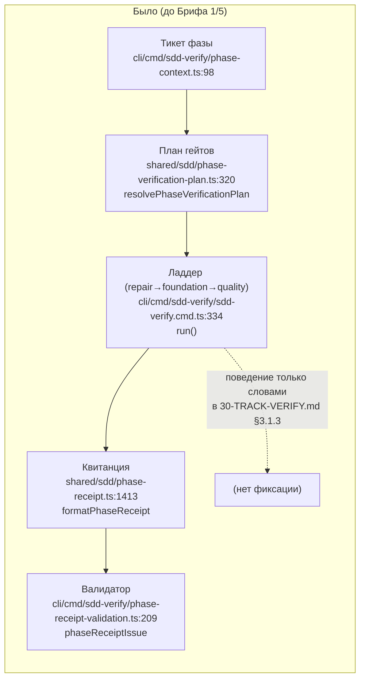
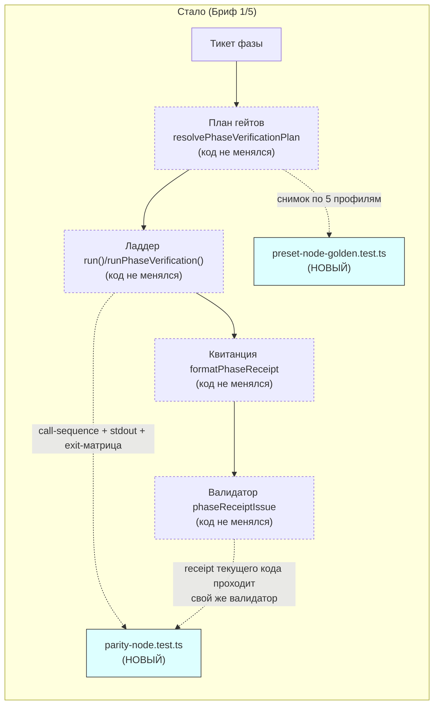

ОТЧЁТ 30/Бриф 1/5 — V-01: node-parity golden (Волна 0)

СТАТУС: DONE

КОММИТЫ (ветка `lead/V-01`, локальная, создана из `origin/codex/sdd-v2-rc52-followup`; НИЧЕГО не запушено):
- `0ff59e396b458051e7ec84bea9d74d65a79a195c` test(v-01): golden byte-for-byte proof of today's sdd-verify node behaviour

Ветка создана командой: `git fetch origin codex/sdd-v2-rc52-followup && git checkout -B lead/V-01 origin/codex/sdd-v2-rc52-followup`.
`origin/codex/sdd-v2-rc52-followup` = `48538019e76de2df3105dd59456fd12c546492a5` (два коммита Брифа 0/5 поверх `rc-baseline-1`) — подтверждено `git rev-parse` до старта.
`rc-baseline-1` = `227c03a83830124fe2aa22541dd5374beb8a53c6` (аннотированный тег, tag object `e64b3219843b3a6a18b03c726d8e9a435918355d`) — не двигался.

**Предпосылка diff-check (обязательна для честности golden):** `git diff 227c03a8 48538019 --stat` показывает ровно 11 файлов, ВСЕ в `ai/flow-eval/.baseline/**`, `ai/flow-eval/scripts/**` и `package.json` (2 добавленные строки скриптов `gate:sdd-check-baseline`/`check:ci`) — **ни один** байт `cli/cmd/sdd-verify/**`, `shared/sdd/phase-*.ts` или `scripts/test-topology.ts` не менялся между срезом и головой брифа. Golden в этом отчёте, соответственно, снят на неизменном между 0/5 и текущим состоянием коде sdd-verify/phase-receipt.

---

## 1. Таблица файлов

| Путь | Тип | Смысл | Чем доказано |
|---|---|---|---|
| `cli/cmd/sdd-verify/__tests__/fixtures/environment-state-fixture/package.json` | новый | Замороженная node-фикстура: ровно 8 скриптов `shared/sdd/readiness.ts:15-24 REQUIRED_SCRIPTS`, без ссылок на корень RC (И-3) | Читается `preset-node-golden.test.ts`/`parity-node.test.ts`; `phaseVerificationEnvironmentState` на этом пути даёт стабильный golden-хэш |
| `shared/sdd/__tests__/preset-node-golden.test.ts` | новый | Golden-JSON резолвнутых гейтов по 5 профилям (setup/code/test-owner/test-non-owner/full) + planTargetRepair-golden (дыры №6-8) + 5 точечных assert'ов (targets.length===0, missing lint:fix, vacuous format:fix, non-forwarding brick, typecheck-алиас) | `node --import tsx --test --experimental-test-module-mocks shared/sdd/__tests__/preset-node-golden.test.ts` → 19/19 pass |
| `shared/sdd/__tests__/preset-node-golden.setup.golden.json` | новый | Golden: резолвнутые гейты профиля `setup` | тот же прогон |
| `shared/sdd/__tests__/preset-node-golden.code.golden.json` | новый | Golden: резолвнутые гейты профиля `code` | тот же прогон |
| `shared/sdd/__tests__/preset-node-golden.test-owner.golden.json` | новый | Golden: резолвнутые гейты профиля `test`, coverage-owner=true | тот же прогон |
| `shared/sdd/__tests__/preset-node-golden.test-non-owner.golden.json` | новый | Golden: резолвнутые гейты профиля `test`, coverage-owner=false | тот же прогон |
| `shared/sdd/__tests__/preset-node-golden.full.golden.json` | новый | Golden: гейты профиля `full` (без `PhaseVerificationGatePlan.state` — этой концепции у `full` в текущем коде нет, зафиксировано честно) | тот же прогон |
| `shared/sdd/__tests__/gates-registry.golden.json` | новый | Golden: порядок канонического реестра `GATES` (sdd-verify.types.ts:36-44) | тот же прогон |
| `shared/sdd/__tests__/plan-target-repair.gennady-adapter-ts-target.golden.json` | новый | Golden: `planTargetRepair` при `lint:fix` = gennady-adapter, .ts-цель | тот же прогон |
| `shared/sdd/__tests__/plan-target-repair.eslint-adapter-ts-target-with-spec.golden.json` | новый | Golden: eslint-adapter + specPath, .ts-цель | тот же прогон |
| `shared/sdd/__tests__/plan-target-repair.eslint-adapter-js-target-no-contract.golden.json` | новый | Golden: eslint-adapter, .js-цель (contract пропущен) | тот же прогон |
| `shared/sdd/__tests__/plan-target-repair.catch-all-adapter-css-target.golden.json` | новый | Golden: catch-all project-linter, .css-цель | тот же прогон |
| `shared/sdd/__tests__/plan-target-repair.mixed-targets-ts-and-css.golden.json` | новый | Golden: смешанные .ts+.css цели | тот же прогон |
| `shared/sdd/__tests__/plan-target-repair.empty-targets.golden.json` | новый | Golden: `planTargetRepair` с пустым списком целей | тот же прогон |
| `cli/cmd/sdd-verify/__tests__/parity-node.test.ts` | новый | Байтовое доказательство: call-sequence, stdout-рендер, exit/status-матрица, receipt-совместимость, environmentState (golden+матрица дыры №9), точные подстроки `⛔`/`gate-state:`, tailCap | `node --import tsx --test --experimental-test-module-mocks cli/cmd/sdd-verify/__tests__/parity-node.test.ts` → 25/25 pass |
| `cli/cmd/sdd-verify/__tests__/parity-node.calls.code.golden.json` | новый | Golden: точная последовательность `(command,args)` для профиля `code`, все гейты зелёные | тот же прогон |
| `cli/cmd/sdd-verify/__tests__/parity-node.calls.full.golden.json` | новый | Golden: точная последовательность вызовов для `full`, включая `npx --no-install gennady yagni` | тот же прогон |
| `cli/cmd/sdd-verify/__tests__/parity-node.stdout.code-pass.golden.txt` | новый | Golden: байтовый stdout, `code` все гейты зелёные (durationMs нормализован) | тот же прогон |
| `cli/cmd/sdd-verify/__tests__/parity-node.stdout.code-typecheck-fail.golden.txt` | новый | Golden: байтовый stdout, `type-check` красный → `⛔`-строка остановки | тот же прогон |
| `cli/cmd/sdd-verify/__tests__/parity-node.stdout.setup-pass.golden.txt` | новый | Golden: байтовый stdout, `setup` без Target Files (bootstrap-нота) | тот же прогон |
| `cli/cmd/sdd-verify/__tests__/parity-node.exit-matrix.code-all-declared.golden.json` | новый | Golden: статус исхода, все скрипты объявлены | тот же прогон |
| `cli/cmd/sdd-verify/__tests__/parity-node.exit-matrix.code-missing-required-type-check.golden.json` | новый | Golden: статус исхода, `type-check` отсутствует (REQUIRED) | тот же прогон |
| `cli/cmd/sdd-verify/__tests__/parity-node.exit-matrix.code-vacuous-test.golden.json` | новый | Golden: статус исхода, `test` — вакуумный скрипт | тот же прогон |
| `cli/cmd/sdd-verify/__tests__/parity-node.exit-matrix.setup-no-targets.golden.json` | новый | Golden: статус исхода, `setup` без целей | тот же прогон |
| `cli/cmd/sdd-verify/__tests__/parity-node.exit-matrix.test-owner-coverage.golden.json` | новый | Golden: статус исхода, `test` profile, coverage-owner | тот же прогон |
| `cli/cmd/sdd-verify/__tests__/parity-node.exit-matrix.test-non-owner.golden.json` | новый | Golden: статус исхода, `test` profile, non-owner | тот же прогон |
| `cli/cmd/sdd-verify/__tests__/parity-node.exit-matrix.full-quality-tail-fail-non-halting.golden.json` | новый | Golden: статус исхода, `lint` красный в `full` (non-halting quality tail) | тот же прогон |
| `cli/cmd/sdd-verify/__tests__/parity-node.receipt-shape.golden.json` | новый | Golden: форма `commands`/`gateEvidence` квитанции, записанной `runPhaseVerification` | тот же прогон + `phaseReceiptIssue(...)===null` в теле теста |
| `cli/cmd/sdd-verify/__tests__/parity-node.environment-state.code.golden.txt` | новый | Golden: хэш `environmentState` на замороженной фикстуре, профиль `code` | тот же прогон |
| `cli/cmd/sdd-verify/__tests__/parity-node.environment-state.test-owner.golden.txt` | новый | Golden: хэш `environmentState` на замороженной фикстуре, профиль `test`/owner | тот же прогон |

Ни один файл вне списка «трогать» брифа не изменён (`git diff --stat` выше — 30 файлов, все новые, все внутри `cli/cmd/sdd-verify/__tests__/**` или `shared/sdd/__tests__/**`). `shared/sdd/phase-verification-plan.ts`, `phase-receipt.ts`, `cli/cmd/sdd-verify/sdd-verify.cmd.ts`, `scripts/test-topology.ts` — не тронуты (проверено `git diff origin/codex/sdd-v2-rc52-followup..HEAD --stat`, см. врезку выше).

## 2. Архитектура — было/стало

Контур: `sdd-verify` (CLI) → план гейтов (`resolvePhaseVerificationPlan`) → прогон ладдера (`run`/`runPhaseVerification`) → квитанция (`SDD_PHASE_RECEIPT`) → (новое) golden-фиксация.





Пунктиром — нетронутый существующий код (только измерен). Заливкой — новые файлы этого брифа. Ни одна стрелка кода не добавлена и не убрана; добавлены только стрелки наблюдения (golden-снимки).

## 3. Доказательства по пунктам ПРИЁМКИ

1. **golden-JSON по 5 профилям**
   команда: `node --import tsx --test --experimental-test-module-mocks shared/sdd/__tests__/preset-node-golden.test.ts`
   вывод (хвост): `# tests 19` / `# pass 19` / `# fail 0`, exit=0
   ВЫПОЛНЕНО

2. **байтовое сравнение stdout (durationMs нормализован, не timestamp'ы — их в receipt нет)**
   команда: `node --import tsx --test --experimental-test-module-mocks cli/cmd/sdd-verify/__tests__/parity-node.test.ts`
   вывод (хвост): `# tests 25` / `# pass 25` / `# fail 0`, exit=0
   Пример golden (`parity-node.stdout.code-pass.golden.txt`):
   ```
   [sdd-verify] ✅ ALL PASS (3/3)
     🔧 fix (Ns) — мутирующий шаг
     ✅ type-check (Ns)
     ✅ test (Ns)
   ```
   ВЫПОЛНЕНО

3. **матрица exit-кодов + validatePhaseReceipt на существующем receipt'е**
   команда: `node --import tsx --test --experimental-test-module-mocks cli/cmd/sdd-verify/__tests__/parity-node.test.ts`
   Матрица (7 кейсов) — golden JSON по каждому (`parity-node.exit-matrix.*.golden.json`); receipt-совместимость: тест `"runPhaseVerification writes a receipt that phaseReceiptIssue accepts on an unchanged workspace"` — `phaseReceiptCommandIssue(...) === null` и `phaseReceiptIssue(...) === null` внутри теста (см. assert на строках теста), плюс golden формы квитанции.
   ВЫПОЛНЕНО (с уточнением — см. §4 «Отклонения», п.1: «validatePhaseReceipt» в коде называется `phaseReceiptIssue`/`phaseReceiptCommandIssue`, отдельной функции с этим именем в RC нет)

4. **planTargetRepair-golden**
   команда: `node --import tsx --test --experimental-test-module-mocks shared/sdd/__tests__/preset-node-golden.test.ts`
   6 golden-кейсов матрицы (адаптер × расширение цели × specPath) + 2 инвариантных теста порядка `PROJECT_LINTER_ADAPTERS` (gennady-contract first-match, catch-all last) — все внутри прогона п.1.
   ВЫПОЛНЕНО

5. **регрессионная шина эвалов: классификатор топологии не падает на новых тест-файлах**
   команда: `npm run test:topology ; echo "exit=$?"`
   вывод: `unit=215 contract=16 local=51 external=8` / `coverage observed=231[unit+contract] black-box=59[local+external]`, exit=0
   Оба новых файла классифицированы РОВНО в один слой — `unit` (проверено прямой репликацией `classifyTest()` на исходном тексте файлов: `none (unit)` для обоих). Числа ДО этого брифа (после Брифа 0/5, не тронувшего sdd-verify/test-topology): unit=213, local=52 (косвенно выведено — `parity-node.test.ts` до правки строки `server.js`-фикстуры первоначально матчил сигнатуру `loopback server` через дословный текст `createServer(`/`.listen(` внутри строкового литерала и комментария и классифицировался как `local`; после замены содержимого фикстуры на безопасный плейсхолдер оба файла попали в `unit`, итог +2 unit).
   ВЫПОЛНЕНО

6. **eval: не требуется** — не применимо, это предпосылка для G1, не сам eval. ВЫПОЛНЕНО (по определению брифа)

7. **sdd-check / npm run check зелёные**
   команда: `npm run check && npm run build && node dist/gennady.js sdd-check --all .`
   `npm run check` → `[sdd-verify] ✅ ALL PASS (5/5)` (type-check 5.4s, test:coverage 52.6s, lint 3.1s, format 2.4s, yagni 0.9s), exit=0.
   `npm run build` → `✓ built in 2.87s`, exit=0.
   `node dist/gennady.js sdd-check --all .` → `[sdd-check] 198 error(s), 431 warning(s) across 212 file(s)`, exit=1 — **ровно** числа baseline `rc-baseline-1`/`sdd-check-227c03a8.json` из Брифа 0/5 (ожидаемо красное; критерий — отсутствие НОВОГО error).
   Дополнительно (не в списке ПРИЁМКИ, но прямое доказательство «без нового error»): `npm run gate:sdd-check-baseline` → `[sdd-check-zero-new-error] OK — no error outside the baseline (baseline commit 227c03a8…, tag rc-baseline-1)`, exit=0.
   ВЫПОЛНЕНО

Дополнительно (полный прогон, не отдельный пункт брифа, но часть «перед завершением» правила): `npm test` → `# tests 3565` / `# pass 3555` / `# fail 0` / `# skipped 10`, exit=0.

## 4. Отклонения от брифа, открытые вопросы, команды пуша

**Отклонения:**

1. **`validatePhaseReceipt` — имя из документа плана, не из кода.** В RC такой функции нет; эквивалент — пара `phaseReceiptCommandIssue`/`phaseReceiptIssue` (`cli/cmd/sdd-verify/phase-receipt-validation.ts:73,209`). Использованы обе, семантически покрывая п.3 приёмки.
2. **`resolvePreset('node', profile, root, config)` не существует в текущем коде** (это задача V-04). Golden п.1 снят через существующие `resolvePhaseVerificationPlan` (для setup/code/test) и `gatesFor`/`requiredGatesFor` (для `full`, который не имеет концепции `PhaseVerificationGatePlan.state`) — зафиксировано честно, без изобретения нового поведения. Точная последовательность аргументов `via:'gennady'`-гейтов (в т.ч. `full`'s `yagni`) golden-запечатана отдельно в `parity-node.calls.full.golden.json` (через реальный `run()` с управляемым cwd), закрывая то, что статический план дать не может.
3. **`run()`/`readProjectScripts()`/`isSelfHosting()` читают `package.json` относительно `process.cwd()`, не параметра root** (`cli/cmd/sdd-verify/sdd-verify.cmd.ts` — не трогался, только констатация факта). Каждый тест, вызывающий `run()`/`runPhaseVerification()`, временно `process.chdir()` в одноразовую фикстуру и восстанавливает cwd в `finally` — decoupled от корня RC (И-3), без правки самого `sdd-verify.cmd.ts`.
4. **Golden JSON-файлы сравниваются по распарсенному значению (`assert.deepStrictEqual`), а не побайтово.** Причина, найденная эмпирически: `npm run format` (prettier) перформатирует committed `.golden.json` (схлопывает короткие массивы в одну строку) при первом же `format:fix` — побайтовое сравнение против raw `JSON.stringify(...,null,2)` начинало бы флапать между двумя проходами с ОДИНАКОВЫМИ данными по причине, не относящейся к поведению sdd-verify. `.golden.txt` (stdout/environmentState) остаются побайтовыми — prettier их не трогает.
5. **Матрица дыры №9 (environmentState: транзитивный hop, hooks, start/restart fallback, pnpm/yarn forwarding, local input) снята НЕ на замороженной, а на одноразовых temp-фикстурах** (создаются и удаляются внутри теста), поведенческими assert'ами (`notStrictEqual` хэшей до/после), а не побайтовым golden. Заморожена (и golden-запечатана побайтово) только БАЗОВАЯ фикстура из уточнения брифа («минимальный package.json со скриптами REQUIRED_SCRIPTS», п.6 ЦЕЛИ). Обоснование: уточнение брифа говорит о фикстуре в единственном числе и связывает заморозку с И-3 («golden не с корня RC»), а не требует пиновки каждого варианта матрицы отдельным committed-файлом.
6. **Live-CLI subprocess e2e не покрыт.** Оба golden-файла работают через инжектируемый `GateRunner`/`VerbatimRunner`, вызывая реальные `run()`/`runPhaseVerification()` (и, значит, реально пишущие квитанцию на диск в §4-тесте) — но НЕ спауня настоящий `node dist/gennady.js sdd-verify` процесс. Это прямой ответ на «ВОПРОСЫ НАЗАД» брифа («на каком уровне снимать exit-коды и stdout»): документ плана сам называет способ в 30-TRACK-VERIFY.md §3.1.3 п.2 («с инжектируемым GateRunner»), поэтому это не решение исполнителя, а буквальное следование источнику — но фиксирую как открытый вопрос ниже, т.к. в брифе явно сказано «не выбирай сам».

**Открытые вопросы Lead/оператору:**

1. Подтвердить, что уровень доказательства exit-кодов/stdout через инжектируемый `GateRunner` (а не реальный spawn `node dist/gennady.js sdd-verify`) закрывает ВОПРОС НАЗАД брифа полностью, а не только частично — документ 30-TRACK-VERIFY.md §3.1.3 п.2 называет именно этот механизм, но брифом отдельно оговорено «остановись и спроси», поэтому явное подтверждение желательно перед приёмкой.
2. Подтвердить трактовку «замороженная фикстура — одна, для golden environmentState; матрица дыры №9 — поведенческая, на temp-фикстурах» (отклонение №5) как соответствующую намерению брифа, а не как недовыполнение.
3. `parity-node.test.ts` изначально (до правки) классифицировался `test-topology.ts` как `local` из-за дословных `createServer(`/`.listen(` в строке-фикстуре и в комментарии (сигнатура — сырой regex по исходному тексту файла, не AST). Исправлено заменой содержимого на безопасный плейсхолдер; попутная находка, не блокирует, но стоит иметь в виду при будущих golden-фикстурах с текстом shell/JS-скриптов внутри тестов.

**Команды пуша для Lead** (ветка `lead/V-01`, ничего не запушено):
```
git -C <rc-worktree> push origin lead/V-01
# затем открыть draft PR в codex/sdd-v2-rc52-followup, описание = этот отчёт целиком (протокол D-52/D-53)
```
