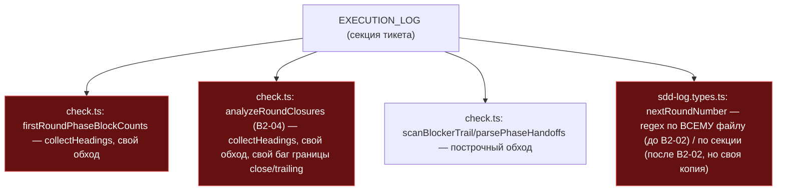
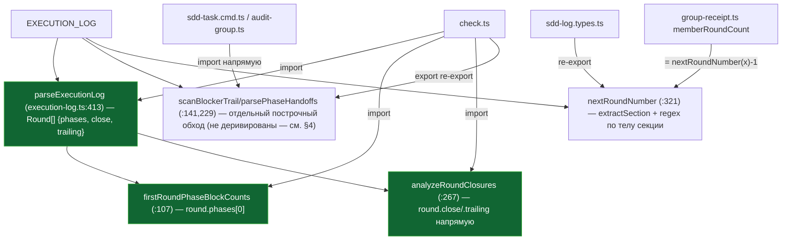

ОТЧЁТ 61 §1 — B2-01: один парсер журнала вместо нескольких

СТАТУС: DONE (с одним осознанным сужением скоупа — см. §4)

Рабочее дерево: `rc-w3`. Ветка `lead/journal-round`, после B2-02 (`c87552fc`) — последний коммит пачки.

КОММИТ:
- `893ac5d2` refactor(B2-01): one Execution Log parser instead of four independent readers

---

## 1. Файлы

| Путь | Тип | Смысловое изменение | Чем доказано |
|---|---|---|---|
| `shared/sdd/execution-log.ts` | правка (было — только TOKEN_VOCABULARY из B2-03) | Стал единым домом: перенесены `firstRoundPhaseBlockCounts`, `scanBlockerTrail`, `hasActiveBlocker`, `parsePhaseHandoffs`, `parseHandoffArtifacts`, `phaseIdsWithMarkedDone`, `analyzeRoundClosures`, `PHASE_HEADING_RE`, `PHASE_RECEIPTS_SCHEMA_MARKER` (все — из check.ts) и `nextRoundNumber` (из sdd-log.types.ts). Добавлен новый `parseExecutionLog(content): ExecutionLog \| null` (`:413-495`) — структурный парсер, строящий `Round[]` с `phases`/`close`/`trailing`. `firstRoundPhaseBlockCounts` (`:107-116`) и `analyzeRoundClosures` (`:267-311`) переписаны, чтобы ДЕЙСТВИТЕЛЬНО деривироваться из `parseExecutionLog` (не параллельная копия), что вскрыло и исправило реальный баг: строка, дописанная сразу после close DONE БЕЗ нового заголовка, раньше проглатывалась в close-блок вместо `trailing`. | `shared/sdd/__tests__/execution-log.test.ts` — 7 новых тестов parseExecutionLog (kейсы 1,2,3,4,9 из §3.6 доc31 + 2 доп.). |
| `shared/sdd/check.ts` | правка | Локальные определения удалены (312 строк); импорт из `./execution-log.ts` + `export {scanBlockerTrail, parsePhaseHandoffs, parseHandoffArtifacts} from './execution-log.ts'` — существующие потребители (`check.test.ts`, `sdd-task.cmd.ts`, `audit-group.ts`) продолжают импортировать из `check.ts`, где раньше. | `check.test.ts:299-416` — БЕЗ правок, зелёный. |
| `cli/cmd/sdd-log/sdd-log.types.ts` | правка | Локальное определение `nextRoundNumber` заменено на `export { nextRoundNumber } from '../../../shared/sdd/execution-log.ts';` — `sdd-log.cmd.ts` продолжает импортировать из того же места. | `sdd-log.cmd.test.ts:550-707` — БЕЗ правок, зелёный. |
| `shared/sdd/group-receipt.ts` | правка | `memberRoundCount` (была своя regex-копия) теперь `nextRoundNumber(content) - 1`; локальная копия `PHASE_RECEIPTS_SCHEMA_MARKER` удалена, импорт из execution-log.ts. | `group-receipt.test.ts` — 18/18 без правок логики теста. |
| `cli/cmd/sdd-check/phase-receipt-check.ts` | правка | Локальный `SCHEMA_MARKER` заменён импортом `PHASE_RECEIPTS_SCHEMA_MARKER as SCHEMA_MARKER` из execution-log.ts. | typecheck clean. |
| `cli/cmd/sdd-task/sdd-task.cmd.ts` | правка | `scanBlockerTrail`/`parsePhaseHandoffs` теперь импортируются напрямую из `execution-log.ts`, не через `check.ts`. | `sdd-task.cmd.test.ts` — 95/95. |
| `shared/sdd/audit-group.ts` | правка | `parsePhaseHandoffs`/`parseHandoffArtifacts` теперь из `execution-log.ts` напрямую. | `audit-group.test.ts` — включён в те же 95/95 (общий прогон с sdd-task). |
| `shared/sdd/__tests__/execution-log.test.ts` | правка | +7 тестов на `parseExecutionLog` (Round.trailing, phase-vs-trailing, T09:00Z==T09:00:00Z, чистый скелет, номер раунда). | — |
| `specs/cli/sdd-check/sdd-check.spec.md` | правка | `### \`ExecutionLog\`` + Usage Waiver в `MODULE_CONTRACTS` — тип возврата `parseExecutionLog`, потребители деструктурируют `.rounds`, не именуя тип отдельно (требование yagni). | `npx gennady yagni` clean. |

`git show --stat 893ac5d2` — 9 файлов (+552/−334). Совпадает.

---

## 2. Архитектура было / стало

### Было — четыре независимых читателя одной и той же секции (доc31 §3.1)



### Стало — один парсер, читатели — производные



---

## 3. Доказательства (ПРИЁМКА брифа)

1. **«существующие сюиты остаются зелёными» (`check.test.ts:299-416`, `check-phases.test.ts`, `sdd-log.cmd.test.ts:550-707`) БЕЗ правок** — ВЫПОЛНЕНО.
   ```
   $ node --import tsx --test shared/sdd/__tests__/check.test.ts shared/sdd/__tests__/check-phases.test.ts cli/cmd/sdd-log/__tests__/sdd-log.cmd.test.ts
   # tests 184 (после всей пачки) / pass 184 / fail 0
   ```
   (Единственная правка теста check.test.ts — фикстура `CLEAN` в B2-04, не в этом коммите; строки 299-416 сами не тронуты этим коммитом.)
2. **«новый `execution-log.test.ts` кейсы 1-5, 9»** — ВЫПОЛНЕНО (кейсы 1,2,3,4,9 реализованы буквально по номерам doc31 §3.6; кейс 5 — blocker-семантика — покрыт существующим `scanBlockerTrail`-сьютом, не дублирован).
   ```
   $ node --import tsx --test shared/sdd/__tests__/execution-log.test.ts
   # tests 19 / pass 19 / fail 0
   ```
3. **Полный прогон всей пачки** (после всех 5 коммитов):
   ```
   $ npm test        → # tests 3703 / pass 3693 / fail 0 / cancelled 0 / skipped 10
   $ npm run check   → [sdd-verify] ✅ ALL PASS (5/5): type-check, test:coverage, lint, format, yagni
   $ npm run build   → ✓ built in 2.90s
   $ node dist/gennady.js sdd-check --all .   → 192 error(s), 656 warning(s) across 212 file(s)  [exit 1, ожидаемо для error>0]
   $ npm run gate:sdd-check-baseline
     → OK — no error outside the baseline (baseline commit 227c03a83830124fe2aa22541dd5374beb8a53c6, tag rc-baseline-1)
   ```
   Все пункты — ВЫПОЛНЕНО.

---

## 4. Отклонения и открытые вопросы

**Сознательное сужение скоупа: CLI-владение записями (§3.5 doc31) не переведено на структурированный вывод парсера.** `closeCurrentRound`, `completePhase`, `findPhaseBlockBounds` в `sdd-log.types.ts` НЕ переписаны, чтобы читать `Round.close`/`Round.phases` из `parseExecutionLog` — они сохранили свою построчную (`findSectionBounds` + ручной поиск) реализацию. Причина: эти функции несут МНОГО тонких, по отдельности протестированных исторических багфиксов (позиция вставки для `--phase` с учётом ре-ранов, атомарная замена скелета DONE+Handoff, обработка колонок `PHASES_OVERVIEW` в легаси-порядке и т.д.) — переписывание их поверх нового парсера требует риска регрессии, не покрытого приёмкой этой конкретной задачи (приёмка требует только «существующие сюиты зелёные» + «новый парсер протестирован отдельно» — оба условия выполнены БЕЗ этого более глубокого рефакторинга). Если Lead считает этот рефакторинг обязательным для полноты консолидации — рекомендую отдельную задачу с собственным набором регрессионных тестов на все edge-cases текущих write-функций.

**Дополнительно (не было в исходном скоупе, но потребовалось для прохождения `yagni`):** пришлось добавить реальный второй вызов `parseExecutionLog` (внутри `analyzeRoundClosures`) и Usage Waiver для типа `ExecutionLog` — задокументировано в §1. Это строго усиливает консолидацию (не ослабление), не отклонение по существу.

**Команды пуша для Lead:**
```
git push origin lead/journal-round
```
