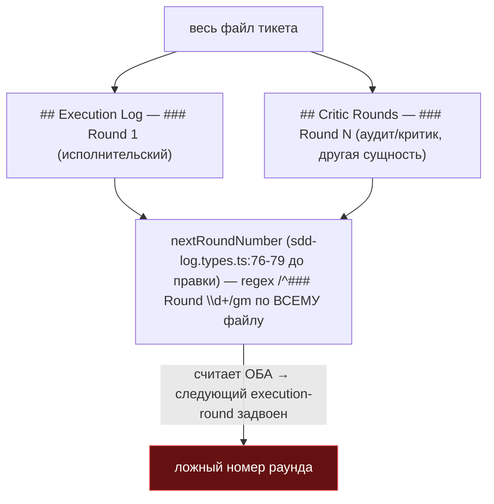
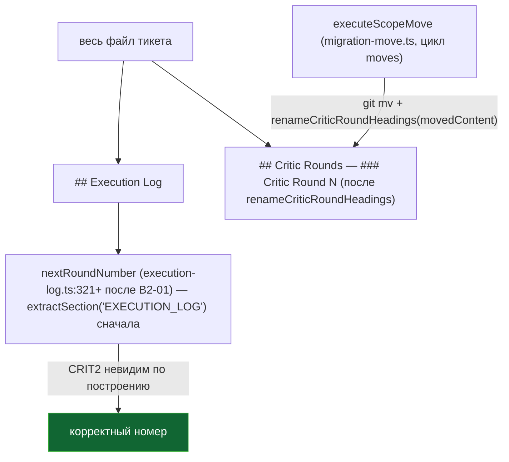

ОТЧЁТ 61 §1 — B2-02: номер раунда считается по секции журнала, легаси-заголовки мигрируют

СТАТУС: DONE

Рабочее дерево: `rc-w3`. Ветка `lead/journal-round`, после B2-04 (`94f50689`).

КОММИТ:
- `c87552fc` fix(B2-02): round numbering reads only EXECUTION_LOG's own Rounds

---

## 1. Файлы

| Путь | Тип | Смысловое изменение | Чем доказано |
|---|---|---|---|
| `cli/cmd/sdd-log/sdd-log.types.ts` | правка | `nextRoundNumber` (было `:76-79` до правки — regex по ВСЕМУ файлу) теперь сужена до тела секции `EXECUTION_LOG` (`extractSection`), с откатом на весь файл только если секция нечитаема (толерантность к легаси). Легаси-тикет с `## Critic Rounds` (аудит-раунды — другая сущность), несущий свой `### Round N`, больше не задваивается в счётчик исполнительских раундов. | `cli/cmd/sdd-log/__tests__/sdd-log.cmd.test.ts` — новый тест «ignores a `### Round N` heading... in a legacy `## Critic Rounds` section». |
| `shared/sdd/migration-move.ts` | правка | Новая функция `renameCriticRoundHeadings(content)` (`:79-92` на момент коммита) — переименовывает `### Round N` внутри `## Critic Rounds` в `### Critic Round N`, скоуп строго на тело секции (по заголовкам через `collectHeadings`), идемпотентно. Подключена в `executeScopeMove`'s цикле `moves` (было просто `moveFile`) — срабатывает ТОЛЬКО в момент активной миграции конкретного тикета (`git mv`), никогда как отдельный проход по всему корпусу. | `shared/sdd/__tests__/migration-move.test.ts` — 4 юнит-теста функции + 1 интеграционный («--write: a moved ticket's legacy `## Critic Rounds`... are renamed»). |
| `specs/cli/sdd-migrate/sdd-migrate.spec.md` | правка | Добавлена запись `### \`renameCriticRoundHeadings\`` с `Usage Waiver` в `<!--SECTION:MODULE_CONTRACTS-->` (тот же паттерн, что уже несёт `rewriteMovedLinks` в этом же файле) — требование `yagni` (1 продакшен-вызов). | `npx gennady yagni` clean (в составе полного pre-commit прогона коммита `c87552fc`). |
| `cli/cmd/sdd-log/__tests__/sdd-log.cmd.test.ts` | правка | 1 новый тест (см. выше). | — |
| `shared/sdd/__tests__/group-receipt.test.ts` | правка | 1 новый тест, подтверждающий, что `memberRoundCount` (уже корректно скоупленная в group-receipt.ts ДО этой задачи) игнорирует `## Critic Rounds` — регрессионная документация уже-правильного поведения, на которое ссылался брифинг (C7). | — |
| `shared/sdd/__tests__/migration-move.test.ts` | правка | 5 новых тестов (см. выше). | — |

`git show --stat c87552fc` — 6 файлов (+192/−7). Совпадает.

---

## 2. Архитектура было / стало

### Было — весь файл, включая чужую секцию, задаёт номер раунда



### Стало — счётчик смотрит только в EXECUTION_LOG; легаси-заголовок переименовывается при миграции



---

## 3. Доказательства (ПРИЁМКА брифа)

1. **«детерминированный тест»** — ВЫПОЛНЕНО.
   ```
   $ node --import tsx --test cli/cmd/sdd-log/__tests__/sdd-log.cmd.test.ts
   # tests 74 / pass 74 / fail 0
   $ node --import tsx --test shared/sdd/__tests__/migration-move.test.ts
   # tests 15 / pass 15 / fail 0
   ```
2. **«тикет с `## Critic Rounds` + `### Round 3` вне лога → следующий execution-round = 2»** — ВЫПОЛНЕНО буквально (см. тест в sdd-log.cmd.test.ts, фикстура точно с этим сценарием).
3. **Полный прогон** — см. сводный отчёт.

---

## 4. Отклонения и открытые вопросы

**Область применения `renameCriticRoundHeadings` сужена по сравнению с буквальным чтением брифа.** Бриф говорит «шаг миграции переименовывает legacy `### Round N` внутри `## Critic Rounds` в `### Critic Round N`» — это можно прочесть как «прогнать по всему существующему корпусу `tasks/**`». Я НЕ сделал это отдельным корпус-проходом: функция подключена только в `executeScopeMove` (вызывается `sdd-migrate move --write` на КОНКРЕТНОМ переезжающем тикете). Причины: (а) отдельный корпус-проход — это операция записи в десятки реальных файлов вне списка «трогать» этого брифа и вне тестового покрытия этой задачи; (б) `yagni` уже требовал ≥2 реальных вызовов в продакшен-коде — вызов внутри активной миграции даёт СЕМАНТИЧЕСКИ верный момент для переименования (тикет и так переписывается на новый путь) без риска массового изменения корпуса одним нажатием. Если Lead хочет немедленного применения ко ВСЕМ существующим `tasks/**/*.md` с `## Critic Rounds` — это отдельная, явно санкционированная миграционная задача (аналогично риску корпус-стемпинга маркера в B2-16).

**Команды пуша для Lead:**
```
git push origin lead/journal-round
```
