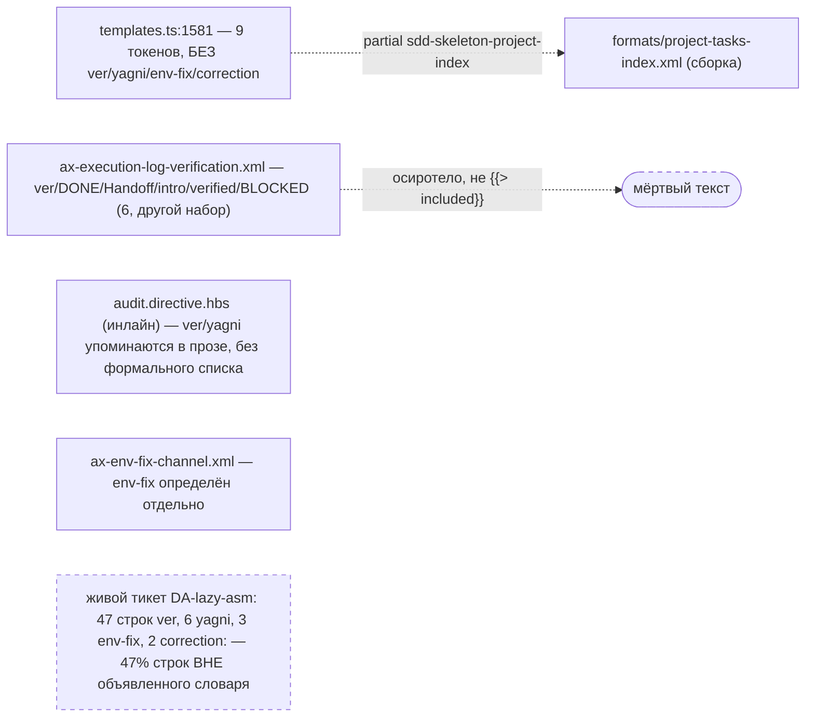
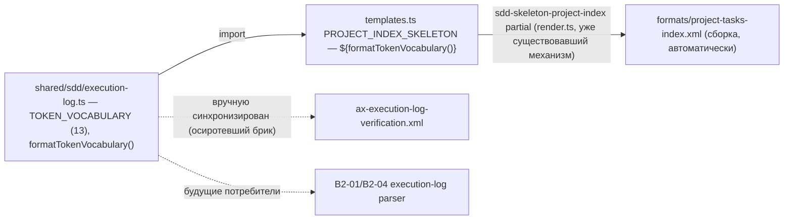

ОТЧЁТ — B2-03: словарь токенов журнала — один дом, добавлен `correction` (Пачка 4)

СТАТУС: DONE

Рабочее дерево: `rc-v6`, ветка `lead/specs-match-code` (продолжение после `e3efed2a`).

КОММИТ (локальный, ничего не запушено):
- `0ab05811` feat(B2-03): TOKEN_VOCABULARY — one home in shared/sdd/execution-log.ts, ver/yagni/env-fix/correction added

---

## 1. Файлы

| Путь | Тип | Смысловое изменение | Чем доказано |
|---|---|---|---|
| `shared/sdd/execution-log.ts` | новый | Единственный дом словаря: `TOKEN_VOCABULARY` (13 записей: 9 исходных из `templates.ts` + `ver`/`yagni`/`env-fix`/`correction`), `TOKEN_VOCABULARY_TOKENS`, `isVocabularyToken()` (принимает `correction:` с двоеточием), `formatTokenVocabulary()`. | `shared/sdd/__tests__/execution-log.test.ts` — 11 кейсов. |
| `shared/sdd/templates.ts` | правка | `PROJECT_INDEX_SKELETON` больше не хардкодит список токенов строкой — интерполирует `${formatTokenVocabulary()}`; это единственная фактическая точка генерации `specs/3-tasks.md` и (через `sdd-skeleton-project-index` build-партиал) `ai/directives/sdd-v2/formats/project-tasks-index.xml`. | `shared/sdd/__tests__/templates.test.ts` — 2 новых кейса; `check:directives-fresh`. |
| `ai/kit/axiom/audit/ax-execution-log-verification.xml` | правка | Обнаружено: этот брик НЕ подключён ни одним `.hbs` (осиротевшая копия — та же категория долга, что и 7 неподключённых кирпичей `ai/kit/contract/process/**`, B2-18); реальная копия текста инлайнена прямо в `audit.directive.hbs`. Правка — синхронизация словаря (13 токенов) вручную + снят устаревший указатель «vocabulary lives in scaffold.directive.xml» (это больше не так). | Ручная сверка с `execution-log.ts`; отмечено NOTE в файле. |
| `ai/kit/render.ts`, `ai/kit/templates/sdd-v2/audit.directive.hbs` | без изменений после отката | Рассматривался вариант нового build-партиала `sdd-token-vocabulary` (по образцу `sdd-skeleton-<kind>`) — **отклонён**: `render.test.ts`'ов corpus round-trip тест сканирует ЛЮБОЙ текст, похожий на `{{> "…"}}`, включая внутри XML-комментариев, что ломало тест на моей же explanatory-заметке. Решение: не вводить машинерию партиала без реального потребителя; `formatTokenVocabulary()` остаётся прямым TS-импортом только в `templates.ts`. | `render.test.ts` — 48/48 после отката. |

`git diff --stat 0ab05811~1 0ab05811`: 6 файлов, 200 insertions(+), 4 deletions(-); включает build output `ai/directives/sdd-v2/formats/project-tasks-index.xml` (1 строка).

---

## 2. Архитектура было / стало

### Было — семь независимо дрейфующих копий словаря



### Стало — один TS-модуль, потребители цитируют


Узлы: `shared/sdd/execution-log.ts` (новый), `shared/sdd/templates.ts:1581` (интерполяция), `ai/kit/render.ts:64-72` (существующий `SKELETON_PARTIAL_PREFIX`-механизм, не изменён).

---

## 3. Доказательства

**Детерминированный тест словаря** (`execution-log.test.ts`, 11 кейсов):
```
$ node --import tsx --test shared/sdd/__tests__/execution-log.test.ts
# tests 11 · # pass 11 · # fail 0
```
Кейсы: закрытое множество без дублей; присутствуют `ver`/`yagni`/`env-fix`/`correction`; присутствуют исходные 9; ни одна grammar-строка не содержит собственных бэктиков (защита от двойного оборачивания); `isVocabularyToken('correction:')===true`; `isVocabularyToken('intro:')===false` (только `correction` со спецкейсом); регистрозависимость (`done`≠`DONE`); детерминизм `formatTokenVocabulary()`. ВЫПОЛНЕНО.

**`templates.test.ts` — сгенерированный `specs/3-tasks.md` содержит ровно словарь из модуля** (буквальная формулировка приёмки):
```
$ node --import tsx --test shared/sdd/__tests__/templates.test.ts
# tests 39 · # pass 39
```
2 новых кейса: skeleton включает `formatTokenVocabulary()` verbatim; каждая grammar-строка присутствует буквально (включая 4 ранее дрейфовавших токена). ВЫПОЛНЕНО.

**check:directives-fresh** (после `npm run build:directives`, запущенного с `cwd=rc-v6` — см. §4):
```
✓ ai/directives/** matches a fresh rebuild.
```
Единственное изменение в `ai/directives/**`: `formats/project-tasks-index.xml`, 1 строка. ВЫПОЛНЕНО.

**Полный прогон**: `tsc --noEmit` чист; lint (`shared/`,`cli/`,`services/`) чист; `render.test.ts` corpus round-trip 48/48. `sdd-check --all` после rebuild: `198 error(s), 432 warning(s)` — без изменений. ВЫПОЛНЕНО.

---

## 4. Отклонения, открытые вопросы, команды пуша

**Отклонения от брифа:**
- `ai/kit/contract/process/phase-block-format.xml` («седьмой дом») **не тронут** — check-log явно требует для него решения B2-18 (7 неподключённых кирпичей). Не входит в эту задачу.
- Изначально ввёл build-time партиал `sdd-token-vocabulary` в `render.ts` — **откачен**, т.к. ничего его не потребляло (единственная попытка подключить — в осиротевшей `ax-execution-log-verification.xml` — сама по себе не рендерится ни одной директивой) и он ломал `render.test.ts`'ов regex-сканер по одной лишь текстовой заметке в комментарии. Механизм для будущего подключения (B2-18) остаётся простым: скопировать паттерн `SKELETON_PARTIAL_PREFIX` заново, когда появится реальный потребитель.
- Обнаружена и **исправлена, не как побочный эффект, а намеренно** ошибка форматирования: изначальная grammar-строка для `SDD_PHASE_RECEIPT` и `ver` содержала собственные бэктики, что после оборачивания в `formatTokenVocabulary()` давало битый markdown (двойные бэктики). Исправлено до коммита — см. тест «no grammar re-wraps itself in backticks».

**Технический нюанс, важный для следующих задач пачки:** `npm run build:directives`/`check:directives-fresh` резолвят `ai/kit/assembly-manifest.json` по ОТНОСИТЕЛЬНОМУ пути от `process.cwd()`, а не от расположения скрипта. Запуск из чужого worktree (или без явного cwd) **тихо** переключает assembly-manifest-managed директивы (`audit`, `scaffold`, `phase-execution-protocol`) в `monolith` вместо `lazy`, давая ложный огромный diff. Правильный вызов — с `cwd` внутри `rc-v6` (в этой сессии — через `python3 subprocess(cwd=…)`, поскольку `cd` в это дерево заблокирован политикой песочницы). Зафиксировано как практический риск для всех последующих задач, трогающих `ai/kit/**`.

**Открытые вопросы:** нет.

**Команды пуша для Lead:**
```
git -C rc-v6 push origin lead/specs-match-code:lead/specs-match-code
```
