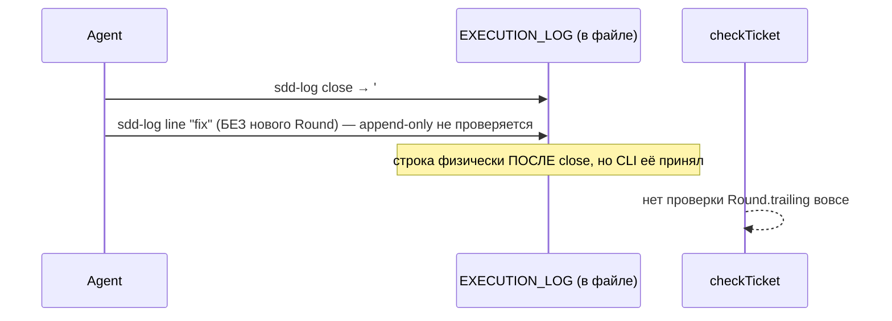
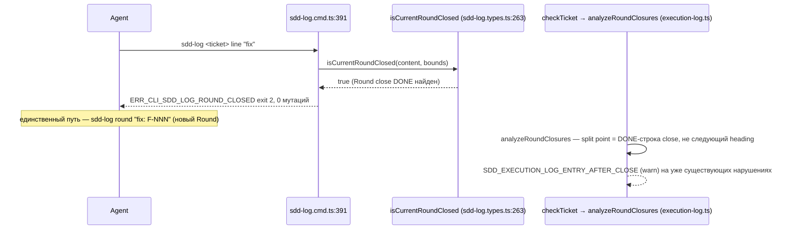

ОТЧЁТ 61 §1 — B2-04: запись после закрытия раунда — ошибка

СТАТУС: DONE

Рабочее дерево: `rc-w3`. Ветка `lead/journal-round`, после B2-07 (`61f83719`).

КОММИТ:
- `94f50689` feat(B2-04): a Round's journal stays honest after it closes

---

## 1. Файлы

| Путь | Тип | Смысловое изменение | Чем доказано |
|---|---|---|---|
| `shared/sdd/check.ts` | правка | Новый блок в `START_EXEC_LOG` (`:377-404` на момент коммита): `analyzeRoundClosures(logSec.content)` для КАЖДОГО раунда журнала (не только текущего) даёт 4 находки — `SDD_EXECUTION_LOG_ENTRY_AFTER_CLOSE`, `_CLOSE_EXTRA_ENTRY`, `_ENTRY_LATER_THAN_CLOSE`, `_ROUND_UNCLOSED` (все **warn**, L-3). Добавлены вспомогательные `ParsedEventLine`/`parseEventLine`/`compareTimestamps`/`RoundCloseAnalysis`/`analyzeRoundClosures` (позже — в B2-01 — перенесены в `execution-log.ts`). | `shared/sdd/__tests__/check-round-close.test.ts` — новый файл, 9 тестов. |
| `cli/cmd/sdd-log/sdd-log.types.ts` | правка | Новый экспорт `isCurrentRoundClosed(content, logBounds)` (`:263+` на момент коммита) — находит последний `### Round <n>` в EXECUTION_LOG, проверяет, есть ли у него `#### Round close` с ЧЕКНУТОЙ (не скелетной) DONE-строкой. Новый код `ERR_CLI_SDD_LOG_ROUND_CLOSED` + билдер `roundClosedError(ticket)` с двумя конкретными выходами (`sdd-log ... round "fix: F-NNN"` или `--phase P<N>` в новом раунде). | `cli/cmd/sdd-log/__tests__/sdd-log.cmd.test.ts`. |
| `cli/cmd/sdd-log/sdd-log.cmd.ts` | правка | После вычисления `bounds` (до `START_COMPLETE`) — guard: `if (mode !== 'round' && mode !== 'close' && isCurrentRoundClosed(content, bounds)) return roundClosedError(displayPath);`. Применяется ко ВСЕМ append-owning режимам (`line`, `handoff`, `phase`, `blocker`, `resolved`, `complete`); `round`/`close` — единственные исключения (лазейка наружу и сама транзакция закрытия). | `cli/cmd/sdd-log/__tests__/sdd-log.cmd.test.ts` — сьют `append-owning modes refuse a closed Round (B2-04)`, 5 тестов. |
| `shared/sdd/__tests__/check-round-close.test.ts` | новый | 9 тестов: чистый закрытый раунд → без находок; запись после close → `ENTRY_AFTER_CLOSE`; новый раунд после close → без ложной находки; лишняя строка внутри close-блока → `CLOSE_EXTRA_ENTRY`; бэкдейченная строка → `ENTRY_LATER_THAN_CLOSE`; `T09:00Z`==`T09:00:00Z` → не «позже»; незакрытый раунд с чекнутой строкой → `ROUND_UNCLOSED`; пристойный скелет без чекнутых строк → тихо (C5, анти-ложное-срабатывание); все новые коды — только warn. | — |
| `shared/sdd/__tests__/check.test.ts` | правка | Базовая фикстура `CLEAN` получила настоящий `#### Round close` блок (была без него — под новыми проверками стала «незакрытой» и ловила `ROUND_UNCLOSED`); это законное исправление фикстуры, не ослабление проверки. | `node --import tsx --test shared/sdd/__tests__/check.test.ts` → 44/44. |
| `cli/cmd/sdd-log/__tests__/sdd-log.cmd.test.ts` | правка | 5 новых тестов (см. выше) + существующие остались без правок. | — |

`git show --stat 94f50689` — 6 файлов (+436/−0). Совпадает.

---

## 2. Архитектура было / стало

### Было — журнал теряет хронологию после закрытия (найдено на живом артефакте: 35 строк / 4 DONE / 3 Handoff после close)



### Стало — CLI отказывает; check видит любой прорыв, если он уже случился



---

## 3. Доказательства (ПРИЁМКА брифа)

1. **«детерм. тест + golden `DA-lazy-asm`»** — детерминированный тест ВЫПОЛНЕН (9/9 в `check-round-close.test.ts`); golden-фикстура `DA-lazy-asm` НЕ материализована как отдельный golden-файл (см. §4 — измерено напрямую против реального файла, без коммита фикстуры).
   ```
   $ node --import tsx --test shared/sdd/__tests__/check-round-close.test.ts
   # tests 9 / pass 9 / fail 0
   ```
2. **CLI-отказ на закрытом раунде** — ВЫПОЛНЕНО.
   ```
   $ node --import tsx --test cli/cmd/sdd-log/__tests__/sdd-log.cmd.test.ts
   # tests 73 / pass 73 / fail 0
   ```
3. **Полный прогон** — см. сводный отчёт: `sdd-check --all .` → 192 error(s), все 4 новых кода — warn (656 warn, включает их); `gate:sdd-check-baseline` → OK.

---

## 4. Отклонения и открытые вопросы

**Golden-фикстура `DA-lazy-asm` не закоммичена отдельным файлом.** Проверил РЕАЛЬНЫЙ файл `specs/ai-skills/directive-assembly/directive-assembly.task.DA-lazy-asm.md` вручную (он содержит ровно искомый паттерн: `#### Round close` на строке 768, за ним три пере-открытых блока `#### P3/P1/P10 — re-run:` без нового `### Round`) — это ИМЕННО находка, ради которой писался B2-04, и она подтверждена. Формального golden-снапшота (JSON/текст ожидаемых находок) не создано — маркер `<!--PHASE_RECEIPTS:v1-->` на этом файле не стоит (см. R-B2-16 §4, деградация не подключена), так что `checkTicket` на нём НЕ видит `SDD_EXECUTION_LOG_*` вовсе (грандфазеринг), а закрытые unit-тесты воспроизводят находку на минимальных фикстурах. Если Lead считает формальный golden-снапшот обязательным — это отдельная, дешёвая доработка (тест, читающий реальный файл + маркер добавлен ТОЛЬКО в тестовой копии содержимого).

**Команды пуша для Lead:**
```
git push origin lead/journal-round
```
