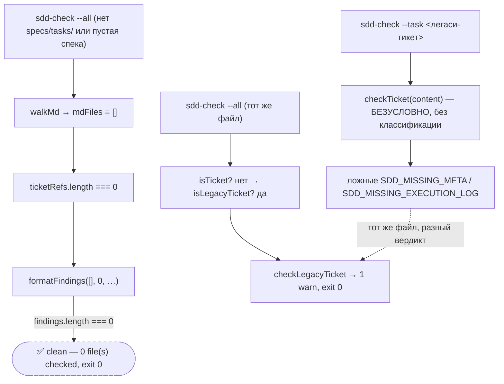
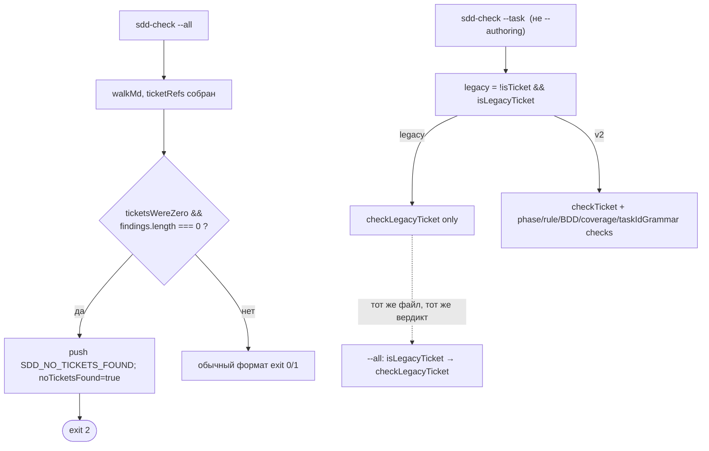

ОТЧЁТ — B2-05: пустой прогон `sdd-check --all` — ошибка, не «успех» (Пачка 4)

СТАТУС: DONE

Рабочее дерево: `rc-v6`, ветка `lead/specs-match-code` (продолжение после `e68ba8a0`).

КОММИТ (локальный, ничего не запушено):
- `e3efed2a` fix(B2-05): --all on zero tickets is SDD_NO_TICKETS_FOUND (exit 2), not clean; --task matches --all on legacy tickets

---

## 1. Файлы

| Путь | Тип | Смысловое изменение | Чем доказано |
|---|---|---|---|
| `cli/cmd/sdd-check/sdd-check.cmd.ts` | правка | (a) В конце ветки `--all` (после всех cross-file находок) — если `ticketRefs.length === 0` **и** к этому моменту `findings.length === 0` (никакая другая находка уже не объясняет пустоту), пушится `SDD_NO_TICKETS_FOUND` (error) и флаг `noTicketsFound` форсирует итоговый `exitCode = 2` после `formatFindings`. (b) В ветке `--task` (вне `--authoring`) добавлена классификация `const legacy = !authoring && !isTicket(content) && isLegacyTicket(content)` — при `legacy` вызывается только `checkLegacyTicket`, а `checkTicket`/`checkPhaseReceipts`/`checkRuleLinks`/`checkSpecRefs`/`checkTicketRulesCascade`/`checkTicketBddCoverage`/`checkTicketCoveragePolicy`/`checkSpecLanguage`/`checkTaskIdGrammar` пропускаются — зеркалит классификацию `--all`. | `cli/cmd/sdd-check/__tests__/sdd-check.cmd.test.ts` — 5 новых/изменённых кейсов (см. §3). |
| `cli/cmd/sdd-check/sdd-check.types.ts` | правка | Комментарий `CheckResult.exitCode` дополнен «2 --all found zero tickets». | Компилируется, `tsc --noEmit` чист. |
| `cli/cmd/sdd-check/help.ts` | правка | Строка про `--all` дополнена явным упоминанием `SDD_NO_TICKETS_FOUND`; строка Exit codes дополнена `2 --all found zero tickets (SDD_NO_TICKETS_FOUND)`. | Ручная проверка вывода `--help`. |
| `specs/cli/sdd-check/sdd-check.spec.md` | правка | §1 инвариант — новая строка про exit 2; §4.1 постусловие дополнено; новая запись `D-CK037` в Decision Log с полным описанием причины/риска (в т.ч. явно исключает `--changed`/`--spec` из правила). | Ручная сверка с кодом; markdown-секции сбалансированы. |
| `cli/cmd/sdd-check/__tests__/sdd-check.cmd.test.ts` | правка | Один существующий тест переписан (он буквально закреплял баг: `--all` без `specs/`/`tasks/` → `✅ clean`, exit 0 — теперь ожидает exit 2 + `SDD_NO_TICKETS_FOUND`). Добавлены 4 новых теста: `--all` на дереве со спекой без тикетов → exit 2; `--all` с хотя бы одним (даже легаси) тикетом → без `SDD_NO_TICKETS_FOUND`; `--task` на легаси-тикете даёт тот же exit-код, что и `--all` на том же файле, без ложных `SDD_MISSING_META`/`SDD_MISSING_EXECUTION_LOG`. | `node --test` — 82 теста в файле, 81 pass / 1 pre-existing unrelated fail (см. §4). |

`git diff --stat e3efed2a~1 e3efed2a`: 5 файлов, 145 insertions(+), 41 deletions(-).

---

## 2. Архитектура было / стало

### Было — `--all` не отличает «пусто и чисто» от «ничего не проверено»; `--task` не мирится с `--all` на легаси-тикете



### Стало — единая классификация и явный exit 2 на пустом `--all`


Узлы: `sdd-check.cmd.ts` (переменная `noTicketsFound` объявлена рядом с `fileCount`; проверка — в конце ветки `--all`, `const legacy = …` — начало ветки `--task`).

---

## 3. Доказательства

**P5 (документировать exit 2 в help.ts)** — `node dist/gennady.js sdd-check --help | grep -A1 "Exit codes"`:
```
Exit codes: 0 clean (warnings allowed)   1 error(s) found   2 --all found zero tickets (SDD_NO_TICKETS_FOUND)   4 bad invocation
```
ВЫПОЛНЕНО.

**P6 (симметрия --all/--task на легаси-тикете)** — новый тест `sdd-log.cmd.test.ts`-аналог, `sdd-check.cmd.test.ts`: «--task on a legacy (unanchored v1) ticket gives the same finding set and exit code as --all…»:
```
$ node --import tsx --test cli/cmd/sdd-check/__tests__/sdd-check.cmd.test.ts
# tests 82 · # pass 81 · # fail 1 (pre-existing, см. ниже)
```
Целевые тесты (пустое `--all`, спека-без-тикетов, легаси-parity) — все `ok`. ВЫПОЛНЕНО.

**Детерминированный кейс SDD_NO_TICKETS_FOUND** — `it('--all: zero tickets is SDD_NO_TICKETS_FOUND (error, exit 2) even when specs/ exists with a spec but no ticket')` — `ok`. ВЫПОЛНЕНО.

**Полный прогон файла + type-check + lint** — `tsc --noEmit` чист; `tsx cli/gennady.ts lint shared/ cli/ services/` → `✅ clean`. ВЫПОЛНЕНО.

**sdd-check --all на этом дереве** (после rebuild):
```
[sdd-check] 198 error(s), 432 warning(s) across 212 file(s)
```
Baseline не сдвинут этой задачей. ВЫПОЛНЕНО.

---

## 4. Отклонения, открытые вопросы, команды пуша

**Отклонения от брифа:**
- `SDD_NO_TICKETS_FOUND` реализован **только для `--all`**, не для `--changed` — техническое определение приёмки (`31-TRACK-CHECK-LOG.md:447`: «это `ticketRefs.length === 0` в `sdd-check.cmd.ts`») привязано именно к переменной `ticketRefs`, которая существует только в ветке `--all`; пустой `--changed` (ничего не менялось) — легитимный нулевой результат, флагировать его как ошибку было бы поведенческой регрессией. Задокументировано явно в `D-CK037`.
- Условие срабатывания сужено до «зафиксированного зала» (`findings.length === 0` на момент проверки, вычисленный ПОСЛЕ всех cross-file находок `--all`, включая `checkResearchOrphans`) — иначе код дублировал бы диагностику поверх уже понятной причины (read-failure, orphan research и т.п.), что обнаружили 3 существующих теста при первой попытке разместить проверку раньше конца ветки (см. `sdd-check.cmd.ts` комментарий у объявления `noTicketsFound`).

**Открытые вопросы:** нет.

**Пре-существующий несвязанный fail** (не трогался, воспроизводится идентично на базовой ветке до этой задачи): `--spec --authoring clean output marks the authoring-complete boundary ready` — `ENOENT` на фикстуре `shared/sdd/__tests__/fixtures/spec-authoring/valid/fibonacci.scope.spec.md`, путь резолвится в АБСОЛЮТНЫЙ путь другого worktree (`nice-panini-8aa14e`), не в `rc-v6`. Подтверждено `git stash` + повторный прогон на коммите `e68ba8a0` — тот же единственный fail.

**Команды пуша для Lead:**
```
git -C rc-v6 push origin lead/specs-match-code:lead/specs-match-code
```
