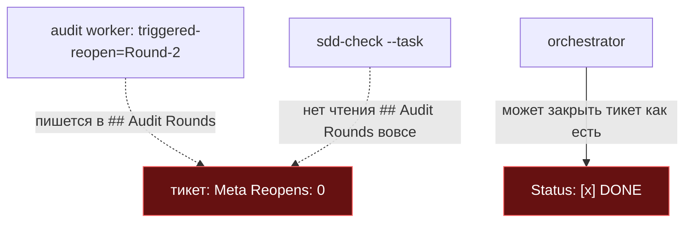
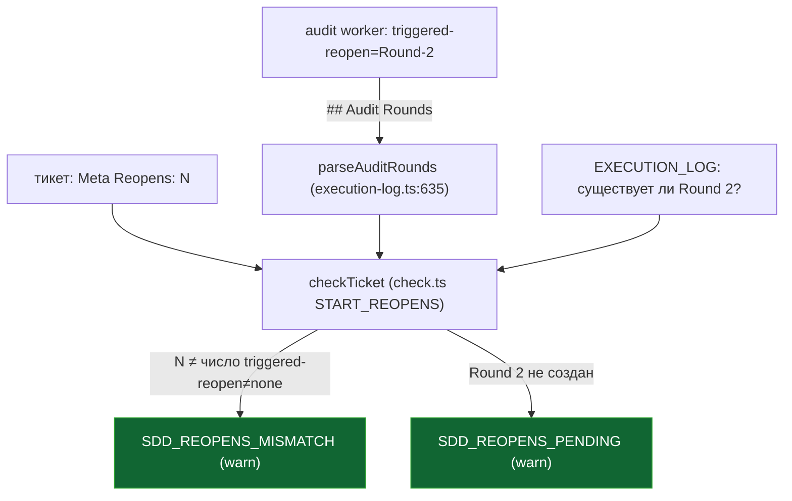

ОТЧЁТ 61 §1 — B2-06: реопен связан с породившей его находкой

СТАТУС: DONE

Рабочее дерево: `rc-v6`. Ветка `lead/reopen-by-cause`, от `origin/lead/journal-round` (стек поверх PR #40).

КОММИТ:
- `65f3a411` feat(B2-06): reopen is causally linked to the audit finding that caused it

---

## 1. Файлы

| Путь | Тип | Смысловое изменение | Чем доказано |
|---|---|---|---|
| `shared/sdd/execution-log.ts` | правка | Новый `parseAuditRounds(content)` — читает бесхозный (не `<!--SECTION-->`) заголовок `## Audit Rounds` через `extractHeadingSection`, парсит каждый `### Audit Round <N>` блок и его fenced `@audit …` строку в `{n, afterExecRound, triggeredReopen, verdict}`. Новый `checkReopens`-эквивалент **не выделен отдельной функцией** — логика инлайнится прямо в `check.ts` (см. ниже), а сюда добавлены только парсер + `isValidRoundReason` (закрытая словарная проверка причины раунда: `initial \| resume \| new-audit-session \| fix: F-NNN`) + экспортируемый `META_REOPENS_RE`. | `shared/sdd/__tests__/reopens.test.ts` — 9 кейсов (парсер, causal-reopens через `checkTicket`, словарь причин). |
| `shared/sdd/check.ts` | правка | `checkTicket` получил регион `START_REOPENS`: парсит `parseAuditRounds`, сравнивает объявленный Meta `**Reopens:**` со счётом записей `triggered-reopen≠none` (`SDD_REOPENS_MISMATCH`, **warn**), и для каждой такой записи проверяет, что заявленный `Round-N` реально существует в `EXECUTION_LOG` (`SDD_REOPENS_PENDING`, **warn** — реопен объявлен, но не исполнен). Логика лежит в `check.ts`, а не в `execution-log.ts` — сознательное решение по прецеденту соседних кодов (`analyzeRoundClosures`/`firstRoundPhaseBlockCounts` тоже парсят в одном модуле, а находки строят в другом). | Там же. |
| `cli/cmd/sdd-log/sdd-log.cmd.ts` | правка | `round`-режим отказывает (`badInvocation`, exit 4), если причина раунда не входит в закрытый словарь (`isValidRoundReason`). | `sdd-log.cmd.test.ts` — новый тест «rejects a round reason outside the closed vocabulary — exit 4». |
| `cli/cmd/sdd-log/sdd-log.types.ts` | правка | Ре-экспорт `nextRoundNumber, isValidRoundReason` из `execution-log.ts`; JSDoc `buildRoundHeader` обновлён под закрытый словарь. | компилируется, тесты выше. |
| `ai/kit/axiom/process/ax-reopen-format.xml` | правка | Документирует оба новых механических кода и принудительный словарь причин раунда (регенерирует `ai/directives/sdd-v2/reconcile.directive.xml` через `{{> "axiom/process/ax-reopen-format"}}`). | `npm run check:directives-fresh` clean. |
| `ai/directives/sdd-v2/reconcile.directive.xml` | build-output | Регенерирован из правки выше. | `check:directives-fresh`. |
| `shared/sdd/__tests__/reopens.test.ts` | новый | 9 тестов: `parseAuditRounds` (3), causal-reopens через `checkTicket` (4), `isValidRoundReason` (2). | сам файл. |

`git show --stat 65f3a411` — 8 файлов (+301/−5). Совпадает.

---

## 2. Архитектура было / стало

### Было — Reopens никак не проверяется



### Стало — причинная сверка



---

## 3. Доказательства (ПРИЁМКА брифа)

1. **новый `shared/sdd/__tests__/reopens.test.ts`** — ВЫПОЛНЕНО.
   ```
   $ node --import tsx --test shared/sdd/__tests__/reopens.test.ts
   # tests 9 / pass 9 / fail 0
   ```
2. **`sdd-log.cmd.test.ts` — причина вне словаря → exit 4** — ВЫПОЛНЕНО.
   ```
   $ node --import tsx --test cli/cmd/sdd-log/__tests__/sdd-log.cmd.test.ts
   # tests 150 (весь файл) / pass 150 / fail 0
   ```
3. **Полный прогон** — ВЫПОЛНЕНО. `npm run check` → `[sdd-verify] ✅ ALL PASS (5/5)` (type-check, test:coverage, lint, format, yagni).

---

## 4. Отклонения и открытые вопросы

- **Severity.** Бриф допускал «warn (L-3) если строка доски не требует error явно». Строка доски (`61-TASK-BOARD.md`) не называет severity явно; дизайн-документ `31-TRACK-CHECK-LOG.md §3.4` предлагает `SDD_REOPENS_MISMATCH: error / SDD_REOPENS_PENDING: warn`. Решено: **обе — warn**, по прямому прецеденту соседних кодов той же секции (`SDD_EXECUTION_LOG_ENTRY_AFTER_CLOSE` и др., все явно закомментированы «WARN per L-3, new codes stay warn until B2-15/B2-20 flip»). Флип на error — задача **B2-20**, не в этой пачке.
- **Архитектурное отклонение от контракта `31-TRACK-CHECK-LOG.md §3.2`.** Документ предлагал `export function checkReopens(file, content): Finding[]` как отдельную функцию в `execution-log.ts`. Вместо этого логика инлайнена в `check.ts`'s `checkTicket` (парсер `parseAuditRounds` остался в `execution-log.ts`). Причина: (а) тот же контракт §3.2 предлагает и `checkExecutionLog(file, content): Finding[]`, которого в реальном коде тоже нет — существующая кодовая база уже разошлась с этим наброском в пользу «парсер в execution-log.ts, находки в check.ts»; (б) отдельная `checkReopens` экспортированная из `check.ts` только через `export {...} from` (barrel-реэкспорт) не набирала ≥2 «настоящих» использований и падала на `gennady yagni` (`ERR_CLI_YAGNI_UNDERUSED`) — честного второго потребителя без надуманного кода не нашлось. Инлайн в `checkTicket` решает обе проблемы разом и не требует Usage Waiver в `specs/**` (которые запрещено трогать по зоне брифа).
- **`parseAuditRounds` сам получил Usage Waiver не через `specs/**`** — вместо этого дан реальный второй вызов внутри `check.ts` (прямой `import` + вызов, не барабанный реэкспорт), что и разрешило `yagni`-находку honestly.
- Известный побочный эффект (не блокер): `sdd-task.cmd.ts`'s собственный вызов `scanBlockerTrail` не тронут — не относится к B2-06 (устранено правкой по вердикту верификатора F-1 в отдельном коммите `813da3fd`, см. сводный отчёт).

**Правка по вердикту верификатора (V-BATCH-15 F-5.3):** §2, мермэйд-диаграмма «стало» — `parseAuditRounds (execution-log.ts:~565)` исправлено на фактическую строку `:635`.

**Команды пуша для Lead:**
```
git push origin lead/reopen-by-cause
```
