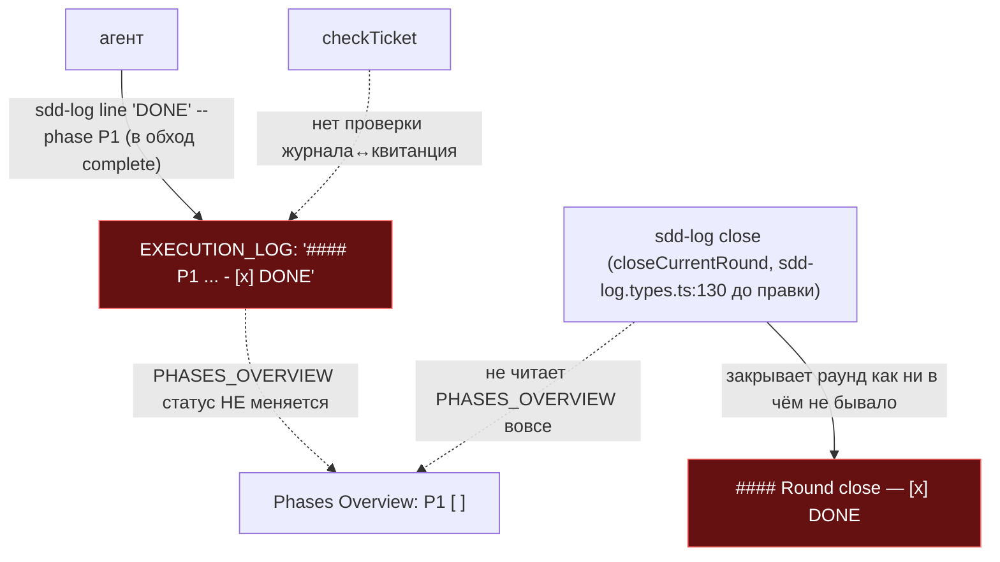
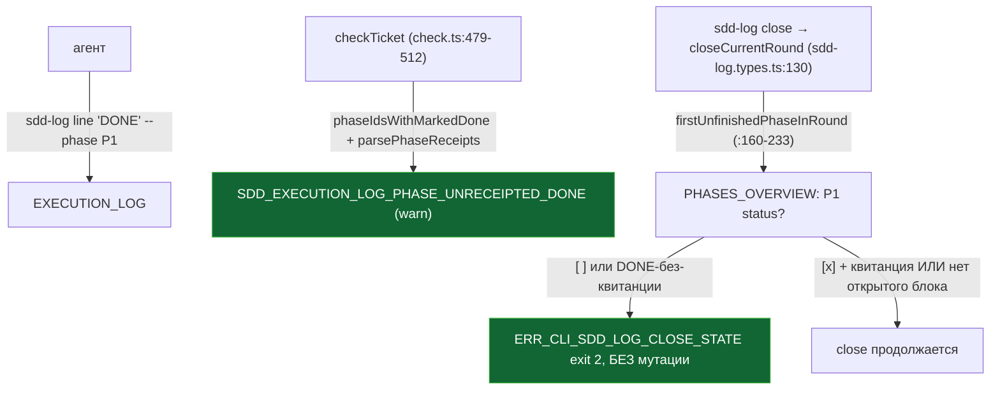

ОТЧЁТ 61 §1 — B2-07: фаза не бывает «сделана» без квитанции; закрытие раунда отказывает

СТАТУС: DONE

Рабочее дерево: `rc-w3`. Ветка `lead/journal-round`, после B2-16 (`dd869fde`).

КОММИТ:
- `61f83719` feat(B2-07): a phase cannot be "done" without a receipt; close refuses too

---

## 1. Файлы

| Путь | Тип | Смысловое изменение | Чем доказано |
|---|---|---|---|
| `shared/sdd/check.ts` | правка | Новая проверка внутри `START_PHASES` (`:499-511`): для каждого тикета с читаемым `PHASES_OVERVIEW` и читаемым `EXECUTION_LOG`, `phaseIdsWithMarkedDone(logSec.content)` (тогда локально в check.ts, после B2-01 — импорт из execution-log.ts) находит фазы с отмеченной `DONE`-строкой в журнале; если для такой фазы нет `SDD_PHASE_RECEIPT` (`parsePhaseReceipts`), пишется `SDD_EXECUTION_LOG_PHASE_UNRECEIPTED_DONE` (**warn**, L-3). Закрывает обход: `sdd-log line "DONE" --phase P1` больше не проходит незамеченным мимо `sdd-log complete`. | `shared/sdd/__tests__/check-phases.test.ts` — сьют `SDD_EXECUTION_LOG_PHASE_UNRECEIPTED_DONE (B2-07)`, 4 теста. |
| `cli/cmd/sdd-log/sdd-log.types.ts` | правка | `closeCurrentRound` (`:130+`) получила предварительную проверку `firstUnfinishedPhaseInRound` (`:160-233`): парсит `PHASES_OVERVIEW`, для каждой фазы с открытым блоком В ЭТОМ РАУНДЕ проверяет статус `[x]` в Overview И (если помечена DONE в журнале) наличие CLI-квитанции; при нарушении — `{ok:false, detail:'phase P<N> is not completed'}` либо `'...is marked DONE...no CLI-owned SDD_PHASE_RECEIPT'`, что превращается в `ERR_CLI_SDD_LOG_CLOSE_STATE` (exit 2, без мутации файла). Легаси-тикет без читаемого `PHASES_OVERVIEW` — пропускается (без регресса). | `cli/cmd/sdd-log/__tests__/sdd-log.cmd.test.ts` — сьют `close mode — refuses an incomplete or unreceipted phase (B2-07)`, 3 теста; существующий тест «replaces one scaffolded Round-close skeleton...» адаптирован — сначала легитимно завершает P1 через `complete`, ПОТОМ закрывает раунд (реальный флоу оркестратора). |
| `shared/sdd/__tests__/check-phases.test.ts` | правка | 4 новых теста: WARN при непомеченной квитанции, чисто при квитанции, не путает DONE внутри `Round close` с предыдущей фазой, молчит на незаполненном скелете. | см. выше. |
| `cli/cmd/sdd-log/__tests__/sdd-log.cmd.test.ts` | правка | 3 новых теста + 1 адаптированный существующий (см. выше). | см. выше. |

`git show --stat 61f83719` — 4 файла (+306/−0). Совпадает.

---

## 2. Архитектура было / стало

### Было — обход `complete` невидим для check и для close



### Стало — обход виден и в check, и в close



---

## 3. Доказательства (ПРИЁМКА брифа)

1. **«детерминированный тест»** (check.ts) — ВЫПОЛНЕНО.
   ```
   $ node --import tsx --test shared/sdd/__tests__/check-phases.test.ts
   # tests 21 (после B2-16+B2-07) / pass 21 / fail 0
   ```
2. **«`sdd-log close` отказывает при фазе со статусом `[ ]` или отмеченным DONE без receipt»** — ВЫПОЛНЕНО.
   ```
   $ node --import tsx --test cli/cmd/sdd-log/__tests__/sdd-log.cmd.test.ts
   # tests 73 / pass 73 / fail 0
   ```
3. **Полный прогон после всей пачки** — см. сводный отчёт: `npm test` 3693 pass 0 fail; `sdd-check --all .` → 192 error(s) (WARN-only код, не влияет на error-баланс); `gate:sdd-check-baseline` → OK.

---

## 4. Отклонения и открытые вопросы

Нет отклонений от брифа. Severity `SDD_EXECUTION_LOG_PHASE_UNRECEIPTED_DONE` = **warn** (не error, как в исходном §3.4 дизайн-документа `31-TRACK-CHECK-LOG.md`) — по прямому указанию Lead в брифе («новые коды — warn (L-3)») и по решению L-3 (`31 D5`, вариант 2: warn сейчас, error после инвентаризации долга B2-15). B2-15 не входит в эту пачку.

**Команды пуша для Lead:**
```
git push origin lead/journal-round
```
