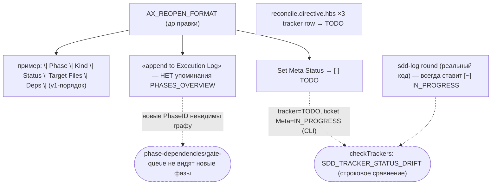
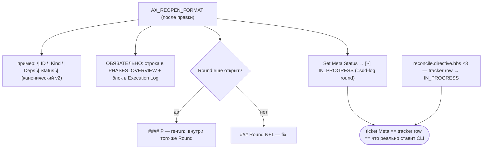

ОТЧЁТ — B2-08: `ax-reopen-format.xml` под структуру v2 (Пачка 4)

СТАТУС: DONE

Рабочее дерево: `rc-v6`, ветка `lead/specs-match-code` (продолжение после `ead43102`).

КОММИТ (локальный, ничего не запушено):
- `7452b10f` docs(B2-08): AX_REOPEN_FORMAT matches v2 PHASES_OVERVIEW, splits — re-run: vs new Round by D-20, fixes TODO/IN_PROGRESS contradiction

---

## 1. Файлы

| Путь | Тип | Смысловое изменение | Чем доказано |
|---|---|---|---|
| `ai/kit/axiom/process/ax-reopen-format.xml` | правка | Живой брик (реально `{{> included}}` в `reconcile.directive.hbs`). Четыре независимых правки: (1) пример таблицы `\| Phase \| Kind \| Status \| Target Files \| Deps \|` → канонический `\| ID \| Kind \| Deps \| Status \|`; (2) явное требование добавить строку в `PHASES_OVERVIEW` для каждого нового PhaseID (раньше — только «append to Execution Log», без упоминания второй секции); (3) разведены по D-20 два способа: `#### P<N> — re-run:` только пока Round открыт, новый `### Round N+1`, если Round уже закрыт; (4) Meta Status и tracker-row при реопене — `[~] IN_PROGRESS`, не `[ ] TODO` (совпадает с тем, что реально ставит `sdd-log round`, и не создаёт `SDD_TRACKER_STATUS_DRIFT`, т.к. `checkTrackers` сравнивает строкой). | `cli/cmd/sdd-log/__tests__/sdd-log.cmd.test.ts` — 1 новый кейс; `shared/sdd/__tests__/check-phases.test.ts` — 1 новый кейс. |
| `ai/kit/templates/sdd-v2/reconcile.directive.hbs` | правка | 3 инлайн-упоминания «tracker row → TODO» (в классификации `task-reopen`, в плане `STEP_3_PLAN`, в `STEP_5_APPLY`) → `IN_PROGRESS` — та же причина, что и в аксиоме. | Сверка построчно с прежним текстом; `check:directives-fresh`. |
| `shared/sdd/__tests__/check-phases.test.ts` | правка | Новый тест: полный `checkTicket` на тикете с v1-порядком PHASES_OVERVIEW не даёт `SDD_PHASE_DAG_CYCLE`/`SDD_PHASE_DEP_UNRESOLVED`/`SDD_PHASE_SECTION_ORPHAN` (закрепляет параллельно и B2-09-фикс на уровне полного `checkTicket`, не только `parsePhasesOverview`). | Прогон, см. §3. |
| `cli/cmd/sdd-log/__tests__/sdd-log.cmd.test.ts` | правка | Новый тест: Round, записанный БУКВАЛЬНО по примеру аксиомы (4-колоночная PHASES_OVERVIEW, fix+test фазы, `[~] IN_PROGRESS`), закрывается через `sdd-log complete`. | Прогон, см. §3. |
| `ai/directives/sdd-v2/reconcile.directive.xml` | build output | Перегенерирован. | `check:directives-fresh`. |

`git diff --stat 7452b10f~1 7452b10f`: 5 файлов, 134 insertions(+), 32 deletions(-).

---

## 2. Архитектура было / стало

### Было — реопен по аксиоме оставляет фазы невидимыми графу, а статусы расходятся с трекером



### Стало — граф видит новые фазы, статусы согласованы, форма выбирается по D-20


Узлы: `ai/kit/axiom/process/ax-reopen-format.xml`, `ai/kit/templates/sdd-v2/reconcile.directive.hbs:126,150,182` (три inline-упоминания).

---

## 3. Доказательства

**`sdd-log.cmd.test.ts` — «реопен, записанный точно по аксиоме, закрывается complete»** (буквально из приёмки):
```
$ node --import tsx --test cli/cmd/sdd-log/__tests__/sdd-log.cmd.test.ts
# (в составе прогона: «a Round written exactly per AX_REOPEN_FORMAT closes cleanly with complete» — ok)
```
ВЫПОЛНЕНО.

**`check-phases.test.ts` — «заголовок `\| Phase \| …` не читается как фаза, Status/Deps не путаются»** (буквально из приёмки):
```
$ node --import tsx --test shared/sdd/__tests__/check-phases.test.ts cli/cmd/sdd-log/__tests__/sdd-log.cmd.test.ts
# tests 77 · # pass 77 · # fail 0
```
ВЫПОЛНЕНО.

**check:directives-fresh** (перегенерация после правки `.hbs`):
```
✓ ai/directives/** matches a fresh rebuild.
```
`git diff --stat -- ai/directives/`: `reconcile.directive.xml`, +28/-16. ВЫПОЛНЕНО.

**Полный прогон**: `tsc --noEmit` чист; `lint` чист; `render.test.ts` corpus 48/48. `sdd-check --all` после rebuild: `198 error(s), 432 warning(s)` — без изменений. ВЫПОЛНЕНО.

---

## 4. Отклонения, открытые вопросы, команды пуша

**Отклонения от брифа:**
- `✅ RESOLVED`/секция `## Blocker Trail` (упомянута в старой версии аксиомы как «куда пишется RESOLVED») **не тронута** — это отдельная, ещё не назначенная задача `B2-19` (`60-ACCEPTANCE.md:A11` — «B2-19 единственный владелец»); новая версия аксиомы явно называет это «related but separate concern», не пытаясь её решить.
- Механическое принуждение «запись в закрытый Round отклоняется» описано в аксиоме как норма, но **не реализовано в коде** (это будущая задача `B2-04`, коды `SDD_EXECUTION_LOG_ENTRY_AFTER_CLOSE` и т.п. в кодовой базе не существуют на момент этой задачи) — формулировка в аксиоме сознательно не утверждает, что CLI это УЖЕ отклоняет, только что запись в закрытый Round — невалидный ввод.

**Открытые вопросы:** нет.

**Команды пуша для Lead:**
```
git -C rc-v6 push origin lead/specs-match-code:lead/specs-match-code
```
