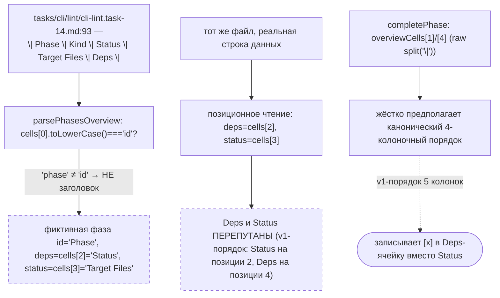
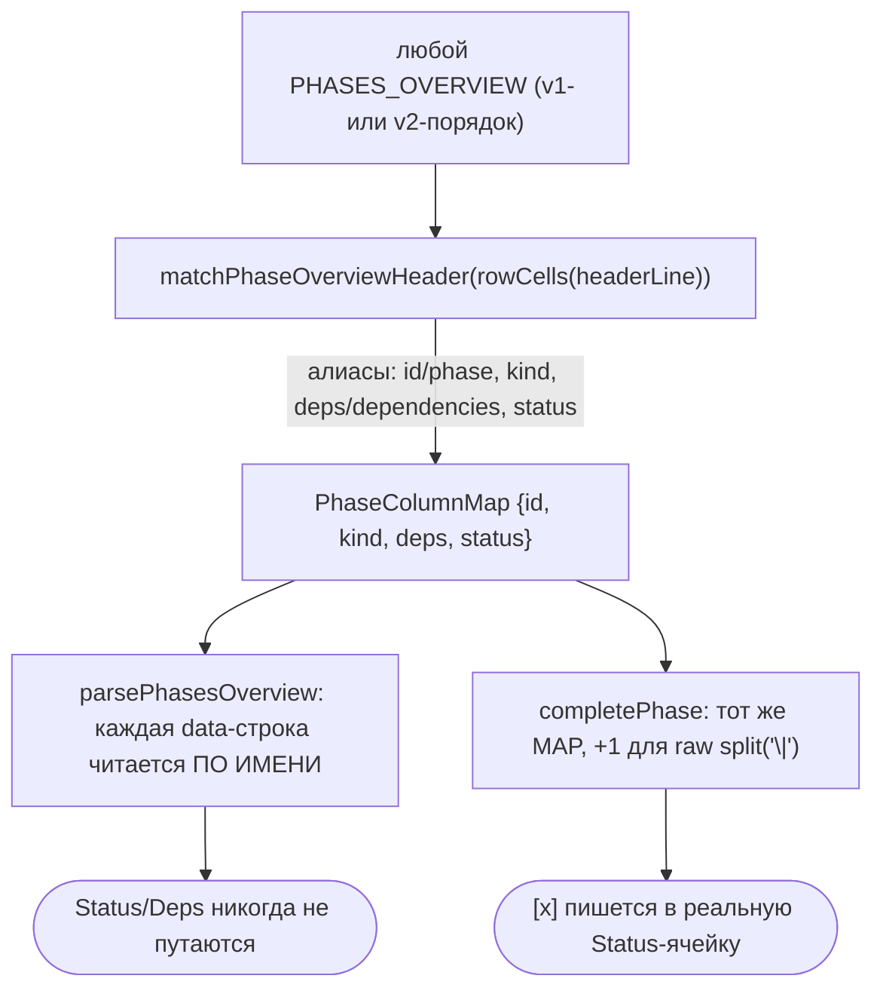

ОТЧЁТ — B2-09: `parsePhasesOverview`/`completePhase` устойчивы к v1-заголовкам PHASES_OVERVIEW (Пачка 4)

СТАТУС: DONE

Рабочее дерево: `rc-v6`, ветка `lead/specs-match-code` (продолжение после `0ab05811`).

КОММИТ (локальный, ничего не запушено):
- `dcfd4bf9` fix(B2-09): parsePhasesOverview/completePhase read PHASES_OVERVIEW columns by header name, not fixed position

---

## 1. Файлы

| Путь | Тип | Смысловое изменение | Чем доказано |
|---|---|---|---|
| `shared/sdd/ticket.ts` | правка | Новые `PhaseColumnMap` (тип) и `matchPhaseOverviewHeader(cells)` — по алиас-таблице (`id`/`phase`→id, `deps`/`dependencies`→deps, `kind`, `status`) определяет индексы колонок по ИМЕНАМ заголовка, а не по позиции. `parsePhasesOverview` теперь ВСЕГДА трактует первую нестроку-сепаратор как заголовок (совпал/не совпал — никогда не данные), читает остальные строки по выученной карте с фолбэком на исторический порядок (`id=0,kind=1,deps=2,status=3`), если заголовок не распознан. `rowCells`/`isSeparator` экспортированы для переиспользования. | `shared/sdd/__tests__/ticket.test.ts` — 2 новых кейса. |
| `cli/cmd/sdd-log/sdd-log.types.ts` | правка | `completePhase` больше не хардкодит `cells[1]`/`cells[4]` (raw `split('|')`-индексы id/status, годные только для канонического 4-колоночного порядка). Теперь сканирует заголовочную строку секции `PHASES_OVERVIEW` через `matchPhaseOverviewHeader(rowCells(line))`, переводит rowCells-индексы в raw-индексы (`+1`, компенсация ведущей пустой ячейки от `split('|')`), с тем же фолбэком на 0/1/2/3. | `cli/cmd/sdd-log/__tests__/sdd-log.cmd.test.ts` — 1 новый кейс. |
| `shared/sdd/__tests__/ticket.test.ts` | правка | 2 новых теста: v1-заголовок `\| Phase \| Kind \| Status \| Target Files \| Deps \|` не даёт фазы `id==='Phase'`; Status/Deps читаются по имени, не по позиции, на том же v1-порядке. | Прогон, см. §3. |
| `cli/cmd/sdd-log/__tests__/sdd-log.cmd.test.ts` | правка | Новый тест: `complete` на v1-порядке PHASES_OVERVIEW корректно переключает Status фазы `[x]`, не трогая реальный Deps соседней строки (P2's `P1`) и Target Files. | Прогон, см. §3. |

`git diff --stat dcfd4bf9~1 dcfd4bf9`: 4 файла, 159 insertions(+), 9 deletions(-). Директивы не тронуты — rebuild не требовался.

---

## 2. Архитектура было / стало

### Было — позиционное чтение ломается на легаси-порядке колонок



### Стало — карта колонок выучивается из заголовка


Узлы: `shared/sdd/ticket.ts` (`matchPhaseOverviewHeader`, `parsePhasesOverview`), `cli/cmd/sdd-log/sdd-log.types.ts` (`completePhase`, участок `idRawIndex`/`statusRawIndex`).

---

## 3. Доказательства

**Фикстура `tasks/cli/lint/cli-lint.task-14.md`** — реальный файл в дереве, чей заголовок `| Phase | Kind | Status | Target Files | Deps |` и был источником бага (легаси-тикет без SECTION-маркеров, поэтому не проходит через `parsePhasesOverview` в проде до миграции якорей — но именно эта форма таблицы теперь тестово покрыта на случай пост-миграционного тикета с якорями вокруг v1-таблицы).

**`ticket.test.ts`**:
```
$ node --import tsx --test shared/sdd/__tests__/ticket.test.ts cli/cmd/sdd-log/__tests__/sdd-log.cmd.test.ts shared/sdd/__tests__/check.test.ts
# tests 129 · # pass 129 · # fail 0
```
ВЫПОЛНЕНО.

**Более широкий прогон потребителей `parsePhasesOverview`** (check-phases, phase-dependencies, gate-queue, phase-verification-plan, audit-group, phase-receipt-check, sdd-task.cmd, phase-context):
```
$ node --import tsx --test shared/sdd/__tests__/check.test.ts shared/sdd/__tests__/check-phases.test.ts shared/sdd/__tests__/phase-dependencies.test.ts shared/sdd/__tests__/gate-queue.test.ts shared/sdd/__tests__/phase-verification-plan.test.ts shared/sdd/__tests__/audit-group.test.ts cli/cmd/sdd-check/__tests__/phase-receipt-check.test.ts cli/cmd/sdd-task/__tests__/sdd-task.cmd.test.ts cli/cmd/sdd-verify/__tests__/phase-context.test.ts
# tests 201 · # pass 201 · # fail 0
```
Регрессий на существующем каноническом 4-колоночном порядке нет — фолбэк на исторические позиции не задействуется, т.к. заголовок всегда распознаётся. ВЫПОЛНЕНО.

**Type-check/lint**: `tsc --noEmit` чист (после добавления обязательных JSDoc-контрактов для новых экспортов `rowCells`/`isSeparator`/`PhaseColumnMap`-полей — `lint:contracts` изначально дал 8 ошибок `ERR_DBC_LINT_*`, все исправлены). `lint` (`shared/`,`cli/`,`services/`) → clean. ВЫПОЛНЕНО.

**sdd-check --all** после rebuild: `198 error(s), 432 warning(s)` — без изменений (директивы не трогались). ВЫПОЛНЕНО.

---

## 4. Отклонения, открытые вопросы, команды пуша

**Отклонения от брифа:** нет — обе цели («щит по множеству имён колонок» и «completePhase перестаёт индексировать позицию Status жёстко») реализованы буквально.

**Открытые вопросы:** нет.

**Команды пуша для Lead:**
```
git -C rc-v6 push origin lead/specs-match-code:lead/specs-match-code
```
