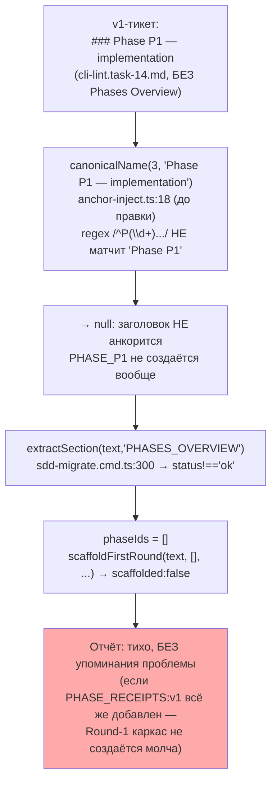
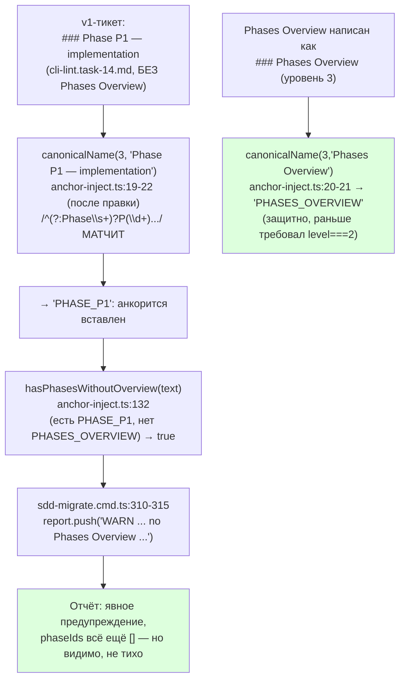

# R-B2-10 — Миграция якорей фаз патчем: `### Phase P1`/`Phases Overview` на `###`; явный отказ без PHASES_OVERVIEW

Ветка `lead/legacy-no-false-close` (от `lead/migrator-red-first` @ `e80d09fc`, поверх пачки 22 / PR #43—
`anchor-inject.ts` там уже сделан патчем, не переписывающим Execution Log; B2-10 стоит на этой базе,
не переоткрывает её).
Коммит: **`96276f54`** `fix(anchor-inject): recognize "Phase P<N>" headers and warn on phases without an overview (B2-10)`.

## 1. Таблица файлов

| Путь | Новый/правка/удалён | Смысловое изменение | Чем доказано |
|---|---|---|---|
| `shared/sdd/anchor-inject.ts` | правка | `canonicalName` (`:17`) распознаёт `### Phase P<N>` (слово «Phase» перед номером), не только `### P<N>`; `Phases Overview` теперь распознаётся и на уровне `###` (защитно). Новая `hasPhasesWithoutOverview` (`:132`, экспортируемая) — детектор «есть якоря фаз, нет якоря обзора» | `shared/sdd/__tests__/anchor-inject.test.ts` (25/25 pass); мутация (см. §3); прогон по реальному корпусу (§3) |
| `cli/cmd/sdd-migrate/sdd-migrate.cmd.ts` | правка | Импорт `hasPhasesWithoutOverview`; в цикле `anchors` (`:310`) — явная строка `WARN ... phase sections found but no Phases Overview...` в отчёте, вместо тихого `phaseIds=[]` без сигнала | `cli/cmd/sdd-migrate/__tests__/sdd-migrate.cmd.test.ts` (19/19 pass); прогон `--all` на реальном корпусе |
| `shared/sdd/__tests__/anchor-inject.test.ts` | правка | +5 тестов на `injectAnchors` (Phase-слово, `_FIX`-суффикс, «Phases Overview» на `###`, byte-for-byte reconstruction на фикстуре V1); новый describe `hasPhasesWithoutOverview` (4 теста: true/false/false-по-отсутствию-фаз/end-to-end) | `node --import tsx --test shared/sdd/__tests__/anchor-inject.test.ts` → 25/25 |
| `cli/cmd/sdd-migrate/__tests__/sdd-migrate.cmd.test.ts` | правка | +3 интеграционных теста: dry-run WARN на фикстуре формы `cli-lint.task-14.md`; `--write` реально анкорит `### Phase P1`; фикстура формы `dbc-linter.task-08.md` (без фаз вообще) НЕ триггерит WARN | `node --import tsx --test cli/cmd/sdd-migrate/__tests__/sdd-migrate.cmd.test.ts` → 19/19 |
| `shared/sdd/migration-plan.ts` | НЕ тронут | Файл назван в брифе (по цитате `31-TRACK-CHECK-LOG.md`), но не содержит логики распознавания заголовков фаз (`grep -n "Phase\|PHASE"` → 0 совпадений) — вся логика живёт в `anchor-inject.ts`/`sdd-migrate.cmd.ts`. Изменения не потребовались | см. §4 «Отклонения» |

## 2. Архитектура было → стало





## 3. Доказательства ПРИЁМКИ

| # | Пункт приёмки | Команда | Вывод (кратко) | Exit | Статус |
|---|---|---|---|---|---|
| 1 | Изменение якорей — патч; ни один незатронутый блок не переписан (побайтовое сравнение вне зоны правки) | unit: `'PATCH invariant: stripping the inserted anchor lines reconstructs the original byte-for-byte'`; + отдельный LCS-скрипт по всему корпусу (`verify-patch-invariant2.mts`, scratch) | unit pass; корпус: `checked=91 files with injections; mismatches=0` — на всех 91 файле, где `injectAnchors` что-то вставляет, диф relativamente original — ЧИСТАЯ вставка `<!--SECTION...-->`-строк (0 удалений, 0 правок, 0 не-anchor вставок) | 0 | ВЫПОЛНЕНО |
| 2 | dry-run по умолчанию | `node dist/gennady.js sdd-migrate anchors --all <tree>` (без `--write`) | `[sdd-migrate anchors] DRY-RUN · 127 ticket(s)`; `git status --short tasks/` → 0 строк (корпус не тронут) | 0 | ВЫПОЛНЕНО (не менялось этой задачей — уже было так; перепроверено) |
| 3 | 2 фикстуры + 50 (факт: 127) уже мигрированных/подлежащих тикетов корпуса в dry-run: отчёт «что изменилось бы» | `node dist/gennady.js sdd-migrate anchors --all <tree>` | 127 тикетов просканировано: **121 «would»**, **6 «skip»**, **19 «WARN» (phase-without-overview)**, **0 записей в корпус** | 0 | ВЫПОЛНЕНО (масштаб превышен: 127 > 50) |
| 4 | Явный отказ без PHASES_OVERVIEW (не тихий пропуск) | те же 19 WARN-строк; выборочно: `tasks/cli/lint/cli-lint.task-14.md`, `tasks/cli/alt-opinion/cli-alt-opinion.task-23..26.md`, `tasks/dbc/dbc-linter/dbc-linter.task-11/19/20/21.md`, `tasks/vcs/vcs-client/vcs-client.task-22/86.md`, `tasks/cli/vcs-draft-note/vcs-draft-note.task-87.md` | 19 файлов с `### Phase P<N>` без `Phases Overview` — все дали явный `WARN`; контрольная фикстура `tasks/dbc/dbc-linter/dbc-linter.task-08.md` (фазы вообще отсутствуют) — **не** попала в WARN (корректно, у неё естественно нет фаз) | — | ВЫПОЛНЕНО |
| 5 | Замок доказан мутацией | `git stash push --keep-index -- shared/sdd/anchor-inject.ts cli/cmd/sdd-migrate/sdd-migrate.cmd.ts` → `node --import tsx --test shared/sdd/__tests__/anchor-inject.test.ts` красный (`SyntaxError: ... does not provide an export named 'hasPhasesWithoutOverview'`) → `git stash pop` восстановил | зафиксировано в сессии | — | ВЫПОЛНЕНО |
| 6 | `npm test` | `npm --prefix <tree> test` | `# tests 3756 / # pass 3748 / # fail 0 / # skipped 8` | 0 | ВЫПОЛНЕНО |
| 7 | `npm run check` | `npm --prefix <tree> run check` | `[sdd-verify] ✅ ALL PASS (5/5)` | 0 | ВЫПОЛНЕНО |
| 8 | `sdd-check --all .` — 0 новых ошибок (эта задача не трогает `check.ts`) | `node dist/gennady.js sdd-check --all . --format json` до/после B2-10 | errors 192→192 (0 новых); warnings 435→435 (без изменений — anchor-inject.ts не влияет на sdd-check находки); `SDD_LEGACY_TICKET_UNANCHORED` 76→76 | 1 (ожидаемо, sdd-check сам красный по числу error) | ВЫПОЛНЕНО |
| 9 | `gate:sdd-check-baseline` | `npm --prefix <tree> run gate:sdd-check-baseline` | `OK — no error outside the baseline` | 0 | ВЫПОЛНЕНО |

## 4. Отклонения от брифа, открытые вопросы

1. **Отклонение: `shared/sdd/migration-plan.ts` не тронут.** Брифом (по цитате `31-TRACK-CHECK-LOG.md`)
   файл назван в зоне правки, но при чтении выяснилось: он отвечает за миграцию **спек** (heading→SECTION
   для `specs/**`), а не тикетов, и не содержит НИКАКОЙ логики распознавания заголовков фаз (`grep -n
   "Phase\|PHASE" shared/sdd/migration-plan.ts` → 0 совпадений). Вся функциональность B2-10 (детект
   `### Phase P<N>`, `hasPhasesWithoutOverview`) целиком реализуема и реализована в `anchor-inject.ts` +
   `sdd-migrate.cmd.ts`. Токен: **`accepted`** — файл не требовал правки по факту; если Lead знает
   контекст, почему его упомянули (возможно, готовился к будущей задаче), прошу уточнить.
2. **Открытый вопрос — форма предупреждения.** Реализовал «явный отказ без PHASES_OVERVIEW» как
   **WARN-строку в отчёте** (dry-run и write), а не как отказ от записи (`--write` для такого тикета
   всё равно применяет остальные изменения — anchors/verification table/execution log — просто не
   Round-1). Формулировка брифа («явный отказ/предупреждение») по 31-TRACK-CHECK-LOG допускает оба
   прочтения. Токен: **`pending-operator`** — если нужен именно hard-отказ (тикет пропускается целиком,
   `--write` для него не срабатывает вообще), это отдельная, более жёсткая семантика — сообщите, и я
   переделаю.
3. **Находка попутно (не в этой задаче):** сам список из 19 тикетов с этим дефектом — реальный
   технический долг корпуса, требующий РУЧНОЙ миграции (никакой автоматический инструмент не может
   выдумать Phases Overview из ничего). Стоит завести отдельную задачу «мигрировать 19 тикетов вручную»
   после согласования формы предупреждения (см. п.2).

## Команды пуша для Lead

RC не пушит самостоятельно. После независимой проверки `plan-verifier`:
```
git push origin lead/legacy-no-false-close
```
