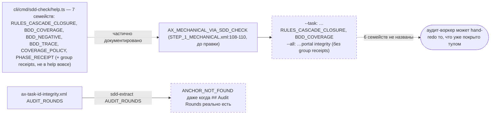
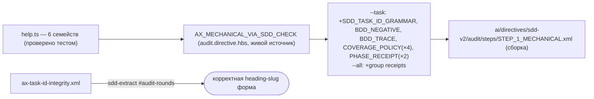

ОТЧЁТ — B2-11: `STEP_1_MECHANICAL` синхронизирован с фактическим набором кодов `sdd-check` (Пачка 4)

СТАТУС: DONE

Рабочее дерево: `rc-v6`, ветка `lead/specs-match-code` (продолжение после `dcfd4bf9`).

КОММИТ (локальный, ничего не запушено):
- `71fe1cf0` docs(B2-11): STEP_1_MECHANICAL names every sdd-check code family; ax-task-id-integrity fixes AUDIT_ROUNDS extraction form

---

## 1. Файлы

| Путь | Тип | Смысловое изменение | Чем доказано |
|---|---|---|---|
| `ai/kit/templates/sdd-v2/audit.directive.hbs` | правка | `AX_MECHANICAL_VIA_SDD_CHECK` (реальный, живой источник — сюда лазит `{{> "axiom/…"}}`-механизм, но САМ текст инлайнен, не партиал) дополнен: bullet `--task` получил `SDD_TASK_ID_GRAMMAR`, `BDD_NEGATIVE` (`SDD_BDD_MISSING_NEGATIVE`), `BDD_TRACE` (`SDD_BDD_REQUIREMENT_UNTRACED`), `COVERAGE_POLICY` (4 кода), `PHASE_RECEIPT` (2 кода); bullet `--all` получил «group receipts» (`SDD_GROUP_AUDIT_MISSING`/`SDD_GROUP_REVIEW_MISSING`). | `ai/kit/__tests__/audit-mechanical-check-coverage.test.ts` — 3 кейса. |
| `ai/kit/axiom/audit/ax-mechanical-via-sdd-check.xml` | правка | Обнаружено осиротевшим (не `{{> included}}` ни одним `.hbs` — живая копия в `audit.directive.hbs`). Синхронизирован вручную теми же 6 семействами кодов + добавлен NOTE-комментарий про причину рассинхрона. | Ручная сверка с `audit.directive.hbs`. |
| `ai/kit/axiom/audit/ax-task-id-integrity.xml` | правка | Тоже осиротевший брик. `AUDIT_ROUNDS` описывался как обычный `<!--SECTION:NAME-->`-анкор (`sdd-extract <ticket> AUDIT_ROUNDS`), хотя это голый markdown-заголовок `## Audit Rounds` (`TICKET_AUDIT_ROUND_FORMAT`) — реальная форма извлечения `sdd-extract <ticket>#audit-rounds` (heading-slug). Исправлено + NOTE про осиротелость. | Сверка с `cli/cmd/sdd-extract/sdd-extract.cmd.ts` (двойная форма адресации: `<NAME>` vs `#<heading-anchor>`) и `ai/kit/contract/audit/ticket-audit-round-format.xml`. |
| `ai/kit/__tests__/audit-mechanical-check-coverage.test.ts` | новый | Извлекает все `ALL_CAPS: ` семейства из `cli/cmd/sdd-check/help.ts` (`RULES_CASCADE_CLOSURE`, `BDD_COVERAGE`, `BDD_NEGATIVE`, `BDD_TRACE`, `COVERAGE_POLICY`, `PHASE_RECEIPT`) и проверяет их присутствие и в собранном `STEP_1_MECHANICAL.xml`, и в `.hbs`-источнике — буквально «коды в help.ts ⊆ коды, перечисленные в директиве». | Прогон, см. §3. |
| `ai/directives/sdd-v2/audit/steps/STEP_1_MECHANICAL.xml` | build output | Перегенерирован (`npm run build:directives`, cwd=rc-v6). | `check:directives-fresh`. |

`git diff --stat 71fe1cf0~1 71fe1cf0`: 5 файлов, 71 insertions(+), 8 deletions(-).

---

## 2. Архитектура было / стало

### Было — аудит-воркер не знает, что `sdd-check` уже проверяет 6 семейств кодов



### Стало — директива называет все реальные семейства кодов; AUDIT_ROUNDS — верная форма


Узлы: `ai/kit/templates/sdd-v2/audit.directive.hbs:35-37` (два bullet-а), `ai/kit/__tests__/audit-mechanical-check-coverage.test.ts` (тест-страж).

---

## 3. Доказательства

**check-directives-fresh** (существующий гейт свежести, буквально из приёмки):
```
$ npm run build:directives   → Generated 55 directive(s).
$ npm run check:directives-fresh   → ✓ ai/directives/** matches a fresh rebuild.
```
ВЫПОЛНЕНО. Единственный изменённый файл в `ai/directives/**`: `sdd-v2/audit/steps/STEP_1_MECHANICAL.xml`.

**coverage-тест кодов** (буквально из приёмки: «коды в help.ts ⊆ коды, перечисленные в директиве»):
```
$ node --import tsx --test ai/kit/__tests__/audit-mechanical-check-coverage.test.ts
# tests 3 · # pass 3 · # fail 0
```
ВЫПОЛНЕНО.

**Регрессия по остальным .hbs-тестам**: `render.test.ts` corpus round-trip — `48/48`. `tsc --noEmit` чист. `lint` (`shared/`,`cli/`,`services/`) чист. ВЫПОЛНЕНО.

**sdd-check --all** после rebuild: `198 error(s), 432 warning(s)` — без изменений. ВЫПОЛНЕНО.

---

## 4. Отклонения, открытые вопросы, команды пуша

**Отклонения от брифа:**
- И `ax-mechanical-via-sdd-check.xml`, и `ax-task-id-integrity.xml` оказались **осиротевшими бриками** (не подключены ни одним `.hbs`) — та же категория долга, что и 7 кирпичей `ai/kit/contract/process/**` (B2-18). Правка их содержимого сделана «на будущее» (корректный текст на случай подключения) и явно помечена NOTE-комментарием в каждом файле; сама wiring-проблема — не предмет B2-11, оставлена как есть.
- `AX_MECHANICAL_VIA_SDD_CHECK` в реальности инлайнен ПРЯМО в `audit.directive.hbs` (не через партиал `{{> "axiom/audit/ax-mechanical-via-sdd-check"}}`, как можно было бы ожидать по аналогии с соседними аксиомами того же файла) — правка сделана в обоих местах для консистентности, но именно `.hbs`-копия — та, что реально попадает в собранную директиву.

**Открытые вопросы:** нет.

**Команды пуша для Lead:**
```
git -C rc-v6 push origin lead/specs-match-code:lead/specs-match-code
```
