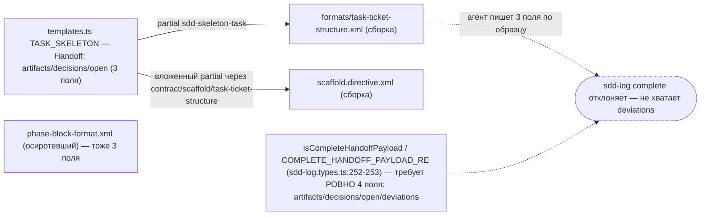
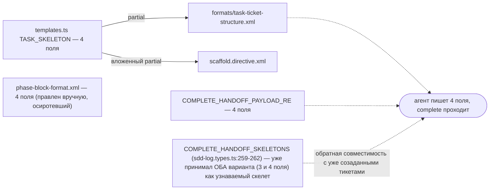

ОТЧЁТ — B2-14: скелет Handoff — одна запись, 4 поля (не 3) в трёх копиях (Пачка 4)

СТАТУС: DONE

Рабочее дерево: `rc-v6`, ветка `lead/specs-match-code` (продолжение после `71fe1cf0`).

КОММИТ (локальный, ничего не запушено):
- `ead43102` fix(B2-14): task skeleton's Handoff placeholder carries deviations — matches sdd-log complete's 4-field contract

---

## 1. Файлы

| Путь | Тип | Смысловое изменение | Чем доказано |
|---|---|---|---|
| `shared/sdd/templates.ts` | правка | `TASK_SKELETON`'а Handoff-плейсхолдер: `artifacts: [...]; decisions: [...]; open: [...]` → добавлено `; deviations: [...]`. Это ЕДИНСТВЕННЫЙ реальный источник для двух из трёх «копий» — `formats/task-ticket-structure.xml` (через build-партиал `sdd-skeleton-task`) и `scaffold.directive.xml` (через вложенный `{{> "contract/scaffold/task-ticket-structure"}}` → тот же партиал). | `shared/sdd/__tests__/templates.test.ts` — 1 новый кейс. |
| `ai/kit/contract/process/phase-block-format.xml` | правка | Третья копия — осиротевший брик (не подключён ни одним `.hbs`, та же категория, что и в B2-03/B2-11). Handoff-строка дополнена `; deviations: [<id: text, …>]`. | Ручная сверка. |
| `shared/sdd/__tests__/templates.test.ts` | правка | Новый тест: skeleton Handoff-строка матчит все 4 поля regex-ом. | Прогон, см. §3. |
| `ai/directives/sdd-v2/formats/task-ticket-structure.xml`, `ai/directives/sdd-v2/scaffold.directive.xml` | build output | Перегенерированы (`npm run build:directives`, cwd=rc-v6) — по 1 строке каждый, подтверждает, что оба реально деривируются из `templates.ts`. | `git diff --stat -- ai/directives/` → 2 файла, +2/-2. |

`git diff --stat ead43102~1 ead43102`: 5 файлов, 18 insertions(+), 4 deletions(-).

---

## 2. Архитектура было / стало

### Было — скелет учит трём полям, `complete` требует четыре



### Стало — все три копии учат 4 полям, совпадают с рантаймом


Узлы: `shared/sdd/templates.ts` (TASK_SKELETON), `cli/cmd/sdd-log/sdd-log.types.ts:252-262`.

---

## 3. Доказательства

**templates.test.ts** (буквально из приёмки):
```
$ node --import tsx --test shared/sdd/__tests__/templates.test.ts
# tests 40 · # pass 40
```
Новый кейс: «task skeleton Handoff placeholder carries all four fields sdd-log complete requires». ВЫПОЛНЕНО.

**`sdd-log.cmd.test.ts:446`** (существующий, буквально из приёмки — номер строки сдвинулся из-за более ранних задач пачки, но тест тот же по содержанию: «requires --phase and the canonical four-field Handoff payload»):
```
$ node --import tsx --test cli/cmd/sdd-log/__tests__/sdd-log.cmd.test.ts
# (в составе общего прогона файла — pass)
```
Подтверждает: рантайм-контракт (4 поля) не менялся этой задачей — менялся только скелет, чтобы соответствовать уже существующему контракту. ВЫПОЛНЕНО.

**check:directives-fresh**:
```
✓ ai/directives/** matches a fresh rebuild.
```
`git diff --stat -- ai/directives/` → `formats/task-ticket-structure.xml` (+1/-1), `scaffold.directive.xml` (+1/-1) — подтверждает, что обе копии деривируются автоматически из одной правки `templates.ts`. ВЫПОЛНЕНО.

**Полный прогон**: `tsc --noEmit` чист; `lint` (`shared/`,`cli/`,`services/`) чист; `render.test.ts` corpus 48/48 (в составе более широкого прогона той же задачи). `sdd-check --all` после rebuild: `198 error(s), 432 warning(s)` — без изменений. ВЫПОЛНЕНО.

---

## 4. Отклонения, открытые вопросы, команды пуша

**Отклонения от брифа:**
- `COMPLETE_HANDOFF_SKELETONS` (набор распознаваемых «недописанных» Handoff-строк, которые `complete` заменяет реальным значением) **не менялся** — он уже содержал ОБА варианта (3-польный и 4-польный) до этой задачи, поэтому тикеты, заскаффолженные ДО правки (с 3-польным скелетом), продолжают закрываться через `complete` без регрессии.
- Обнаружена (но НЕ тронута — вне охвата задачи) четвёртая копия 3-польного Handoff-паттерна в `ai/flow-eval/provision.ts` — не относится ни к одному из трёх названных бордом файлов, принадлежит другому треку (эвал-фикстуры).

**Открытые вопросы:** нет.

**Команды пуша для Lead:**
```
git -C rc-v6 push origin lead/specs-match-code:lead/specs-match-code
```
