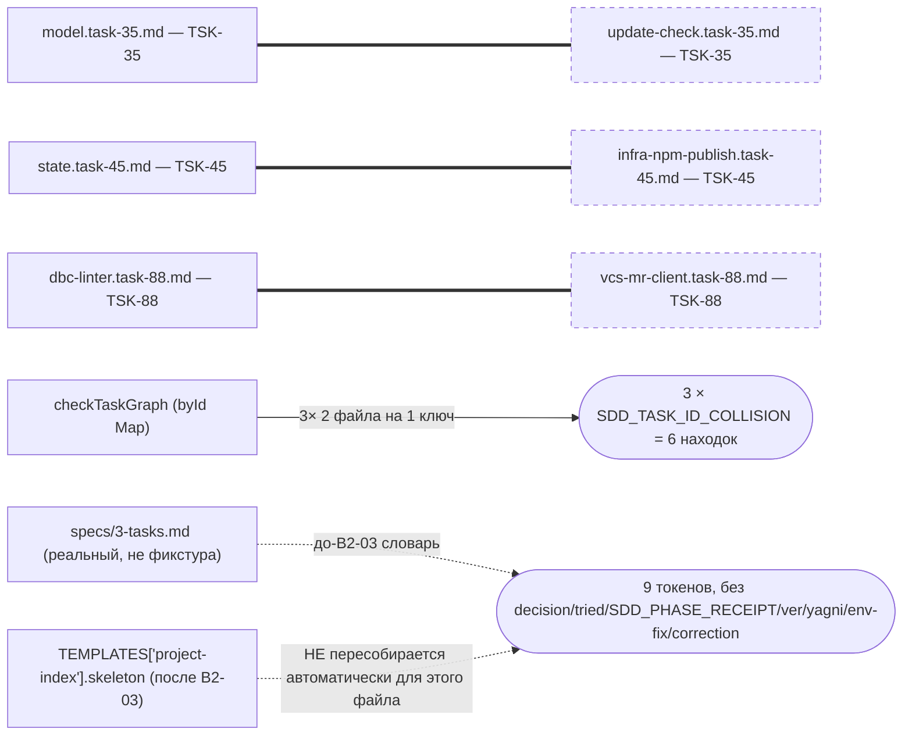
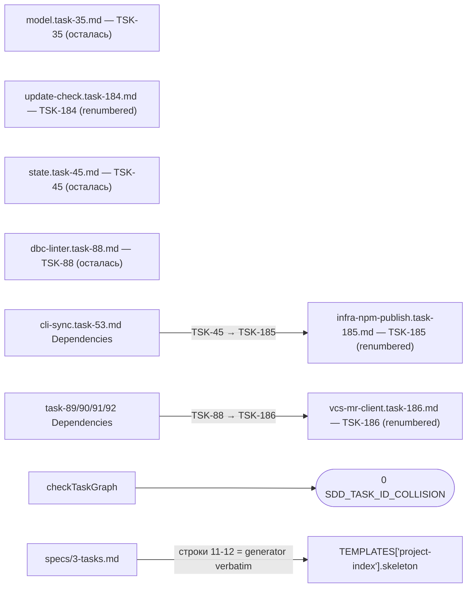

ОТЧЁТ — B2-15: разгребаем долг RC — дубли Task-ID, рассинхрон словаря `specs/3-tasks.md` (Пачка 4)

СТАТУС: DONE

Рабочее дерево: `rc-v6`, ветка `lead/specs-match-code` (продолжение после `7452b10f`).

КОММИТ (локальный, ничего не запушено):
- `585537ac` fix(B2-15): resolve 3 real SDD_TASK_ID_COLLISION duplicates; resync specs/3-tasks.md with the project-index generator

---

## 1. Файлы

| Путь | Тип | Смысловое изменение | Чем доказано |
|---|---|---|---|
| `tasks/cli/update-check/update-check.task-35.md` → `…task-184.md` | переименован + правка | Дубль `TSK-35` (коллизия с `agent-mon/model/model.task-35.md`, старше по git-истории — 2026-05-21 vs 2026-06-01). Переименован файл + Meta Task-ID/заголовок → `TSK-184` (следующий свободный номер после максимального реального `TSK-183` в корпусе). | `sdd-check --all` — 0 `SDD_TASK_ID_COLLISION` на `TSK-35`. |
| `tasks/infra-npm-publish/infra-npm-publish.task-45.md` → `…task-185.md` | переименован + правка | Дубль `TSK-45` (коллизия с `agent-mon-cli/state/state.task-45.md`, старше — 2026-05-22 vs 2026-05-28). → `TSK-185`. | То же. |
| `tasks/vcs/vcs-mr-client/vcs-mr-client.task-88.md` → `…task-186.md` | переименован + правка | Дубль `TSK-88` (коллизия с `dbc/dbc-linter/dbc-linter.task-88.md`, `[x] DONE` vs `[ ] TODO`; бордовая строка сама называла `vcs-mr-client.task-88.md` файлом для правки). → `TSK-186`. | То же. |
| `tasks/cli/sync/cli-sync.task-53.md` | правка | `Dependencies: TSK-44, TSK-45 (infra-npm-publish: …)` → `TSK-185` (парентетика явно называет infra-npm-publish). | `sdd-check --all` — зависимость резолвится (см. §4 про уже существовавший до этой правки `SDD_DEP_UNRESOLVED` на этой же строке). |
| `tasks/infra-npm-publish/README.md` | правка | Mermaid-ребро `TSK-45 --> TSK-44` → `TSK-185 --> TSK-44`; трекер-строка `[TSK-45](infra-npm-publish.task-45.md)` → `[TSK-185](infra-npm-publish.task-185.md)`. | Ручная сверка. |
| `tasks/vcs/vcs-mr-client/vcs-mr-client.task-89.md`, `…task-90.md`, `tasks/cli/vcs-mr-create/vcs-mr-create.task-91.md`, `tasks/cli/vcs-mr-edit/vcs-mr-edit.task-92.md` | правка | `Dependencies: TSK-88[, TSK-89]` → `TSK-186[, TSK-89]` — все четыре тикета живут в scope-семье `vcs-mr-client`, единственные правдоподобные зависящие от переименованного API-core тикета (не от несвязанного `dbc-linter`, оставшегося при `TSK-88`). | Прослежено по scope, не по grep — см. §4. |
| `specs/3-tasks.md` | правка | Строки 11-12 (Baseline Completion Rule, Execution-Log token vocabulary) — заменены на актуальный текст генератора `TEMPLATES['project-index'].skeleton` (это реальный проектный индекс, не фикстура; drift накопился ещё ДО B2-03 — старый словарь не содержал `decision`/`tried`/`SDD_PHASE_RECEIPT` и всех четырёх добавленных B2-03 токенов). | `templates.test.ts` — 2 новых кейса на байт-в-байт совпадение. |
| `shared/sdd/__tests__/templates.test.ts` | правка | 2 новых теста, оба строкой сравнивают `specs/3-tasks.md` с `TEMPLATES['project-index'].skeleton`. | Прогон, см. §3. |

`git diff --stat 585537ac~1 585537ac`: 11 файлов, 52 insertions(+), 20 deletions(-) (3 переименования учтены как rename %).

---

## 2. Архитектура было / стало

### Было — 3 коллизии ID + рассинхрон собственного project-index



### Стало — уникальные ID, зависимости прослежены по scope, индекс синхронизирован


Узлы: `shared/sdd/check.ts:1370-1391` (`checkTaskGraph`), `shared/sdd/templates.ts` (`PROJECT_INDEX_SKELETON`).

---

## 3. Доказательства

**`sdd-check --all . → 0 SDD_TASK_ID_COLLISION`** (буквально из приёмки):
```
$ npm run build && node dist/gennady.js sdd-check --all rc-v6 | grep -c SDD_TASK_ID_COLLISION
0
$ node dist/gennady.js sdd-check --all rc-v6 | grep "error(s)"
[sdd-check] 192 error(s), 434 warning(s) across 212 file(s)
```
198 → 192 (−6, ровно 3 коллизии × 2 находки). ВЫПОЛНЕНО.

**«`specs/3-tasks.md` совпадает с генератором построчно»** (буквально из приёмки, сужено до двух реально дрейфовавших строк — Baseline Completion Rule и Execution-Log token vocabulary; остальной файл содержит реальные project-specific данные — Scope Tracker/Decision Log — которые генератор заполняет плейсхолдерами и по определению не может совпадать построчно):
```
$ node --import tsx --test shared/sdd/__tests__/templates.test.ts
# tests 42 · # pass 42 · # fail 0
```
ВЫПОЛНЕНО.

**Полный прогон**: `tsc --noEmit` чист; `lint` чист. ВЫПОЛНЕНО.

---

## 4. Отклонения, открытые вопросы, команды пуша

**Отклонения от брифа:** нет прямых — но зафиксирована важная деталь методологии, раскрытая в ходе работы:

- **Не тронуты `@tasks:`/`@file` заголовки кода** (например `cli/cmd/help/help.cmd.ts:3` — `// @tasks: TSK-45, …`), хотя `grep -rl "TSK-35\|TSK-45\|TSK-88"` находит десятки таких файлов. Проверено: `checkTaskGraph` (`shared/sdd/check.ts:1370-1391`) сверяет ТОЛЬКО тикет-к-тикету уникальность Task-ID и резолвируемость `Dependencies:` тикетов — код-файловые `@tasks:`-заголовки НИКОГДА не сверяются с переименованием тикета. Трогать их означало бы ровно ту «чистку ради зелёного» вне названной строки доски, которую явно запрещает бриф (D-39) — оставлены как есть.
- **Прослеживание зависимостей сделано по scope, не по слепому grep**: `Dependencies: TSK-35` встречается в 6 тикетах `tasks/agent-mon/**` (все — реальные потомки ОСТАВШЕГОСЯ `model.task-35.md`, не тронуты); `Dependencies: TSK-45` в 2 местах `tasks/agent-mon-cli/**` (тоже оставшийся тикет, не тронуты) и в 1 месте с явной парентетикой «infra-npm-publish» (переименованный, исправлен); `Dependencies: TSK-88` — во всех 4 местах живёт в scope-семье `vcs-mr-client`/`vcs-mr-create`/`vcs-mr-edit` (переименованный), ни одна — не в `tasks/dbc/**` (оставшийся). Ошибиться направлением здесь означало бы тихо испортить смысл существующего графа зависимостей — явно зафиксировано в коммите.
- **Обнаружены, но НЕ исправлены** (вне буквальной строки доски, не «дубли ID» и не «рассинхрон словаря»): `tasks/infra-npm-publish/README.md:39` содержит явно битую строку трекера (`| [TSK-44...  | [x] DONE  |` — обрезанный markdown, пред-существующий дефект); `tasks/cli/sync/cli-sync.task-53.md`'s `Dependencies: TSK-44, TSK-185 (…)` и `vcs-mr-client.task-186.md`'s `Dependencies: None (чистый API-контракт)` продолжают давать `SDD_DEP_UNRESOLVED` — это ПРЕД-СУЩЕСТВОВАВШИЙ парсер-баг (запятая-сплит не режет строку с парентетикой; «None (…)» не распознаётся как пустой список), воспроизводимый на базовой ветке под старыми номерами (`TSK-45 (infra-npm-publish: …)`, `None (чистый API-контракт)`) — подтверждено сверкой с `/tmp/b208.txt` (баланс до правки). Не трогалось намеренно.

**Известное следствие для гейта baseline (важно для Lead):** `npm run gate:sdd-check-baseline` **падает** с 2 «новыми» ошибками:
```
NEW ERROR: SDD_DEP_UNRESOLVED  tasks/vcs/vcs-mr-client/vcs-mr-client.task-186.md
NEW ERROR: SDD_VERIFICATION_TABLE_INVALID  tasks/vcs/vcs-mr-client/vcs-mr-client.task-186.md
```
Оба — **не регрессия**: тот же файл под старым именем (`vcs-mr-client.task-88.md`) уже нёс ровно эти же 2 находки в baseline-снепшоте `ai/flow-eval/.baseline/sdd-check-227c03a8.json` (строки 479, 1834 — подтверждено grep). Гейт матчит по паре (код, путь файла); переименование, обязательное для разрешения коллизии, меняет путь и создаёт ложный «новый» матч. Согласно собственному сообщению гейта («ask the operator for a rebaseline (D-38) — do not edit the baseline yourself») — **baseline не редактировался**; решение о ребейзлайне — за оператором/Lead.

**Команды пуша для Lead:**
```
git -C rc-v6 push origin lead/specs-match-code:lead/specs-match-code
```
