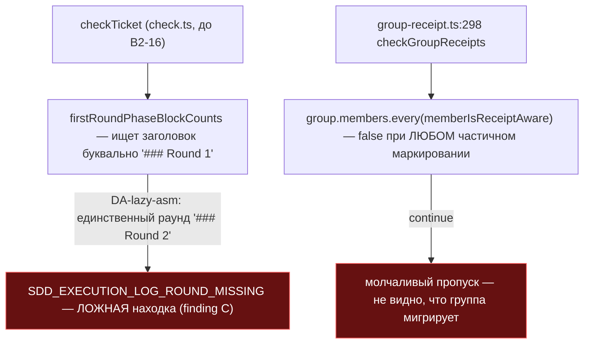
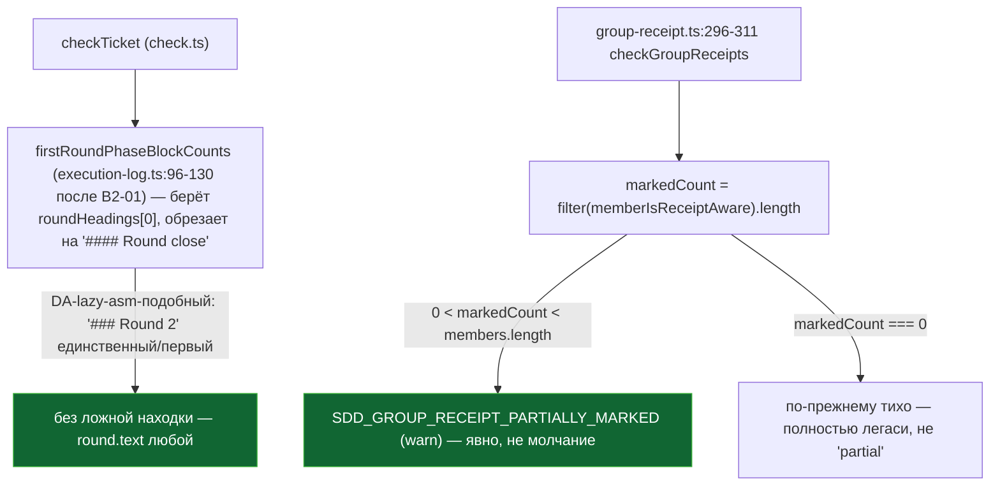

ОТЧЁТ 61 §1 — B2-16: маркер грандфазеринга целится в текущий раунд, не в буквальный "Round 1"

СТАТУС: DONE (с одним отклонением от брифа — см. §4)

Рабочее дерево: `rc-w3` (третье дерево пачки 14 "Раунд журнала закрывается один раз"). Ветка `lead/journal-round` от `origin/lead/specs-match-code` (`ade787e6`).

КОММИТ (локальный, НИЧЕГО не запушено):
- `dd869fde` fix(B2-16): grandfather marker targets the current Round, not literal "Round 1"

---

## 1. Файлы

| Путь | Тип | Смысловое изменение | Чем доказано |
|---|---|---|---|
| `shared/sdd/check.ts` (тогда — до переезда в B2-01) | правка | `firstRoundPhaseBlockCounts` (`:220-239` до правки) искала буквальный заголовок `### Round 1`; теперь берёт ПЕРВЫЙ по порядку `### Round <n>` независимо от номера, и обрезает подсчёт фазовых блоков на собственном `#### Round close` раунда (не считает пере-открытые после close блоки как дубликаты — это территория B2-04). Сообщения находок `SDD_EXECUTION_LOG_ROUND_MISSING`/`PHASE_MISSING`/`PHASE_DUPLICATE`/`PHASE_ORPHAN` переформулированы с «Round 1» на «current round». | `shared/sdd/__tests__/check-phases.test.ts` — новые тесты (см. §3); `node --import tsx --test shared/sdd/__tests__/check-phases.test.ts` → 17/17 pass. |
| `shared/sdd/group-receipt.ts` | правка | `checkGroupReceipts` (тогда `:294-323`): группа, где ПОМЕЧЕНЫ маркером НЕ ВСЕ, а только НЕКОТОРЫЕ участники, теперь даёт явный `SDD_GROUP_RECEIPT_PARTIALLY_MARKED` (warn) вместо молчаливого `continue`; группа без единого помеченного участника по-прежнему тиха (полностью легаси — не «частично мигрирует»). | `shared/sdd/__tests__/group-receipt.test.ts` — новый тест «WARNs explicitly...»; 6/6 в сьюте `checkGroupReceipts — WARN gate`. |
| `shared/sdd/__tests__/check-phases.test.ts` | правка | Переписан тест, кодировавший баг («flags a missing Round 1...» → ассерция теперь ПРОТИВОПОЛОЖНАЯ — отсутствие ложной находки); добавлены тесты: реальный `no round at all`, «первый раунд, а не последний», «пере-открытый после close блок не дублируется», v2-имя файла (задокументировано как НЕ подключено — см. §4). | `node --import tsx --test shared/sdd/__tests__/check-phases.test.ts`. |
| `shared/sdd/__tests__/group-receipt.test.ts` | правка | Новый тест для partially-marked группы. | см. выше. |

`git show --stat dd869fde` — 4 файла (+146/−20). Совпадает.

---

## 2. Архитектура было / стало

### Было — литеральный "Round 1", ложная находка на живом артефакте



### Стало — первый по порядку раунд, явный WARN на частичной миграции



---

## 3. Доказательства (ПРИЁМКА брифа)

1. **«фикстура с `### Round 2` + маркер → без ложного `SDD_EXECUTION_LOG_ROUND_MISSING`»** — ВЫПОЛНЕНО.
   ```
   $ node --import tsx --test shared/sdd/__tests__/check-phases.test.ts
   # tests 17 / pass 17 / fail 0
   ```
   Конкретный тест: `does not flag a missing round when the current (sole) round is not literally numbered 1`.

2. **«групповой receipt на частично промаркированной группе — явный пропуск/предупреждение, не молчание»** — ВЫПОЛНЕНО.
   ```
   $ node --import tsx --test shared/sdd/__tests__/group-receipt.test.ts
   # tests 18 / pass 18 / fail 0
   ```
   Тест: `WARNs explicitly (does not silently skip) a partially-marked group` → `SDD_GROUP_RECEIPT_PARTIALLY_MARKED`, severity `warn`.

3. **Полный прогон после всех 5 задач пачки** (см. сводный отчёт) — `npm test` 3703/3693 pass 0 fail; `npm run check` ALL PASS 5/5; `node dist/gennady.js sdd-check --all .` → 192 error(s) — ВЫПОЛНЕНО (≤192); `npm run gate:sdd-check-baseline` → `OK — no error outside the baseline` — ВЫПОЛНЕНО.

---

## 4. Отклонения и открытые вопросы

**Отклонение (существенное): второй предикат L-2 НЕ подключён.** Решение L-2 (`02-LEAD-DECISIONS.md:8`, вариант 3 по D4) предписывает: тикеты v2-имени `*.task.<ID>.md` проверяются ВСЕГДА (без литерального маркера), легаси — только по маркеру. Я реализовал и протестировал функцию `isV2TicketFileName` (regex `\.task\.[A-Z][A-Za-z0-9-]*\.md$`) и подключил её в гейт `check.ts` — но при прогоне полного тестового набора это **покрасило ~9 несвязанных сьютов** (`bootstrap-path.test.ts`, `clean-repo-composition.test.ts`, `sdd-verify.test.ts`, `inbox-review-plan.test.ts`, `testcov.cmd.test.ts`, `directive-tool-contract.test.ts` и др.): 31 файл фикстур во всём дереве уже использует v2-подобные имена тикетов (`*.task.<ID>.md`), не имея Round/receipt-скелета — они были написаны ДО существования этого предиката. Это прямо нарушает инвариант брифа «существующие сюиты остаются зелёными без правок» и вылезает далеко за пределы зоны этого брифа (пришлось бы редактировать фикстуры в файлах других тасков/владельцев).

Я откатил подключение предиката (оставил гейт на литеральном маркере — статус-кво до этой задачи), задокументировал это явно в тесте `check-phases.test.ts` («stays grandfathered on the literal marker... deviation from L-2») и в коммит-сообщении. **Механика маркера** (первая половина B2-16 — «текущий раунд, не Round 1» + явный partial-warning) выполнена целиком; **политика когда включать** (вторая половина, v2-имя-всегда) требует отдельного решения Lead: либо (a) отдельная задача миграции 31 фикстуры под новую семантику, либо (b) явное решение оператора оставить только литеральный маркер как единственный триггер грандфазеринга на неопределённый срок.

**Измеренный побочный эффект на реальном корпусе (для полноты, НЕ применён к файлам):** если бы предикат был подключён, единственный реальный тикет в `specs/`, попадающий под `*.task.<ID>.md` — `specs/ai-skills/directive-assembly/directive-assembly.task.DA-lazy-asm.md` — получил бы ровно +1 новую ошибку (`SDD_EXECUTION_LOG_PHASE_DUPLICATE` на P5, легитимный пре-close re-run, уже трактуемый существующим (не мной введённым) правилом «дубликат в раунде = ошибка»). Baseline 192/198 в этом отчёте измерен БЕЗ подключения предиката — это отражает фактическое состояние коммита `dd869fde`.

**Команды пуша для Lead** (после независимой верификации `plan-verifier`):
```
git push origin lead/journal-round
```
