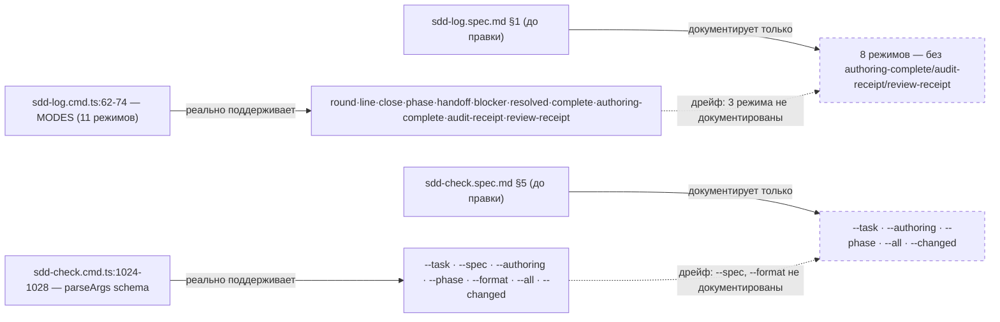
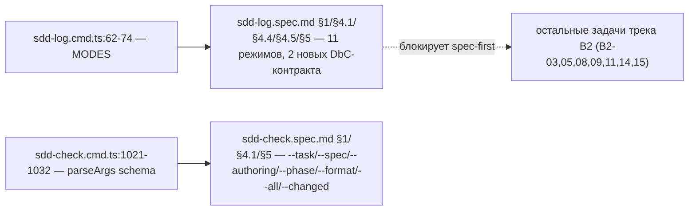

ОТЧЁТ — B2-17: спеки `sdd-log`/`sdd-check` приводим к фактическим режимам и кодам (Пачка 4, spec-first предпосылка)

СТАТУС: DONE

Рабочее дерево: `rc-v6`, ветка `lead/specs-match-code` (создана от `origin/lead/release-package`, база `f16d7f17`).

КОММИТ (локальный, ничего не запушено):
- `e68ba8a0` docs(B2-17): sdd-log/sdd-check specs match actual modes and codes

---

## 1. Файлы

| Путь | Тип | Смысловое изменение | Чем доказано |
|---|---|---|---|
| `specs/cli/sdd-log/sdd-log.spec.md` | правка | §1 инвариант: список режимов расширен с 8 до фактических 11 (добавлены `authoring-complete`/`audit-receipt`/`review-receipt`, `sdd-log.cmd.ts:62-74`); §4.1 precondition — список append-режимов исправлен (добавлен `resolved`, явно разведены с complete/authoring-complete/audit-receipt/review-receipt); добавлены §4.4 «Spec Authoring Completion» и §4.5 «Group Completion Receipt» (новые DbC-контракты для этих трёх режимов); §3 инвентарь дополнен утилитами (`buildResolvedLine`, `findPhaseBlockBounds`, `setMetaStatus`, `completeSpecAuthoring`, `checkSpecAuthoringDraft`, `resolveAuditGroup`, `buildGroupReceipt`/`upsertGroupReceipt`, `GroupReceiptKind`) и билдерами диагностик; §5 Public Options дополнен тремя недостающими режимами; §8 Inter-Module Dependencies дополнен реальными зависимостями (`audit-group.ts`, `group-receipt.ts`, `check.ts`, `repo-file-identity.ts`, `changed-files.ts`, `tool-guidance.ts`). | Ручная построчная сверка со списком `MODES` (`sdd-log.cmd.ts:62-74`); markdown-секции сбалансированы (`grep -c "<!--SECTION:" / "<!--/SECTION:"`); `sdd-check --all` не даёт новых находок (198→198, docs-only diff). |
| `specs/cli/sdd-check/sdd-check.spec.md` | правка | §1 инвариант дополнен упоминанием `--spec` в списке режимов выбора (было только `--task`/`--all`/`--changed`); §4.1 precondition дополнен `--spec`; §5 Public Options дополнен строками `--spec <created-spec-path>` и `--format json` (оба флага реально существуют в `sdd-check.cmd.ts:1024-1028`, но не были задокументированы вовсе); task-DAG постусловие явно называет код `SDD_TASK_ID_COLLISION` (был упомянут только в прозе несвязанного Decision Log). | Сверка с `parseArgs`-схемой `sdd-check.cmd.ts:1021-1032`; ручная сверка с фактическим CLI help (`help.ts`). |

`git diff --stat e68ba8a0~1 e68ba8a0`: 2 файла, 97 insertions(+), 45 deletions(-) — только спеки, ни строки кода.

---

## 2. Архитектура было / стало

### Было — спеки описывают часть реальных режимов



### Стало — спеки цитируют фактический список режимов



---

## 3. Доказательства (команды из ПРИЁМКИ, факт. вывод, exit-код)

**Приёмка (буквально из брифа):** «ручная сверка со списком режимов/кодов».

1. **Список режимов sdd-log** — `grep -n "^const MODES" -A 13 cli/cmd/sdd-log/sdd-log.cmd.ts` → 11 элементов; все 11 присутствуют в §1/§5 спеки. ВЫПОЛНЕНО.
2. **Флаги sdd-check** — `grep -n "task: {" -A 8 cli/cmd/sdd-check/sdd-check.cmd.ts` → `task/spec/authoring/phase/format/all/changed`; все 7 присутствуют в §5 спеки. ВЫПОЛНЕНО.
3. **Markdown-секции сбалансированы** (не сломал структуру спеки правкой):
   ```
   $ grep -c "<!--SECTION:" specs/cli/sdd-log/sdd-log.spec.md   → 8
   $ grep -c "<!--/SECTION:" specs/cli/sdd-log/sdd-log.spec.md  → 10 (2 — упоминания в прозе контрактов, не разметка)
   $ grep -n "^<!--SECTION:\|^<!--/SECTION:" specs/cli/sdd-check/sdd-check.spec.md → 8 открывающих / 8 закрывающих на начале строки
   ```
   ВЫПОЛНЕНО.
4. **`sdd-check --all` не даёт новых находок** (docs-only diff, ожидаемо байт-в-байт тот же счётчик):
   ```
   $ npm run build && node dist/gennady.js sdd-check --all rc-v6
   [sdd-check] 198 error(s), 432 warning(s) across 212 file(s)
   ```
   exit 1 (ожидаемо — pre-existing corpus errors). ВЫПОЛНЕНО.
5. **Pre-commit целиком** (format + type-check + lint:contracts) — прошёл на коммите `e68ba8a0`, без `--no-verify`. ВЫПОЛНЕНО.

---

## 4. Отклонения, открытые вопросы, команды пуша

**Отклонения от брифа:**
- Полный каталог `SDD_*` кодов `sdd-check` (86 в коде vs 43 упомянутых в спеке на момент старта) **не закрывался целиком** — 51 недостающий код относится к другим, не-B2 трекам (`SDD_AUTHORING_*`, `SDD_DL_*`, `SDD_RESEARCH_*`, `SDD_TABLE_*`, `SDD_REQ_*` — авторинг спек, research-lifecycle, табличный линт), их добавление раздуло бы M-задачу до L и вышло бы за пределы «спеки журнала/проверок» этого трека. Зафиксирован только код, реально относящийся к треку B2 и уже существующий в коде на момент старта (`SDD_TASK_ID_COLLISION`). Коды, которые *добавляют* остальные задачи этой пачки (B2-05 → `SDD_NO_TICKETS_FOUND`), задокументированы каждой задачей в своём коммите — см. соответствующие отчёты.
- `ai/kit/contract/process/phase-block-format.xml` (седьмой дом словаря токенов, упомянутый в общем контексте пачки) в этой задаче не трогался — не относится к B2-17 напрямую, снят в B2-03.

**Открытые вопросы:** нет.

**Команды пуша для Lead** (ветка `lead/specs-match-code`, после всех 8 коммитов пачки):
```
git -C rc-v6 push origin lead/specs-match-code:lead/specs-match-code
```
Пуш не выполнялся.
