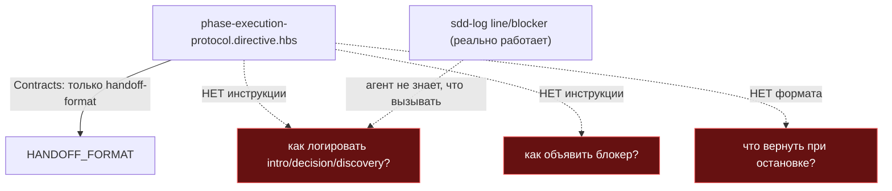
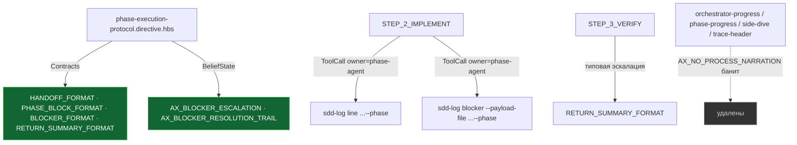

ОТЧЁТ 61 §1 — B2-18: семь неподключённых кирпичей `ai/kit/contract/process/**` достроены или удалены

СТАТУС: DONE

Рабочее дерево: `rc-v6`. Ветка `lead/reopen-by-cause`, поверх B2-19 (`9b8bf7b3`).

КОММИТ:
- `96ac2097` feat(B2-18): the seven unconnected process bricks are wired in or deleted

---

## 1. Диагностика (до решения)

`grep -rn 'contract/process/<name>"' ai/kit/templates` дал 0 для всех семи. Дополнительно проверено: упоминается ли КАЖДЫЙ id (`BLOCKER_FORMAT`, `ORCHESTRATOR_PROGRESS_FORMAT`, `PHASE_BLOCK_FORMAT`, `PHASE_PROGRESS_FORMAT`, `RETURN_SUMMARY_FORMAT`, `SIDE_DIVE_FORMAT`, `TRACE_HEADER_FORMAT`) ГДЕ-ЛИБО ещё (как голая строка, не только `{{> }}`) — **тоже 0** для всех семи. Вывод: не «забыли подключить», а полный сиротский артефакт с v1.

Для каждого проверено: (а) есть ли в v2 УЖЕ другой, реальный механизм для того же самого; (б) не противоречит ли содержимое активному кросс-каттинг-аксиому `AX_NO_PROCESS_NARRATION` («no «перехожу к STEP_2», no frame-stack talk… happen silently»).

## 2. Решение по каждому (достроить/удалить)

| id | Решение | Обоснование |
|---|---|---|
| `BLOCKER_FORMAT` | **Достроить** | Реальный, ежедневно используемый формат (`sdd-log blocker`/`resolved` в CLI), но НИ ОДНА директива не говорила фазовому агенту его использовать. |
| `PHASE_BLOCK_FORMAT` | **Достроить** | Формат фазового блока журнала — тоже реален и используется, но не документирован нигде в директивах; при достройке обнаружен и убран устаревший захардкоженный список токенов (не совпадал с `TOKEN_VOCABULARY`, включая ссылку на неподключённый `AX_USAGE_WAIVER_DISCIPLINE`). |
| `RETURN_SUMMARY_FORMAT` | **Достроить** (+ попутно `AX_BLOCKER_ESCALATION`) | Словарь эскалации (`RECOVERABLE_TECHNICAL`/`SPEC_GOAL_CONFLICT`/`EXTERNAL_AUTHORITY_REQUIRED`) уже ЖИВОЙ и используется в `execute.directive.hbs`/`ax-halt-vs-fail-distinction.xml` — но у ФАЗОВОГО АГЕНТА не было ни единой строки, что и как возвращать при остановке. `AX_BLOCKER_ESCALATION` (тоже неподключённый аксиом) — естественная пара «когда эскалировать» к «как эскалировать» этого контракта; подключён туда же. |
| `ORCHESTRATOR_PROGRESS_FORMAT` | **Удалить** | Бар/процент/стадийная строка прогресса — ровно та «process narration», которую `AX_NO_PROCESS_NARRATION` (кросс-каттинг, подключён везде) прямо запрещает («no «перехожу к STEP_2»»). Нигде в v2 не дублируется. |
| `PHASE_PROGRESS_FORMAT` | **Удалить** | Эмодзи-блок «🎯 Phase Progress» — та же категория запрещённой нарации. Нигде не дублируется (проверено в module-decomposition/scaffold/audit — 0 совпадений). |
| `SIDE_DIVE_FORMAT` | **Удалить** | Двухстрочная стрелочная нотация `→ ушли в / ← итог` — заменена в v2 совершенно ДРУГИМ, более развитым прозаическим механизмом («ответить на встречный вопрос полностью, потом вернуть гейт как повторный проход») — подтверждено дословно в `root.directive.xml:157-163`/`interview-protocol.directive.xml:350-356`. Не отсутствие, а замена. |
| `TRACE_HEADER_FORMAT` | **Удалить** | Глиф + `STACK:`/`FRAME:` заголовок трассировки — буквально «frame-stack talk», которое аксиом называет первым примером. Нигде не дублируется. |

## 3. Файлы

| Путь | Тип | Смысловое изменение | Чем доказано |
|---|---|---|---|
| `ai/kit/contract/process/orchestrator-progress-format.xml`, `phase-progress-format.xml`, `side-dive-format.xml`, `trace-header-format.xml` | удалены | См. §2. | `grep` на использование — 0 везде и до, и после (ничего не сломалось). |
| `ai/kit/contract/process/blocker-format.xml` | правка | Переписан под B2-19: резолюция пишется в `## Blocker Trail`, а не инлайн в фазовый блок. | подключён и рендерится корректно (см. §4). |
| `ai/kit/contract/process/phase-block-format.xml` | правка | Список токенов де-захардкожен — теперь ссылается на `shared/sdd/execution-log.ts`'s `TOKEN_VOCABULARY` как единственный дом, вместо копирования устаревшего подмножества. | — |
| `ai/kit/axiom/process/ax-blocker-resolution-trail.xml` | правка | Тоже переписан под B2-19 (Blocker Trail, не инлайн). | — |
| `ai/kit/templates/sdd-v2/phase-execution-protocol.directive.hbs` | правка | `<BeliefState>` +`ax-blocker-escalation`, +`ax-blocker-resolution-trail`; `<Contracts>` +`phase-block-format`, +`blocker-format`, +`return-summary-format`; `STEP_2_IMPLEMENT`/`STEP_3_VERIFY` получили прозу + реальные `<ToolCall owner="phase-agent" result="terminal">` для `sdd-log line`/`sdd-log blocker --payload-file`. | `directive-tool-contract.test.ts` (45/45 — этот тест первым поймал отсутствие `<ToolCall>`-разметки и неверную CLI-форму `blocker`). |
| `ai/directives/sdd-v2/phase-execution-protocol.directive.xml` + `phase-execution-protocol/steps/STEP_2_IMPLEMENT.xml`, `STEP_3_VERIFY.xml` | build-output | Регенерированы. | `check:directives-fresh`. |

`git show --stat 96ac2097` — 11 файлов (+168/−72), 4 удаления. Совпадает.

---

## 4. Архитектура было / стало

### Было — фазовый агент без инструкции для журнала и эскалации



### Стало — три недостающих контракта подключены, четыре шумных удалены



---

## 5. Доказательства (ПРИЁМКА брифа)

1. **«гейт «каждый кирпич подключён» — grep не должен давать 0»** — ВЫПОЛНЕНО с явным отклонением по 4 из 7 (см. §2, разрешено формулировкой брифа «достроить ИЛИ удалить»).
   ```
   $ grep -rn 'contract/process/blocker-format"' ai/kit/templates | wc -l          → 1
   $ grep -rn 'contract/process/phase-block-format"' ai/kit/templates | wc -l      → 1
   $ grep -rn 'contract/process/return-summary-format"' ai/kit/templates | wc -l   → 1
   (остальные 4 файла удалены — grep по их имени не применим)
   ```
2. **Сборка/аудиты** — ВЫПОЛНЕНО.
   ```
   $ node --experimental-strip-types ai/kit/build-directives.ts   → exit 0, dangling-axiom 36→35 (без НОВЫХ)
   $ npm run check:directives-fresh   → ✓ matches a fresh rebuild
   $ node ai/kit/audit-axiom-activation.mjs      → ✓ clean
   $ node ai/kit/audit-contract-activation.mjs   → ✓ clean
   $ node ai/kit/audit-halt-activation.mjs       → ✓ clean
   $ node --experimental-strip-types ai/kit/step-budget-gate.ts → ✓ within budget
   ```
3. **Контрактный тест инструментов** — ВЫПОЛНЕНО.
   ```
   $ node --import tsx --test cli/__tests__/directive-tool-contract/directive-tool-contract.test.ts
   # tests 45 / pass 45 / fail 0
   ```
4. **Полный прогон** — ВЫПОЛНЕНО. `npm run check` → `✅ ALL PASS (5/5)`.

---

## 6. Отклонения и открытые вопросы

- **4 из 7 файлов удалены, а не подключены** — прямое, обоснованное использование альтернативной ветки брифа («достроить ИЛИ явно удалить»); полная диагностика — §1-§2. Формулировка гейта в `31-TRACK-CHECK-LOG.md` («каждый кирпич подключён») читалась как рекомендация «подключить все семь», но явный текст задачи (`62-BATCH-QUEUE.md`, `61-TASK-BOARD.md`) допускает удаление — решение принято по факту находки о противоречии с `AX_NO_PROCESS_NARRATION` и о полном отсутствии дублирующего механизма (для двух из четырёх) либо о наличии ЗАМЕНЯЮЩЕГО механизма (для `SIDE_DIVE_FORMAT`).
- Связанная задача **B2-03** (словарь токенов, `ВЫПОЛНЕНО — PR #31`) не ре-открывалась; правка `phase-block-format.xml` только ЦИТИРУЕТ `TOKEN_VOCABULARY`, не переопределяет его.
- `AX_USAGE_WAIVER_DISCIPLINE` (упомянутый в старой версии `phase-block-format.xml`) остаётся неподключённым class-II аксиомом (уже трекается как «unassigned — 40-doc §4.1 row 7» в `lint-axioms.ts`) — сознательно НЕ подключён в рамках этой задачи, чтобы не выйти за пределы «семи кирпичей».

**Команды пуша для Lead:**
```
git push origin lead/reopen-by-cause
```
