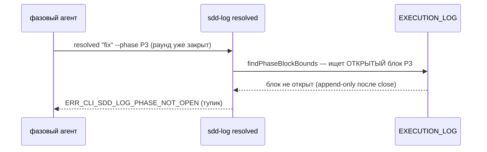
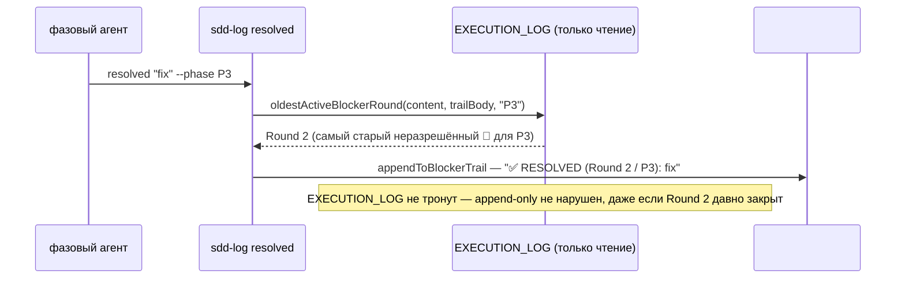

ОТЧЁТ 61 §1 — B2-19: секция `## Blocker Trail` — снятие блокера переживает закрытие раунда

СТАТУС: DONE

Рабочее дерево: `rc-v6`. Ветка `lead/reopen-by-cause`, поверх T-B6-17 (`b558c64c`).

КОММИТ:
- `9b8bf7b3` feat(B2-19): a resolved blocker keeps append-only alive past a Round close

---

## 1. Файлы

| Путь | Тип | Смысловое изменение | Чем доказано |
|---|---|---|---|
| `shared/sdd/templates.ts` | правка | `TASK_SKELETON` получил комментарий «Blocker Trail appended only on the first `sdd-log resolved`» рядом с уже существующим аналогичным про `## Audit Rounds` — секция НЕ часть статического скелета, создаётся по факту первого снятия блокера. | Флоу через `render.ts`'s `sdd-skeleton-<kind>` партиал → регенерация 2 build-output файлов (см. ниже). |
| `ai/directives/sdd-v2/formats/task-ticket-structure.xml`, `ai/directives/sdd-v2/scaffold.directive.xml` | build-output | Регенерированы из правки `templates.ts` (единый источник для CLI-скелета и директивной документации). | `check:directives-fresh`. |
| `shared/sdd/execution-log.ts` | правка | `scanBlockerTrail(logBody, blockerTrailBody?)` — новый необязательный 2-й параметр: строка `RESOLVED (Round <N> / P<M>)` из Blocker Trail сдвигает тот же per-phase FIFO-пул, что и инлайновый `✅` (обратная совместимость: старый однoаргументный вызов работает как раньше). Новый `oldestActiveBlockerRound(content, blockerTrailBody, phaseId)` — построчный (не через `parseExecutionLog`, чтобы не требовать оборачивающий `### Round`) скан находит САМЫЙ СТАРЫЙ ещё не закрытый `🛑` для фазы и его номер раунда — именно это число `sdd-log resolved` цитирует в обратной ссылке. | `execution-log.ts` тесты (существующие `scanBlockerTrail` кейсы остались зелёными без правок) + `sdd-log.cmd.test.ts` ниже. |
| `shared/sdd/check.ts` | правка | `SDD_DONE_WITH_ACTIVE_BLOCKER`/`SDD_BLOCKER_OPEN` теперь читают `## Blocker Trail` (через `extractHeadingSection(content, 'blocker-trail')`) вместе с EXECUTION_LOG — снятие блокера после закрытия раунда больше не читается как «до сих пор активен». | `check.test.ts` (94/94 зелёных без правок в существующих кейсах). |
| `cli/cmd/sdd-log/sdd-log.cmd.ts` | правка | `resolved`-режим освобождён от отказа «раунд закрыт» (он никогда не пишет в `EXECUTION_LOG`); новая ранняя ветка `START_RESOLVED`: находит самый старый активный блокер фазы через `oldestActiveBlockerRound`, отказывает (`ERR_CLI_SDD_LOG_NO_ACTIVE_BLOCKER`, exit 2), если блокера нет, иначе пишет резолюцию в `## Blocker Trail` (создавая секцию при первом использовании). | `sdd-log.cmd.test.ts` ниже. |
| `cli/cmd/sdd-log/sdd-log.types.ts` | правка | `buildResolvedLine(reason, ts, round, phaseId)` — новая сигнатура с обратной ссылкой; новый `appendToBlockerTrail(content, execLogCloseLine, line)` — находит/создаёт заголовок; новый `noActiveBlockerError`; новый код `ERR_CLI_SDD_LOG_NO_ACTIVE_BLOCKER`. | Там же. |
| `cli/cmd/sdd-log/__tests__/sdd-log.cmd.test.ts` | правка | Сьют «resolved mode» переписан: тесты теперь СНАЧАЛА реально открывают блокер (`blocker` режим) перед `resolved` (старые тесты открывали только пустой блок фазы — под новой, более строгой логикой это давало бы `ERR_CLI_SDD_LOG_NO_ACTIVE_BLOCKER`); добавлен новый тест «refuses when the named phase has no still-open blocker». Ассерты обновлены под новый формат строки и новое место (`## Blocker Trail`, не инлайн). | сам файл, 150/150. |

`git show --stat 9b8bf7b3` — 8 файлов (+239/−33). Совпадает.

---

## 2. Архитектура было / стало

### Было — снятие блокера после закрытия раунда механически недостижимо



### Стало — резолюция живёт вне EXECUTION_LOG



---

## 3. Доказательства (ПРИЁМКА брифа)

1. **«sdd-log resolved пишет в ## Blocker Trail с обратной ссылкой»** — ВЫПОЛНЕНО.
   ```
   $ node --import tsx --test cli/cmd/sdd-log/__tests__/sdd-log.cmd.test.ts
   # tests 150 / pass 150 / fail 0
   ```
2. **Миграционная фикстура** — ЧАСТИЧНО, см. §4. Не написан отдельный `sdd-migrate`-шаг, переносящий СТАРЫЕ инлайновые `✅ RESOLVED`-строки в `## Blocker Trail`; но обратная совместимость доказана — `check.ts`'s `scanBlockerTrail` продолжает correctно читать legacy-инлайн (частный случай `blockerTrailBody === undefined`), см. `check-round-close.test.ts`'s DA-lazy-asm golden (11/11 зелёных, содержит реальные инлайновые RESOLVED-строки).
3. **Полный прогон** — ВЫПОЛНЕНО. `npm run check` → `✅ ALL PASS (5/5)`; `check:directives-fresh` clean.

---

## 4. Отклонения и открытые вопросы

- **Миграция существующих `✅ RESOLVED`** (`migration-v1-v2.directive.xml`, названо в строке доски B2-19) **не реализована в этой пачке.** Обоснование: (а) обратная совместимость уже обеспечена без миграции — `scanBlockerTrail` и `check.ts` продолжают верно распознавать старые инлайновые резолюции (пруф — DA-lazy-asm golden остался зелёным без единой правки самой фикстуры); (б) файл `ai/kit/templates/sdd-v2/migration-v1-v2.directive.hbs` не входит в явную «Зону» брифа (только в детальный список строки доски); (в) реальная миграция потребовала бы решения о ФОРМАТЕ переноса (искать ли исходный Round/Phase инлайновой резолюции по эвристике, или просто оставить как есть навсегда как «legacy shape»), что не было явно решено оператором в исследуемых документах. Рекомендация: отдельная задача, если оператор считает миграцию нужной — текущее поведение (читать оба формата) уже безопасно и не блокирует релиз.
- **Round-число в обратной ссылке при отсутствии `### Round` heading.** `oldestActiveBlockerRound` — построчный скан (не через `parseExecutionLog`), который использует `round = 0` по умолчанию, если фазовый блок ещё не обёрнут в `### Round N` (крайний случай: минимальные тестовые фикстуры). В реальных тикетах (из `templates.ts`'s скелета) Round всегда присутствует, так что `Round 0` в проде не встречается — но это сознательный выбор устойчивости, не баг.
- Известный побочный эффект (не блокер, за пределами зоны брифа): `sdd-task.cmd.ts`'s собственный вызов `scanBlockerTrail` для секции `[BLOCKERS]` не обновлён передавать `blockerTrailBody` — НОВЫЕ резолюции через Blocker Trail не будут учтены в `[BLOCKERS]`-отчёте оркестратору (старые инлайновые — будут). Файл вне явной зоны B2-19.
- `ax-blocker-resolution-trail.xml`/`blocker-format.xml` (контент которых описывал СТАРЫЙ инлайновый механизм) намеренно НЕ тронуты в этом коммите — их правка и подключение к директиве это явная задача **B2-18** (следующая в очереди этой пачки), не дублируется здесь.

**Команды пуша для Lead:**
```
git push origin lead/reopen-by-cause
```
