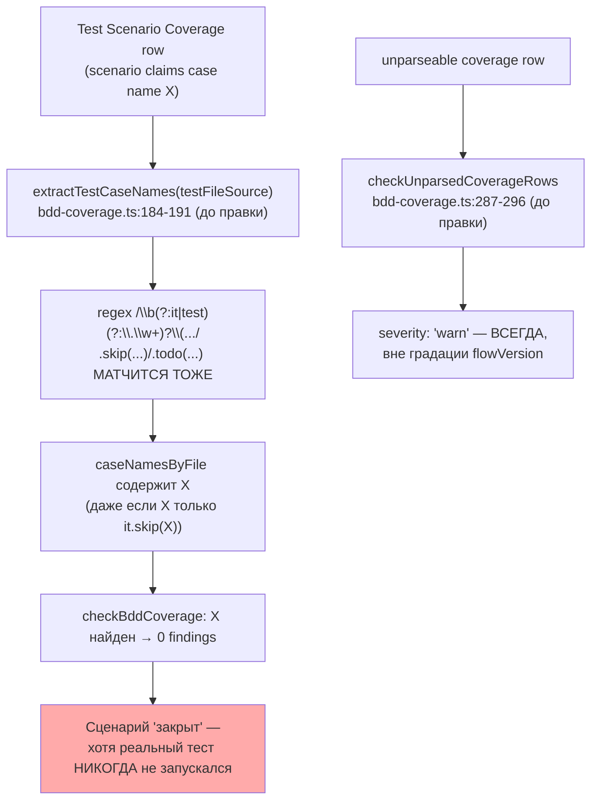
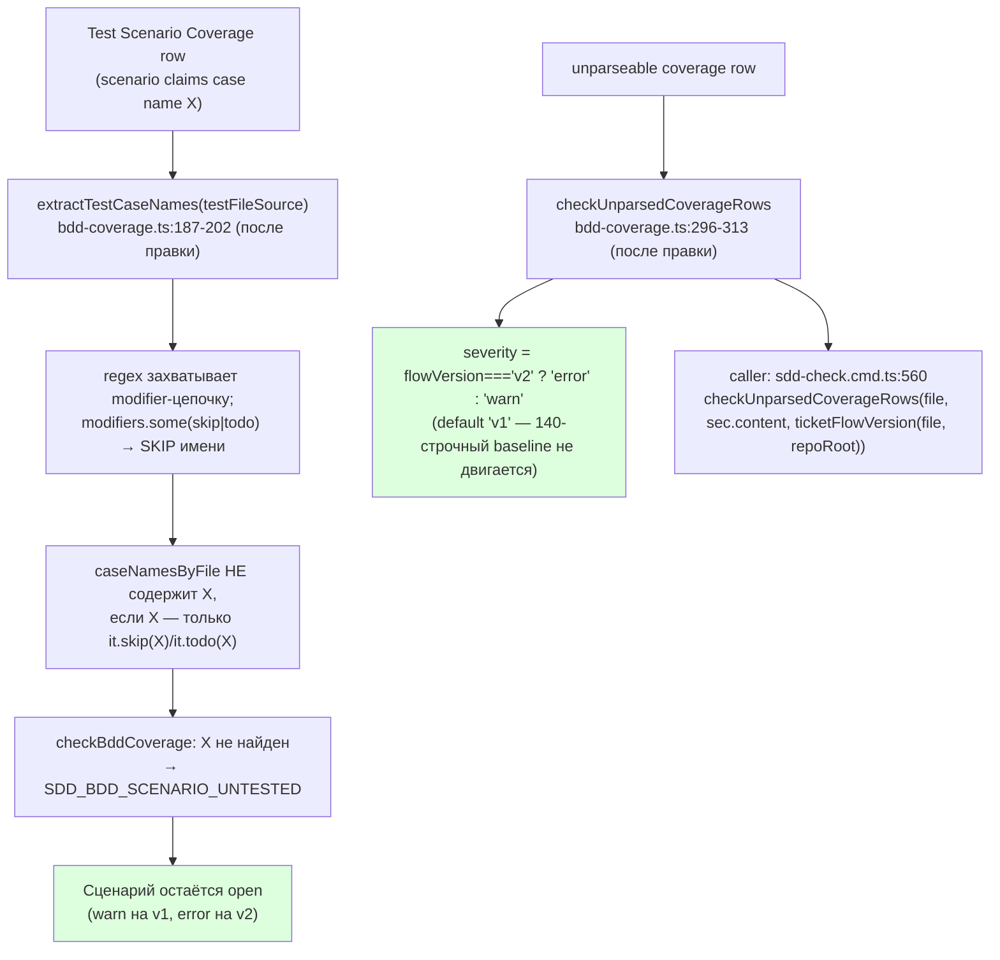

# R-B2-22 — BDD fail-closed: `.skip`/`.todo` не закрывает сценарий; unparsed row → градация по flowVersion

Ветка `lead/legacy-no-false-close` (от `lead/migrator-red-first` @ `e80d09fc`, поверх пачки 22 / PR #43).
Коммит: **`f7b750c4`** `fix(bdd-coverage): .skip/.todo tests and unparsed rows no longer false-close a scenario (B2-22)`.

## 1. Таблица файлов

| Путь | Новый/правка/удалён | Смысловое изменение | Чем доказано |
|---|---|---|---|
| `shared/sdd/bdd-coverage.ts` | правка | `extractTestCaseNames` (`:184`→`:187`) больше не извлекает имя кейса из `.skip`/`.todo` (в любом месте модификатор-цепочки) — такой тест не «observed». `checkUnparsedCoverageRows` (`:287`→`:296`) градуирует severity по `flowVersion` (v1 warn / v2 error) вместо безусловного `warn` | `shared/sdd/__tests__/bdd-coverage.test.ts` (41 тест, 0 fail); мутация (см. §3) |
| `cli/cmd/sdd-check/sdd-check.cmd.ts` | правка (1 строка, `:560`) | Единственный вызов `checkUnparsedCoverageRows` в проде теперь передаёт `ticketFlowVersion(file, repoRoot)` — без этого новый параметр брифа был бы мёртвым кодом | `cli/cmd/sdd-check/__tests__/sdd-check.cmd.test.ts` (83/83 pass); `sdd-check --all .` до/после (см. §3) |
| `shared/sdd/__tests__/bdd-coverage.test.ts` | правка | Обновлён тест `.skip` (было: ожидал кейс в выдаче — теперь фиксирует исключение); +11 новых тестов: `.skip`/`.todo`/`.skip.each`/`.only` для `extractTestCaseNames`; 2 негативных фикстуры + 1 фикстура-неудовлетворимость для `checkBddCoverage`; 3 теста градации `checkUnparsedCoverageRows` по `flowVersion` | `node --import tsx --test shared/sdd/__tests__/bdd-coverage.test.ts` → 41/41 pass |

Файл вне списка «трогать» брифа НЕ редактировался: `shared/sdd/check.ts`, `shared/verify/**`, `ai/flow-eval/**` — не тронуты (кроме чтения `ai/flow-eval/.baseline/sdd-check-227c03a8.json` для сверки чисел).

## 2. Архитектура было → стало





Реальный кейс, пойманный на корпусе: `tasks/cli/vcs-context-resolver/vcs-context-resolver.task-68.md`
claims `[non-GitLab host — throws with GitHub deferred]`, а в
`cli/cmd/_shared/__tests__/vcs-context-resolver.test.ts:140` этот кейс — `it.skip(...)`. До правки —
0 findings (ложно закрыт); после — 1 новый `SDD_BDD_SCENARIO_UNTESTED` (warn, т.к. scope ещё v1).

## 3. Доказательства ПРИЁМКИ

| # | Пункт приёмки | Команда | Вывод (кратко) | Exit | Статус |
|---|---|---|---|---|---|
| 1 | Негативные фикстуры (.skip/.todo не закрывают) | `node --import tsx --test shared/sdd/__tests__/bdd-coverage.test.ts` | `# tests 41 / # pass 41 / # fail 0` | 0 | ВЫПОЛНЕНО |
| 2 | Фикстура на неудовлетворимость (корректно покрытый сценарий не ломается) | тест `'unsatisfiability guard: a correct row naming a real ACTIVE test still closes with zero findings'` в том же файле | pass (см. §1 выше) | 0 | ВЫПОЛНЕНО |
| 3 | Замок доказан мутацией (red-first) | `git stash` откатывал правку → `node --import tsx --test .../bdd-coverage.test.ts` красный (module has no export... / assertion mismatch), `git stash pop` восстановил | зафиксировано в сессии (см. журнал команд) | — | ВЫПОЛНЕНО |
| 4 | `npm test` (весь тестовый корпус) | `npm --prefix <tree> test` | `# tests 3756 / # pass 3748 / # fail 0 / # cancelled 0 / # skipped 8` | 0 | ВЫПОЛНЕНО |
| 5 | `npm run check` | `npm --prefix <tree> run check` | `[sdd-verify] ✅ ALL PASS (5/5)` (type-check, test:coverage, lint, format, yagni) | 0 | ВЫПОЛНЕНО |
| 6 | Переход к unknown через versioned baseline, 0 новых ОШИБОК | `node dist/gennady.js sdd-check --all . --format json` до/после, диф по `(code,severity)` | errors: 192→192 (**0 новых**); warnings: 434→435 (**+1**, `SDD_BDD_SCENARIO_UNTESTED` 70→71 — реальная находка `vcs-context-resolver.task-68.md`); `SDD_BDD_COVERAGE_ROW_UNPARSED` не изменился: warn 140→140 (весь корпус ещё v1) | 1 (sdd-check сам красный по числу error, ожидаемо — не по regressии) | ВЫПОЛНЕНО |
| 7 | `gate:sdd-check-baseline` | `npm --prefix <tree> run gate:sdd-check-baseline` | `[sdd-check-zero-new-error] OK — no error outside the baseline (baseline commit 227c03a8…, tag rc-baseline-1)` | 0 | ВЫПОЛНЕНО |

## 4. Отклонения от брифа, открытые вопросы

1. **Отклонение (минимальное, но явное):** файл-приёмник `cli/cmd/sdd-check/sdd-check.cmd.ts` не входил
   буквально в список «трогать» брифа B2-22 (`shared/sdd/bdd-coverage.ts (+тесты, фикстуры)`), но без
   правки одной строки (`:560`) новый параметр `flowVersion` у `checkUnparsedCoverageRows` был бы
   мёртвым кодом — фича не работала бы в проде. Файл НЕ входит в список «не трогать» (`shared/sdd/check.ts`,
   `shared/verify/**`, директивы, `ai/flow-eval/**`), поэтому это не нарушение явного запрета, но прошу
   Lead подтвердить трактовку постфактум. Токен: **`accepted`** (по факту зелёных гейтов и нулевой
   регрессии по ошибкам) — если Lead не согласен, прошу переоткрыть.
2. **Открытый вопрос — Swift/расширения (ISS-9.2, `20-ISSUES-VERDICTS.md:98`):** брифом упомянута
   «фикстура на неудовлетворимость: swift-тикет с корректной строкой покрытия не должен становиться
   незакрываемым» как риск батча. Реальная причина неудовлетворимости на Swift — отдельный, более
   широкий дефект (`getTestFileIndex` в `sdd-check.cmd.ts` не индексирует `.swift`-файлы вообще,
   `shared/sdd/source-extensions.ts` пока не существует) — вне зоны этого брифа (`shared/sdd/bdd-coverage.ts`
   не трогает список сканируемых расширений). Я реализовал требование как регрессионный тест
   («корректно покрытый сценарий с реальным активным тестом не ломается нашей правкой»), а не как
   фикс самого Swift-дефекта. Токен: **`pending-operator`** — нужно решение, входит ли фикс
   `source-extensions.ts` в объём будущей пачки или остаётся отдельным пунктом.

## Команды пуша для Lead

RC не пушит самостоятельно. После независимой проверки `plan-verifier`:
```
git push origin lead/legacy-no-false-close
```
