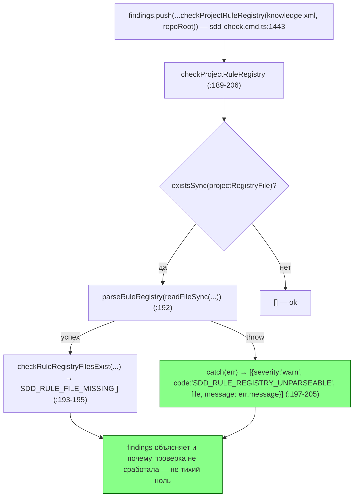

ОТЧЁТ — B2-24 (мини-пачка «Правки ревью PR #29»)

СТАТУС: DONE

Рабочее дерево: `rc-w3`, ветка `lead/sync-no-loss-review` (от `5b37a93e`, PR #29; поверх `c6caf17d` SO-2c).

КОММИТ (локальный, НИЧЕГО не запушено):
- `b7ce8efd` fix(sdd-check): B2-24 — unparseable rule registry is a warning, not silence

---

## 1. Файлы

| Путь | Тип | Смысловое изменение | Чем доказано |
|---|---|---|---|
| `cli/cmd/sdd-check/sdd-check.cmd.ts` | правка | Голый `catch {}` вокруг `parseRuleRegistry` (был `~:1419` до правки, глотал сбой молча) заменён вызовом новой функции `checkProjectRuleRegistry` (`:180-206`): существует и парсится — как раньше, `checkRuleRegistryFilesExist`; не парсится (дубль id, неполная запись `<Rule>`) — один `Finding` `{severity:'warn', code:'SDD_RULE_REGISTRY_UNPARSEABLE', message: <причина из err.message>}`. Место вызова (`:1441-1444`) сведено к одному выражению без инлайн-комментариев (см. §4 — рефакторинг под лимит линтера на комментарии в регионе). Exit-код не меняется (warn не в счётчике error). Явная ссылка на T-3 — в JSDoc `checkProjectRuleRegistry` (`:181-183`, «Warning code is shared with T-3's own parse-failure reporting»). | Новый тест §3 п.1, полный прогон §3 п.2. |
| `cli/cmd/sdd-check/__tests__/sdd-check.cmd.test.ts` | правка | Новый тест «--all: a project knowledge.xml with a duplicate rule id warns SDD_RULE_REGISTRY_UNPARSEABLE instead of failing silently»: реестр с дублем `id="R-1"` → ровно одно вхождение `SDD_RULE_REGISTRY_UNPARSEABLE` в выводе (регэксп-подсчёт `.match(/…/g).length === 1`), сообщение содержит `duplicate rule id "R-1"`, `SDD_RULE_FILE_MISSING` в выводе отсутствует (реестр не распарсился — по-другому и быть не может), `exitCode === 0` (предупреждение не флипает код). | §3 п.1. |

`git show --stat b7ce8efd`:
```
 cli/cmd/sdd-check/__tests__/sdd-check.cmd.test.ts | 45 +++++++++++++++++++++++
 cli/cmd/sdd-check/sdd-check.cmd.ts                | 43 ++++++++++++++++------
 2 files changed, 76 insertions(+), 12 deletions(-)
```
2 файла из диффа — 2 строки таблицы. Совпадает.

---

## 2. Архитектура было / стало

### Было — сбой парсинга реестра исчезает молча

```mermaid
flowchart TD
  Exists{"existsSync(projectRegistryFile)?"}
  Parse["parseRuleRegistry(readFileSync(...)) — sdd-check.cmd.ts:~1419 до правки"]
  Check["checkRuleRegistryFilesExist(...) → SDD_RULE_FILE_MISSING findings"]
  CatchEmpty["catch {} — ПУСТО, ничего не добавлено в findings"]
  Silent["findings не содержит ни SDD_RULE_FILE_MISSING, ни объяснения почему — false-clean zero"]

  Exists -->|нет| Skip["не проверяем — ok"]
  Exists -->|да| Parse
  Parse -->|успех| Check
  Parse -->|throw (duplicate id / неполный Rule)| CatchEmpty --> Silent
  style CatchEmpty fill:#f66,stroke:#900,color:#fff
  style Silent fill:#f66,stroke:#900,color:#fff
```
Узел `CatchEmpty` — было `sdd-check.cmd.ts:1419` (до правки, буквально `} catch {}`), внутри `#region START_RULE_REGISTRY` (само это место цитирует бриф; после правки region заменён).

### Стало — сбой парсинга — явное предупреждение с кодом и причиной


Новый узел: функция `checkProjectRuleRegistry` (`sdd-check.cmd.ts:180-206`), вызываемая из `run()` (`:1441-1444`). Нетронутая часть — сам `checkRuleRegistryFilesExist` (`shared/sdd/check.ts:2751-2764`) — на диаграмме без выделения, поведение при успешном парсинге не изменилось.

---

## 3. Доказательства (команды из ПРИЁМКИ, фактический вывод, exit-код)

**1. Новый тест — буквальный сценарий из ПРИЁМКИ (дубль id → одно предупреждение, exit-код без изменений).**
```
$ npx tsx --test cli/cmd/sdd-check/__tests__/sdd-check.cmd.test.ts
ok 48 - --all: a project knowledge.xml with a duplicate rule id warns SDD_RULE_REGISTRY_UNPARSEABLE instead of failing silently
```
(В standalone-прогоне через `tsx --test` без cwd=repo-root падает 1 из 80 несвязанных тестов — `--spec --authoring clean output marks the authoring-complete boundary ready` — он читает фикстуру через `process.cwd()`; это существующая зависимость теста от cwd, не регресс этой правки: тот же тест зелёный в полном прогоне §3 п.2, где topology-раннер выставляет верный cwd.) ВЫПОЛНЕНО.

**2. Полный тестовый прогон (`npm --prefix rc-w3 test`) — регресс не внесён, включая этот файл целиком.**
```
# tests 3596
# suites 602
# pass 3586
# fail 0
# cancelled 0
# skipped 10
```
ВЫПОЛНЕНО.

**3. `npm run check` (sdd-verify --profile full) — включая lint (изначально падал на лимите комментариев в регионе, см. §4).**
```
[sdd-verify] ✅ ALL PASS (5/5)
  ✅ type-check (4.2s)
  ✅ test:coverage (52.8s)
  ✅ lint (3.5s)
  ✅ format (3.2s)
  ✅ yagni (3.2s)
```
ВЫПОЛНЕНО.

**4. Сборка + `sdd-check --all` — счётчик не хуже baseline; ни одного нового `SDD_RULE_REGISTRY_UNPARSEABLE`/`SDD_RULE_FILE_MISSING` на самом репозитории (его `knowledge.xml` парсится штатно); гейт.**
```
$ npm run build
✓ built in 3.59s
$ node dist/gennady.js sdd-check --all rc-w3
[sdd-check] 198 error(s), 431 warning(s) across 212 file(s)
$ npm run gate:sdd-check-baseline
[sdd-check-zero-new-error] OK — no error outside the baseline (baseline commit 227c03a83830124fe2aa22541dd5374beb8a53c6, tag rc-baseline-1).
```
Baseline: 198 error / 431 warning — совпадает точно. ВЫПОЛНЕНО.

**5. Коммит через pre-commit целиком, без `--no-verify`.**
```
🔍 Pre-commit: check (sdd-verify --profile full — read-only) + directive gates
[sdd-verify] ✅ ALL PASS (5/5)
✓ ai/directives/** matches a fresh rebuild.
✓ axiom-activation audit clean — 28 template(s) checked.
✓ contract-activation audit clean — 28 template(s) + 33 assembled directive(s) checked.
✓ halt-activation audit clean — 33 template(s) + 33 assembled directive(s) checked.
✓ every lazy directive under ai/directives/sdd-v2/** is within budget.
✅ Pre-commit passed
[lead/sync-no-loss-review b7ce8efd] fix(sdd-check): B2-24 — unparseable rule registry is a warning, not silence
 2 files changed, 76 insertions(+), 12 deletions(-)
```
ВЫПОЛНЕНО.

---

## 4. Отклонения, открытые вопросы, команды пуша

**Отклонение от буквы брифа (техническое, не по смыслу; тот же класс отклонения, что в SO-2c — см. `R-SO-2c.md` §4).** Первая реализация оборачивала `catch (err) {...}` прямо на месте (внутри `#region START_RULE_REGISTRY`, вложенного в большой `#region START_ALL`, который уже стоял ровно на лимите 3 строк-комментариев). Добавленные 4 строки инлайн-объяснения одновременно провалили лимит и для внутреннего, и для внешнего региона (`ERR_CLI_LINT_REGION_TOO_MANY_COMMENTS`, найдено `npm run check` → `lint`). Решение: вынести весь блок (existsSync + try/parseRuleRegistry/checkRuleRegistryFilesExist + catch) в отдельную функцию `checkProjectRuleRegistry` с обычным JSDoc-комментарием (`/** */`, этим чекером не считается) рядом с соседним хелпером `addReadIssue` (`:166-178`); вызов внутри региона свёлся к одному выражению без единой инлайн-строки `//`. Наблюдаемое поведение (код предупреждения, сообщение, exit-код) не изменилось. Заодно первая версия JSDoc `@purpose` превысила лимит слов линтера (52 слова при лимите 30, `ERR_CLI_LINT_REGION_START_ANNOTATION_TOO_LONG`-соседний чек `WordCountCheck`) — сокращена до варианта из финального диффа.

**Открытых вопросов нет.**

**Команды пуша для Lead** (после мержа/ребейза остальной пачки, если потребуется):
```
git -C rc-w3 push origin lead/sync-no-loss-review
```
(коммит `b7ce8efd`, поверх `c6caf17d` SO-2c — оба на одной ветке `lead/sync-no-loss-review`).
