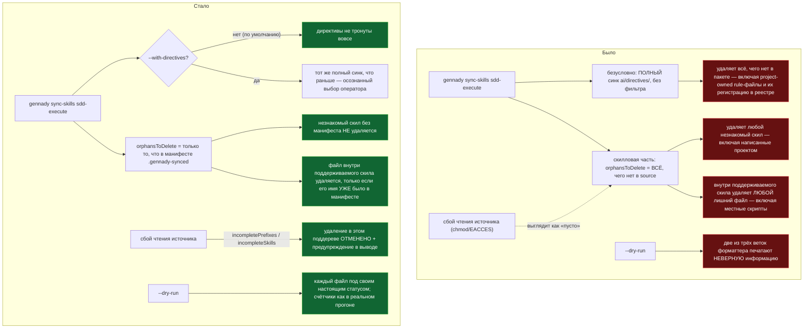

ОТЧЁТ (сводный) — Пачка 1: «Синк больше не удаляет файлы проекта»

СТАТУС: DONE — 7 задач (SO-2, SO-2b, SO-7, SO-11, SO-4, SO-6, SO-9), 6 коммитов (SO-2+SO-2b — один коммит по прямому указанию их брифа)

Рабочее дерево: `rc-v6` (git worktree gennady, `origin` = RubaXa/gennady). Ветка `lead/sync-no-loss`, создана от `origin/codex/sdd-v2-rc52-followup` (голова `2acbe682`).

**ВАЖНО: ничего не запушено.** Все 6 коммитов лежат локально в `rc-v6` на ветке `lead/sync-no-loss`, поверх `origin/codex/sdd-v2-rc52-followup`. Команды пуша — в конце документа.

Коммиты (в порядке применения):
1. `c012e511` — SO-2 + SO-2b (манифест владения скилами и файлами внутри них)
2. `5678c307` — SO-7 (частичное чтение источника не удаляет)
3. `b3f927c1` — SO-11 (замок на существование файла правила в реестре)
4. `e913d14d` — SO-4 (dry-run честно показывает удаления)
5. `823bc840` — SO-6 (тестовые файлы скила не деплоятся)
6. `ea399ec6` — SO-9 (синк директив внутри sync-skills — по флагу, не всегда)

---

## 1. Что сделали и зачем

Команда `gennady sync-skills` (и частично `gennady sync`) при первом же реальном прогоне у потребителя пакета **удаляла файлы, которых сама не создавала** — причём без предупреждения, с кодом выхода 0. Это два открытых issue из внешнего аудита (akkrat #9.4 «sync-skills удаляет мои скилы», #24 «sync перетирает локальные правки») и пять строк доски задач, помеченных как блокер релиза. Пачка закрывает потерю данных четырьмя независимыми механизмами защиты и добавляет три смежных исправления, найденных в процессе того же аудита.

**Что именно было не так (до этой пачки), по одному предложению на дефект:**

1. **Любой скил в `.claude/skills/`, которого пакет не поставляет, удалялся** — в том числе те, что написал сам проект (например `generate-codeowners/`, `write-uitests/`). Пакет не различал «мы это ставили» и «это чужое».
2. **Внутри скила, который пакет ещё поддерживает, любой файл, которого нет в пакетной версии, тоже удалялся** — включая локальный вспомогательный скрипт, который никогда не был частью пакета.
3. **Один сбой чтения (`chmod 000` на подкаталог, разрыв сети, гонка файловой системы) выглядел как «источник пуст»** — а «источник пуст» синк трактовал как «всё нужно удалить». На реальном дереве один `chmod` стёр 8 нетронутых файлов молча.
4. **Реестр правил (`knowledge.xml`) мог остаться целым, а файлы правил под ним — быть удалены зеркальным синком** — тихий отказ: `sdd-check` не видел разрыва между «правило заявлено» и «файла нет».
5. **Превью `--dry-run` в двух из трёх веток печатало неверную информацию, а не просто скрывало часть** — удаляемый файл иногда показывался с меткой «будет добавлен», а иногда живой нетронутый файл показывался как «будет удалён» (притом что реальный прогон делал то, что честно написано в первой ветке — расхождение было именно в превью).
6. **Тестовые файлы самого скила (`*.test.ts` внутри `ai/skills/`) уезжали к потребителю** — включая npm-пакет — и ломали ему typecheck, потому что импортировали внутренности репозитория gennady, которых у потребителя нет.
7. **Самая узкая команда — `gennady sync-skills <одно-имя-скила>` — безусловно выполняла самое широкое разрушительное действие**: полную, нефильтрованную синхронизацию ВСЕХ директив с удалением. На копии реальной ветки один такой вызов одновременно стёр регистрацию Swift-правил в реестре и сами rule-файлы.

**Что теперь:**

1. Скил удаляется, только если инструмент сам записал его имя в манифест `.claude/skills/.gennady-synced` на прошлом прогоне (SO-2). На первом прогоне без манифеста ничего не удаляется — присваивается владение только тем скилам, которые пакет поставляет прямо сейчас.
2. Файл внутри ещё поддерживаемого скила удаляется, только если его точное имя уже было в манифесте (SO-2b) — новый уровень детализации манифеста, которого не было даже в main.
3. Ошибка чтения помечается отдельно от «пусто» и блокирует удаление именно в этом поддереве — при этом настоящие, не связанные с ошибкой orphan-файлы продолжают штатно удаляться (SO-7).
4. `sdd-check` сообщает находкой (`SDD_RULE_FILE_MISSING`, предупреждение — не ошибка, до отдельной инвентаризации долга), если реестр ссылается на несуществующий файл правила (SO-11).
5. `--dry-run` печатает каждый файл под его настоящим статусом и несёт те же счётчики, что и реальный прогон, а не голую фразу «ничего не записано» (SO-4).
6. Тестовые файлы скила снова исключены из деплоя — и в проект потребителя, и в npm-пакет (SO-6).
7. Директивная часть внутри `sync-skills` — по флагу `--with-directives`, выключена по умолчанию; узкая команда больше не делает самого широкого действия молча (SO-9).

---

## 2. Файл → что изменилось по смыслу

| Файл | Что изменилось (простыми словами) |
|---|---|
| `cli/cmd/sync-skills/sync-skills-core.ts` | Ядро синхронизации скилов. Добавлен манифест владения (какие скилы и какие файлы внутри них поставил сам инструмент) — удаление ограничено только тем, что в манифесте. Добавлено различение «не прочитали» / «там правда пусто» — при сбое чтения удаление в этом поддереве отменяется. Вернулось исключение тестовых файлов скила из деплоя. |
| `cli/cmd/sync/sync-core.ts` | Ядро синхронизации директив. То же различение «не прочитали» / «пусто», что и в скилах — сбой чтения одного подкаталога источника больше не выглядит как «весь подкаталог удалён у пакета», удаление в такой ситуации отменяется с предупреждением в выводе. |
| `cli/cmd/sync-skills/sync-skills-formatter.ts` | То, что видит оператор в терминале при `--dry-run`. Каждый файл в группе скила теперь показан под своим настоящим статусом (добавлен/обновлён/удалён) — раньше в двух ветках из трёх часть файлов терялась из вывода или подписывалась чужим статусом. Итоговая строка при `--dry-run` теперь несёт те же числа, что и реальный прогон. |
| `cli/cmd/sync-skills/sync-skills.cmd.ts` | Точка входа команды `sync-skills`. Синхронизация директив (`ai/directives/`) внутри `sync-skills` теперь по флагу `--with-directives`, выключена по умолчанию — раньше выполнялась всегда, даже при запросе одного конкретного скила. |
| `cli/cmd/sdd-check/sdd-check.cmd.ts` | Проверка целостности SDD-артефактов. Добавлена новая проверка: если реестр правил проекта ссылается на файл, которого нет на диске, это теперь видимая находка (предупреждение), а не тихий пропуск. |
| `shared/sdd/check.ts` | Библиотека самих проверок. Добавлена новая чистая функция для проверки «файл, на который ссылается реестр правил, существует» — используется командой `sdd-check`. |
| `cli/cmd/help/help.cmd.ts` | Текст `gennady --help`. Строка про `sync-skills` переписана под новое поведение (флаг `--with-directives`, синк директив выключен по умолчанию). |
| `specs/cli/sync-skills/sync-skills.spec.md` | Спецификация команды `sync-skills`. Переписаны два архитектурных решения, которые раньше документировали как раз то поведение, что привело к потере данных (полная синхронизация без владения; директивы всегда синхронизируются первыми) — теперь описывают исправленное, безопасное поведение и явно фиксируют, чем прежнее решение было опровергнуто. |
| `specs/cli/cli.spec.md` | Общая спецификация CLI. Обновлены три конкретные строки требований (превью `--dry-run`, предупреждение о чужой поддиректории, справка), чтобы соответствовать исправленному поведению. |
| 6 тестовых файлов (`__tests__/*.test.ts`, включая 2 новых) | Порт существующих тестов из main (там, где main уже решал ту же проблему) плюс новые тесты на находки, которых в main никогда не было (частичное чтение, внутрискилловое зеркало, узкий вызов не должен трогать директивы). Все команды-приёмки из брифов — см. §4. |

**Итого:** 15 файлов, +1275/−152 строк (`git diff --stat origin/codex/sdd-v2-rc52-followup..HEAD`).

---

## 3. Архитектура — было → стало



Подробные, файл:строка mermaid-диаграммы по каждой задаче — в индивидуальных отчётах `_raw/reports/R-SO-2-SO-2b.md`, `R-SO-7.md`, `R-SO-11.md`, `R-SO-4.md`, `R-SO-6.md`, `R-SO-9.md`.

---

## 4. Команды-доказательства (после всех 7 задач, на голове ветки `ea399ec6`)

**Полный набор тестов (`npm test`):**
```
$ npm --prefix rc-v6 test
# tests 3593
# suites 602
# pass 3583
# fail 0
# cancelled 0
# skipped 10
```
ВЫПОЛНЕНО.

**Полная проверка (`npm run check` — type-check, тесты с покрытием, lint, format, yagni):**
```
$ npm --prefix rc-v6 run check
[sdd-verify] ✅ ALL PASS (5/5)
  ✅ type-check (4.7s)
  ✅ test:coverage (49.7s)
  ✅ lint (2.9s)
  ✅ format (1.9s)
  ✅ yagni (0.7s)
```
ВЫПОЛНЕНО.

**Сборка + `sdd-check --all` — счётчик находок не хуже baseline (198 error / 431 warn, из `GAP-B-1`, коммит `48538019`):**
```
$ npm --prefix rc-v6 run build
✓ built in 2.97s
$ node rc-v6/dist/gennady.js sdd-check --all rc-v6 2>&1 | grep -c ': error:'
198
$ node rc-v6/dist/gennady.js sdd-check --all rc-v6 2>&1 | grep -c ': warn:'
431
```
Совпадает с baseline (0 новых, 0 закрытых) — ожидание из задания выполнено буквально: «не хуже 198/431». ВЫПОЛНЕНО.

**Гейт «ноль новых ошибок» (`gate:sdd-check-baseline`) — тот самый гейт, который уже стоит на каждом `git push`:**
```
$ npm --prefix rc-v6 run gate:sdd-check-baseline
[sdd-check-zero-new-error] OK — no error outside the baseline (baseline commit 227c03a83830124fe2aa22541dd5374beb8a53c6, tag rc-baseline-1).
```
exit 0. ВЫПОЛНЕНО.

Полные, детализированные команды-доказательства по каждой из 7 задач (с промежуточными прогонами, разовыми флаки топологии тестов и их повторами) — в индивидуальных отчётах, раздел «3. Доказательства» каждого.

---

## 5. Предыстория: что уже было в ветке до этой пачки

Ветка `lead/sync-no-loss` создана от `origin/codex/sdd-v2-rc52-followup`, голова которой уже включала четыре независимо выполненные и провалидированные задачи — они создали инфраструктуру, без которой эта пачка не могла бы доказать «не хуже baseline» и не могла бы безопасно пушиться:

1. **Заморожен эталонный срез RC** — тегом `rc-baseline-1` на коммите `227c03a8`, дерево на срезе чисто. Коммит `d2aaf2a3` (`chore(rel-17): freeze RC snapshot at rc-baseline-1 (227c03a8) — before-report`).
2. **Введён версионированный baseline находок `sdd-check`** — 198 ошибок / 431 предупреждение, зафиксированные как отправная точка, плюс предикат «ноль новых ошибок» (сравнение текущего прогона с этим списком). Коммит `48538019` (`feat(gap-b-1): versioned sdd-check baseline + zero-new-error CI gate`). Это тот самый baseline, с которым сравнивались все 7 задач этой пачки в §4.
3. **Гейт «ноль новых ошибок» перенесён в `pre-push`** — раньше жил в неиспользуемом npm-скрипте `check:ci`, которого ничто не вызывало (в репозитории нет CI); теперь стоит на каждом `git push`, включая тот, который сделает Lead после этой пачки. Коммиты `85d2fed1` (`chore(gap-b-2): move sdd-check baseline gate from unused check:ci into pre-push`) и `d53a56f4` (`chore(gap-b-2): apply verifier fixes (V-R-02): prepare works in linked worktrees; docs`).
4. **Снят золотой эталон поведения `sdd-verify`** — байт-в-байт зафиксировано, что делает текущий (на срезе) `verify` node-стека: ступени, команды, квитанция. Это эталон для будущего переноса `verify` из main (задачи волны 1, вне этой пачки). Коммиты `ecac032a` (`test(v-01): golden byte-for-byte proof of today's sdd-verify node behaviour`) и `2acbe682` (`test(v-01): apply verifier fixes (V-R-01 Б-1..Б-5)`) — последний и есть голова, от которой создана ветка этой пачки.

Отдельно, в **main** репозитория (не в RC-дереве) уже удалён нерабочий GitHub Actions workflow, который ничего не проверял, но создавал видимость CI — коммит `9663c65b` (`ci: remove non-working GitHub workflow`). Эта пачка (`lead/sync-no-loss`) на main не влияет никак; упомянуто для полноты картины «что уже сделано вокруг этой темы».

---

## 6. Что не сделано / стопы

**Ни одного «стопа» по ходу выполнения не было** — ни одна задача не упёрлась в явное стоп-условие своего брифа («вопросы назад»), ни одна задача не была пропущена.

**Явно не входит в эту пачку (по решению оператора D-56, приостановлено):**
- **`SO-1`** — `knowledge.xml` как project-owned реестр (никогда не перезаписывается и не удаляется при синке). Приостановлена оператором до отдельного разговора о реестре правил. Без неё `PROJECT_OWNED_ENTRIES` и статус `preserved` в реестре не появились — реестр по-прежнему перезаписывается зеркальным синком директив, как и раньше. Это не регресс от этой пачки (было так же и до неё), но и не исправлено ею — открытый пункт для отдельной пачки.

**Не входит в объём этой пачки по решению самих брифов (не стоп, а явная граница задачи), с указанием, кто это закроет:**
- Полная целевая архитектура владения (единый хэш-манифест на обе поверхности — директивы и скилы, статусы `locally-modified`/`adopted-conflict`, флаги `--force`/`--prune-foreign`) — это отдельная задача `SO-3`, вне этой пачки; сделанное здесь (манифест по именам + по путям файлов внутри скилов) — минимальный, самодостаточный набор, разблокирующий релиз без неё.
- Снимок поставляемой поверхности (`deployed-surface` golden, `npm pack --dry-run`) и утечка dev-пути в `agent-inbox/golden-chat-output.example.md` — задача `SO-5`, вне этой пачки.
- Golden-приёмка целевого владения на копиях реальных потребителей (messenger, cloud-ios) — задача `E-04`/`E-19`, привязана к приостановленной `SO-1`, вне этой пачки.

**Разовая, не влияющая на итог флакость среды (зафиксирована в индивидуальных отчётах, не скрыта):** несколько прогонов `npm run check` в процессе работы (после правок SO-7, SO-4, SO-6) показали `test:coverage` с `cancelled 1..5` без единого `fail` в сводке — три конкретных теста в `cli/__tests__/tool-behavior/` при параллельном прогоне топологии. Каждый раз чистый повтор сразу после давал `ALL PASS (5/5)`; те же файлы по отдельности проходили 100%. Это тот же класс нестабильности, что уже отдельно заведён в очереди пачек как `REL-15` («IPC-краш `node --test`», Пачка 3, вне объёма этой пачки) — не регресс от кода этой пачки, воспроизводился и до неё.

---

## 7. Команды пуша для Lead

```
git -C rc-v6 push origin lead/sync-no-loss:lead/sync-no-loss
```
Ни один `git push` не выполнялся этой сессией — по роли `rc-executor`, пуш всегда делает Lead. Перед пушем стоит убедиться, что локальный `pre-push`-хук у Lead резолвится в его собственное дерево (worktree-специфичный `core.hooksPath`), иначе пуш из другого worktree может выполнить чужой хук.
