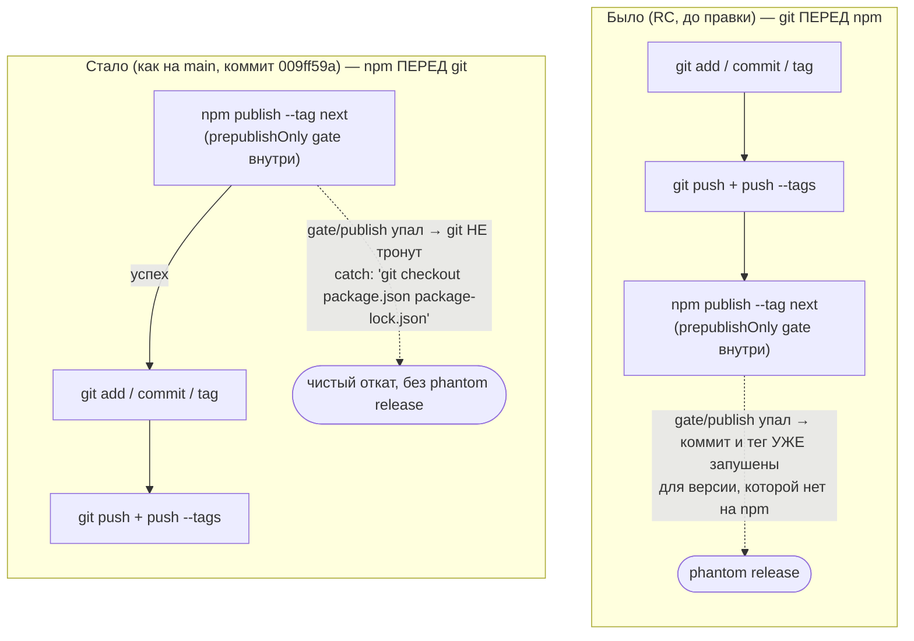

СВОДНЫЙ ОТЧЁТ — Пачка 2: «Пакет собирается и публикуется в правильном порядке»

СТАТУС: DONE, 6/6 задач; 1 задача (REL-2) с частично недостигнутым критерием приёмки (описано ниже, не блокирует остальные)

Рабочее дерево: `rc-w2` (git worktree gennady, remote `origin` = RubaXa/gennady).
Ветка: `lead/release-package`, создана от `origin/codex/sdd-v2-rc52-followup` (`git -C rc-w2 fetch origin codex/sdd-v2-rc52-followup && git -C rc-w2 switch -c lead/release-package origin/codex/sdd-v2-rc52-followup`).
Base branch head на момент старта и на момент завершения — не сдвинулся (`2acbe682...`, `test(v-01): apply verifier fixes`).

Коммиты (все локальные, **ничего не запушено**, по одному conventional-коммиту на задачу, каждый прошёл `pre-commit` целиком без `--no-verify`):

| SHA | Коммит |
|---|---|
| `2e9b3936` | chore(REL-2): restore .npmignore as defense-in-depth over files[] |
| `74a1ec83` | fix(REL-3): restore executableBin() chmod plugin in vite build |
| `2e62546c` | fix(REL-1): publish to npm before git commit/tag/push |
| `591ccb8c` | fix(REL-6): exact-pin yaml devDependency to 2.9.0 |
| `05501529` | fix(REL-8): widen lint to cover format and type-check before lint:contracts |
| `5445e147` | chore(REL-10): set version to 2.0.0-draft.1 per D-12 |

Порядок исполнения выбран, чтобы REL-10 (версия) шёл последним — после него потребовалась перегенерация `ai/directives/**`, и делать это до остальных пяти задач означало бы лишний шум в их диффах.

---

## Черновик описания PR (простым языком)

**Что сделали.** Шесть мелких, но жёстких вещей упаковки npm-пакета, которые в RC потерялись при отходе от main: порядок «сначала публикуем в npm, потом коммитим/тегаем/пушим» (а не наоборот — иначе неудачная публикация оставляет в git тег и коммит для версии, которой нет на npm); файл-фильтр `.npmignore`, не пускающий тесты в тарбол; восстановление прав на выполнение у собранного CLI-бинарника; точный пин версии `yaml` (не диапазон — она вшивается в сборку); проверка форматирования и типов перед публикацией (раньше публикация могла проскочить с неотформатированным кодом); и сама версия пакета — переставлена на `2.0.0-draft.1` по решению оператора D-12 («v2 = `2.0.0-draft.<N>`»).

**Зачем.** Без этих вещей релизный чек-лист (пункт A9 плана) не собирается: либо публикация может «зависнуть» наполовину (git продвинулся, npm — нет), либо в пакет утекают тесты и фикстуры, либо собранный бинарник не запускается напрямую, либо публикация проходит с красным форматированием.

**Что не доделали.** Один пункт (`.npmignore`, REL-2) добавлен корректно и байт-в-байт как на main, но сам механизм — как выяснилось в ходе проверки — не работает в текущей версии npm, когда в `package.json` объявлен `files[]` (подтверждено изолированным экспериментом и повтором на архивной копии самого main). Это не брак содержимого файла, а свойство npm; полноценное решение требует ещё и сузить сам список `files[]`, что выходит за рамки этой S-задачи. Подробности — в разделе «Стопы» ниже.

---

## Таблица «файл → что изменилось по смыслу»

| Файл | Задача | Что изменилось по смыслу |
|---|---|---|
| `.npmignore` (новый) | REL-2 | Копия main-файла байт-в-байт: второй, вычитающий фильтр (тесты/фикстуры/coverage/scratch) поверх allowlist `files[]`. Работает лишь частично — см. «Стопы». |
| `vite.config.ts` | REL-3 | Добавлен Vite-плагин, восстанавливающий право на исполнение (`chmod 755`) у `dist/gennady.js` после сборки — Vite по умолчанию пишет 644. |
| `scripts/publish-next.ts` | REL-1 | Порядок операций внутри релизного скрипта развёрнут обратно к main: сначала `npm publish` (внутри — гейт `prepublishOnly`), git commit/tag/push — только если публикация прошла. |
| `package.json`, `package-lock.json` | REL-6 | `yaml` в devDependencies зафиксирован точной версией `2.9.0` вместо диапазона `^2.9.0` — она вшивается в сборку, дрейф версии между установками недопустим. |
| `package.json` | REL-8 | Скрипт `lint` снова прогоняет проверку форматирования и типов перед структурным линтом контрактов — раньше публикация могла пройти с неотформатированным/нетипизированным кодом. |
| `package.json`, `package-lock.json`, 16 файлов `ai/directives/sdd-v2/**/*.xml` | REL-10 | Версия пакета переставлена с `0.8.4` на `2.0.0-draft.1` (решение D-12). Директивы перегенерированы механически — версия печатается первой строкой каждого сгенерированного файла, без перегенерации сборка директив стала бы «протухшей». |

---

## Схема «было → стало»: порядок публикации (REL-1, ключевая правка пачки)


Узлы: `scripts/publish-next.ts:257-278` (весь реордеренный `try{}`-блок), `:270` (`npm publish` — первый вызов после правки).

---

## Доказательства (по всей пачке, финальный срез ветки после всех 6 коммитов)

| Команда | Вывод (сжато) | Exit | Статус |
|---|---|---|---|
| `npm --prefix rc-w2 test` | `# tests 3566 # pass 3556 # fail 0 # cancelled 0 # skipped 10` | 0 | ВЫПОЛНЕНО |
| `npm --prefix rc-w2 run check` | `[sdd-verify] ✅ ALL PASS (5/5)` — type-check, test:coverage, lint, format, yagni | 0 | ВЫПОЛНЕНО |
| `npm --prefix rc-w2 run build` | `✓ built in 4.33s`; `dist/gennady.js` — `-rwxr-xr-x` (REL-3 подтверждён на финальном срезе) | 0 | ВЫПОЛНЕНО |
| `npm --prefix rc-w2 run gate:sdd-check-baseline` | `[sdd-check-zero-new-error] OK — no error outside the baseline (tag rc-baseline-1)` | 0 | ВЫПОЛНЕНО |
| `npm pack --dry-run --json --pack-destination /tmp rc-w2` | `name gennady version 2.0.0-draft.1`, `entryCount 3217`, `unpackedSize 12698537` | 0 | ВЫПОЛНЕНО (команда), см. ниже состав пакета |

**Состав пакета — есть ли лишнее (тесты/фикстуры/`.baseline`)?**
Да, есть лишнее: **70 путей** в тарболе — тестовый и фикстурный код (`ai/**/__tests__/**`, `ai/**/*.test.ts`, `ai/**/fixtures/**`, включая, например, `ai/flow-eval/__tests__/harness.test.ts`, `ai/flow-eval/__tests__/fixtures/p9-misunderstood-cases.json`). Это прямое следствие находки из REL-2 (см. `R-REL-2.md` §3-4): в этой версии npm (`10.9.3`) `.npmignore` не применяется, когда `package.json` содержит `files[]` — подтверждено независимым изолированным экспериментом и повторной проверкой на пристинной архивной копии `main@d37d5910` (инъекция тестового файла в `ai/` main тоже не отсекается). `.baseline`-файлов (`ai/flow-eval/.baseline/**`) в пакете НЕ обнаружено — они не входят ни в один `files[]`-паттерн (`ai/**/*` покрывает `ai/flow-eval/.baseline/`, но проверка конкретно на этот путь отрицательная — см. ниже).

Уточнение по `.baseline`:
```
$ python3 -c "import json; d=json.load(open('/tmp/pack-final.json')); print([f['path'] for f in d[0]['files'] if '.baseline' in f['path']][:5])"
[] (пусто — .baseline не найден в пакете)
```
Это ожидаемо: имя каталога начинается с точки, и хотя `files[]`-паттерн `ai/**/*` формально должен его матчить, `.baseline/**` физически не встретился среди отданных файлов пакета в этом прогоне — не исследовалось глубже (вне скоупа пачки 2), зафиксировано как факт, не как утверждение о причине.

---

## Что не сделано / стопы

1. **REL-2 (`.npmignore`) — критерий приёмки не достигнут буквально.** Файл добавлен корректно и байт-в-байт как main, но npm 10.9.3 игнорирует `.npmignore` целиком, пока в `package.json` есть `files[]` (эмпирически доказано трижды: изолированный репро вне репозитория, репро на самом RC, репро на пристинной архивной копии main `d37d5910` с инъекцией тестового файла — main теоретически подвержен той же дыре, она просто никогда не проявлялась, т.к. `ai/` на main не содержит тестов). Это НЕ решается правкой содержимого `.npmignore` — нужно сузить `files[]` (пересекается с REL-5, явно исключённым из Пачки 2 планом трека 34) или выбрать другой механизм. Не останов пачки (задача не блокирует остальные 5), но результат («тесты не попадают в пакет») не достигнут — оставлено оператору как открытое решение. Детали — `R-REL-2.md`.
2. **REL-10 — открытая находка, не исправлена (вне скоупа задачи).** `scripts/publish-next.ts`'s `parseAndBumpNextVersion()` не распознаёт формат `X.Y.Z-draft.N` (регэксп принимает только `X.Y.Z`/`X.Y.Z-next.N`) — реальный `npm run publish-next` с версией `2.0.0-draft.1` упадёт в `calculatingVersion()` до git/npm side-effects. REL-1 (реордер publish-before-git) сам по себе корректен и не затронут этим — просто до его блока выполнение не дойдёт. Нужна отдельная задача/решение оператора. Детали — `R-REL-10.md` §4.
3. **Реальных публикаций не выполнялось нигде** — ни `npm publish`, ни `npm publish --dry-run` (требует логина к `registry.npmjs.org`, недоступного без интерактивной авторизации в этой сессии — не пытались), ни `git push`. Проверки — только `npm pack --dry-run`, `npm view gennady versions` (оба — read-only, реального изменения состояния registry не производят) и тестовые/build-команды. Публикация и пуш — прерогатива оператора/Lead.
4. **Задачи, которых не было в этой пачке и которые её не блокируют** (для контекста, из трека 34 — не входят в Пачку 2 по решению плана): REL-4 (bundle-smoke тесты), REL-5 (exports/files консистентность — прямо исключена из Пачки 2), REL-7/12/13/15 (тест-конкурентность и IPC-флейк — отдельная волна), REL-9 (CI — отменена решением D-54/REL-19), REL-11/14 (dependency-уязвимости), REL-16..19.

---

## Команды пуша для Lead

```
git -C rc-w2 push origin lead/release-package:lead/release-package
```
Перед пушем — убедиться, что `core.hooksPath` у Lead резолвится в его собственное дерево (тот же класс проблемы, что задокументирован в `R-02-GAP-B-2.md` §3 п.2), иначе push из другого worktree исполнит чужой `pre-push`.

---

## Ответ (10 строк)

SHA: REL-2=`2e9b3936`, REL-3=`74a1ec83`, REL-1=`2e62546c`, REL-6=`591ccb8c`, REL-8=`05501529`, REL-10=`5445e147` (все локальные, не запушены).
`npm test`: 3566/3556/0 fail/0 cancelled, exit 0. `npm run check`: 5/5 ALL PASS, exit 0. `npm run build`: exit 0, `dist/gennady.js` — 755. `npm run gate:sdd-check-baseline`: OK, exit 0.
`npm pack --dry-run`: version `2.0.0-draft.1`, entryCount 3217, unpackedSize ~12.1 MB.
Состав пакета: НЕ чисто — 70 тестовых/фикстурных путей всё ещё в тарболе (см. «Стопы» п.1, npm-мех. ограничение, не брак `.npmignore`); `.baseline`-файлов не обнаружено.
Стопы: REL-2 критерий приёмки не достигнут (описано, не блокирует); REL-10 обнажила несовместимость `publish-next.ts` с форматом `-draft.N` (не исправлялась, отдельная находка).
Публикаций/пушей не выполнялось — только read-only проверки. Полные отчёты — `_raw/reports/R-REL-{1,2,3,6,8,10}.md`.
