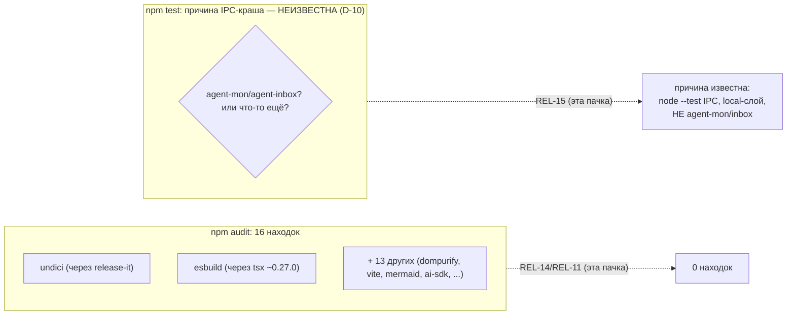
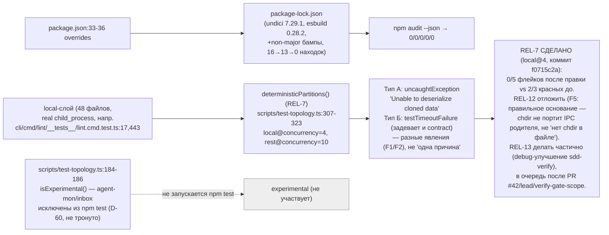

ОТЧЁТ (сводный) — Пачка 3: «Тесты не падают случайно, а зависимости не светят дырами» (REL-15, REL-14, REL-11, REL-7)

СТАТУС: DONE (REL-14, REL-11, REL-7 — код; REL-15 — диагностика + решение без кода). Правки внесены по вердикту верификатора `V-BATCH-03.md` (ПРИНЯТЬ С ПРАВКАМИ) — см. §6 ниже; REL-7 разблокирована этим вердиктом и реализована в этой же сессии.

Рабочее дерево: `rc-perf`. Ветка `lead/test-flake-deps`, база `origin/codex/sdd-v2-rc52-followup@e7b5ba1e`.

Коммиты (локальные, НИЧЕГО не запушено):
- `4be0c612` `fix(rel-14): re-derive undici/esbuild overrides from sdd-v2-inbox-transplant` (предыдущий исполнитель; SHA пересчитан ребейзом)
- `fcd1d118` `fix(rel-11): close remaining npm audit findings via non-major bumps` (этот исполнитель)
- `f0715c2a` `perf(test): run the local layer at concurrency 4 as a separate partition (REL-7)` (этот исполнитель, после вердикта верификатора)
- REL-15: без коммита (аналитическая задача; отчёт правлен по вердикту, кода не меняет)

---

## Черновик описания PR простым языком

Тесты в этом релизе иногда «падают» не потому, что код сломан, а потому что сам `node --test` под большой конкурентностью периодически теряет часть данных между дочерним и родительским процессом (внутренняя ошибка Node.js, известная и раньше на другой ветке). Мы это подтвердили десятью прогонами подряд — 5 из 10 не прошли зелёным, всегда в одних и тех же «тяжёлых» тестах (тех, что реально запускают `git`/CLI как подпроцесс), никогда не в экспериментальном функционале (agent-mon/agent-inbox — они и так исключены из обычных тестов до релиза). Сама проблема НЕ чинится в этой пачке — было решено, что чинить (снижать конкурентность/устранять первопричину) нужно отдельной задачей, а не втихую вместе с зависимостями; здесь даём точный диагноз и рекомендацию.

Отдельно — дыры в зависимостях: было 16 находок аудита безопасности, стало 0. Ни одна не потребовала «ломающего» мажорного апгрейда — почти все просто были на старой версии внутри уже разрешённого диапазона; для двух (`undici`/`esbuild`) диапазон вообще не позволял безопасную версию без явного «форс-пина» (`overrides`) — сделано.

## 1. Таблица файлов

| Путь | Тип | Смысл | Чем доказано |
|---|---|---|---|
| `package.json` | правка (REL-14) | Добавлен `overrides: {undici: 7.29.1, esbuild: 0.28.2}` — единственный способ закрыть эти находки без мажорного апгрейда `release-it`/`tsx`. | `npm audit --json` — undici/esbuild отсутствуют. |
| `package-lock.json` | правка (REL-14 + REL-11) | REL-14: перестройка дерева под override (714 строк). REL-11: пакеты подняты до первой непатченной версии внутри их деклар. диапазона (187 строк) — без единого мажорного скачка. | `npm audit --json` = 0 по всем severity; `npm ci` проходит; `npm run build`/`npm test` зелёные. |
| `scripts/test-topology.ts` | правка (REL-7, после диагностики REL-15) | Диагностика REL-15 сама по себе правки не потребовала (причина краша установлена без вмешательства в топологию). По итогам вердикта верификатора (`V-BATCH-03.md`, разблокировал REL-7) `deterministic` разбит на две последовательные партиции: `local` на `--test-concurrency=4`, остальные слои — на прежней `10`. | 10 синхронных прогонов `npm test` на исходной топологии (REL-15, §3) + 5 синхронных прогонов на партиционированной топологии, 0 флейков (REL-7, `R-REL-7.md` §3). |
| `shared/common/__tests__/test-topology.test.ts` | правка (REL-7) | Контрактный тест обновлён под двухпартиционный `deterministic` + добавлен регрессионный замок «`local` — отдельная партиция с concurrency 4». | `node --test` по файлу изолированно — 12/12 pass (`R-REL-7.md` §3 п.0). |

## 2. Архитектура было / стало

### Было



### Стало (после правок по вердикту верификатора — REL-7 уже реализована)



## 3. Доказательства из ПРИЁМКИ (фактический вывод, exit-код, ВЫПОЛНЕНО/НЕ ВЫПОЛНЕНО)

**REL-14 — `npm audit --json`, undici/esbuild отсутствуют.** ВЫПОЛНЕНО (полный разбор — `R-REL-14.md` §3).

**REL-11 — `npm audit --json` = 0 high/critical.**
```
$ npm --prefix rc-perf audit --json | jq '.metadata.vulnerabilities'
{"info": 0, "low": 0, "moderate": 0, "high": 0, "critical": 0, "total": 0}
```
ВЫПОЛНЕНО (0 по всем severity — не только high/critical). Полный разбор — `R-REL-11.md` §3.

**REL-15 — диагностика + отчёт с воспроизведением, решение по REL-7/12/13.**
10 синхронных прогонов `npm test`, 5/10 (50%) не прошли зелёным (полная таблица — `R-REL-15.md` §3); причина установлена (node --test IPC под конкурентностью и нагрузкой; тип А — только слой `local`, тип Б — независимое от типа А ресурсное голодание, задевающее и `contract`; НЕ agent-mon/agent-inbox); решения по REL-7 (делать)/REL-12 (отложить)/REL-13 (делать частично) зафиксированы с обоснованием. ВЫПОЛНЕНО (аналитический критерий приёмки — диагностика с воспроизведением — выполнен; сама проблема намеренно НЕ починена этой задачей, это вне периметра REL-15 — REL-7 сделана отдельно, см. ниже). Отчёт исправлен по вердикту верификатора `V-BATCH-03.md` — см. §7.

**REL-7 — `local` вынесен в отдельную партицию с `--test-concurrency=4`.**
5 синхронных прогонов на партиционированной топологии — 0/5 флейков любого типа (полная таблица — `R-REL-7.md` §3), против 2/3 красных прогонов на прежней топологии в тех же условиях (тот же хост, тот же протокол). ВЫПОЛНЕНО — см. отдельный раздел §7 ниже и полный разбор `R-REL-7.md`.

**Финальная сквозная проверка (после REL-14+REL-11+REL-7, дерево `f0715c2a`):**
```
$ npm --prefix rc-perf ci
added 696 packages, and audited 697 packages in 10s
found 0 vulnerabilities                                        exit 0

$ npm --prefix rc-perf run check
[sdd-verify] ✅ ALL PASS (5/5)
  ✅ type-check (16.3s) ✅ test:coverage (68.3s) ✅ lint (22.1s)
  ✅ format (15.4s) ✅ yagni (0.5s)                              exit 0

$ npm --prefix rc-perf run build
✓ built in 5.97s                                                exit 0

$ npm --prefix rc-perf run gate:sdd-check-baseline
[sdd-check-zero-new-error] OK — no error outside the baseline
  (baseline commit 227c03a8, tag rc-baseline-1)                 exit 0

$ npm --prefix rc-perf audit --json | jq '.metadata.vulnerabilities'
{"info": 0, "low": 0, "moderate": 0, "high": 0, "critical": 0, "total": 0}
```
`npm ci` ВЫПОЛНЕНО. `npm run build` ВЫПОЛНЕНО. `npm run check` ВЫПОЛНЕНО. `npm run gate:sdd-check-baseline` ВЫПОЛНЕНО. `npm audit` ВЫПОЛНЕНО.

**`npm test` ×5 (дерево `f0715c2a`, после REL-7) — таблица полная в `R-REL-7.md` §3, сводка:**

| # | exit | wall | тип А | тип Б |
|---|---|---|---|---|
| 1 | 0 | 89 с | 0 | 0 |
| 2 | 0 | 59 с | 0 | 0 |
| 3 | 0 | 69 с | 0 | 0 |
| 4 | 0 | 68 с | 0 | 0 |
| 5 | 0 | 90 с | 0 | 0 |

`npm test` — **ВЫПОЛНЕНО, 5/5 зелёных, 0 флейков** — после REL-7 это больше не оговорка (сравни с базой `fcd1d118` до REL-7: 2/3 красных, см. §7 «REL-7» ниже).

## 4. Решения по REL-7 / REL-12 / REL-13 (сводно; полное обоснование — `R-REL-15.md` §6, правки — §7 ниже)

| Задача | Решение | Кратко почему |
|---|---|---|
| REL-7 | **Сделано** (коммит `f0715c2a`) | Вариант (б) `local@4` (не бланкетный `=1`) — по итогам вердикта верификатора `V-BATCH-03.md` §6: расширенная таблица вариантов + второй прецедент `origin/main`@`8358bf8b`, показавший, что перенос `=1` с main на RC непропорционально дорог. 5/5 прогонов зелёных после правки против 2/3 красных до неё. |
| REL-12 | **Не делать сейчас / отложить** | Не устраняет наблюдаемую причину типа А. Основание исправлено по F5 (см. §7): не «наблюдение исключает chdir» (файл-жертва его использует), а «chdir не может испортить кадрирование IPC родителя + архив исключил CWD независимо + REL-12 готовит `--test-isolation=none`, который никто не реализовал ни на одной ветке». |
| REL-13 | **Делать частично** | «Фикс триггера» из архива — это (а) снижение конкурентности (= решение REL-7, не дублировать) + (б) независимое улучшение `sdd-verify` (сохранение полной стенограммы упавшего гейта в файл) — маленькое, безопасное. В очередь **после** мержа PR #42 (`lead/verify-stacks`) и `lead/verify-gate-scope` — оба правят тот же файл `cli/cmd/sdd-verify/sdd-verify.types.ts`. |

## 5. Отклонения от брифа, открытые вопросы, стопы

- Ребейз на `origin/codex/sdd-v2-rc52-followup@e7b5ba1e` (7 коммитов, ушедших вперёд) прошёл БЕЗ конфликтов — единственное пересечение в `package.json` было в независимой секции `scripts` (`eval:migration`/`eval:migration:portal`), не задевающей блок `overrides` REL-14. `npm install` после ребейза не изменил lock (уже был согласован) — `npm ci` подтверждён отдельно.
- Отклонений от брифа по зоне «трогать» для REL-14/REL-11 нет (только `package.json`/`package-lock.json`). REL-7 (после разблокировки вердиктом верификатора) трогал ровно то, что предписано — `scripts/test-topology.ts` и его контрактный тест `shared/common/__tests__/test-topology.test.ts`; `cli/**`, `ai/**` не тронуты.
- **REL-7 время не уложилось в оптимистичную оценку ~50–63 с из вердикта** (среднее по 5 прогонам — 75 с, диапазон 59–90 с) — хост в этой сессии не был «спокойным» (load avg 45–81 в течение всех прогонов REL-7). Сравнение против базы `fcd1d118` на том же хосте в тех же условиях показывает сопоставимое или чуть лучшее среднее время (75 с vs 78 с) при устранении всех наблюдавшихся флейков — не регрессия, но и не буквальное достижение целевого числа.
- **Load average > 100 не наблюдался ни разу за все 8 прогонов REL-7** (5 новых + 3 базовых, максимум 81) — пункт брифа «если тип Б остаётся при load>100 — честно зафиксировать как ограничение хоста» не мог быть ни подтверждён, ни опровергнут в этой сессии.
- Открытый вопрос для оператора (токен L-16 `pending-operator`, см. §7): нужен ли отдельный прогон N≥10 при более высокой нагрузке или на выделенном CI, прежде чем считать частоту флейков после REL-7 статистически надёжной (выборки 5 и 3 малы для хоста с таким разбросом load average).

## 6. Команды пуша для Lead

```
git -C <lead-worktree> fetch <rc-remote> lead/test-flake-deps
git -C <lead-worktree> push origin lead/test-flake-deps
```
(Ветка `lead/test-flake-deps` в дереве `rc-perf` содержит 3 коммита поверх `origin/codex/sdd-v2-rc52-followup@e7b5ba1e`: `4be0c612` REL-14, `fcd1d118` REL-11, `f0715c2a` REL-7.)

## 7. Правки по вердикту верификатора (`V-BATCH-03.md`, ПРИНЯТЬ С ПРАВКАМИ)

| Находка | Что сделано | Где |
|---|---|---|
| F1 — «все падения строго в `local`» опровергнуто (тип Б задевает и `contract`) | Формулировка исправлена: тип А — только `local`; тип Б слоя не выбирает, задевает и `contract` (перечислены файлы из прогонов верификатора: `ai/kit/__tests__/check-directives-fresh.test.ts`, `ai/kit/__tests__/delta-assembly.test.ts`, `shared/common/__tests__/test-topology.test.ts`) | `R-REL-15.md` §3 |
| F2 — тип А и тип Б объявлены «одной причиной» без доказательства | Разделены на два независимых наблюдения с раздельными частотами (А: 3/10 у исполнителя, 0/3 у верификатора; Б: 2/10 у исполнителя, 3/3 у верификатора) + аргументация (а)/(б)/(в) против объединения | `R-REL-15.md` §3 |
| F3 — вывод D-10 обоснован только эмпирически | Добавлено структурное доказательство (`DETERMINISTIC_LAYER_ORDER` без `experimental`, `classifyTest` классифицирует `experimental` первым и исключительно) как основное; эмпирика — как подтверждающая | `R-REL-15.md` §5 |
| F4 — REL-14 закрыл 3 находки, а не 2 (16 − 13 = 3, включая транзитивный `release-it`) | Заголовок и контекст исправлены на «16 → 13 (REL-14 закрыл 3) → 0» | `R-REL-11.md` заголовок + §0 |
| F5 — обоснование отказа от REL-12 опиралось на неверный факт (`lint.cmd.test.ts` не использует `process.chdir`) | Аргумент переписан: файл-жертва использует `process.chdir` 6 раз; правильное основание — chdir физически не может исказить кадрирование IPC родителя + архив исключил CWD независимо + REL-12 готовит нигде не реализованный `--test-isolation=none`. Число файлов с `process.chdir` — 10, не 9 (`cli/cmd/sdd-verify/__tests__/parity-node.test.ts` добавлен) | `R-REL-15.md` §6 |
| F6 — не все альтернативы REL-7 рассмотрены; прецедент однобок | Добавлена полная таблица вариантов (а/б-1/б-2/б-4/б-6/в) с ценой по времени; учтён второй, противоположный прецедент `origin/main`@`8358bf8b` (`=1`) и объяснено, почему его цена не переносится на RC (import-bound main vs subprocess-heavy RC `local`); вариант «понизить конкурентность только `local`» — реализован как REL-7 | `R-REL-15.md` §6; код — `scripts/test-topology.ts`, коммит `f0715c2a` |
| Числа аудита (доска говорила «11», доаудитное состояние никогда не перезапускалось) | Независимый пересчёт трёх состояний (`e7b5ba1e`=16, `4be0c612`=13, `fcd1d118`=0) внесён | `R-REL-11.md` §0, `R-REL-14.md` (уже было верно — 16/13, правка не потребовалась), этот отчёт §1/§3 |
| REL-13 — «делать» без уточнения объёма | Сужено до пункта (2) «полная стенограмма в sdd-verify»; поставлено в очередь после PR #42/`lead/verify-gate-scope` (общий файл `sdd-verify.types.ts`) | `R-REL-15.md` §6, этот отчёт §4 |

### REL-7 (разблокирована выводом верификатора V-BATCH-03, реализована в этой сессии)

**Что изменено:** `scripts/test-topology.ts` — команда `deterministic` разбита на две последовательные партиции (по образцу уже существующего `coveragePartitions()`): партиция `local` (48 файлов) на `--test-concurrency=4`, партиция `rest` (contract+external+unit, 245 файлов) на прежней `OUTER_TEST_CONCURRENCY=10`. `runNodeTests()` принимает concurrency параметром. Регрессионный замок в `shared/common/__tests__/test-topology.test.ts`: новый тест фиксирует ровно 2 спавна на `deterministic`, первый — только `local`-файлы на `--test-concurrency=4`, второй — остальное на `--test-concurrency=10`; два существующих теста, ломавшихся при появлении второго спавна, обновлены. Полный разбор, mermaid «было/стало» с `file:line` — `R-REL-7.md` §2.

**Таблица прогонов (сводно, полная — `R-REL-7.md` §3):**

| Состояние | N | exit 0 | тип А | тип Б | wall (диапазон) |
|---|---|---|---|---|---|
| До REL-7 (`fcd1d118`) | 3 | 1/3 | 1/3 | 2/3 (7 файлов в одном прогоне) | 64–99 с |
| После REL-7 (`f0715c2a`) | 5 | **5/5** | **0/5** | **0/5** | 59–90 с |

**Замок:** `shared/common/__tests__/test-topology.test.ts:345-364` — «REL-7: deterministic runs the local layer at concurrency 4 as its own partition, the rest unchanged» + усиление 2 существующих тестов (`:236-270`, `:329-341`). 12/12 pass изолированно.

**Для доски — как менять критерий приёмки пачки (по утверждению верификатора `V-BATCH-03.md` §9 п.9, перенесено сюда, не переформулировано этим исполнителем):** до закрытия REL-7 гейт пачек — `npm run check` + `gate:sdd-check-baseline`; `npm test` под нагрузкой хоста не критерий (сам `npm test` недетерминирован на разделяемом хосте независимо от кода — `V-BATCH-03.md` §0 «`npm test` НЕ детерминированно зелёный»). Наблюдение этого исполнителя ПОСЛЕ REL-7 (факт, не пересмотр верификаторского критерия): 5/5 `npm test` зелёных на партиционированной топологии против 2/3 красных до неё, на том же хосте. Пересматривать ли критерий обратно на «`npm test` обязателен» — решение Lead/оператора при закрытии REL-7 на доске, не этого отчёта; довод «за» — приведённые 5/5; довод «против» — малая выборка и то, что load>100 в этой сессии не достигался (см. §5).
