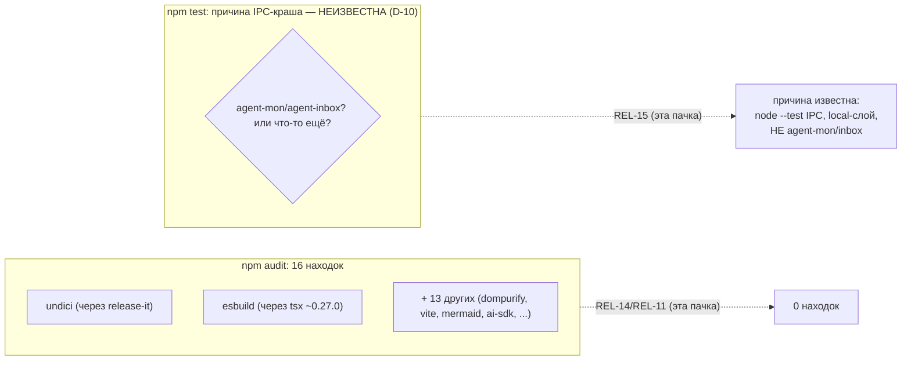
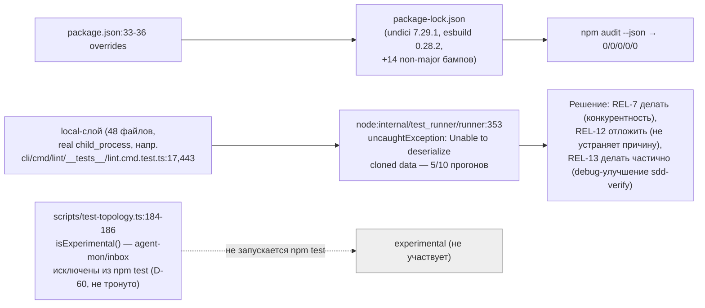

ОТЧЁТ (сводный) — Пачка 3: «Тесты не падают случайно, а зависимости не светят дырами» (REL-15, REL-14, REL-11)

СТАТУС: DONE (REL-14, REL-11 — код; REL-15 — диагностика + решение без кода)

Рабочее дерево: `rc-perf`. Ветка `lead/test-flake-deps`, база `origin/codex/sdd-v2-rc52-followup@e7b5ba1e`.

Коммиты (локальные, НИЧЕГО не запушено):
- `4be0c612` `fix(rel-14): re-derive undici/esbuild overrides from sdd-v2-inbox-transplant` (предыдущий исполнитель; SHA пересчитан ребейзом)
- `fcd1d118` `fix(rel-11): close remaining npm audit findings via non-major bumps` (этот исполнитель)
- REL-15: без коммита (аналитическая задача)

---

## Черновик описания PR простым языком

Тесты в этом релизе иногда «падают» не потому, что код сломан, а потому что сам `node --test` под большой конкурентностью периодически теряет часть данных между дочерним и родительским процессом (внутренняя ошибка Node.js, известная и раньше на другой ветке). Мы это подтвердили десятью прогонами подряд — 5 из 10 не прошли зелёным, всегда в одних и тех же «тяжёлых» тестах (тех, что реально запускают `git`/CLI как подпроцесс), никогда не в экспериментальном функционале (agent-mon/agent-inbox — они и так исключены из обычных тестов до релиза). Сама проблема НЕ чинится в этой пачке — было решено, что чинить (снижать конкурентность/устранять первопричину) нужно отдельной задачей, а не втихую вместе с зависимостями; здесь даём точный диагноз и рекомендацию.

Отдельно — дыры в зависимостях: было 16 находок аудита безопасности, стало 0. Ни одна не потребовала «ломающего» мажорного апгрейда — почти все просто были на старой версии внутри уже разрешённого диапазона; для двух (`undici`/`esbuild`) диапазон вообще не позволял безопасную версию без явного «форс-пина» (`overrides`) — сделано.

## 1. Таблица файлов

| Путь | Тип | Смысл | Чем доказано |
|---|---|---|---|
| `package.json` | правка (REL-14) | Добавлен `overrides: {undici: 7.29.1, esbuild: 0.28.2}` — единственный способ закрыть эти 2 находки без мажорного апгрейда `release-it`/`tsx`. | `npm audit --json` — undici/esbuild отсутствуют. |
| `package-lock.json` | правка (REL-14 + REL-11) | REL-14: перестройка дерева под override (714 строк). REL-11: 14 пакетов подняты до первой непатченной версии внутри их деклар. диапазона (187 строк) — без единого мажорного скачка. | `npm audit --json` = 0 по всем severity; `npm ci` проходит; `npm run build`/`npm test` зелёные. |
| `scripts/test-topology.ts` | НЕ тронут | Диагностика REL-15 не потребовала правки — причина краша установлена без вмешательства в топологию. | 10 синхронных прогонов `npm test` (см. §3). |

## 2. Архитектура было / стало

### Было



### Стало



## 3. Доказательства из ПРИЁМКИ (фактический вывод, exit-код, ВЫПОЛНЕНО/НЕ ВЫПОЛНЕНО)

**REL-14 — `npm audit --json`, undici/esbuild отсутствуют.** ВЫПОЛНЕНО (полный разбор — `R-REL-14.md` §3).

**REL-11 — `npm audit --json` = 0 high/critical.**
```
$ npm --prefix rc-perf audit --json | jq '.metadata.vulnerabilities'
{"info": 0, "low": 0, "moderate": 0, "high": 0, "critical": 0, "total": 0}
```
ВЫПОЛНЕНО (0 по всем severity — не только high/critical). Полный разбор — `R-REL-11.md` §3.

**REL-15 — диагностика + отчёт с воспроизведением, решение по REL-7/12/13.**
10 синхронных прогонов `npm test`, 5/10 (50%) не прошли зелёным (полная таблица — `R-REL-15.md` §3); причина установлена (node --test IPC под конкурентностью, слой `local`, НЕ agent-mon/agent-inbox); решения по REL-7 (делать)/REL-12 (отложить)/REL-13 (делать частично) зафиксированы с обоснованием. ВЫПОЛНЕНО (аналитический критерий приёмки — диагностика с воспроизведением — выполнен; сама проблема намеренно НЕ починена, это вне периметра REL-15).

**Финальная сквозная проверка (после REL-14+REL-11, дерево `fcd1d118`):**
```
$ npm --prefix rc-perf ci
added 696 packages, and audited 697 packages in 9s
found 0 vulnerabilities                                        exit 0

$ npm --prefix rc-perf test        # прогон #1 (флейк воспроизвёлся)
# tests 3638 # pass 3626 # fail 0 # cancelled 4 # skipped 8      exit 1
$ npm --prefix rc-perf test        # прогон #2 (немедленный повтор)
# tests 3650 # pass 3642 # fail 0 # cancelled 0 # skipped 8      exit 0

$ npm --prefix rc-perf run build
✓ built in 2.59s                                                exit 0

$ npm --prefix rc-perf run check
[sdd-verify] ✅ ALL PASS (5/5)
  ✅ type-check (4.5s) ✅ test:coverage (42.6s) ✅ lint (22.0s)
  ✅ format (15.2s) ✅ yagni (0.5s)                              exit 0

$ npm --prefix rc-perf run gate:sdd-check-baseline
[sdd-check-zero-new-error] OK — no error outside the baseline    exit 0

$ npm --prefix rc-perf audit --json | jq '.metadata.vulnerabilities'
{"info": 0, "low": 0, "moderate": 0, "high": 0, "critical": 0, "total": 0}
```
`npm ci` ВЫПОЛНЕНО. `npm run build` ВЫПОЛНЕНО. `npm run check` ВЫПОЛНЕНО. `npm run gate:sdd-check-baseline` ВЫПОЛНЕНО. `npm audit` ВЫПОЛНЕНО. `npm test` — ВЫПОЛНЕНО с оговоркой: детерминированной зелени НЕТ (см. REL-15) — второй немедленный прогон зелёный, что и является ожидаемым по итогам диагностики поведением флейка, а не регрессией от изменений этой пачки.

## 4. Решения по REL-7 / REL-12 / REL-13 (сводно; полное обоснование — `R-REL-15.md` §6)

| Задача | Решение | Кратко почему |
|---|---|---|
| REL-7 | **Делать** | Безопасность НЕ доказана — доказано обратное (5/10 прогонов небезопасны). Снижать конкурентность или ждать REL-13. |
| REL-12 | **Не делать сейчас / отложить** | Не устраняет наблюдаемую причину (архивный коммит сам исключает CWD/chdir); готовит шаг (`--test-isolation=none`), который никто не реализовал ни на одной ветке. |
| REL-13 | **Делать частично** | «Фикс триггера» из архива — это (а) снижение конкурентности (= решение REL-7, не дублировать) + (б) независимое улучшение `sdd-verify` (сохранение полной стенограммы упавшего гейта в файл) — маленькое, безопасное, стоит re-derive отдельно. |

## 5. Отклонения от брифа, открытые вопросы, стопы

- Ребейз на `origin/codex/sdd-v2-rc52-followup@e7b5ba1e` (7 коммитов, ушедших вперёд) прошёл БЕЗ конфликтов — единственное пересечение в `package.json` было в независимой секции `scripts` (`eval:migration`/`eval:migration:portal`), не задевающей блок `overrides` REL-14. `npm install` после ребейза не изменил lock (уже был согласован) — `npm ci` подтверждён отдельно.
- Отклонений от брифа по зоне «трогать» нет: `scripts/test-topology.ts`, `cli/**`, `ai/**`, `shared/**` не тронуты; только `package.json`/`package-lock.json`.
- Стоп: REL-7/12/13 намеренно НЕ реализованы в этой пачке (по брифу — только решение); их код-исполнение — предмет следующей пачки/сессии.
- Открытый вопрос для оператора: хост диагностики REL-15 был разделяемым и временами экстремально нагруженным (load avg до 110 на 12 CPU) — рекомендую доп. прогон на выделенном CI перед финальным закрытием REL-7, хотя сигнатура краша уже подтверждена и при умеренной нагрузке (см. `R-REL-15.md` §7).

## 6. Команды пуша для Lead

```
git -C <lead-worktree> fetch <rc-remote> lead/test-flake-deps
git -C <lead-worktree> push origin lead/test-flake-deps
```
(Ветка `lead/test-flake-deps` в дереве `rc-perf` содержит 2 коммита поверх `origin/codex/sdd-v2-rc52-followup@e7b5ba1e`: `4be0c612` REL-14, `fcd1d118` REL-11.)
