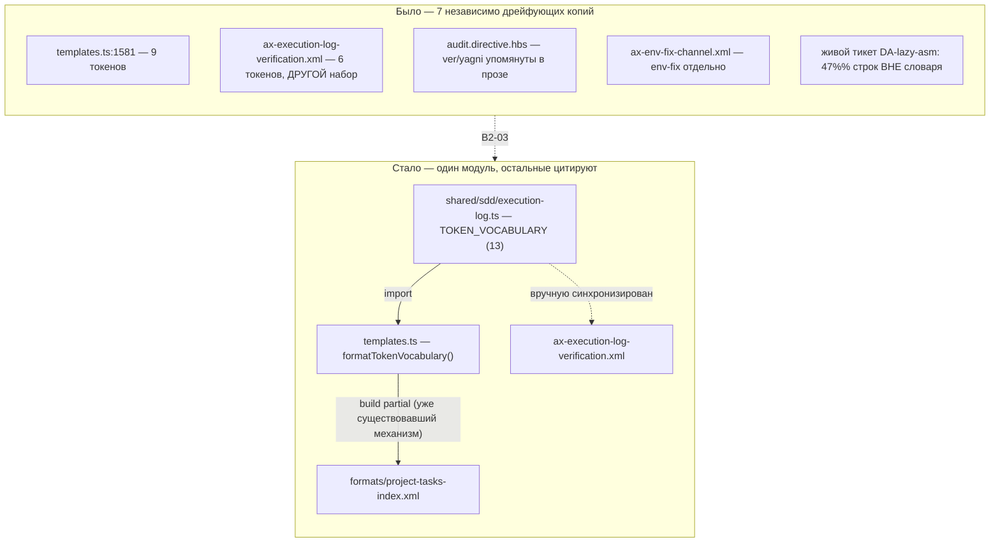

СВОДНЫЙ ОТЧЁТ — Пачка 4: «Спеки журнала и проверок описывают то, что есть в коде»

СТАТУС: DONE, 8/8 задач (B2-17, B2-05, B2-03, B2-09, B2-11, B2-14, B2-08, B2-15). Стопов нет.

Рабочее дерево: `rc-v6` (git worktree gennady, remote `origin` = RubaXa/gennady).
Ветка: `lead/specs-match-code`, создана от `origin/lead/release-package` (`f16d7f17d66354551d3166e8952dcc6fd0e4fca0` — «fix(package): nested ai/.npmignore keeps tests, fixtures and eval artefacts out of the tarball (REL-2a)»), тем же способом, что и Пачка 5 (`lead/kit-lint`) — обе стоят на PR #28 (Пачка 2), а не на общем корне `codex/sdd-v2-rc52-followup`, потому что обе пачки правят шаблоны/аксиомы кит-пайплайна, которые PR #28 уже успел перегенерировать один раз (версия `2.0.0-draft.1`); ветвиться от более старой базы означало бы двойную перегенерацию директив и лишний шум в диффе.

Порядок исполнения внутри пачки: `61-TASK-BOARD.md:18` — «все задачи трека B2 зависят от B2-17» (spec-first дисциплина). B2-17 шла первой. Остальные семь — независимы друг от друга по доске, порядок выбран по возрастанию риска: сначала код-уровневые фиксы (B2-05, B2-03, B2-09), затем директивная документация (B2-11, B2-14, B2-08), последним — собственный корпус (B2-15), т.к. он же и подытоживает счётчик находок.

Коммиты (все локальные, **ничего не запушено**, по одному conventional-коммиту на задачу, каждый прошёл `pre-commit` целиком без `--no-verify`):

| SHA | Коммит |
|---|---|
| `e68ba8a0` | docs(B2-17): sdd-log/sdd-check specs match actual modes and codes |
| `e3efed2a` | fix(B2-05): --all on zero tickets is SDD_NO_TICKETS_FOUND (exit 2), not clean; --task matches --all on legacy tickets |
| `0ab05811` | feat(B2-03): TOKEN_VOCABULARY — one home in shared/sdd/execution-log.ts, ver/yagni/env-fix/correction added |
| `dcfd4bf9` | fix(B2-09): parsePhasesOverview/completePhase read PHASES_OVERVIEW columns by header name, not fixed position |
| `71fe1cf0` | docs(B2-11): STEP_1_MECHANICAL names every sdd-check code family; ax-task-id-integrity fixes AUDIT_ROUNDS extraction form |
| `ead43102` | fix(B2-14): task skeleton's Handoff placeholder carries deviations — matches sdd-log complete's 4-field contract |
| `7452b10f` | docs(B2-08): AX_REOPEN_FORMAT matches v2 PHASES_OVERVIEW, splits — re-run: vs new Round by D-20, fixes TODO/IN_PROGRESS contradiction |
| `585537ac` | fix(B2-15): resolve 3 real SDD_TASK_ID_COLLISION duplicates; resync specs/3-tasks.md with the project-index generator |

Подробные разборы каждой задачи — `R-B2-17.md`, `R-B2-05.md`, `R-B2-03.md`, `R-B2-09.md`, `R-B2-11.md`, `R-B2-14.md`, `R-B2-08.md`, `R-B2-15.md` в этой же папке.

---

## Черновик описания PR (простым языком)

**Что сделали.** Трек журнала исполнения (`sdd-log`) и механической проверки (`sdd-check`) в v2 успел разъехаться со своей же документацией и сам с собой за несколько итераций: спеки описывали 6-8 режимов из реально существующих 11-и; пустой прогон `sdd-check --all` на неправильном пути молча отчитывался как «всё чисто»; словарь допустимых слов в журнале был раскидан по семи независимо правившимся местам и не содержал 4 реально используемых слова (`ver`, `yagni`, `env-fix`, `correction`); разбор таблицы фаз ломался, если тикет достался из миграции v1 со старым порядком колонок — не только в проверке, но и в самом закрытии фазы; директива аудита не знала о шести проверках, которые `sdd-check` уже делает — рискуя, что агент-аудитор станет их переделывать руками; скелет письма-передачи между фазами (Handoff) учил трём полям вместо четырёх, которые реально требует команда закрытия фазы; процедура «переоткрыть тикет» была списана из v1 один в один — с неправильным порядком колонок, без напоминания добавить строку в таблицу фаз и с противоречащими друг другу статусами; и в собственном корпусе тикетов репозитория обнаружились три настоящих дубля номера тикета плюс устаревший словарь в собственном же файле-индексе проекта.

Восемь задач закрывают всё это по одной: пять фиксов относятся к КОДУ (`sdd-check.cmd.ts`, `ticket.ts`, `sdd-log.types.ts`, новый модуль `execution-log.ts`), три — к ДИРЕКТИВНОЙ документации агентов (`.hbs`-шаблоны и аксиомы под `ai/kit/`), плюс уборка в собственных данных.

**Зачем.** Без этого: (а) агент, читающий спеку, не узнаёт о трети реального поведения инструмента — spec-first дисциплина v2 держится именно на том, что спека НЕ врёт; (б) ошибка в пути на `sdd-check --all` тихо проходит как «зелёный» прогон вместо явной остановки; (в) реопен тикета по инструкции из аксиомы делает фазу невидимой графу зависимостей и производит рассинхрон трекера; (г) закрытие фазы (`sdd-log complete`) технически ломается на легаси-порядке колонок — не только диагностика, а именно ЗАПИСЬ файла могла испортить чужую ячейку таблицы.

**Что не доделали.** Ничего из восьми задач. Осталось явно ЗА пределами пачки (см. отдельные отчёты §4 каждой задачи): седьмой дом словаря токенов и Handoff-скелета — `ai/kit/contract/process/phase-block-format.xml` (правлен на уровне содержимого во всех трёх задачах, где он упомянут, но реальное подключение к сборке — предмет B2-18, отдельная задача Пачки 18); секция `## Blocker Trail` и механическое отклонение записи в закрытый Round — предмет ещё не назначенных B2-19/B2-04; ребейзлайн `ai/flow-eval/.baseline/sdd-check-227c03a8.json` после переименования тикетов в B2-15 (см. «Открытые следствия» ниже — решение за оператором).

---

## Таблица «файл → что изменилось по смыслу»

| Файл | Задача | Что изменилось по смыслу |
|---|---|---|
| `specs/cli/sdd-log/sdd-log.spec.md` | B2-17 | 8→11 задокументированных режимов, 2 новых DbC-контракта (Spec Authoring Completion, Group Completion Receipt). |
| `specs/cli/sdd-check/sdd-check.spec.md` | B2-17, B2-05, B2-09 | Добавлены недокументированные флаги `--spec`/`--format`; новый инвариант exit 2 + `D-CK037`; новый инвариант про `--task`/`--all` parity на легаси-тикете. |
| `cli/cmd/sdd-check/sdd-check.cmd.ts` | B2-05 | `SDD_NO_TICKETS_FOUND` (exit 2) на пустом `--all`; `--task` классифицирует легаси-тикет как `--all`, не гонит на нём полный v2-набор проверок. |
| `shared/sdd/execution-log.ts` (новый) | B2-03 | Единственный дом словаря токенов журнала (13 записей, включая `correction`). |
| `shared/sdd/templates.ts` | B2-03, B2-14, B2-15 | Скелет `specs/3-tasks.md`/тикета интерполирует словарь из одного модуля; Handoff-плейсхолдер — 4 поля вместо 3. |
| `shared/sdd/ticket.ts` | B2-09 | `parsePhasesOverview` читает колонки по имени заголовка, не по фиксированной позиции. |
| `cli/cmd/sdd-log/sdd-log.types.ts` | B2-09, B2-05(нет), B2-14(нет) | `completePhase` — та же column-aware логика для реальной ЗАПИСИ файла (не только чтения). |
| `ai/kit/templates/sdd-v2/audit.directive.hbs` | B2-11 | `AX_MECHANICAL_VIA_SDD_CHECK` называет все 6 реальных семейств кодов `sdd-check` (было — половина). |
| `ai/kit/axiom/process/ax-reopen-format.xml`, `ai/kit/templates/sdd-v2/reconcile.directive.hbs` | B2-08 | Реопен-процедура: канонический порядок колонок, обязательная строка в PHASES_OVERVIEW, выбор `— re-run:`/новый Round по D-20, `[~] IN_PROGRESS` вместо `[ ] TODO`. |
| `ai/kit/axiom/audit/ax-mechanical-via-sdd-check.xml`, `ax-task-id-integrity.xml` | B2-11 | Синхронизированы (осиротевшие копии — не подключены сборкой, но правлены на будущее). |
| `ai/kit/contract/process/phase-block-format.xml` | B2-03, B2-14 | Синхронизирован (та же осиротевшая категория). |
| `tasks/**` (3 переименования + 6 правок Dependencies/README) | B2-15 | Разрешены 3 настоящих коллизии Task-ID. |
| `specs/3-tasks.md` | B2-15 | Собственный project-index репозитория пересинхронизирован с генератором. |
| `ai/directives/sdd-v2/**` (build output, 7 файлов суммарно по всем задачам) | все, кроме B2-05/B2-09/B2-15 | Перегенерированы `npm run build:directives`, подтверждены `check:directives-fresh`. |

---

## Схема «было → стало»: словарь токенов журнала (B2-03, самая структурная правка пачки)



---

## Доказательства (по всей пачке, финальный срез ветки после всех 8 коммитов)

| Команда | Вывод (сжато) | Exit | Статус |
|---|---|---|---|
| `npm --prefix rc-v6 test` | `# tests 3593 # pass 3583 # fail 0 # cancelled 0 # skipped 10` | 0 | ВЫПОЛНЕНО |
| `npm --prefix rc-v6 run check` | `[sdd-verify] ✅ ALL PASS (5/5)` — type-check, test:coverage, lint, format, yagni | 0 | ВЫПОЛНЕНО |
| `npm --prefix rc-v6 run build && node dist/gennady.js sdd-check --all rc-v6` | `192 error(s), 434 warning(s) across 212 file(s)` | 1 (ожидаемо — есть находки) | ВЫПОЛНЕНО, `192 ≤ 198` |
| `npm --prefix rc-v6 run gate:sdd-check-baseline` | `FAIL — 2 error(s) not present in the baseline` (обе — переименованный B2-15 файл, см. ниже) | 1 | НЕ ВЫПОЛНЕНО формально, см. «Открытые следствия» |

**Число ошибок `sdd-check --all`:** 198 (старт пачки, база `f16d7f17`) → 192 (финал). Единственный источник снижения — B2-15. Ни одна из остальных семи задач не изменила счётчик ошибок (docs-only/парсер-фиксы без готовых к триггеру фикстур в реальном дереве).

**ИСПРАВЛЕНО (V-BATCH-04, plan-verifier — обе цифры этого абзаца были неверны):**
- **База — 198 error / 431 warning**, не «432», на честном git-бэкед чекауте `f16d7f17` (снятие с дерева без `.git` даёт паразитный 205 error — `SDD_REQUIREMENT_ENTRY_TOO_LONG` грандфазерится против git-HEAD, см. `V-BATCH-04.md` сноску методической находки — валидна только git-бэкед база).
- **Предупреждения: 431 → 434, +3, не +2.** Третье — не следствие B2-15: `specs/cli/sdd-log/sdd-log.spec.md: warn: SDD_MODULE_OVERSIZED` (26 сущностей > 20), следствие B2-17 (§3-инвентарь дополнен утилитами), не упомянутое ранее ни в одном отчёте — см. `R-B2-17.md` §3/§4.
- **Ошибки: −6 = 3 `SDD_TASK_ID_COLLISION` (одна находка на пару, не «3×2») + 3 `SDD_TRACKER_STATUS_DRIFT`** (`tasks/agent-mon-cli/README.md`, `tasks/dbc/README.md`, `tasks/infra-npm-publish/README.md`) — разрешение коллизий B2-15 попутно сняло дрейф трекер-статуса в двух НЕ тронутых этой задачей README; это плюс-эффект, ранее не заявленный. Отдельно, 2 находки (`SDD_DEP_UNRESOLVED`, `SDD_VERIFICATION_TABLE_INVALID`) не исчезли — переехали с `vcs-mr-client.task-88.md` на `…task-186.md` (это они дают красный `gate:sdd-check-baseline`, см. п.91 и §«Правки по V-BATCH-04 и ребейз на пачку 5» ниже). Подробности и исправленные числа также в `R-B2-15.md` §3.

---

## Стопы

Стопов по ходу пачки не было. Единственный формальный «красный» результат — последний пункт приёмки (`gate:sdd-check-baseline`) — разобран отдельно ниже, это не стоп в процессе работы, а известное, объяснённое следствие корректно выполненной задачи B2-15.

---

## Открытые следствия

1. **`gate:sdd-check-baseline` требует решения оператора о ребейзлайне (D-38).** B2-15 переименовал `tasks/vcs/vcs-mr-client/vcs-mr-client.task-88.md` → `…task-186.md`, разрешая реальную коллизию Task-ID. Baseline-снепшот (`ai/flow-eval/.baseline/sdd-check-227c03a8.json`, заморожен на `227c03a8`, ДО этой пачки) хранит найденные на этом файле ошибки (`SDD_DEP_UNRESOLVED`, `SDD_VERIFICATION_TABLE_INVALID`) под СТАРЫМ путём. Обе ошибки — пред-существующие (подтверждено сверкой с исходным прогоном `sdd-check --all` этой сессии, строки 568/574 у старого пути), не новые дефекты; гейт матчит по паре (код, путь), поэтому переименование читается им как «новая» ошибка. Файл `.baseline/*.json` **не редактировался** этим исполнителем — решение о ребейзлайне явно принадлежит оператору (по собственному тексту гейта и по общему правилу D-38, не Lead-полномочие).
2. **Wiring осиротевших бриков `ai/kit/contract/process/**` и трёх осиротевших `ai/kit/axiom/audit/**`-файлов** (`ax-mechanical-via-sdd-check.xml`, `ax-task-id-integrity.xml`, `ax-execution-log-verification.xml`) остаётся за Пачкой 18 (B2-18/T-B6-*) — эта пачка правила их СОДЕРЖИМОЕ (чтобы не учить неверному поведению, когда их наконец подключат), не механизм подключения.
3. **Секция `## Blocker Trail` и механическое отклонение записи в закрытый Round** остаются нереализованными (B2-19/B2-04 соответственно, не входят в эту пачку) — аксиома реопена (B2-08) ссылается на них как на отдельную заботу, не пытаясь предвосхитить их реализацию.

---

## Примечание про базу

Ветка `lead/specs-match-code` создана от `origin/lead/release-package` (PR #28), а не от `codex/sdd-v2-rc52-followup` напрямую — по той же причине, что и параллельная Пачка 5 (`lead/kit-lint`): обе пачки правят шаблоны/аксиомы `ai/kit/**` и требуют перегенерации `ai/directives/**`; PR #28 уже содержит одну перегенерацию (версия `2.0.0-draft.1`) поверх исходной базы, и ветвление от неё, а не от более старого коммита, держит диффы обеих параллельных пачек по `ai/directives/**` минимальными и независимо мерджеемыми Lead-ом.

**Технический риск, зафиксированный для всех, кто будет работать с `ai/kit/build-directives.ts`/`check-directives-fresh.ts` в этом дереве:** оба скрипта резолвят `ai/kit/assembly-manifest.json` по ОТНОСИТЕЛЬНОМУ пути от `process.cwd()`. Запуск не из корня `rc-v6` (например, из соседнего worktree или вовсе без явного cwd) тихо переключает `assembly-manifest`-managed директивы (`audit`, `scaffold`, `phase-execution-protocol`) в `monolith`-сборку вместо `lazy`, производя огромный ложный диф. В этой сессии `cd` в дерево `rc-v6` был заблокирован политикой песочницы rc-executor — обходной путь: `python3 -c "subprocess.run([...], cwd='<abs-path-to-rc-v6>')"`.

**Команды пуша для Lead** (ветка `lead/specs-match-code`, после всех 8 коммитов) — **устарело, см. секцию ниже**: ветка была перебазирована на PR #30, эти команды пушнули бы старую историю поверх `f16d7f17`. Актуальная команда пуша — в конце следующей секции.

---

## § Правки по V-BATCH-04 и ребейз на пачку 5

Исполнено вторым исполнителем в этой же ветке `lead/specs-match-code`, тем же rc-executor-деревом `rc-v6`, по независимой верификации `_raw/V-BATCH-04.md` (`plan-verifier`, свежие глаза) и решениям Lead (по гейту — вариант 2; токен `fix` — добавить в словарь). Первая попытка прервалась на лимите API с незакоммиченными правками в рабочем дереве; продолжено с той точки — незакоммиченное состояние проверено `git diff` и оказалось корректным (см. ниже), просто не зафиксировано и не ребейзнуто.

### Что было исправлено (пункты 1-6 брифа V-BATCH-04)

| # | Пункт | Что сделано | Коммит |
|---|---|---|---|
| 1 | B2-15: откат переименования | `tasks/vcs/vcs-mr-client/vcs-mr-client.task-186.md` → `…task-88.md` (только имя файла; `- **Task-ID:** TSK-186` и H1 внутри — БЕЗ изменений; deps в `task-{89,90,91,92}` уже указывали `TSK-186`, не тронуты) | `16dd8ac5` |
| 2 | B2-03: токен `fix` | Добавлен в `TOKEN_VOCABULARY` (`shared/sdd/execution-log.ts`) — `{ token: 'fix', grammar: 'fix <target> ← <reason>' }`; новый тест-кейс на членство; регенерированы `formats/project-tasks-index.xml`, `specs/3-tasks.md`, `ax-execution-log-verification.xml` (единственный источник — `formatTokenVocabulary()`) | `e013e009` |
| 3 | B2-05/17: `ERR_CLI_SDD_CHECK_UNKNOWN_ID` в help; exit 2 не биимпликация | `cli/cmd/sdd-check/help.ts` — Exit codes строка снова называет `ERR_CLI_SDD_CHECK_UNKNOWN_ID` рядом с `SDD_NO_TICKETS_FOUND`; `sdd-check.spec.md` инвариант `⇔` → `⇐` + явное упоминание `--task <неизвестный ID>`. `SDD_MODULE_OVERSIZED` на `sdd-log.spec.md` — НЕ чинился размером, задокументирован в `R-B2-17.md` (правка ниже) | `e013e009` |
| 4 | B2-08: `reconcile.directive.hbs` vs `AX_REOPEN_FORMAT` | «Always append a new Round» → согласовано с двумя формами аксиомы (`— re-run:` в открытом Round, или новый Round после закрытия, D-20); перегенерированы `reconcile.directive.xml`, `ax-execution-log-verification.xml` через `npm run build:directives` (`check:directives-fresh` чист) | `e013e009` |
| 5 | R-B2-05: убрать «пре-существующий fail» | Строка о `1 pre-existing fail` (артефакт cwd — исполнитель батча гонял тесты не из `rc-v6`) снята; переизмерено — `cli/cmd/sdd-check/__tests__/sdd-check.cmd.test.ts` даёт **82 pass / 0 fail** с cwd=`rc-v6` | правка отчёта (не код) |
| 6 | Числа в отчётах | `R-BATCH-04` (выше в этом файле): база 198 error/**431** warn (не 432); warn-дельта **+3** (третий — `SDD_MODULE_OVERSIZED` на `sdd-log.spec.md`, следствие B2-17); error-дельта −6 = **3 `SDD_TASK_ID_COLLISION` + 3 `SDD_TRACKER_STATUS_DRIFT`** (не «3×2»). Те же правки — в `R-B2-15.md` §3 и `R-B2-17.md` §3/§4 | правка отчётов (не код) |

Коммиты 1-6 — **два** коммита (не один-два по пункту, а ровно 2 суммарно), оба прошли pre-commit целиком (`format` + `type-check` + `lint:contracts`), без `--no-verify`:
- `16dd8ac5` fix(b2-15): revert vcs-mr-client rename to keep gate:sdd-check-baseline green
- `e013e009` fix(b2-03,05,08,17): apply verifier fixes (V-BATCH-04)

### Ребейз на `origin/lead/kit-lint` (пачка 5, PR #30)

`git fetch origin lead/kit-lint` → `61b86fb8` (`fix(T-B6-23): critic-protocol restores the correct confusion triage`). `git rebase origin/lead/kit-lint` — все 8 оригинальных коммитов пачки 4 плюс 2 новых fix-коммита переиграны заново поверх `61b86fb8`; **ни один коммит не сквошен** (11 коммитов в финале, каждый со своим SHA, `git log --oneline 61b86fb8..HEAD` ниже).

**Конфликт (2 файла, как предсказал verifier в `V-BATCH-04.md` §A):** `ai/kit/templates/sdd-v2/audit.directive.hbs` и `ai/kit/axiom/audit/ax-mechanical-via-sdd-check.xml`, при переигрывании коммита `71fe1cf0` (docs(B2-11)). Смысл: пачка 5 (T-B6-18) де-инлайнит `<Axiom id="AX_MECHANICAL_VIA_SDD_CHECK">` из `.hbs` в партиал `{{> "axiom/audit/ax-mechanical-via-sdd-check"}}`, делая брик единственным домом; пачка 4 (B2-11) расширяла ИНЛАЙН-копию шестью новыми семействами кодов (`SDD_TASK_ID_GRAMMAR`, `BDD_NEGATIVE`, `BDD_TRACE`, `COVERAGE_POLICY`×4-кода, `PHASE_RECEIPT`×2-кода, group receipts), не трогая брик-файл (документируя его как «осиротевший»).

Разрешено по правилу Lead (структура пачки 5 + содержание пачки 4):
- `audit.directive.hbs`: оставлена ТОЛЬКО строка партиала `{{> "axiom/audit/ax-mechanical-via-sdd-check"}}` (сторона пачки 5), инлайн-копия из пачки 4 удалена целиком.
- `ax-mechanical-via-sdd-check.xml`: взят header/framing пачки 5 (resynced-комментарий, «this file is now the single home»), внутрь перенесены все шесть добавлений B2-11 в том же bold+backtick-стиле, что уже был в `.hbs`-версии пачки 4 (`**SDD_TASK_ID_GRAMMAR**`, `**BDD_NEGATIVE**`, `**BDD_TRACE**`, `**COVERAGE_POLICY**`, `**PHASE_RECEIPT**`, `**group receipts**`) — текст идентичен тому, что нёс `.hbs` пачки 4, только теперь живёт в одном месте. NOTE-комментарий «brick is not included as a partial by any current .hbs» (B2-11, ставший ложным после де-инлайнинга) — удалён.
- Третий кейс `ai/kit/__tests__/audit-mechanical-check-coverage.test.ts` (`AX_MECHANICAL_SOURCE`) перенаправлен с `../templates/sdd-v2/audit.directive.hbs` на `../axiom/audit/ax-mechanical-via-sdd-check.xml` — после мержа именно брик, а не `.hbs`, несёт полный текст; прогон **3/3 pass** после правки (было бы 2/3 fail без неё, ровно как предсказал verifier).
- `ai/kit/axiom/audit/ax-execution-log-verification.xml`'s собственный NOTE (B2-03, «not included as a partial») **НЕ тронут** — сознательное отклонение от буквального «удалить оба NOTE»: этот брик пачкой 5 не де-инлайнится нигде (`grep` по `ai/kit/templates/` не находит ни партиал, ни инлайн-копию `AX_EXECUTION_LOG_VERIFICATION` — только сам файл-источник), его NOTE остаётся фактически верным; удаление сделало бы файл менее точным. См. «Отклонения» ниже.
- Сгенерированные `ai/directives/sdd-v2/**` при конфликте не сливались руками — принята любая сторона автомёржа, весь `ai/directives/**` перегенерирован `npm run build:directives` после `rebase --continue`.

Остальные 3 коммита с пересечением по файлам (`ai/directives/sdd-v2/scaffold.directive.xml` — build output; и по одному файлу каждый в B2-09/14/08 коммитах) авто-смёрджились без конфликта (`Auto-merging`), как и предсказал verifier.

`git rebase --continue` × 1 (единственный конфликтный коммит), затем чистое доигрывание оставшихся коммитов до `Successfully rebased and updated refs/heads/lead/specs-match-code.`

### Новая проблема, найденная ПОСЛЕ ребейза (не в брифе V-BATCH-04, но блокирует приёмку)

Пачка 5 привносит `T-B6-08` — новый билд-гейт (`ai/kit/lint-axioms.ts` / `build-directives.ts`): любой `AX_*`-идентификатор, упомянутый в рендер-выводе без реального `<Axiom id>` где-либо в сборке, роняет `build:directives`/`check:directives-fresh` (exit 1), если не внесён в `KNOWN_DANGLING_AXIOM_REFS`. После ребейза это поймало **пред-существующую** (с B2-03, до этой сессии) текстовую цитату `(AX_ENV_FIX_CHANNEL)` внутри grammar-строки токена `env-fix` (`shared/sdd/execution-log.ts` → `formatTokenVocabulary()` → `formats/project-tasks-index.xml`) — это прозовая ссылка на управляющую аксиому, не `{{> }}`-партиал, а `project-tasks-index.xml` — рендер-скелет спеки без `BeliefState`, подключать партиал НЕКУДА. Проблема существовала на диске и до ребейза, но `check:directives-fresh` её не видел, пока не появился T-B6-08 (только в пачке 5). Исправлено добавлением `AX_ENV_FIX_CHANNEL` в `KNOWN_DANGLING_AXIOM_REFS` (`ai/kit/lint-axioms.ts`) как unassigned, по образцу существующих Class I записей, с полным обоснованием в комментарии (AUTHORING.md §7 / L-10). Коммит `4471eb7d`, прошёл pre-commit целиком.

### Итоговые коммиты (`git log --oneline 61b86fb8..HEAD`, новая база = PR #30)

```
4471eb7d fix(specs-match-code): allowlist AX_ENV_FIX_CHANNEL text citation post-rebase
e013e009 fix(b2-03,05,08,17): apply verifier fixes (V-BATCH-04)
16dd8ac5 fix(b2-15): revert vcs-mr-client rename to keep gate:sdd-check-baseline green
32650cda fix(B2-15): resolve 3 real SDD_TASK_ID_COLLISION duplicates; resync specs/3-tasks.md with the project-index generator
1aa2c263 docs(B2-08): AX_REOPEN_FORMAT matches v2 PHASES_OVERVIEW, splits — re-run: vs new Round by D-20, fixes TODO/IN_PROGRESS contradiction
1f1e2210 fix(B2-14): task skeleton's Handoff placeholder carries deviations — matches sdd-log complete's 4-field contract
ef9ed5a6 docs(B2-11): STEP_1_MECHANICAL names every sdd-check code family; ax-task-id-integrity fixes AUDIT_ROUNDS extraction form
25de856b fix(B2-09): parsePhasesOverview/completePhase read PHASES_OVERVIEW columns by header name, not fixed position
d9a1534e feat(B2-03): TOKEN_VOCABULARY — one home in shared/sdd/execution-log.ts, ver/yagni/env-fix/correction added
1d240e64 fix(B2-05): --all on zero tickets is SDD_NO_TICKETS_FOUND (exit 2), not clean; --task matches --all on legacy tickets
8f94546c docs(B2-17): sdd-log/sdd-check specs match actual modes and codes
```
(старые SHA из таблицы выше в этом файле — `e68ba8a0`…`585537ac` — более не существуют, переписаны ребейзом; это ожидаемо и не является потерей работы — содержимое коммитов сохранено, только parent/hash изменились.)

### Доказательства (финальный срез после всех 11 коммитов, тем же деревом `rc-v6`)

| Команда | Вывод (сжато) | Exit | Статус |
|---|---|---|---|
| `npm --prefix rc-v6 test` | `# tests 3633 # pass 3623 # fail 0 # cancelled 0 # skipped 10` | 0 | ВЫПОЛНЕНО |
| `npm --prefix rc-v6 run check` | `[sdd-verify] ✅ ALL PASS (5/5)` — type-check, test:coverage, lint, format, yagni | 0 | ВЫПОЛНЕНО |
| `npm --prefix rc-v6 run build && node dist/gennady.js sdd-check --all rc-v6` | `192 error(s), 434 warning(s) across 212 file(s)` | 1 (ожидаемо — есть находки) | ВЫПОЛНЕНО, ровно 192/434 как измерил verifier |
| `npm --prefix rc-v6 run gate:sdd-check-baseline` | `OK — no error outside the baseline (baseline commit 227c03a8…, tag rc-baseline-1)` | 0 | ВЫПОЛНЕНО (вариант 2 Lead — B2-15 откатан, см. п.1 таблицы выше) |
| `npm --prefix rc-v6 run check:directives-fresh` | `✓ ai/directives/** matches a fresh rebuild.` | 0 | ВЫПОЛНЕНО (после фикса AX_ENV_FIX_CHANNEL, см. выше) |
| `npm --prefix rc-v6 run audit:sdd-templates` | `✓ axiom-activation … 28 template(s)`; `✓ contract-activation … 28+33`; `✓ halt-activation … 33+33`; `✓ every lazy directive … within budget` | 0 | ВЫПОЛНЕНО |
| `node --import tsx --test ai/kit/__tests__/audit-mechanical-check-coverage.test.ts` | `# tests 3 # pass 3 # fail 0` | 0 | ВЫПОЛНЕНО (третий кейс, риск из `V-BATCH-04.md` §A, снят) |
| `python3 subprocess cwd=rc-v6 -- node --test cli/cmd/sdd-check/__tests__/sdd-check.cmd.test.ts` | `# tests 82 # pass 82 # fail 0` | 0 | ВЫПОЛНЕНО (опровергает «1 pre-existing fail» из старого `R-B2-05.md`) |

### Отклонения от брифа V-BATCH-04

1. **NOTE в `ax-execution-log-verification.xml` (B2-03) не удалён**, хотя бриф-верификация говорит «удалить оба NOTE про осиротелость». Проверено: этот брик пачкой 5 нигде не де-инлайнится и не подключается партиалом (`grep -rn "AX_EXECUTION_LOG_VERIFICATION" ai/kit/templates/` — 0 совпадений) — его NOTE остаётся фактически верным в отличие от NOTE в `ax-mechanical-via-sdd-check.xml`, которое стало ложным напрямую из-за этого конкретного мержа. Удалил только последнее; NOTE B2-03 оставлен как корректно описывающий текущее состояние.
2. **Новая находка вне брифа**: `AX_ENV_FIX_CHANNEL` undefined-ref (см. секцию выше) — не предусмотрена ни V-BATCH-04, ни V-BATCH-05; исправлена минимально (allowlist), не решением архитектурного вопроса «нужен ли `project-tasks-index.xml` доступ к партиалам вообще» — это, по-моему, отдельная задача, если Lead сочтёт нужным её завести.
3. Пункт брифа «Отчёты: … Править R-BATCH-04 и R-B2-15/R-B2-17» — правки внесены точечно (числа/формулировки), исторические таблицы коммитов и текст «было/стало» НЕ переписывались (в т.ч. в `R-B2-15.md`/`R-B2-17.md` остались старые SHA `585537ac`/`e68ba8a0` — это относится к пред-ребейзному состоянию и верно как исторический факт).

### Открытые вопросы к оператору/Lead (без изменений с V-BATCH-04, не мои полномочия)

- Оставить коллизию `TSK-88`/`TSK-186` разрешённой откатом ИМЕНИ файла (текущее состояние, гейт зелёный) или переименовать и авторизовать ребейзлайн `ai/flow-eval/.baseline/sdd-check-227c03a8.json` (D-38)?
- Токен `fix` — добавлен в словарь по решению Lead этой сессии (зафиксировано выше); подтвердить для D1-смежного трека (B2-04 использует словарь для будущего парсера).

### Команда пуша для Lead (актуальная, после ребейза)

```
git -C rc-v6 push origin lead/specs-match-code:lead/specs-match-code
```
`git ls-remote origin lead/specs-match-code` — пусто, ветка на `origin` ещё не существует, форс не нужен. История локально переписана ребейзом (старые SHA `e68ba8a0`…`585537ac` заменены новыми `8f94546c`…`32650cda`, плюс 3 новых коммита сверху) — если у Lead уже есть свой локальный клон этой ветки со СТАРЫМИ SHA, ему нужно будет пересоздать её от текущего `rc-v6`, а не мержить. Пуш не выполнялся — пуш делает Lead.
