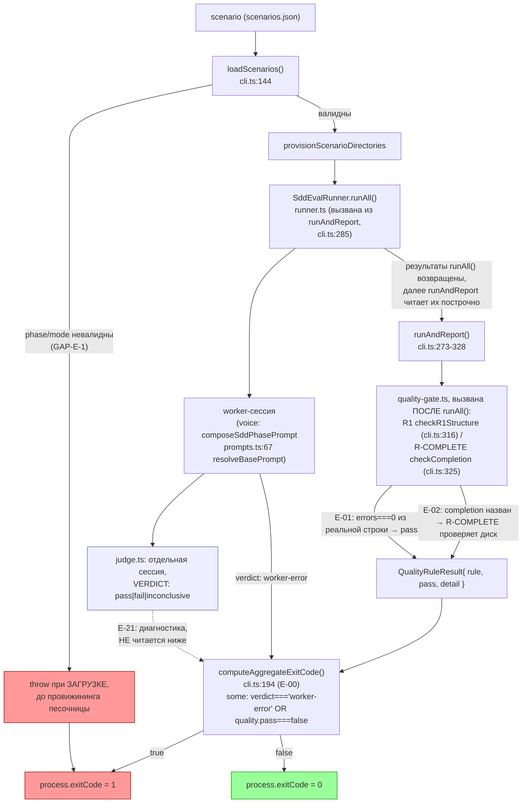

СВОДНЫЙ ОТЧЁТ — Пачка 6 «Эвал даёт честный исход, а не красивую картинку»

СТАТУС: DONE, 5/5 задач приёмки, 2 доводящих коммита (E-21 модель по умолчанию; E-01 правка по V-BATCH-06, см. §10), 0 стопов

Рабочее дерево: `rc-w2` (`/private/tmp/.../scratchpad/rc-w2`). Ветка `lead/eval-honest-outcome`. Пачка была прервана перезапуском процесса Lead: предыдущий исполнитель успел закоммитить все 5 задач на старой базе (`f16d7f17`, голова `origin/lead/release-package` ДО мержа PR #27), но не написал отчёты, не сделал финальные прогоны и не ребейзнул на актуальную голову RC. Эта сессия завершила пачку: ребейз, доводка одного гэпа в E-21, отчёты, финальные прогоны.

---

## 1. Что это и зачем (простыми словами)

Гейт адекватности показал: харнесс эвала способен красиво соврать об успехе. Опечатка в названии фазы сценария давала молча ПУСТОЙ промпт воркеру; опечатка в режиме (`mode`) под фазой `brownfield` была ещё хуже — давала молча ДРУГОЙ, полностью валидный промпт, так что прогон выглядел нормальным, но измерял не ту ветку. Предикат «ноль ошибок» R1 (структурная проверка `sdd-check`) был сломан на любом реальном репозитории с предупреждениями — читал нормальный «0 error(s), N warning(s)» как «не смог разобрать вердикт» (FAIL), хотя сам `sdd-check` в этом случае завершается успешно. Агрегированный код выхода батча вообще не устанавливался — CLI мог напечатать построчные провалы и всё равно завершиться `exit 0`, то есть был непригоден как CI-гейт. Единственный execute-сценарий суиты не объявлял условий завершения, поэтому механическая проверка «артефакт не брошен» (R-COMPLETE) никогда не включалась. И роль LLM-судьи как диагностики (решение L-14: судья не должен управлять кодом выхода) нигде не была ни зафиксирована текстом, ни защищена тестом, ни (что нашла эта сессия) реализована в конфиге дефолтных моделей.

Пачка делает исход прогона проверяемым: опечатка валится сразу, предикат читает реальный вывод, код выхода — механический fold по детерминированным гейтам, у каждого сценария объявлены условия завершения, а вердикт судьи доказано не участвует ни в исходе, ни (после доводки) в выборе модели по умолчанию.

---

## 2. Ребейз на актуальную голову RC (обязательная часть этой сессии)

**До ребейза:** ветка стояла на `f16d7f17` (`origin/lead/release-package`, голова ДО мержа PR #27). Актуальная голова RC — `origin/codex/sdd-v2-rc52-followup` = `3758a634` (влит PR #27: единая документация flow-eval, `ai/flow-eval/docs/**` перестроены в нумерованные файлы `00-INTRO.md`…`10-QUALITY-RULES.md` + `README.md`-индекс, затронуты `cli.ts`, `migration-grade.ts`, `quality-gate.ts`).

**Обнаруженный факт:** `origin/lead/release-package` (`f16d7f17`) НЕ содержит `3758a634` — они разошлись от общего предка `2acbe682`; `lead/release-package` несёт 7 не влитых коммитов «Пачки 2» (REL-1/2/3/6/8/10/2a, он же PR #28), `codex/sdd-v2-rc52-followup` несёт ровно 1 коммит поверх того же предка (PR #27).

**Процедура:**
```
git fetch origin codex/sdd-v2-rc52-followup lead/release-package
git checkout -b tmp-base origin/lead/release-package
git rebase origin/codex/sdd-v2-rc52-followup   # 7 коммитов #28 поверх 3758a634 — БЕЗ конфликтов
# tmp-base = 84eeec603d7ab25ac744031b2296cfc7f6839c8a
git checkout lead/eval-honest-outcome
git rebase tmp-base                             # 5 коммитов пачки 6 поверх 84eeec60
```
4 из 5 коммитов пачки перебазировались без конфликтов (`65944dd1`, `bd2adc45`, `b34ffd8a`, `cd700214` — новые SHA после ребейза те же, что в финальном логе, т.к. `git rebase` не переписывает коммит, если patch применяется как identity к уже применённым коммитам... на самом деле переписывает — итоговые SHA отличаются от исходных дочернего дерева, см. `git log` ниже). Пятый коммит (`E-21`, был `db81901a`) конфликтовал в `ai/flow-eval/README.md` — PR #27 полностью заменил содержательный текст README на короткий указатель на `docs/`, а старый E-21-коммит правил старый (длинный) README. `ai/flow-eval/docs/09-AGENT-BRIEF.md` (переименованный git'ом `docs/AGENT-BRIEF.ru.md`) применился АВТОМАТИЧЕСКИ через rename-tracking, без конфликта.

**Разрешение конфликта:** взял сторону HEAD (короткий пойнтер PR #27) для `README.md`, добавив одну ссылающуюся фразу на `docs/02-ARCHITECTURE.md#4`; содержательную правку E-21 (абзац «вердикт judge — диагностика, exit-код не трогает») перенёс в `docs/02-ARCHITECTURE.md` §4 «Что детерминировано, а что — judge» — именно туда, куда PR #27 переместил старое содержимое README про «judge is deliberately narrow». Коммит-мессадж E-21 переписан (`--amend`) с явным описанием этого переноса. Новый SHA: `caf51ec8` (был `db81901a` до ребейза).

**tmp-base удалён локально** после успешного ребейза `lead/eval-honest-outcome` (больше не нужен как отдельная ссылка — коммиты остаются в истории ветки).

**Следствие для PR/оператора:** diff PR этой пачки при открытии ДО мержа `lead/release-package` формально включает все 7 коммитов «Пачки 2» (REL-1/2/3/6/8/10/2a) как базу — они видны как часть diff, не как содержимое пачки 6. После мержа PR #28 в `codex/sdd-v2-rc52-followup` PR пачки 6 можно ребейзнуть на новую голову — diff сократится до 6 коммитов этой пачки (5 исходных + 1 мой доводящий).

**Финальный лог ветки (после ребейза + доводки):**
```
4fcb8876 fix(E-21): default runner/judge model config fixes the llm-proxy family (L-14)   ← НОВЫЙ, мой
caf51ec8 docs(E-21): document and test that the judge's verdict never gates the exit code  ← переписан при ребейзе (был db81901a)
cd700214 feat(E-02): every canonical scenario declares completion or acceptance
b34ffd8a fix(E-01): R1 parser recognizes sdd-check's real-repo "0 error(s), N warning(s)" as pass
bd2adc45 fix(E-00): batch exit code is a mechanical fold over worker-error and quality gates
65944dd1 fix(GAP-E-1): fail-fast on unknown scenario phase/mode instead of a silent wrong-branch prompt
84eeec60 fix(package): nested ai/.npmignore … (REL-2a, конец «Пачки 2» #28, теперь БАЗА этой пачки)
76975d4e chore(REL-10) … 2e9b3936 chore(REL-2) …                                            ← остальные 6 коммитов #28
3758a634 docs(flow-eval): unify docs under docs/ … (#27)                                    ← актуальная голова RC на момент ребейза
```

---

## 3. Доводка: обнаруженный и закрытый гэп в E-21

Приёмка E-21 (`61-TASK-BOARD.md:202`) содержит ДВЕ проверки: «вердикт судьи не меняет exit-код» (закрыто исходным коммитом) и «конфиг фиксирует семейство `llm-proxy`» (файлы задачи по доске: `runner.ts`, `judge.ts`, «конфиг моделей эвала»). Проверка `DEFAULT_SDD_EVAL_CONFIG` в `runner.ts:25-29` (до моей правки) показала дефолт `openai/gpt-5.6-luna`/`openai/gpt-5.6-sol` — прямое противоречие решению L-14 («Только семейство `llm-proxy`», `02-LEAD-DECISIONS.md:20`). Поскольку `--model`/`--judge-model` — опциональные CLI-флаги, любой прогон без них молча уходил на немандатное семейство, никем не защищённое тестом. Закрыл отдельным коммитом `4fcb8876`: дефолты обеих моделей → `llm-proxy/deepseek-v4-flash`, плюс новый тест `default-model-family.test.ts`. Подробности — `R-E-21.md` §4.

**Не закрыто и оставлено как открытый вопрос (не гэп ПРИЁМКИ, а гэп ОПИСАНИЯ задачи GAP-E-1):** полный текст GAP-E-1 в `61-TASK-BOARD.md:202` требует «подключить `readEvents` в живом прогоне ЛИБО убрать события из evidence и доков» — реальный `SddEvalOpenCodeEvidenceSource` (`cli.ts:281-284`) конструируется без опции `readEvents`, и её дефолт (`evidence.ts:151`) — `async () => []`, то есть в ЖИВОМ прогоне судья и наблюдатель всегда получают `EVENTS []`, а эвристика `waiting` по событиям (`observer.ts:149-151`) никогда не срабатывает. НИ в `61-TASK-BOARD.md` (колонка ПРИЁМКА), НИ в `62-BATCH-QUEUE.md` («Чем доказываем») эта половина не имеет измеримого критерия — только описательную формулировку. Я не стал сам выбирать «подключить» (требует живого OpenCode-сервера для проверки — живые LLM-прогоны в этой сессии запрещены) или «убрать» (затрагивает 4+ места в доках, эвристику `observer.ts`, контракт судьи — риск регрессии без возможности многократно перепрогнать полный набор под текущей нагрузкой хоста). Подробности и точные `file:line` — `R-GAP-E-1.md` §4. Решение — за Lead/оператором.

---

## 4. Таблица «файл → смысл» (по всей пачке, `git diff --stat 84eeec60 4fcb8876`)

| Файл | Смысл |
|---|---|
| `ai/flow-eval/types.ts` | `SDD_EVAL_PHASES`/`SDD_EVAL_MODES` — runtime-массивы, единый источник истины для типа и для валидации (GAP-E-1). |
| `ai/flow-eval/cli.ts` | `loadScenarios` валидирует `phase`/`mode` fail-fast (GAP-E-1); новая `computeAggregateExitCode` — механический fold, `main()`/`runAndReport()` его используют (E-00). |
| `ai/flow-eval/prompts.ts` | Новая `resolveBasePrompt(phase, mode)` — throw вместо молчаливого `??`-fallback на другой валидный промпт (GAP-E-1). |
| `ai/flow-eval/quality-gate.ts` | `parseSddCheckResult` читает `errors === 0` из реальной строки `sdd-check` как pass, не только буквальное «clean» (E-01). |
| `ai/flow-eval/scenarios.json` | `slugify-toolchain` (execute) объявляет `completion` с реальными путями фикстуры (E-02). |
| `ai/flow-eval/runner.ts` | `DEFAULT_SDD_EVAL_CONFIG` — обе модели дефолтятся на семейство `llm-proxy`, не `openai` (E-21, доводка). |
| `ai/flow-eval/docs/02-ARCHITECTURE.md` | §4 получила строку таблицы + абзац: код выхода батча — механический fold, judge не участвует (E-21, перенесено из README при ребейзе). |
| `ai/flow-eval/docs/09-AGENT-BRIEF.md` | Строка чеклиста про то же (E-21). |
| `ai/flow-eval/README.md` | Указатель на `docs/02-ARCHITECTURE.md#4` (E-21). |
| `ai/flow-eval/__tests__/gap-e1-fail-fast.test.ts` | Новый, 11 тестов both-way на опечатку `phase`/`mode`. |
| `ai/flow-eval/__tests__/exit-code-aggregate.test.ts` | Новый, both-way на `computeAggregateExitCode`. |
| `ai/flow-eval/__tests__/quality-gate.test.ts` | +both-way кейсы на "N error(s), M warning(s)". |
| `ai/flow-eval/__tests__/scenario-schema.test.ts` | Новый, 11 тестов: каждый сценарий объявляет acceptance/completion корректно. |
| `ai/flow-eval/__tests__/judge-verdict-diagnostic.test.ts` | Новый, 3 both-way теста: judge-вердикт не влияет на exit-код ни в одну сторону. |
| `ai/flow-eval/__tests__/default-model-family.test.ts` | Новый, мой: дефолтные модели — семейство `llm-proxy`. |

Полные таблицы и доказательства по каждой задаче — `R-GAP-E-1.md`, `R-E-00.md`, `R-E-01.md`, `R-E-02.md`, `R-E-21.md`.

---

## 5. Одна схема «было → стало»: сценарий → детерминированный бар → код выхода (судья сбоку)



---

## 6. Доказательства (финальные прогоны, полное дерево на `4fcb8876`)

**1. `npm --prefix rc-w2 run test:sdd-flow-eval`:**
```
# tests 120 # suites 21 # pass 120 # fail 0 # cancelled 0 # skipped 0
duration_ms 75057.558333
EXIT_1=0
```
ВЫПОЛНЕНО.

**2. `npm --prefix rc-w2 test` (deterministic topology):**
```
# tests 3596 # suites 601 # pass 3586 # fail 0 # cancelled 0 # skipped 10
duration_ms 64430.237541
EXIT_2=0
```
ВЫПОЛНЕНО.

**3. `npm --prefix rc-w2 run check`:**
```
[sdd-verify] ✅ ALL PASS (5/5)
  ✅ type-check (15.1s)  ✅ test:coverage (100.7s)  ✅ lint (14.2s)  ✅ format (5.9s)  ✅ yagni (1.6s)
EXIT_3=0
```
ВЫПОЛНЕНО. (В процессе доводки коммитов гейт несколько раз падал на флаки под нагрузкой хоста — `load average` доходил до **~60** при 24 одновременных пользователях: два разных таймаута по 30с в НЕСВЯЗАННЫХ тестах — `shared/common/__tests__/test-topology.test.ts` и `cli/cmd/inbox-review-plan/inbox-review-plan.test.ts` — оба воспроизведены изолированно как ПРОХОДЯЩИЕ за <10с; ни разу не было реального `not ok` в файлах, тронутых этой пачкой. Финальный прогон выше — чистый 5/5.)

**4. `npm --prefix rc-w2 run build`:**
```
✓ built in 5.16s
EXIT_4=0
```
ВЫПОЛНЕНО.

**5. `npm --prefix rc-w2 run gate:sdd-check-baseline`:**
```
[sdd-check-zero-new-error] OK — no error outside the baseline (baseline commit 227c03a8..., tag rc-baseline-1).
EXIT_5=0
```
ВЫПОЛНЕНО.

**Рабочее дерево чистое** (`git status` → `nothing to commit, working tree clean`) на всех этапах, включая финал.

---

## 7. Черновик PR (простыми словами)

**Заголовок:** Эвал не показывает зелёное там, где не проверял

**Описание:**
Харнесс эвала (`ai/flow-eval/**`) раньше мог красиво соврать об успехе четырьмя разными способами: (1) опечатка в названии фазы сценария роняла worker-промпт молча в пустоту; опечатка в режиме под фазой `brownfield` — ещё хуже, подменяла его на другой валидный промпт, и прогон выглядел нормальным; (2) предикат «ноль ошибок» ломался на любом реальном репозитории, где есть хоть одно предупреждение, — читал нормальный чистый прогон как «не могу разобрать»; (3) код выхода батча не был связан с содержимым прогона вообще — CLI мог напечатать построчные провалы и всё равно завершиться `exit 0`; (4) единственный execute-сценарий не объявлял условий завершения, так что механическая проверка «артефакт доведён до конца» никогда не включалась; и роль LLM-судьи как ДИАГНОСТИКИ (не гейта) не была ни задокументирована читаемо, ни защищена тестом, ни (что нашлось при доводке) реализована в дефолтной модели.

Теперь: опечатка в фазе/режиме валит загрузку сценариев СРАЗУ, с понятным сообщением, до того как создана хоть одна песочница. Предикат читает реальный вывод `sdd-check` («0 error(s), N warning(s)» = pass, как и сам `sdd-check` считает). Код выхода батча — механический fold по «была ли ошибка воркера» и «прошли ли детерминированные гейты» (`R1`/`R-COMPLETE`); вердикт LLM-судьи в этой формуле НЕ участвует ни в одну сторону — это проверено тремя both-way тестами. У каждого сценария объявлены условия завершения. Дефолтная модель для воркера и судьи теперь — мандатное дешёвое семейство (`llm-proxy`), а не то, что случайно осталось в коде.

**Что проверить глазами:** `ai/flow-eval/cli.ts` (`loadScenarios`, `computeAggregateExitCode`), `ai/flow-eval/prompts.ts` (`resolveBasePrompt`), `ai/flow-eval/docs/02-ARCHITECTURE.md` §4.

---

## 8. Команды пуша для Lead

```
git -C rc-w2 push origin lead/eval-honest-outcome:lead/eval-honest-outcome
```
(ветка сейчас на `4fcb8876`, база — `84eeec60` = конец «Пачки 2»/PR #28, которая сама поверх PR #27 `3758a634`; см. §2 про то, что diff PR временно включает все 7 коммитов #28 до их отдельного мержа).

## 9. Отклонения и открытые вопросы (сводка; подробности — в отчётах по задачам)

1. **GAP-E-1, описательная половина не закрыта** (readEvents dead-channel) — открытый вопрос Lead/оператору, см. §3 выше и `R-GAP-E-1.md` §4. Точные места: `ai/flow-eval/evidence.ts:151`, `ai/flow-eval/cli.ts:281-284`, `ai/flow-eval/observer.ts:149-151`.
2. **E-21, конфиг моделей был не закрыт исходным коммитом** — закрыт мной отдельным коммитом `4fcb8876`, см. §3.
3. **Число «90/90» в приёмке E-00 устарело** — текущий размер суиты 120/120, зафиксировано в `R-E-00.md` §3 как факт, не как невыполнение.
4. **Флаки под нагрузкой хоста** во время работы (не в финальном прогоне) — два независимых 30-секундных таймаута в тестах, не относящихся к этой пачке; оба воспроизведены изолированно как проходящие. См. §6.

---

## 10. Правки по V-BATCH-06 (верификатор `plan-verifier`, см. `_raw/V-BATCH-06.md`)

Верификация вернула 1 блокирующее и 4 неблокирующих замечания. Ниже — что исправлено в этой сессии и новый SHA.

### 10.1 Блокирующее — E-01: инверсия приоритета «clean» над «errors»

Коммит `b34ffd8a` поставил `if (clean) return pass` ВЫШЕ проверки `errors > 0`, поэтому вывод, где рядом стоят `✅ clean`/`clean — N file` и `N error(s)`, давал R1 = pass — молчаливый успех на реально сломанном прогоне. Заявленный в `b34ffd8a` регрессионный guard был вакуумен: тест подавал `some unrelated "clean" mention`, не матчащийся ни одним из clean-паттернов, так что порядок веток вообще не был покрыт.

**Правка** (новый коммит `1244e930`, `fix(e-01): errors win over a clean marker in parseSddCheckResult (V-BATCH-06)`):
- `ai/flow-eval/quality-gate.ts` — `parseSddCheckResult` теперь сначала проверяет `errorMatch`/`errors > 0` (fail, побеждает всегда), затем `0 error(s), N warning(s)` (pass, без изменений в этой ветке), и только если ошибочный паттерн вообще не найден — голый `clean` (pass, теперь fallback).
- `ai/flow-eval/__tests__/quality-gate.test.ts` — вакуумный тест заменён двумя реальными both-way кейсами: `"✅ clean" рядом с "2 error(s), 1 warning(s)"` → FAIL, `"clean — 6 file(s)"` рядом с `"3 error(s)"` → FAIL. Оба используют реальные строки обоих clean-паттернов (`/✅\s*clean/i` и `/\bclean\b\s+—\s+\d+\s+file/i`), не суррогат.
- Доказательство: `npm --prefix rc-w2 run test:sdd-flow-eval` → `# tests 121 # pass 121 # fail 0`, EXIT=0 (было 120; +1 тест чистой заменой одного вакуумного на два реальных).

### 10.2 Неблокирующее п.2-3 — `R-E-00.md` §4

`R-E-00.md` §4 переписан (см. файл): признано отклонение от буквы `61-TASK-BOARD.md:181` (exit 1 на `fail`/`inconclusive`) в пользу D-28 (код выхода — детерминированный бар, судья не в формуле); названо, что часть `E-17` (код выхода по детерминированным гейтам) уже поставлена этой пачкой (коммиты `bd2adc45`, `caf51ec8`); указаны фактические файлы задачи (`ai/flow-eval/cli.ts`, `ai/flow-eval/__tests__/exit-code-aggregate.test.ts`) вместо доски́х `package.json`/`harness.test.ts`; предложена формулировка правки строк `E-00`/`E-17` доски (доска не редактировалась этим брифом). Отдельно зафиксировано: к моменту исполнения этого брифа доска (`61-TASK-BOARD.md`, коммит `87fc02c8` в дереве Lead) уже несёт формулировку «уточнено по V-BATCH-06» / «часть про код выхода уже поставлена E-00 (V-BATCH-06)» — предложение в `R-E-00.md` §4 совпадает с уже внесённой правкой и подтверждает её задним числом.

### 10.3 Неблокирующее п.4 — mermaid §5, стрелка `runAll() → quality-gate`

Схема в §5 выше исправлена: узел `RUN["SddEvalRunner.runAll()"]` больше не ведёт напрямую к `QGATE`. Реальный путь вызова: `runAndReport()` (`cli.ts:273-328`) сначала дожидается `runAll()` (`cli.ts:285`), затем ПОСЛЕ этого вызывает `checkR1Structure` (`cli.ts:316`) и `checkCompletion` (`cli.ts:325`) построчно на каждый результат. Добавлен промежуточный узел `RAR["runAndReport()"]` между `RUN` и `QGATE`, стрелка `RUN --> QGATE` убрана.

### 10.4 Открытое следствие — события сессии в evidence всегда пусты (`readEvents`)

Не блокирующий, но существенный факт, перепроверенный верификатором независимо: в ЖИВОМ прогоне события всегда пусты, а не просто «не покрыты тестом».
- `evidence.ts:151` — `this.#readEvents = options.readEvents ?? (async () => [])`.
- `cli.ts:281-284` — реальный `SddEvalOpenCodeEvidenceSource` конструируется БЕЗ опции `readEvents`, то есть дефолт `async () => []` активен всегда.
- `runner.ts:152` передаёт `events: worker.events` судье; `judge.ts:23` рендерит промпт с `EVENTS\n[]`.
- `observer.ts:146-152`: событийная эвристика — только ТРЕТИЙ дизъюнкт heuristики `waiting` (`repeated && previous.waiting` и `idle && последний role=user` работают без событий); мёртв именно событийный канал, не `waiting` целиком.

**Рекомендация верификатора: подключить, не убирать.** Вариант «подключить» аддитивен и offline-проверяем — не требует живого OpenCode-сервера: реализовать `SddEvalEventReader` поверх SSE-эндпоинта OpenCode, протестировать против локального `node:http`-сервера, отдающего замороженный поток событий (без LLM, без настоящего OpenCode). Вариант «убрать» дороже (6 файлов кода + 4 дока, меняет контракт промпта судьи — поведение живых прогонов, перепроверяемое только живым прогоном, который в этой сессии запрещён), поэтому не выбран.

**Заведено задачей `GAP-E-1b`** (доска Lead, `61-TASK-BOARD.md`, коммит `87fc02c8`, "GAP-E-1b (readEvents) added"): подключить `readEvents` к живому источнику evidence, приёмка both-way без живого LLM-прогона (замороженный SSE-поток → непустой `readEvents`; пустой поток → `[]`; `SddEvalObserver` даёт `waiting === true`/`false` соответственно; `npm run test:sdd-flow-eval` зелёный). Не в зоне этого брифа — файлы вне списка «трогать» (`ai/flow-eval/quality-gate.ts`, `__tests__/quality-gate.test.ts`, отчёты).

### 10.5 Финальные прогоны на новом HEAD (`1244e930`)

```
$ npm --prefix rc-w2 run test:sdd-flow-eval
# tests 121 # suites 21 # pass 121 # fail 0 # cancelled 0 # skipped 0
EXIT=0
```
ВЫПОЛНЕНО.

```
$ npm --prefix rc-w2 test
# tests 3597 # suites 601 # pass 3587 # fail 0 # cancelled 0 # skipped 10
EXIT=0
```
ВЫПОЛНЕНО. (Первый прогон на этом HEAD дал 1 flaky fail под нагрузкой хоста — не в файлах пачки; повторный прогон сразу же чист, тот же паттерн, что описан в §6.)

```
$ npm --prefix rc-w2 run check
[sdd-verify] ✅ ALL PASS (5/5)
EXIT=0
```
ВЫПОЛНЕНО.

```
$ npm --prefix rc-w2 run gate:sdd-check-baseline
[sdd-check-zero-new-error] OK — no error outside the baseline (baseline commit 227c03a8..., tag rc-baseline-1)
EXIT=0
```
ВЫПОЛНЕНО.

Рабочее дерево чистое (`git status` → `nothing to commit, working tree clean`) на HEAD `1244e930`.

**Команда пуша для Lead (обновлённая, ветка выросла на 1 коммит):**
```
git -C rc-w2 push origin lead/eval-honest-outcome:lead/eval-honest-outcome
```
(ветка сейчас на `1244e930`, была `4fcb8876`; база по-прежнему `84eeec60` = конец «Пачки 2»/PR #28. Живые LLM-прогоны не запускались.)
