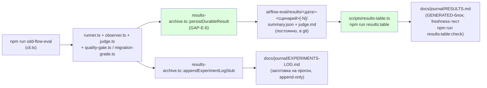

# Пачка 7 — «Эвал воспроизводим из чистого клона и описан одним документом»

Ветка `lead/eval-reproducible` (от `codex/sdd-v2-rc52-followup`). Задачи: `GAP-E-4`, `E-16`,
`GAP-E-1b` (двумя предыдущими проходами `rc-executor`, без отчётов — восстановлены в этой сессии
по коммитам, см. `R-GAP-E-4.md`/`R-E-16.md`/`R-GAP-E-1b.md`), `GAP-E-6`, `GAP-E-5`, `GAP-E-2`,
`E-11`, `E-15` (этой сессией). 9 коммитов, все прошли `npm run check` в pre-commit хуке.

## Черновик описания PR (простым языком)

Эвал (`ai/flow-eval`) — стенд, который прогоняет дешёвую модель через одну фазу SDD-флоу в
одноразовой копии репозитория и смотрит, справилась ли она как обычный разработчик. До этой пачки
у него было три отдельные проблемы: (1) три вспомогательных скрипта не работали вне машины автора
(зашитые пути); (2) документация — 24 файла с тремя разными наборами чисел и тремя разными
описаниями «что значит пройден тест», часть из них прямо противоречила коду; (3) результат каждого
прогона не сохранялся — только временный файл, который следующий прогон стирал.

Эта пачка чинит все три вещи и добавляет две небольшие, но полезные детали: игрушечную Go-фикстуру
(готовит почву для проверки не-Node стеков) и тест, который запирает («лочит») два места, где флоу
принимает решение о маршруте (старый v1-репозиторий → миграционная директива; репозиторий на Go →
своя ветка проверки), чтобы будущая правка не сломала это молча.

Итог: `npm run sdd-flow-eval` из чистого клона без единой переменной окружения доходит до загрузки
сценария; каждый прогон оставляет постоянную запись в `ai/flow-eval/results/`; вся документация —
2 файла (`EVAL-SPEC.md`+`RUNBOOK.md`) с автоматической проверкой «каждая упомянутая команда и путь
реальны»; секретных файлов во внешних фикстурах больше нет и это проверяется скриптом.

## Таблица «файл → смысл» (сводно по всей пачке; полные таблицы — в `R-<id>.md`)

| Файл | Смысл |
|---|---|
| `ai/flow-eval/scripts/migration-eval.sh`, `roundtrip-eval.sh`, `session-metrics.py` | Больше не зашиты на машину автора — GAP-E-4 |
| `ai/flow-eval/scenarios/migration-cloud-ios.scenario.json` | Репо-committed шаблон сценария миграции — GAP-E-4 |
| `ai/flow-eval/scripts/check-fixture-hygiene.sh` + тест | Диагностика «фикстура воспроизводима + нет секретных файлов» — E-16 |
| `ai/flow-eval/evidence.ts`, `cli.ts` | События OpenCode — реальный SSE-канал, не всегда `[]` — GAP-E-1b |
| `ai/flow-eval/results-archive.ts`, `scripts/results-table.ts`, `docs/journal/{RESULTS,EXPERIMENTS-LOG}.md`, `results/README.md` | Постоянный каталог результатов на диске + генерируемая таблица — GAP-E-6 |
| `ai/flow-eval/docs/EVAL-SPEC.md`, `docs/RUNBOOK.md`, `scripts/verify-eval-docs.ts` | Единая спека + процедуры + механическая проверка «команды/пути реальны» — GAP-E-5 |
| `ai/flow-eval/scripts/__tests__/gap-e2-budget-table.test.ts` | Таблица бюджетов сверена с реальным раннером — GAP-E-2 |
| `ai/flow-eval/provision.ts`, `types.ts`, `__tests__/golang-slugify-golden.test.ts` | Новая Go-фикстура, golden both-way — E-11 |
| `ai/flow-eval/__tests__/routing-lock-v1-go.test.ts` | Лок маршрутизации v1→миграция и go.mod→golang-стек — E-15 |
| `package.json`, `.gitignore` | Новые npm-скрипты эвала; уточнён комментарий про `.results/` (транзиент) vs `results/` (постоянно) |

## Таблица «док → судьба» (GAP-E-5, было 24 `.md`-файла под `ai/flow-eval/`)

| Документ | Судьба |
|---|---|
| `README.md` (корень) | Оставлен, переписан — линкует всё оставшееся |
| `docs/09-AGENT-BRIEF.md` | Удалён → заменён `docs/EVAL-SPEC.md` (часть B) |
| `docs/00-INTRO.md` | Удалён → содержание в `EVAL-SPEC.md` (часть A) + README («два контура») |
| `docs/01-WALKTHROUGH.md` | Удалён → жизненный цикл прогона в `EVAL-SPEC.md` |
| `docs/02-ARCHITECTURE.md` | Удалён → пайплайн/роли модулей/таблица «детерминировано vs judge» в `EVAL-SPEC.md` |
| `docs/03-SETUP.md` | Удалён → предпосылки/сервер/env в `RUNBOOK.md` |
| `docs/04-RUNNING.md` | Удалён → живой прогон/цепочные прогоны в `RUNBOOK.md` |
| `docs/05-METRICS.md` | Удалён → словарь правил в `EVAL-SPEC.md`, команды метрик в `RUNBOOK.md` |
| `docs/06-NEW-EVAL.md` | Удалён → «Добавить свой eval» (сжато) в `EVAL-SPEC.md` |
| `docs/07-EXPERIMENTS.md` | Удалён → «Поставить эксперимент» (сжато) в `EVAL-SPEC.md` |
| `docs/08-EXTERNAL-REPO.md` | Удалён → «Внешний репозиторий» в `RUNBOOK.md` |
| `docs/10-QUALITY-RULES.md` | Удалён → бэклог R2-R6 признан устаревшим (в коде нет), словарь R1/MIGRATION/R-COMPLETE в `EVAL-SPEC.md` |
| `docs/README.md`, `docs/journal/README.md` | Удалены → индекс в корневом README |
| `docs/journal/flow-verification-ledger.md` | Оставлен как есть + дополнен finding A7 |
| `docs/journal/EXPERIMENTS-LOG.md` | Оставлен, живой (GAP-E-6) |
| `docs/journal/RESULTS.md` | Оставлен, живой + генерируемый (GAP-E-6) |
| `docs/journal/ROADMAP.md`, `PROGRESS-REPORT.md` | Удалены — чистые устаревшие снимки, числа заменены генерируемой таблицей |
| `docs/journal/flow-verification-redesign.md` | Удалён — принятые решения уже дублированы в ledger (разделы C/E) |
| `docs/journal/roundtrip-wall3-assessment.md` | Удалён — единственная живая находка перенесена в ledger как finding A7 |
| `docs/journal/swiftlint-setup.md` | Удалён — живая host-процедура перенесена дословно в `RUNBOOK.md` |
| `docs/journal/infra-tasks-research.md`, `p9-signifiers.md`, `p9-verification.md` | Удалены — чистый ресёрч/калибровка одной прошлой сессии, выводы уже в коде/фикстурах |

## Mermaid: прогон → сырые данные → таблица/журнал



## Доказательства (сводно; полные команды/вывод — в `R-<id>.md` каждой задачи)

| Команда | Результат | Exit |
|---|---|---|
| `npm --prefix <tree> run test:sdd-flow-eval` | 177/177 тестов, 39 suites, `SELF-TEST: PASS` | 0 |
| `npm --prefix <tree> test` (главный test-topology, deterministic) | 3828/3841 pass; 3 файла НЕ ok — см. «Стопы» ниже, все вне зоны батча и не задеты этой пачкой | **1** |
| `npm --prefix <tree> run check` (type-check/test:coverage/lint/format/yagni) | ALL PASS 5/5 | 0 |
| `npm --prefix <tree> run gate:sdd-check-baseline` | «no error outside the baseline» | 0 |
| `node --import tsx ai/flow-eval/scripts/verify-eval-docs.ts` (скрипт-верификатор спеки) | `OK — 2 doc(s), 14 path(s) checked, 11 npm command(s) checked, 0 [UNVERIFIED] markers` | 0 |
| `npm --prefix <tree> run results:table:check` (регенерация RESULTS.md без диффа) | `up to date (no diff)` | 0 |

## Стопы / открытые вопросы

1. **`npm test` (главный, deterministic-режим) возвращает exit 1**, но НЕ из-за этой пачки:
   - `cli/cmd/inbox-review-plan/inbox-review-plan.test.ts` — **консистентно** 34/35 упавших при
     изолированном прогоне (не флейк: перепроверено дважды подряд, тот же результат). `git diff
     94caa7e0 HEAD -- cli/cmd/inbox-review-plan/` — пусто, файл не менялся ни этой, ни предыдущими
     сессиями пачки 7. Предсуществующая поломка вне зоны батча (`cli/**` — «не трогать»).
   - `cli/cmd/testcov/__tests__/testcov.cmd.test.ts`, `shared/common/sync/__tests__/deployed-surface.test.ts`
     — `testTimeoutFailure` (30с), тот же паттерн ресурсной перегрузки под полным параллельным
     прогоном, что и раньше в этой сессии (`cli/__tests__/tool-behavior/bootstrap-path.test.ts`,
     `cli/cmd/lint/__tests__/lint.cmd.test.ts` — оба зелёные при повторном изолированном прогоне).
     Тоже вне зоны батча, `git diff` — пусто.
   - Это НЕ красный гейт этой пачки: `npm run check` (реальный pre-commit/pre-push гейт для этого
     репозитория) — ALL PASS 5/5 на каждом из 9 коммитов. Флагаю как находку для Lead/оператора —
     возможно, отдельная задача на трек 33/31 (сюит `cli/cmd/inbox-review-plan`), не блокирует пуш
     этой пачки.
2. **Процедурная ошибка этой сессии (исправлена в самой пачке).** Первый коммит GAP-E-5 случайно
   захватил 11 файлов вне зоны (`cli/cmd/{sdd-check,sdd-task,sdd-verify}/**`,
   `shared/{common,sdd}/**`) через `git add -u` после того, как pre-commit хук прогнал репо-уровневый
   `npm run fix`. Найдено и исправлено двумя следующими коммитами той же сессии (`eadd54b3`,
   `a157b903`); финальный `git diff 94caa7e0 HEAD` вне `ai/flow-eval/**`/`package.json`/`.gitignore`
   — пуст. Урок для будущих сессий: после `npm run fix` в pre-commit хуке проверять `git status`
   ПЕРЕД повторным `git add`, никогда `git add -u`/`-A` вслепую.
3. **GAP-E-5's счёт «19 → 4» и трактовка «ledger»** — см. `R-GAP-E-5.md` §4, п.1: интерпретация
   («ledger» = семейство ledger+EXPERIMENTS-LOG+RESULTS, не один файл) продиктована зависимостью
   GAP-E-6 от живых `EXPERIMENTS-LOG.md`/`RESULTS.md`; открыт для решения Lead/оператора, если
   буквальный счёт важнее.
4. **E-15's выбор ветки маршрутизации** (STEP_2_ROUTE вместо прозаической копии в `<Contracts>`) —
   см. `R-E-15.md` §4; технически корректно (парсер реально разбирает только вторую), но если
   оператор хотел именно первую формулировку — открыт вопрос.
5. **E-11's golang-slugify сознательно не подключена к `scenarios.json`/`execute`** — блокер
   (`readiness.ts` хардкожен на node) зафиксирован явно, это работа `E-12`, не этой задачи.

## Команды пуша для Lead

```
git push origin lead/eval-reproducible
```
(после независимой верификации `plan-verifier` по всей пачке, как того требует протокол.)
