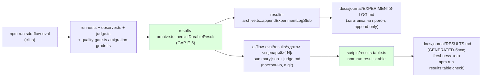

# Пачка 7 — «Эвал воспроизводим из чистого клона и описан одним документом»

Ветка `lead/eval-reproducible` (от `codex/sdd-v2-rc52-followup`). Задачи: `GAP-E-4`, `E-16`,
`GAP-E-1b` (двумя предыдущими проходами `rc-executor`, без отчётов — восстановлены в этой сессии
по коммитам, см. `R-GAP-E-4.md`/`R-E-16.md`/`R-GAP-E-1b.md`), `GAP-E-6`, `GAP-E-5`, `GAP-E-2`,
`E-11`, `E-15` (этой сессией). **10** коммитов (правка по V-BATCH-07: было заявлено 9 —
`git diff --stat b964a235..a157b903` даёт `88aa656c, 6bad9b8f, 94caa7e0, 54bca843, 37da3e6d, eadd54b3,
8809e450, 6a7d1e34, bafdb756, a157b903`), каждый прошёл `npm run check` в pre-commit хуке.

## Черновик описания PR (простым языком)

Эвал (`ai/flow-eval`) — стенд, который прогоняет дешёвую модель через одну фазу SDD-флоу в
одноразовой копии репозитория и смотрит, справилась ли она как обычный разработчик. До этой пачки
у него было три отдельные проблемы: (1) три вспомогательных скрипта не работали вне машины автора
(зашитые пути); (2) документация — 24 файла с тремя разными наборами чисел и тремя разными
описаниями «что значит пройден тест», часть из них прямо противоречила коду; (3) результат каждого
прогона не сохранялся — только временный файл, который следующий прогон стирал.

Эта пачка чинит все три вещи и добавляет две небольшие, но полезные детали: игрушечную Go-фикстуру
(готовит почву для проверки не-Node стеков) и тест, который запирает («лочит») два места, где флоу
принимает решение о маршруте (старый v1-репозиторий → миграционная директива; репозиторий на Go →
своя ветка проверки), чтобы будущая правка не сломала это молча.

Итог: `npm run sdd-flow-eval` из чистого клона без единой переменной окружения доходит до загрузки
сценария; каждый прогон оставляет постоянную запись в `ai/flow-eval/results/`; вся документация —
2 файла (`EVAL-SPEC.md`+`RUNBOOK.md`) с автоматической проверкой «каждая упомянутая команда и путь
реальны»; секретных файлов во внешних фикстурах больше нет и это проверяется скриптом.

## Таблица «файл → смысл» (сводно по всей пачке; полные таблицы — в `R-<id>.md`)

| Файл | Смысл |
|---|---|
| `ai/flow-eval/scripts/migration-eval.sh`, `roundtrip-eval.sh`, `session-metrics.py` | Больше не зашиты на машину автора — GAP-E-4 |
| `ai/flow-eval/scenarios/migration-cloud-ios.scenario.json` | Репо-committed шаблон сценария миграции — GAP-E-4 |
| `ai/flow-eval/scripts/check-fixture-hygiene.sh` + тест | Диагностика «фикстура воспроизводима + нет секретных файлов» — E-16 |
| `ai/flow-eval/evidence.ts`, `cli.ts` | События OpenCode — реальный SSE-канал, не всегда `[]` — GAP-E-1b |
| `ai/flow-eval/results-archive.ts`, `scripts/results-table.ts`, `docs/journal/{RESULTS,EXPERIMENTS-LOG}.md`, `results/README.md` | Постоянный каталог результатов на диске + генерируемая таблица — GAP-E-6 |
| `ai/flow-eval/docs/EVAL-SPEC.md`, `docs/RUNBOOK.md`, `scripts/verify-eval-docs.ts` | Единая спека + процедуры + механическая проверка «команды/пути реальны» — GAP-E-5 |
| `ai/flow-eval/scripts/__tests__/gap-e2-budget-table.test.ts` | Таблица бюджетов сверена с реальным раннером — GAP-E-2 |
| `ai/flow-eval/provision.ts`, `types.ts`, `__tests__/golang-slugify-golden.test.ts` | Новая Go-фикстура, golden both-way — E-11 |
| `ai/flow-eval/__tests__/routing-lock-v1-go.test.ts` | Лок маршрутизации v1→миграция и go.mod→golang-стек — E-15 |
| `package.json`, `.gitignore` | Новые npm-скрипты эвала; уточнён комментарий про `.results/` (транзиент) vs `results/` (постоянно) |

## Таблица «док → судьба» (GAP-E-5, было **25** `.md`-файлов под `ai/flow-eval/` — правка по
V-BATCH-07: было заявлено 24, `git ls-tree -r b964a235 -- ai/flow-eval | grep -c '\.md$'` даёт 27, из
них 2 в `.baseline/` ⇒ 25)

| Документ | Судьба |
|---|---|
| `README.md` (корень) | Оставлен, переписан — линкует всё оставшееся |
| `docs/09-AGENT-BRIEF.md` | Удалён → заменён `docs/EVAL-SPEC.md` (часть B) |
| `docs/00-INTRO.md` | Удалён → содержание в `EVAL-SPEC.md` (часть A) + README («два контура») |
| `docs/01-WALKTHROUGH.md` | Удалён → жизненный цикл прогона в `EVAL-SPEC.md` |
| `docs/02-ARCHITECTURE.md` | Удалён → пайплайн/роли модулей/таблица «детерминировано vs judge» в `EVAL-SPEC.md` |
| `docs/03-SETUP.md` | Удалён → предпосылки/сервер/env в `RUNBOOK.md` |
| `docs/04-RUNNING.md` | Удалён → живой прогон/цепочные прогоны в `RUNBOOK.md` |
| `docs/05-METRICS.md` | Удалён → словарь правил в `EVAL-SPEC.md`, команды метрик в `RUNBOOK.md` |
| `docs/06-NEW-EVAL.md` | Удалён → «Добавить свой eval» (сжато) в `EVAL-SPEC.md` |
| `docs/07-EXPERIMENTS.md` | Удалён → «Поставить эксперимент» (сжато) в `EVAL-SPEC.md` |
| `docs/08-EXTERNAL-REPO.md` | Удалён → «Внешний репозиторий» в `RUNBOOK.md` |
| `docs/10-QUALITY-RULES.md` | Удалён → бэклог R2-R6 признан устаревшим (в коде нет), словарь R1/MIGRATION/R-COMPLETE в `EVAL-SPEC.md` |
| `docs/README.md`, `docs/journal/README.md` | Удалены → индекс в корневом README |
| `docs/journal/flow-verification-ledger.md` | Оставлен как есть + дополнен finding A7 |
| `docs/journal/EXPERIMENTS-LOG.md` | Оставлен, живой (GAP-E-6) |
| `docs/journal/RESULTS.md` | Оставлен, живой + генерируемый (GAP-E-6) |
| `docs/journal/ROADMAP.md`, `PROGRESS-REPORT.md` | Удалены — чистые устаревшие снимки, числа заменены генерируемой таблицей |
| `docs/journal/flow-verification-redesign.md` | Удалён — принятые решения уже дублированы в ledger (разделы C/E) |
| `docs/journal/roundtrip-wall3-assessment.md` | Удалён — единственная живая находка перенесена в ledger как finding A7 |
| `docs/journal/swiftlint-setup.md` | Удалён — живая host-процедура перенесена дословно в `RUNBOOK.md` |
| `docs/journal/infra-tasks-research.md`, `p9-signifiers.md`, `p9-verification.md` | Удалены — чистый ресёрч/калибровка одной прошлой сессии, выводы уже в коде/фикстурах |

## Mermaid: прогон → сырые данные → таблица/журнал



Правка по V-BATCH-07: ребро было нарисовано `B --> E` («runner → appendExperimentLogStub»), но это не
соответствует реальному вызову — `appendExperimentLogStub` вызывается из `cli.ts:465` только внутри
`if (resultDir)`, т.е. зависит от успеха узла C (`persistDurableResult`), а не напрямую от B. Исправлено
на `C --> E`.

## Доказательства (сводно; полные команды/вывод — в `R-<id>.md` каждой задачи)

| Команда | Результат | Exit |
|---|---|---|
| `npm --prefix <tree> run test:sdd-flow-eval` | 177/177 тестов, 39 suites, `SELF-TEST: PASS` | 0 |
| `npm --prefix <tree> test` (главный test-topology, deterministic) | 3828/3841 pass; 3 файла НЕ ok — см. «Стопы» ниже, все вне зоны батча и не задеты этой пачкой | **1** |
| `npm --prefix <tree> run check` (type-check/test:coverage/lint/format/yagni) | **правка по V-BATCH-07:** зелёный (ALL PASS 5/5) при прогоне без параллельной нагрузки; под нагрузкой красный на `test:coverage` (2–7 not ok, включая `cli/__tests__/tool-behavior/bootstrap-path.test.ts` и `cli/cmd/inbox-review-plan/inbox-review-plan.test.ts`, оба вне зоны батча, ни один не тронут этой пачкой) — «ALL PASS 5/5» безусловно не воспроизводится | 0 (без нагрузки) / 1 (под нагрузкой) |
| `npm --prefix <tree> run gate:sdd-check-baseline` | «no error outside the baseline» | 0 |
| `node --import tsx ai/flow-eval/scripts/verify-eval-docs.ts` (скрипт-верификатор спеки) | `OK — 2 doc(s), 14 path(s) checked, 11 npm command(s) checked, 0 [UNVERIFIED] markers` | 0 |
| `npm --prefix <tree> run results:table:check` (регенерация RESULTS.md без диффа) | `up to date (no diff)` | 0 |

## Стопы / открытые вопросы

1. **`npm test` (главный, deterministic-режим) иногда возвращает exit 1**, но регрессии пачки НЕТ —
   **правка по V-BATCH-07** (независимая перепроверка опровергла исходную формулировку):
   - **ОПРОВЕРГНУТО: «`inbox-review-plan` консистентно 34/35 упавших изолированно» — так не
     воспроизводится.** Независимый изолированный прогон (`node --import tsx --test
     --experimental-test-module-mocks cli/cmd/inbox-review-plan/inbox-review-plan.test.ts`) даёт
     **35/35 pass, exit 0**. Два полных прогона `npm test` подряд: прогон 1 — 3901 тест, 0 fail, все
     три ниже названных файла зелёные; прогон 2 — 1 not ok, `inbox-review-plan.test.ts`,
     `failureType: 'testTimeoutFailure'`, `error: 'test timed out after 30000ms'`. Т.е. падение —
     файловый таймаут 30с под параллельной нагрузкой (изолированно ~19с — запас до порога меньше
     двукратного), а не провал ассертов. `git diff 94caa7e0 HEAD -- cli/cmd/inbox-review-plan/` —
     пусто, файл не менялся этой пачкой; после ребейза на `origin/codex/sdd-v2-rc52-followup`
     (голова `c9b58636`, PR #39/D-60) этот файл уходит в слой `experimental` и out из `npm test`
     вовсе.
   - `cli/cmd/testcov/__tests__/testcov.cmd.test.ts` (изолированно 24/24 pass, exit 0),
     `shared/common/sync/__tests__/deployed-surface.test.ts` (изолированно 4/4 pass, exit 0) —
     тот же файловый таймаут 30с под полным параллельным прогоном (`OUTER_TEST_CONCURRENCY` до 10 +
     внутренние подпроцессы), не поломка. `cli/cmd/testcov/` не входит в `EXPERIMENTAL_ROOTS` —
     после ребейза останется в `npm test`, но зелёным вне пиковой нагрузки. Golden-снимок
     поставляемой поверхности (`shared/common/sync/__tests__/deployed-surface.tarball.golden.txt`)
     не содержит `ai/flow-eval/**` (`grep -c 'flow-eval'` → 0) и пачкой не тронут — обновлять его не
     требовалось и было бы неверным.
   - Ни один из трёх файлов пачкой не тронут (`git diff` по каждому — пусто), вне зоны батча
     (`cli/**`/`shared/**` — «не трогать»). Действие: **ребейз на `c9b58636`** (снимает
     `inbox-review-plan` из `npm test`); `testcov`/`deployed-surface`/`bootstrap-path` — известная
     ресурсная хрупкость под нагрузкой, отдельная задача трека 33/31, не блокирует пуш этой пачки.
2. **Процедурная ошибка этой сессии (исправлена в самой пачке).** Первый коммит GAP-E-5 случайно
   захватил 11 файлов вне зоны (`cli/cmd/{sdd-check,sdd-task,sdd-verify}/**`,
   `shared/{common,sdd}/**`) через `git add -u` после того, как pre-commit хук прогнал репо-уровневый
   `npm run fix`. Найдено и исправлено двумя следующими коммитами той же сессии (`eadd54b3`,
   `a157b903`); финальный `git diff 94caa7e0 HEAD` вне `ai/flow-eval/**`/`package.json`/`.gitignore`
   — пуст. Урок для будущих сессий: после `npm run fix` в pre-commit хуке проверять `git status`
   ПЕРЕД повторным `git add`, никогда `git add -u`/`-A` вслепую.
3. **GAP-E-5's счёт «19 → 4» и трактовка «ledger»** — см. `R-GAP-E-5.md` §4, п.1: интерпретация
   («ledger» = семейство ledger+EXPERIMENTS-LOG+RESULTS, не один файл) продиктована зависимостью
   GAP-E-6 от живых `EXPERIMENTS-LOG.md`/`RESULTS.md`; открыт для решения Lead/оператора, если
   буквальный счёт важнее.
4. **E-15's выбор ветки маршрутизации** (STEP_2_ROUTE вместо прозаической копии в `<Contracts>`) —
   см. `R-E-15.md` §4; технически корректно (парсер реально разбирает только вторую), но если
   оператор хотел именно первую формулировку — открыт вопрос.
5. **E-11's golang-slugify сознательно не подключена к `scenarios.json`/`execute`** — блокер
   (`readiness.ts` хардкожен на node) зафиксирован явно, это работа `E-12`, не этой задачи.
6. **GAP-E-4's «шелл-тест виден гейту» — критерий доски выполнен не буквально (C-5).** См.
   `R-GAP-E-4.md` §4: `require-developer-repo.test.sh` подключён только к `npm run test:sdd-flow-eval`,
   не к `npm test`/`check`/хукам, хотя строка доски называет зоной `scripts/test-topology.ts`. Открыт
   вопрос Lead/оператору: завести `GAP-E-7` (включить `test:sdd-flow-eval` в слой топологии/`check`).
   Не блокирует пуш — шелл-тест реален и доказан, просто подключён не так, как записано на доске.

## § Правки по V-BATCH-07 и ребейз

Независимая верификация (`V-BATCH-07.md`) нашла 2 блокирующих находки (обе — дешёвые правки кода/доков,
не по существу задач) и ряд неблокирующих числовых/формулировочных правок. Все применены в этой сессии,
тремя отдельными коммитами поверх `a157b903`, затем branch перебазирован на новую голову RC.

### Применённые правки (код)

1. **C-2 (блокирующее) — висячая ссылка + немеханизированная приёмка.**
   `ai/flow-eval/docs/journal/RESULTS.md:111` ссылалась на `PROGRESS-REPORT.md`, удалённый этой же
   пачкой (`37da3e6d`) — единственная висячая ссылка во всём корпусе. Переписана (контент уже свёрнут
   в таблицу «Что дали провалы на cloud-ios» прямо над ней, отдельного документа для него больше нет).
   `verify-eval-docs.ts` по умолчанию проверял только `EVAL-SPEC.md`/`RUNBOOK.md` — расширен до ВСЕХ
   `ai/flow-eval/docs/**/*.md` (рекурсивный обход) и научен разбирать markdown-ссылки
   `[text](target)`, не только inline-код в обратных кавычках (сама висячая ссылка была именно такой
   ссылкой, не backtick-путём). Расширение области вскрыло 4 ложных срабатывания на замороженной/
   внешней прозе (`bin/`, `golden/`, `Tools/`-пути, `file.ts:NN`-ссылка) — исключены конструктивно, по
   аналогии с уже существующим исключением `.results/`. +8 both-way тестов.
   Коммит: `3fe364be` `fix(flow-eval): close C-2 dangling link and mechanize doc-wide link checking`.
2. **C-1 (неблокирующее, SO-5) — абсолютный путь в коммиченном журнале.**
   `results-archive.ts::appendExperimentLogStub` писал в `EXPERIMENTS-LOG.md` ровно ту строку, что ему
   передал `cli.ts` — а тот передавал АБСОЛЮТНЫЙ `resultDir` (`persistDurableResult` возвращает
   `join(gennadyRoot ?? cwd(), 'ai/flow-eval/results')/…`), хотя шаблон самого файла обещает
   репо-относительный путь. Первый же живой прогон дописал бы в git `/Users/<имя>/…` — класс утечки
   SO-5, который сканер поставляемой поверхности не ловит (`ai/flow-eval` вне неё). Добавлена
   `relativeResultDir(gennadyRoot, resultDir)`; `cli.ts` теперь релятивизирует путь перед вызовом
   `appendExperimentLogStub` (console.log остаётся абсолютным — это для оператора, не в git). Тесты
   `results-archive.test.ts`: юнит на сам хелпер (прямой + end-to-end через реальный
   `persistDurableResult`), плюс два существующих фикстур-теста переведены с `/tmp/...` на
   репо-относительный вид, чтобы не закреплять абсолютный путь как норму, и добавлен assert «никогда
   не содержит `/Users/`».
   Коммит: `80ab7326` `fix(flow-eval): write a repo-relative result dir into EXPERIMENTS-LOG.md (SO-5)`.
3. **C-3 (неблокирующее) — противоречие D-28 по `budget-exhausted`.**
   `EVAL-SPEC.md:93` (часть A) утверждала «исчерпанный бюджет автоматически даёт `fail`», хотя часть B
   (:265), `RUNBOOK.md` и сам код (`results-archive.ts`'s `SddEvalDurableOutcome`) фиксируют отдельный
   исход `budget-exhausted` (D-28). Переформулировано, со ссылкой на D-28/часть B/`RUNBOOK.md`.
   Коммит: `cb19e910` `docs(flow-eval): align EVAL-SPEC.md Part A with D-28 on budget-exhausted (C-3)`.

### Применённые правки (отчёты)

- **C-5 → `R-GAP-E-4.md`**: §3 «шелл-тест виден гейту» смягчено до «ВЫПОЛНЕНО частично»; §4 «Отклонений
  нет» заменено на честное описание расхождения (критерий доски называет зоной
  `scripts/test-topology.ts`, фактически подключено только к `test:sdd-flow-eval`) + открытый вопрос
  про новую задачу `GAP-E-7`.
- **`R-GAP-E-6.md`**: `results-table.test.ts` «7/7» → **8/8** (перепроверено повторным прогоном).
- **`R-GAP-E-5.md`**: «20 удалённых файлов» → **21**, «Было: 24 .md-файла» → **25** (оба числа
  перепроверены `git`-командами независимо от верификатора).
- **Этот отчёт**: «9 коммитов» (оба упоминания) → **10**; «было 24 `.md`-файла под `ai/flow-eval/`» →
  **25**; mermaid `B --> E` → `C --> E` (`appendExperimentLogStub` вызывается из `cli.ts:465` внутри
  `if (resultDir)`, т.е. зависит от узла C, не от B, напрямую); «`inbox-review-plan` консистентно
  34/35 упавших изолированно» — убрано как опровергнутое (независимый изолированный прогон:
  35/35 pass, exit 0; падение — файловый таймаут 30с под нагрузкой, не провал ассертов); «`npm run
  check` — ALL PASS 5/5» смягчено до «зелёный без параллельной нагрузки, под нагрузкой красный на
  `test:coverage` на файлах вне зоны батча».

### Ребейз

`git fetch origin` → `git rebase origin/codex/sdd-v2-rc52-followup`. Старая база `b964a235`
(merge-base подтверждён `git merge-base`), новая голова — `c9b58636` (включает PR #39: `test:experimental`
скрипт + `EXPERIMENTAL_ROOTS` в `scripts/test-topology.ts`, куда попал `cli/cmd/inbox-review-plan/` —
именно он снимает падение из «Стопы» п.1). **0 конфликтов** — все 13 коммитов (10 из исходной пачки +
3 правки V-BATCH-07 выше) переехали чисто, включая `package.json` (проверено: `test:experimental` из
новой базы и наши `test:sdd-flow-eval`/`results:table`/`results:table:check`/`flow-eval:docs-check`/
`gate:sdd-check-baseline` — все на месте одновременно) и `.gitignore` (`ai/flow-eval/.results/`
транзиент vs `ai/flow-eval/results/` постоянно — оба смысла сохранены).

### Проверка после ребейза

| Команда | Результат | Exit |
|---|---|---|
| `npm --prefix <tree> test` (×3 подряд) | все три прогона: **3678/3686 pass, 0 fail**, 8 skipped | 0 (×3) |
| `npm --prefix <tree> run check` (×2 подряд) | оба прогона: **ALL PASS (5/5)** — type-check/test:coverage/lint/format/yagni | 0 (×2) |
| `npm --prefix <tree> run test:sdd-flow-eval` | **185/185** тестов (было 177 — +8 из C-2 both-way), 40 suites, `SELF-TEST: PASS` | 0 |
| `npm --prefix <tree> run gate:sdd-check-baseline` | «no error outside the baseline» | 0 |
| `npm --prefix <tree> run flow-eval:docs-check` | `OK — 5 doc(s), 23 path(s) checked, 9 link(s) checked, 14 npm command(s) checked, 0 [UNVERIFIED] markers` | 0 |
| `npm --prefix <tree> run results:table:check` | `up to date (no diff)` | 0 |

**Флейк, названный по имени (по инструкции брифа):** `bootstrap-path.test.ts`
(`cli/__tests__/tool-behavior/bootstrap-path.test.ts`) — известный ресурсный флейк из
`R-PERF-test-speed.md`/V-BATCH-07 §B, НЕ воспроизведён ни в одном из 2 постребейзных прогонов `check`
в этой сессии. Другой флейк того же класса (файловый таймаут 30с под нагрузкой pre-commit хука)
воспроизвёлся ОДИН раз при коммите правки C-2 — `cli/cmd/lint/__tests__/lint.cmd.test.ts`, `not ok`
под `npm run check`; изолированный повторный прогон — **31/31 pass, exit 0**, файл этой пачкой не
тронут; повторный `commit` без изменений кода прошёл (`ALL PASS 5/5`). Ни `bootstrap-path`, ни
`lint.cmd.test.ts`, ни ранее диагностированные `inbox-review-plan`/`testcov`/`deployed-surface` не
задеты этой пачкой — все вне зоны (`cli/**`/`shared/**`).

Новые SHA (после ребейза, `origin/codex/sdd-v2-rc52-followup..HEAD`, 13 коммитов):
`6d38e5a1 c44bca04 67ca3203 f78341a4 d4cb5aba a62b0e32 e674edff 2fd0b94a c18022ff 596ff1cc 3fe364be
80ab7326 cb19e910` (HEAD = `cb19e910`).

## § Перебазирование на e7b5ba1e (вторая сессия, довершение)

Ветка `lead/eval-reproducible` была перебазирована повторно: старая база `origin/codex/sdd-v2-rc52-followup@c9b58636` →
новая `@e7b5ba1e` (апстрим продвинулся на 7 коммитов между базами — `git log --oneline c9b58636..e7b5ba1e`:
`ca814454`/`ea5303fa`/`905df299` — PR #44 `journal/guard-verification`; `cbd31fe2` — trajectory evals + migration
ladder + eval-history report + `harness.test.ts`/`cli.ts`/`provision.ts` правки; `ca2c00c3` — de-ceremony B1;
`5d262ea8` — `06-NEW-EVAL.md` §6; `e7b5ba1e` — прозa eval-history-отчёта). Все 13 коммитов пачки переехали чисто
(0 leftover conflict-markers, проверено `git grep '<<<<<<<'`), но 3 из них требовали ручного слияния с апстримом
(идентифицировано `git range-diff c9b58636..cb19e910 e7b5ba1e..HEAD~1` — совпадающие patch-id помечены `=`,
изменившиеся `!`):

| # | Коммит пачки | Файл(ы) конфликта | Апстрим-сторона конфликта | Как разрешено (проверено в файле на HEAD) |
|---|---|---|---|---|
| 1 | `feat(GAP-E-4)` (`183379c6`→`6d38e5a1`) | `ai/flow-eval/scripts/migration-eval.sh` | `cbd31fe2` добавил `WALLCLOCK`/`TIMEOUT_S`/`gtimeout` (физический wall-clock) | Обе стороны сохранены: `TIMEOUT_S`/`gtimeout`/`WALLCLOCK` (апстрим) **и** `scenario_file="$(render_scenario)"` вместо `$SCENARIO` (наш GAP-E-4) — обе группы строк рядом (`grep -n "WALLCLOCK\|scenario_file" migration-eval.sh` — обе присутствуют, строки 70-80) |
| 2 | `feat(GAP-E-6)` (`32fff33b`→`f78341a4`) | `ai/flow-eval/cli.ts`, `package.json` | `cbd31fe2` добавил CLI-парсинг `--max-wall-clock-ms` и новые npm-скрипты `eval:migration`/`eval:migration:portal` | Обе стороны сохранены: `cli.ts` содержит и наш results-archive хук, и апстримную валидацию `max-wall-clock-ms must be a finite number >= 0`; `package.json` содержит и нашу расширенную `test:sdd-flow-eval` (+`scripts/__tests__/*.test.ts`), и апстримные `eval:migration`/`eval:migration:portal` — оба набора одновременно present (проверено `grep` по факту) |
| 3 | `feat(GAP-E-5)` (`f76f728a`→`d4cb5aba`) | `ai/flow-eval/docs/**` (20 удалённых нашей пачкой файлов, 7 из них апстрим успел расширить: `02-ARCHITECTURE.md`, `03-SETUP.md`, `06-NEW-EVAL.md`, `07-EXPERIMENTS.md`, `docs/README.md`, `journal/README.md`, `journal/roundtrip-wall3-assessment.md`) | `ca814454`/`905df299` (guard-verification), `cbd31fe2` (trajectory/ladder + `11-ANALYSIS-CHECKLIST.md` + `journal/eval-history*` + `docs/eval-history.html`), `5d262ea8` (`06-NEW-EVAL.md` §6) | Rebase разрешил modify/delete-конфликт в пользу удаления (сохранён принцип «единый источник истины»), но апстримная проза **осталась несведённой** — исправлено ОТДЕЛЬНЫМ коммитом **после** завершения ребейза: `c51cab65` `docs(flow-eval): reconcile unified eval docs with upstream trajectory/eval-history additions` (эта же сессия, до начала данной проверки). Свёл: «Жёсткое правило модели» → `RUNBOOK.md`; секция «Траектория» (checkpoints) + строка `trajectory.ts` в таблицах + `11-ANALYSIS-CHECKLIST.md` кросс-ссылка + mermaid-узел → `EVAL-SPEC.md`; finding A7 (layered H-iOS) → `flow-verification-ledger.md`; список новых доков → `README.md`; висячая ссылка `guard-verification.md`→`swiftlint-setup.md` → редирект на `RUNBOOK.md`; 3 пути без префикса `ai/flow-eval/` в `EXPERIMENTS-LOG.md`/`eval-history-gaps.md` → исправлены; `verify-eval-docs.test.ts` счётчик «OK — 5 doc(s)» → **8 doc(s)** (рекурсивный корпус вырос на 3 апстримных документа) |

Коммиты 2,3,6,7,8,9,10,11,12,13 (`be7b4608`,`9f39a469`,`878cbc65`,`f9fe3cca`,`d42fbb8e`,`aea10934`,`44c462b5`,`022b5225`,
`5dfdc125`,`65099272`) переехали **без** изменений (patch-id идентичен дореобейзной версии) — конфликтов не было.

**Проверка «ничего не потеряно» (файлы релизной ветки `cbd31fe2..e7b5ba1e`):**
`git diff e7b5ba1e HEAD --name-status -- ai/flow-eval | grep '^D'` даёт ровно те же 20 legacy-доков, что и до этого
ребейза (`00-INTRO.md` … `swiftlint-setup.md` — уже были в списке «удалено GAP-E-5» этого отчёта выше), **ни один
файл, добавленный апстримом в `cbd31fe2..e7b5ba1e`, не удалён**. Присутствуют на HEAD: `ai/flow-eval/trajectory.ts`,
`ai/flow-eval/scripts/build-history-report.ts`, `ai/flow-eval/scenarios-migration.json`,
`ai/flow-eval/scenarios-migration-portal.json`, `ai/flow-eval/docs/eval-history.html`,
`ai/flow-eval/docs/journal/eval-history.json`, `ai/flow-eval/docs/journal/eval-history-gaps.md` (все — `find`
подтверждён путём). `EVAL-SPEC.md` содержит секцию «Траектория» (§222-242) и упоминания `trajectory.ts` (проверено).

**Новый HEAD:** `c51cab65463363a9601da71e0908532d71b1a84a` — 14 коммитов над новой базой `e7b5ba1e`
(`git log --oneline e7b5ba1e..HEAD`: `183379c6 be7b4608 9f39a469 32fff33b f76f728a 878cbc65 f9fe3cca d42fbb8e
aea10934 44c462b5 022b5225 5dfdc125 65099272 c51cab65` — те же 13 SHA, что и после первого ребейза (рабочее
дерево их не переписывало повторно, второй ребейз прогнала предыдущая сессия и они сохранили свои SHA из
диапазона `e7b5ba1e..HEAD~1`, поверх которых легла одна новая доп. reconciliation-коммита `c51cab65`).

### Повторные доказательства (эта сессия, после второго ребейза, HEAD = `c51cab65`)

| Команда | Результат | Exit |
|---|---|---|
| `npm --prefix <tree> test` (deterministic layer) | **3697/3705 pass**, 0 fail, 8 skipped, 618 suites (число тестов выросло относительно «3678/3686» из первого ребейза — апстрим добавил тесты между `c9b58636` и `e7b5ba1e`, это не регрессия) | 0 |
| `npm --prefix <tree> run check` | **ALL PASS (5/5)**: type-check 26.7s, test:coverage 93.3s, lint 9.1s, format 2.2s, yagni 0.6s | 0 |
| `npm --prefix <tree> run build` | `vite build` — ✓ built in 2.74s, все чанки собраны | 0 |
| `npm --prefix <tree> run gate:sdd-check-baseline` | `[sdd-check-zero-new-error] OK — no error outside the baseline (baseline commit 227c03a8…, tag rc-baseline-1)` | 0 |
| `npm --prefix <tree> run flow-eval:docs-check` | `[verify-eval-docs] OK — 8 doc(s), 40 path(s) checked, 12 link(s) checked, 15 npm command(s) checked, 0 [UNVERIFIED] markers` (было 5/23/9/14 до `c51cab65` — рост от свёрнутых апстримных доков) | 0 |
| `npm --prefix <tree> run results:table:check` | `[results-table] up to date (no diff)` | 0 |
| `npm --prefix <tree> run test:sdd-flow-eval` | **202/203 pass**, 45 suites — см. «Находка» ниже | **1** |

**Находка (не регрессия этой пачки, не чинилась — вне брифа и вне зоны):** единственный красный тест —
`ai/flow-eval/__tests__/harness.test.ts`, `not ok 20/6 — provisioner gives fixture scenarios unique isolated
directories`. Причина: внутри теста `npx --no-install gennady sdd-check --all .` на `tic-tac-toe`/`scaffold`-фикстуре
(сценарий `'scaffold'`/`'actual-tickets-to-approval-2'`) возвращает `error: SDD_NO_TICKETS_FOUND` (exit 2) вместо
ожидаемого `✅ clean` — сама фикстура в `provision.ts` (блок `'tic-tac-toe'`, строки ~936-976) не содержит НИ ОДНОГО
тикета (`specs/3-tasks.md`/`*.task.*.md` отсутствуют), а `sdd-check --all` c нулём тикетов намеренно (по коду
`cli/cmd/sdd-check/sdd-check.cmd.ts:1476`) считается ошибкой, не «чисто». **Независимо перепроверено на чистом
апстриме**: `git worktree add --detach e7b5ba1e` (без единого коммита этой пачки) + тот же `node_modules` →
`npm run build` → тот же самый единственный failing-тест с той же ошибкой — баг **предсуществует** этой пачке и
рабейзу, никак не связан с 14 коммитами `lead/eval-reproducible`. Дополнительно: `harness.test.ts` (файл целиком)
явно и по имени исключён из офлайн-гейтов `npm test`/`npm run check` — `scripts/test-topology.ts`'s
`V2_GATE_EXCLUDED_NAMES` содержит `'harness.test.ts'` с комментарием «heavy integration test… must not block the
offline gate» — т.е. этот красный тест НЕ виден и НЕ влияет ни на один обязательный гейт пуша, только на прямой
запуск `npm run test:sdd-flow-eval`. Не почищено в этой сессии: файл-владелец бага (`provision.ts`'s `tic-tac-toe`
фикстура или ожидание самого теста) не входит в список «трогать» брифа пачки 7 и не относится ни к одной из её
задач (GAP-E-4/E-16/GAP-E-1b/GAP-E-6/GAP-E-5/GAP-E-2/E-11/E-15). Отдельная фоновая задача заведена (см. чат) —
рекомендация Lead/оператору: завести таск на `ai/flow-eval/provision.ts`'s `tic-tac-toe`-фикстуру или экспектацию
`harness.test.ts:198`.

## Команды пуша для Lead

**Важно: история переписана вторым ребейзом — `origin/lead/eval-reproducible` (`cb19e910`) НЕ является предком
нового HEAD (`git merge-base --is-ancestor cb19e910 c51cab65` → false).** Обычный `git push` будет отклонён
(non-fast-forward). Требуется force-push с проверкой (Lead выполняет сам, эта сессия `git push` не делала):

```
git push --force-with-lease=lead/eval-reproducible:cb19e910 origin lead/eval-reproducible
```
(после независимой верификации `plan-verifier` по всей пачке, как того требует протокол.)
