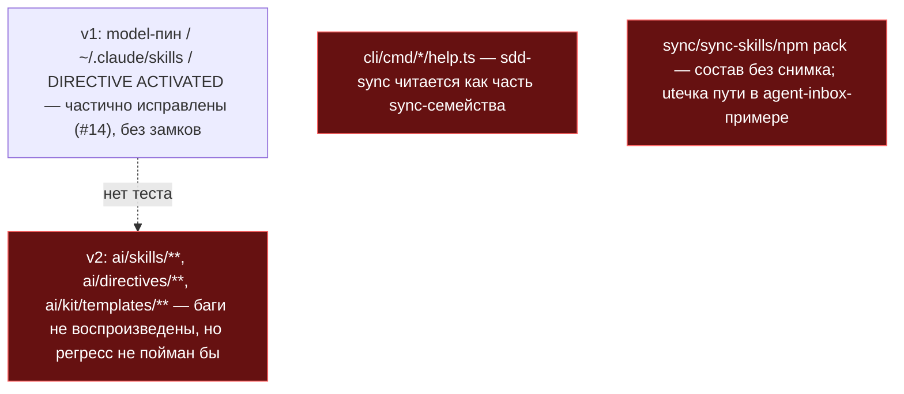
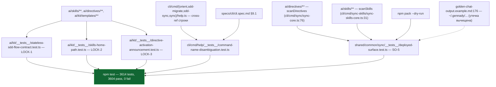

СВОДНЫЙ ОТЧЁТ — Пачка 9 «Поставляемая поверхность под замком, имена команд не путаются»

СТАТУС: DONE, 5/5 задач, 0 стопов

Рабочее дерево: `rc-v6`, ветка `lead/surface-locks`.

**База ветки.** `origin/lead/kit-lint` @ `61b86fb8` (`fix(T-B6-23): critic-protocol restores the correct confusion triage`) — это голова **PR #30** (Пачка 5, ещё не влита в `codex/sdd-v2-rc52-followup` на момент старта этой пачки). Diff этого PR формально включает 8 коммитов PR #30 как базу, пока оператор не смержит #28→#30; после мержа PR можно ребейзнуть — diff сократится до 5 коммитов этой пачки.

Продолжение прерванной сессии: в дереве уже лежали незакоммиченные правки предыдущего исполнителя (процесс Lead перезапустился). Работа этой сессии: изучить diff, разложить по 5 задачам в отдельные conventional-коммиты, довести недостающее, прогнать полную проверку.

---

## Что это и зачем (простыми словами)

Пять независимых, но однотемных задач волны 0 — все про то, что реально уезжает потребителю или агенту, и что может случайно перепутаться:

1. **LOCK-1/2/3** — три «замка»-регрессии на баги, которые v1 когда-то нашёл и (частично) починил, но без механической проверки: захардкоженный `model:` пин в dispatch-промптах, путь к скиллам в домашней папке разработчика (`~/.claude/skills/...` вместо папки проекта), и инструкция скиллу объявить `DIRECTIVE ACTIVATED` — фразу, которую тот же аксиом называет запрещённым нарративом. Раньше это ловилось только внимательным ревью; теперь `npm test` красный, если баг того же класса вернётся в любой шаблон/директиву/скилл.
2. **SO-14** — восемь похожих CLI-имён (`sync`, `sync-skills`, `sdd-sync`, `sdd-migrate`, `orient`, `sdd-orient`, `agents-rules`, отложенный `sdd-rules`) легко перепутать; в частности `sdd-sync` (rollup статуса тикета в трекеры) читался как часть «пакетного sync»-семейства, хотя это два разных механизма. Каждой из 4 затронутых команд добавлена явная строка «Not X» в собственный `--help`, а grep-замок гарантирует, что все семь конкретных имён описаны РАЗНЫМИ фразами в обеих поверхностях (`npx gennady help` и `cli.spec.md`), и что восьмое (ещё не построенное) имя нигде не обещано.
3. **SO-5** — у `sync`/`sync-skills`/`npm pack` не было снимка того, что они РЕАЛЬНО отдают потребителю: случайный лишний или пропавший файл на поставляемой поверхности прошёл бы незамеченным. Заодно найдена и починена настоящая утечка — реальный чат-пример с захардкоженным домашним путём автора отчёта (`/Users/k.lebedev/...`) в примере вывода `agent-inbox`.

---

## Таблица «файл → смысл»

| Файл | Тип | Смысл | Чем доказано |
|---|---|---|---|
| `ai/kit/__tests__/stateless-sdd-flow-contract.test.ts` | правка | +`describe('model pin never returns (LOCK-1)')` — сканирует `ai/skills`, `ai/directives`, `ai/kit/templates` на хардкод `model: "sonnet"\|"haiku"\|"opus"`. | изолированный прогон 1/1 |
| `ai/kit/__tests__/skills-home-path.test.ts` | новый | Сканирует собранные `ai/directives/**`+`ai/skills/**` на `~/.claude/` и v1-путь `.claude/skills/sdd-execute/scripts`. | изолированный прогон 1/1 |
| `ai/kit/__tests__/directive-activation-announcement.test.ts` | новый | Сканирует `ai/skills/**/SKILL.md` на фразу `DIRECTIVE ACTIVATED`. | изолированный прогон 1/1 |
| `cli/cmd/{orient,sdd-migrate,sdd-sync,sync}/help.ts` | правка (4 файла) | Каждой команде — явная строка «Not `X` (…)» размежевания с похожим именем в собственном `--help`. | ручной прогон `--help` + лок ниже |
| `specs/cli/cli.spec.md` §9.1 | правка | Добавлены отсутствовавшие строки-предметы `sdd-sync`/`sdd-migrate`; `sync-skills` дополнен размежеванием. | лок ниже |
| `cli/cmd/help/__tests__/command-name-disambiguation.test.ts` | новый | Grep-замок: 7 имён — уникальное описание в обеих поверхностях; 8-е (`sdd-rules`) — ни в одной. | изолированный прогон 2/2 |
| `ai/directives/agent-inbox/golden-chat-output.example.md:176` | правка | Найденная утечка `/Users/k.lebedev/.gennady/...` → `~/.gennady/...`. | 4-й `it` деплой-теста |
| `shared/common/sync/__tests__/deployed-surface.test.ts` | новый | 3 golden-снимка (directives/skills/tarball) + 1 безусловный zero-leak инвариант. | изолированный прогон 4/4 |
| `shared/common/sync/__tests__/deployed-surface.{directives,skills,tarball}.golden.txt` | новые | Заморожены списки: 104/13/1636 путей. | тот же прогон |
| `shared/common/sync/__tests__/GOLDEN-MANIFEST.md` | новый | Конвенция `UPDATE_SURFACE_GOLDEN=1` + владельцы намеренного дрейфа. | справочный |

Полные таблицы и обоснования по каждой задаче — в `R-LOCK-1.md`, `R-LOCK-2.md`, `R-LOCK-3.md`, `R-SO-14.md`, `R-SO-5.md`.

---

## Схема «было → стало»

### Было — три незапертых регресса, спутанные CLI-имена, деплой без снимка



### Стало — три замка + разведённые имена + golden деплоя



---

## Доказательства

| Команда | Результат | Exit |
|---|---|---|
| `node --import tsx --test ai/kit/__tests__/stateless-sdd-flow-contract.test.ts` (LOCK-1) | все suites ok, включая новый `describe('model pin never returns (LOCK-1)')` | 0 |
| `node --import tsx --test ai/kit/__tests__/skills-home-path.test.ts` (LOCK-2) | 1/1 | 0 |
| `node --import tsx --test ai/kit/__tests__/directive-activation-announcement.test.ts` (LOCK-3) | 1/1 | 0 |
| `node --import tsx --test cli/cmd/help/__tests__/command-name-disambiguation.test.ts` (SO-14) | 2/2 | 0 |
| `node --import tsx --test shared/common/sync/__tests__/deployed-surface.test.ts` (SO-5) | 4/4 (включая golden + zero-leak) | 0 |
| `npm --prefix rc-v6 run test:topology` (check) | `unit=216 contract=22 local=52 external=8`, все новые файлы — ровно в одном слое (`contract`×3, `contract`×1, `local`×1) | 0 |
| `npm --prefix rc-v6 test` (deterministic, весь репозиторий, после всех 5 коммитов) | 3614 tests, 3604 pass, 0 fail, 0 cancelled, 10 skip | 0 |
| `npm --prefix rc-v6 run check` (sdd-verify --profile full) | `ALL PASS (5/5)`: type-check 7.4s, test:coverage 81.0s, lint 12.2s, format 3.5s, yagni 0.9s | 0 |
| `npm --prefix rc-v6 run build` (vite build) | `dist/gennady.js` + чанки собраны | 0 |
| `npm --prefix rc-v6 run gate:sdd-check-baseline` | «no error outside the baseline» (`227c03a8`, тег `rc-baseline-1`) | 0 |
| `grep -rE '/Users/[A-Za-z0-9._-]+/\|/home/[A-Za-z0-9._-]+/' ai/directives ai/skills \| grep -v '<user>'` | пусто (0 совпадений) | — |

Каждый из 5 коммитов ТАКЖЕ прошёл `pre-commit` целиком (тот же `npm run check` + `check:directives-fresh` + `audit:axioms`/`audit:contracts`/`audit:halts` + `check:directive-budgets`) без `--no-verify`.

**5 коммитов (по порядку, локальные, НИЧЕГО не запушено):**
| # | SHA | Тема |
|---|---|---|
| 1 | `3feace46` | LOCK-1 — model-пин никогда не возвращается |
| 2 | `d5274a14` | LOCK-2 — домашний путь скиллов никогда не возвращается |
| 3 | `5e1d40e0` | LOCK-3 — `DIRECTIVE ACTIVATED` никогда не возвращается |
| 4 | `9f61c159` | SO-14 — восемь CLI-имён разведены в help |
| 5 | `041c507a` | SO-5 — golden деплоя + починка найденной утечки пути |

`15 файлов изменены, +2181/−3` (`git diff --stat 61b86fb8..HEAD`).

---

## Стопы

**Ноль.** Полный `npm run check` (профиль full, тест-корпус ~826-830 файлов под `c8`) дважды показал флаки-«cancelled»/единичный «fail» на тестах ВНЕ диффа этой пачки (`cli/__tests__/tool-behavior/{bootstrap-path,clean-repo-composition}.test.ts`, `cli/cmd/lint/__tests__/lint.cmd.test.ts`) — разный набор при каждой попытке, все зелёные при изолированном прогоне. Тот же класс машинной флакости полного профиля под нагрузкой, что уже документирован в `R-SO-7.md` (Пачка 1). Не остановка: третья/вторая попытка коммита в каждом случае дала чистый `Pre-commit passed`; финальный прогон на итоговом состоянии всех 5 коммитов — `ALL PASS (5/5)` без единого cancelled/fail.

---

## Отклонения от брифа

1. **Путь SO-5-теста.** Доска/очередь называют `scripts/__tests__/deployed-surface.test.ts`; фактически — `shared/common/sync/__tests__/deployed-surface.test.ts`. Причина: `scripts/test-topology.ts:19` — `TEST_ROOTS = ['ai','cli','services','shared']` — не включает `scripts/`; тест по указанному в доске пути не обнаруживался бы ни `npm test`, ни pre-commit гейтом. Технически необходимое отклонение, не архитектурный выбор — см. `R-SO-5.md` §4.
2. **`shared/common/sync/path-normalizer.ts` не изменён** (SO-5 допускал правку «при необходимости») — найденная утечка была статичным markdown-примером, не проходящим через нормализатор; общий класс утечек теперь ловит безусловный `it` в `deployed-surface.test.ts`.
3. **`sync-skills`/`sdd-orient`/`agents-rules` не получили собственных cross-ref строк** в SO-14 — у первого и третьего нет отдельного `help.ts` (справка только в мастер-листинге и `cli.spec.md`, уже покрыта локом); структурное свойство CLI, не пробел.

Открытых вопросов, требующих решения оператора, — нет.

**Команда пуша для Lead** (после независимой верификации `plan-verifier`):
```
git -C rc-v6 push origin lead/surface-locks
```
(единый push, весь диапазон из 5 коммитов; ничего не запушено этой сессией).
