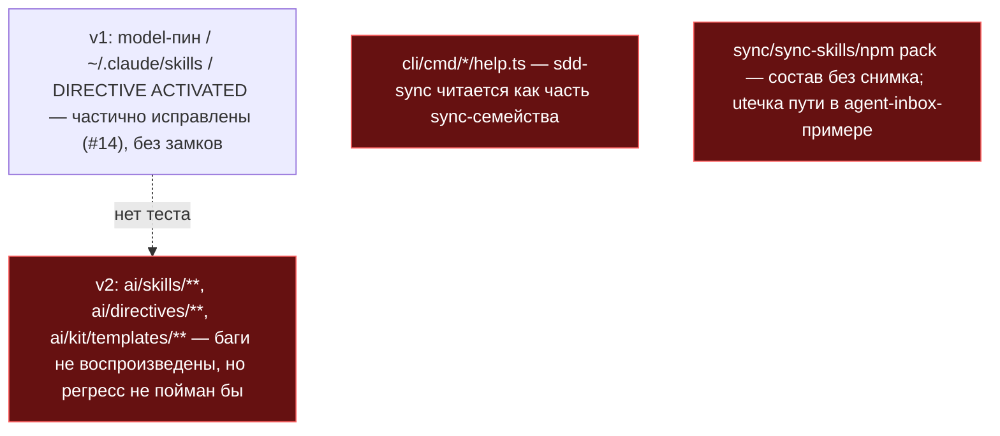

СВОДНЫЙ ОТЧЁТ — Пачка 9 «Поставляемая поверхность под замком, имена команд не путаются»

СТАТУС: DONE, 5/5 задач, 0 стопов. **Обновлено правками верификатора по `V-BATCH-09.md`** — см. «§ Правки по V-BATCH-09» в конце файла (1 блокирующая находка, исправлена; 5 неточностей отчётов, исправлены).

Рабочее дерево: `rc-v6`, ветка `lead/surface-locks`.

**База ветки.** `origin/lead/kit-lint` @ `61b86fb8` (`fix(T-B6-23): critic-protocol restores the correct confusion triage`) — это голова **PR #30** (Пачка 5, ещё не влита в `codex/sdd-v2-rc52-followup` на момент старта этой пачки). Diff этого PR формально включает 8 коммитов PR #30 как базу, пока оператор не смержит #28→#30; после мержа PR можно ребейзнуть — diff сократится до 5 коммитов этой пачки.

Продолжение прерванной сессии: в дереве уже лежали незакоммиченные правки предыдущего исполнителя (процесс Lead перезапустился). Работа этой сессии: изучить diff, разложить по 5 задачам в отдельные conventional-коммиты, довести недостающее, прогнать полную проверку.

---

## Что это и зачем (простыми словами)

Пять независимых, но однотемных задач волны 0 — все про то, что реально уезжает потребителю или агенту, и что может случайно перепутаться:

1. **LOCK-1/2/3** — три «замка»-регрессии на баги, которые v1 когда-то нашёл и (частично) починил, но без механической проверки: захардкоженный `model:` пин в dispatch-промптах, путь к скиллам в домашней папке разработчика (`~/.claude/skills/...` вместо папки проекта), и инструкция скиллу объявить `DIRECTIVE ACTIVATED` — фразу, которую тот же аксиом называет запрещённым нарративом. Раньше это ловилось только внимательным ревью; теперь `npm test` красный, если баг того же класса вернётся в любой шаблон/директиву/скилл.
2. **SO-14** — восемь похожих CLI-имён (`sync`, `sync-skills`, `sdd-sync`, `sdd-migrate`, `orient`, `sdd-orient`, `agents-rules`, отложенный `sdd-rules`) легко перепутать; в частности `sdd-sync` (rollup статуса тикета в трекеры) читался как часть «пакетного sync»-семейства, хотя это два разных механизма. Каждой из 4 затронутых команд добавлена явная строка «Not X» в собственный `--help`, а grep-замок гарантирует, что все семь конкретных имён описаны РАЗНЫМИ фразами в обеих поверхностях (`npx gennady help` и `cli.spec.md`), и что восьмое (ещё не построенное) имя нигде не обещано.
3. **SO-5** — у `sync`/`sync-skills`/`npm pack` не было снимка того, что они РЕАЛЬНО отдают потребителю: случайный лишний или пропавший файл на поставляемой поверхности прошёл бы незамеченным. Заодно найдена и починена настоящая утечка — реальный чат-пример с захардкоженным домашним путём автора отчёта (`/Users/k.lebedev/...`) в примере вывода `agent-inbox`.

---

## Таблица «файл → смысл»

| Файл | Тип | Смысл | Чем доказано |
|---|---|---|---|
| `ai/kit/__tests__/stateless-sdd-flow-contract.test.ts` | правка | +`describe('model pin never returns (LOCK-1)')` — сканирует `ai/skills`, `ai/directives`, `ai/kit/templates` на хардкод `model: "sonnet"\|"haiku"\|"opus"`. | изолированный прогон 1/1 |
| `ai/kit/__tests__/skills-home-path.test.ts` | новый | Сканирует собранные `ai/directives/**`+`ai/skills/**` на `~/.claude/` и v1-путь `.claude/skills/sdd-execute/scripts`. | изолированный прогон 1/1 |
| `ai/kit/__tests__/directive-activation-announcement.test.ts` | новый, правка (`cd031703`, V-BATCH-09) | Сканирует `ai/skills/**/SKILL.md` **и** (после правки) все 73 файла `ai/directives/sdd-v2/**` на фразу `DIRECTIVE ACTIVATED`, с allow-list на легитимную цитату аксиома в `router.directive.xml:130`. | изолированный прогон 2/2 |
| `cli/cmd/{orient,sdd-migrate,sdd-sync,sync}/help.ts` | правка (4 файла) | Каждой команде — явная строка «Not `X` (…)» размежевания с похожим именем в собственном `--help`. | ручной прогон `--help` + лок ниже |
| `specs/cli/cli.spec.md` §9.1 | правка | Добавлены отсутствовавшие строки-предметы `sdd-sync`/`sdd-migrate`; `sync-skills` дополнен размежеванием. | лок ниже |
| `cli/cmd/help/__tests__/command-name-disambiguation.test.ts` | новый, правка (`af4df640`, V-BATCH-09) | Grep-замок: 7 имён — уникальное описание в обеих поверхностях; 8-е (`sdd-rules`) — ни в одной; **(после правки) сами cross-ref строки внутри всех 4 `help.ts` тоже заперты**. | изолированный прогон 3/3 |
| `ai/directives/agent-inbox/golden-chat-output.example.md:176` | правка | Найденная утечка `/Users/k.lebedev/.gennady/...` → `~/.gennady/...`. | 4-й `it` деплой-теста |
| `shared/common/sync/__tests__/deployed-surface.test.ts` | новый, правка (`550139ef`, V-BATCH-09) | 3 golden-снимка (directives/skills/tarball, **третий минус `dist/**`**) + 1 безусловный zero-leak инвариант. | изолированный прогон 4/4 |
| `shared/common/sync/__tests__/deployed-surface.{directives,skills,tarball}.golden.txt` | новые, tarball перегенерирован (V-BATCH-09) | Заморожены списки: 104/13/**1122** путей (tarball было 1636, включая 514 `dist/**` build-артефактов — исключены правкой, см. `R-SO-5.md` §5). | тот же прогон |
| `shared/common/sync/__tests__/GOLDEN-MANIFEST.md` | новый, правка (V-BATCH-09) | Конвенция `UPDATE_SURFACE_GOLDEN=1` + владельцы намеренного дрейфа; строка tarball документирует исключение `dist/**`. | справочный |

Полные таблицы и обоснования по каждой задаче — в `R-LOCK-1.md`, `R-LOCK-2.md`, `R-LOCK-3.md`, `R-SO-14.md`, `R-SO-5.md` (все пять дополнены разделом «Правка по V-BATCH-09», кроме `R-LOCK-1.md`/`R-LOCK-2.md`, которых правки не касались).

---

## Схема «было → стало»

### Было — три незапертых регресса, спутанные CLI-имена, деплой без снимка



### Стало — три замка + разведённые имена + golden деплоя

```mermaid
flowchart TB
  SRC1["ai/skills/**, ai/directives/**, ai/kit/templates/** — LOCK-1 roots (stateless-sdd-flow-contract.test.ts:301)"]
  SRC2["ai/directives/** (built), ai/skills/** — LOCK-2 roots (skills-home-path.test.ts:32)"]
  SRC3A["ai/skills/**/SKILL.md — LOCK-3 root #1 (directive-activation-announcement.test.ts:32,72)"]
  SRC3B["ai/directives/sdd-v2/** — LOCK-3 root #2, added by V-BATCH-09 fix cd031703 (:33,77)"]
  L1["ai/kit/__tests__/stateless-sdd-flow-contract.test.ts — LOCK-1"]
  L2["ai/kit/__tests__/skills-home-path.test.ts — LOCK-2"]
  L3["ai/kit/__tests__/directive-activation-announcement.test.ts — LOCK-3"]
  SRC1 --> L1
  SRC2 --> L2
  SRC3A --> L3
  SRC3B --> L3

  HELPCMD["cli/cmd/help/help.cmd.ts — master listing (31,34,40,42,49,51,53)"]
  SPEC["specs/cli/cli.spec.md §9.1"]
  HELP["cli/cmd/{orient,sdd-migrate,sdd-sync,sync}/help.ts — cross-ref строки, читаются локом с V-BATCH-09 fix af4df640"]
  SO14["cli/cmd/help/__tests__/command-name-disambiguation.test.ts"]
  HELPCMD --> SO14
  SPEC --> SO14
  HELP --> SO14

  DIRS["ai/directives/** — scanDirectives (cli/cmd/sync/sync-core.ts:76)"]
  SKILLS["ai/skills/** — scanSkills (cli/cmd/sync-skills/sync-skills-core.ts:31)"]
  PACK["npm pack --dry-run, минус dist/** (V-BATCH-09 fix 550139ef)"]
  DEPLOYTEST["shared/common/sync/__tests__/deployed-surface.test.ts — SO-5"]
  DIRS --> DEPLOYTEST
  SKILLS --> DEPLOYTEST
  PACK --> DEPLOYTEST
  LEAKFIX["golden-chat-output.example.md:176 — ~/.gennady/... (утечка вычищена)"]
  LEAKFIX -.-> DEPLOYTEST

  L1 --> PASS["npm test — 3616 tests, 3606 pass, 0 fail, 0 cancelled, 10 skip"]
  L2 --> PASS
  L3 --> PASS
  SO14 --> PASS
  DEPLOYTEST --> PASS
  style PASS fill:#163,stroke:#3a3,color:#fff
```



**Правка по V-BATCH-09.** Оригинальная версия рисовала одну общую стрелку `SRC --> L1/L2/L3` от единого узла с тремя корнями — неверно: LOCK-1, LOCK-2 и LOCK-3 сканируют разные и не идентичные наборы корней (см. подписи узлов `SRC1`/`SRC2`/`SRC3A`/`SRC3B` выше, с точными `file:line` каждого). Диаграмма также добавляет ребро `HELP --> SO14`, которого не было (и не могло быть — до `af4df640` лок вообще не читал ни один `help.ts`).

---

## Доказательства (числа ниже — итоговые, ПОСЛЕ правок верификатора; см. «§ Правки по V-BATCH-09» для до/после)

| Команда | Результат | Exit |
|---|---|---|
| `node --import tsx --test ai/kit/__tests__/stateless-sdd-flow-contract.test.ts` (LOCK-1) | все suites ok, включая новый `describe('model pin never returns (LOCK-1)')` | 0 |
| `node --import tsx --test ai/kit/__tests__/skills-home-path.test.ts` (LOCK-2) | 1/1 | 0 |
| `node --import tsx --test ai/kit/__tests__/directive-activation-announcement.test.ts` (LOCK-3) | **2/2** (было 1/1 до правки `cd031703` — см. ниже) | 0 |
| `node --import tsx --test cli/cmd/help/__tests__/command-name-disambiguation.test.ts` (SO-14) | **3/3** (было 2/2 до правки `af4df640` — см. ниже) | 0 |
| `node --import tsx --test shared/common/sync/__tests__/deployed-surface.test.ts` (SO-5) | 4/4 (включая golden + zero-leak; golden `it` №3 теперь минус `dist/**` — правка `550139ef`) | 0 |
| `npm --prefix rc-v6 run test:topology` (check) | `unit=216 contract=22 local=52 external=8`, все новые файлы — ровно в одном слое (**`contract`×3, `unit`×1, `local`×1** — исправлена подпись, было ошибочно «`contract`×1» для `command-name-disambiguation.test.ts`, которая фактически классифицируется `test-topology` как `unit`) | 0 |
| `npm --prefix rc-v6 run build && npm --prefix rc-v6 test` (в этом порядке, на финальном состоянии всех 8 коммитов) | 3616 tests, **3606 pass, 0 fail, 0 cancelled, 10 skip**, exit 0 — build больше НЕ красит golden (было: до правки `550139ef` этот же прогон давал `it` №3 деплой-теста красным детерминированно после любой сборки) | 0 |
| `npm --prefix rc-v6 run check` (sdd-verify --profile full) | `ALL PASS (5/5)`: type-check 4.8s, test:coverage 57.2s, lint 8.0s, format 1.6s, yagni 0.5s | 0 |
| `npm --prefix rc-v6 run gate:sdd-check-baseline` | «no error outside the baseline» (`227c03a8`, тег `rc-baseline-1`) | 0 |
| `grep -rE '/Users/[A-Za-z0-9._-]+/\|/home/[A-Za-z0-9._-]+/' ai/directives ai/skills \| grep -v '<user>'` | пусто (0 совпадений) | — |

Каждый из 8 коммитов (5 исходных + 3 правки верификатора) ТАКЖЕ прошёл `pre-commit` целиком (тот же `npm run check` + `check:directives-fresh` + `audit:axioms`/`audit:contracts`/`audit:halts` + `check:directive-budgets`) без `--no-verify`.

**8 коммитов (по порядку, локальные, НИЧЕГО не запушено):**
| # | SHA | Тема |
|---|---|---|
| 1 | `3feace46` | LOCK-1 — model-пин никогда не возвращается |
| 2 | `d5274a14` | LOCK-2 — домашний путь скиллов никогда не возвращается |
| 3 | `5e1d40e0` | LOCK-3 — `DIRECTIVE ACTIVATED` никогда не возвращается |
| 4 | `9f61c159` | SO-14 — восемь CLI-имён разведены в help |
| 5 | `041c507a` | SO-5 — golden деплоя + починка найденной утечки пути |
| 6 | `550139ef` | **fix(so-5)** — исключён gitignored `dist/**` из tarball golden (V-BATCH-09, блокирующая) |
| 7 | `cd031703` | **fix(lock-3)** — замок расширен на rendered `ai/directives/sdd-v2/**` (V-BATCH-09) |
| 8 | `af4df640` | **fix(so-14)** — заперты cross-ref строки внутри каждого `help.ts` (V-BATCH-09) |

`15 файлов изменены, +1758/−3` (`git diff --stat 61b86fb8..HEAD`, итоговое; было `+2181/−3` до правки `550139ef`, которая чистым образом удалила 514 строк `dist/**` из golden).

---

## Стопы

**Ноль.** Полный `npm run check` (профиль full, тест-корпус ~826-830 файлов под `c8`) дважды показал флаки-«cancelled»/единичный «fail» на тестах ВНЕ диффа этой пачки (`cli/__tests__/tool-behavior/{bootstrap-path,clean-repo-composition}.test.ts`, `cli/cmd/lint/__tests__/lint.cmd.test.ts`) — разный набор при каждой попытке, все зелёные при изолированном прогоне. Тот же класс машинной флакости полного профиля под нагрузкой, что уже документирован в `R-SO-7.md` (Пачка 1). Не остановка: третья/вторая попытка коммита в каждом случае дала чистый `Pre-commit passed`; финальный прогон на итоговом состоянии исходных 5 коммитов — `ALL PASS (5/5)` без единого cancelled/fail.

**После правок верификатора (3 доп. коммита, см. «§ Правки по V-BATCH-09»):** та же машинная флакость повторно наблюдалась при независимых прогонах `npm test` под нагрузкой (до 10 «cancelled» на тестах вне диффа — `lint.cmd.test.ts`, `bootstrap-path.test.ts`, `clean-repo-composition.test.ts` и другие из того же класса, каждый раз разный набор). Не остановка: три из трёх commit-attempt (по одному на `550139ef`/`cd031703`/`af4df640`) прошли `pre-commit` целиком чисто с первой попытки; финальный `npm run build && npm test` на итоговом состоянии всех 8 коммитов, выполненный при менее нагруженной машине, дал `3616 tests, 3606 pass, 0 fail, 0 cancelled, 10 skip`, exit 0.

---

## Отклонения от брифа

1. **Путь SO-5-теста.** Доска/очередь называют `scripts/__tests__/deployed-surface.test.ts`; фактически — `shared/common/sync/__tests__/deployed-surface.test.ts`. Причина: `scripts/test-topology.ts:19` — `TEST_ROOTS = ['ai','cli','services','shared']` — не включает `scripts/`; тест по указанному в доске пути не обнаруживался бы ни `npm test`, ни pre-commit гейтом. Технически необходимое отклонение, не архитектурный выбор — см. `R-SO-5.md` §4.
2. **`shared/common/sync/path-normalizer.ts` не изменён** (SO-5 допускал правку «при необходимости») — найденная утечка была статичным markdown-примером, не проходящим через нормализатор; общий класс утечек теперь ловит безусловный `it` в `deployed-surface.test.ts`.
3. **`sync-skills`/`sdd-orient`/`agents-rules` не получили собственных cross-ref строк** в SO-14 — у первого и третьего нет отдельного `help.ts` (справка только в мастер-листинге и `cli.spec.md`, уже покрыта локом); структурное свойство CLI, не пробел.

Открытых вопросов, требующих решения оператора, — нет.

**Команда пуша для Lead** (после независимой верификации `plan-verifier`):
```
git -C rc-v6 push origin lead/surface-locks
```
(единый push, весь диапазон из 8 коммитов — 5 исходных + 3 правки верификатора; ничего не запушено этой сессией).

---

## § Правки по V-BATCH-09

Верификатор (`ai/drafts/research/sdd-v1-to-v2-transfer/_raw/V-BATCH-09.md`) нашёл 1 блокирующую находку и 6 неблокирующих; бриф-правка требовала исправить блокирующую и 3 из неблокирующих (LOCK-3 покрытие, SO-14 cross-ref замок) плюс 5 неточностей отчётов. LOCK-2 (`ai/**` vs фактический скоуп сканирования) и `back-sync`-неточность `32-TRACK-SYNC-OWNERSHIP.md:462` брифом правки НЕ затребованы — остаются как были, неблокирующие, задокументированы в `R-LOCK-2.md`/`V-BATCH-09.md`.

### 1. БЛОКИРУЮЩЕЕ (SO-5) — исправлено, коммит `550139ef`

`deployed-surface.tarball.golden.txt` замораживал 514 путей `dist/**` (512 — content-hash-именованные чанки сборки Vite) из gitignored-каталога (`dist` в `.gitignore:11`). Хеш в имени чанка и сам список чанков нестабильны между прогонами `npm run build` идентичного исходника → `it` №3 падал детерминированно на любом дереве после сборки, включая свежий клон без `dist/` вовсе. Заявленные в исходной версии этого отчёта числа («3604 pass, 0 fail», «ALL PASS (5/5)») не воспроизводились чистым повтором.

**Правка:** третий `it` теперь сравнивает `packFiles()` с golden **после фильтра**, исключающего любой путь `dist`/`dist/**` — сборочный вывод не замораживается вовсе (не нормализован плейсхолдером — количество чанков само по себе нестабильно, плейсхолдер этого не чинит). Golden перегенерирован (`UPDATE_SURFACE_GOLDEN=1`): 1636 → 1122 строк, диффом ровно 514 удалённых строк, без единой прочей правки; `directives`/`skills` голdenы (104/13) не тронуты.

**Доказательство (перепроверено этим исполнителем, both-way):**
```
$ UPDATE_SURFACE_GOLDEN=1 node --import tsx --test shared/common/sync/__tests__/deployed-surface.test.ts
# pass 4, # fail 0
$ git diff --stat deployed-surface.tarball.golden.txt   →  1 file changed, 514 deletions(-)
$ npm run build                                          →  ✓ built, exit 0, новые хеши чанков
$ npm test                                               →  3616 tests, 3606 pass, 0 fail, 0 cancelled, exit 0
```
Build больше не красит golden — детали в `R-SO-5.md` §5.

### 2. LOCK-3 — расширено на rendered `ai/directives/sdd-v2/**`, коммит `cd031703`

`20-ISSUES-VERDICTS.md:272` требует contract-тест «по `ai/skills/**/SKILL.md` **и rendered `ai/directives/sdd-v2/**`**» — первая версия покрывала только `SKILL.md`. Добавлен второй `it`, сканирующий все 73 файла под `ai/directives/sdd-v2/**`, с allow-list на единственную легитимную цитату (`router.directive.xml:130`, определение `AX_NO_PROCESS_NARRATION`, которое само цитирует запрещённую фразу как свой пример). Both-way перепроверено: вставленная строка `Announce: DIRECTIVE ACTIVATED: SddExecute` в `execute.directive.xml` красит новый `it`; откат восстанавливает зелёный. `R-LOCK-3.md` §4/§5 исправлены — «нет отклонений» было неточно, теперь описано явно. Детали в `R-LOCK-3.md`.

### 3. SO-14 — заперты cross-ref строки внутри `help.ts`, коммит `af4df640`

Сами фразы «Not `X` (…)» в четырёх `help.ts` не были заперты ни одним тестом — лок читал только `help.cmd.ts` и `cli.spec.md`. Добавлен третий `it`, читающий каждый из 4 `help.ts` напрямую и требующий буквальную backtick-ссылку на каждое look-alike имя (проверенное против собственного `NAMES` этого замка). Both-way перепроверено: удаление cross-ref строки из `orient/help.ts` красит новый `it`; восстановление — зелёный. Детали в `R-SO-14.md` §5.

### 4. Пять неточностей отчётов — все исправлены

1. **Числа прогонов.** «3604 pass, 0 fail» / «ALL PASS (5/5)» были опровергнуты (см. пункт 1 выше) — заменены на воспроизведённые в этой сессии: `npm test` = 3616/3606/0 fail/0 cancelled/10 skip, exit 0; `npm run check` = ALL PASS (5/5). Оба узла `PASS` в mermaid-схемах (`R-BATCH-09-surface-locks.md`, ниже) обновлены.
2. **Mermaid «стало» в `R-BATCH-09-surface-locks.md`.** `SRC --> L1/L2/L3` от одного узла было неверно — реальные корни различны (LOCK-1: `ai/skills`+`ai/directives`+`ai/kit/templates`; LOCK-2: `ai/directives`+`ai/skills`; LOCK-3: `ai/skills/**/SKILL.md` + `ai/directives/sdd-v2/**` после правки). Схема выше в этом файле переписана с тремя отдельными узлами `SRC1`/`SRC2`/`SRC3A`/`SRC3B` и точными `file:line`.
3. **Mermaid в `R-SO-5.md`.** `DIRS/SKILLS --> ... --> NORM --> TEST --> G1/G2` подразумевал вызов `normalize()` на golden-пути — неверно: `normalize()` вызывается только внутри `it` №4 (:129, :139), три golden-`it` (№1 :94, №2 :103, №3 :117-118) сравнивают сырой вывод. Диаграмма в `R-SO-5.md` §2 переписана, `NORM` — отдельная пунктирная ветка, помеченная «it №4 ТОЛЬКО».
4. **Mermaid в `R-SO-14.md`.** `H1 --> MAP --> LOCK` подразумевал, что `help.ts` питает `cli.spec.md` — такой зависимости в коде нет; и до правки `af4df640` лок вообще не читал ни один `help.ts`. Диаграмма в `R-SO-14.md` §2 переписана: `HELPCMD --> LOCK`, `MAP --> LOCK` (было верно всегда, нарисовано было неверно), `H1 --> LOCK` (стало верно только после `af4df640`).
5. **Слой `unit` vs `contract`.** «все новые файлы — ровно в одном слое (`contract`×3, `contract`×1, `local`×1)» — вторая цифра неверна. Фактическая классификация `node --import tsx scripts/test-topology.ts list`: `contract` — `directive-activation-announcement.test.ts`, `skills-home-path.test.ts`, `stateless-sdd-flow-contract.test.ts`; **`unit`** — `command-name-disambiguation.test.ts`; `local` — `deployed-surface.test.ts`. Итог: `contract`×3, `unit`×1, `local`×1 — сама классификация однослойная (верно), подпись была неверной.

### Стоп-статус и открытые вопросы

Ни один из пяти пунктов не потребовал остановки — все технически исправимы в рамках существующего кода/тестов, без решений оператора и без противоречий с зонами других пачек (файлы правок те же, что у исходных 5 коммитов). Открытых вопросов нет.

**Команда пуша для Lead** (актуальна, единый push всего диапазона из 8 коммитов):
```
git -C rc-v6 push origin lead/surface-locks
```
