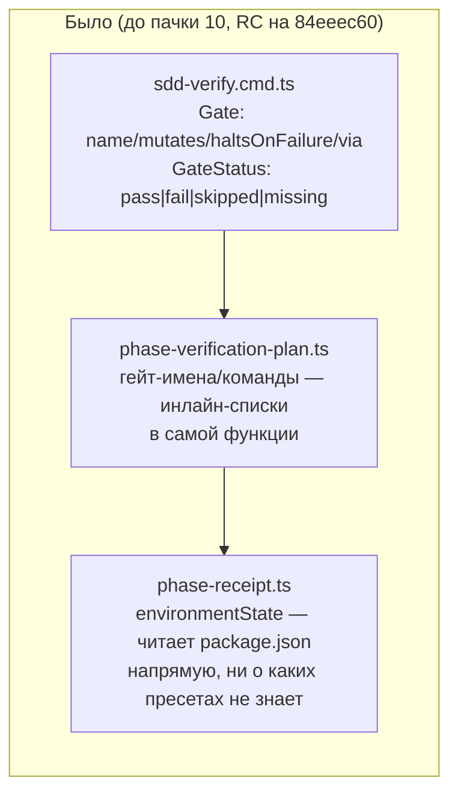
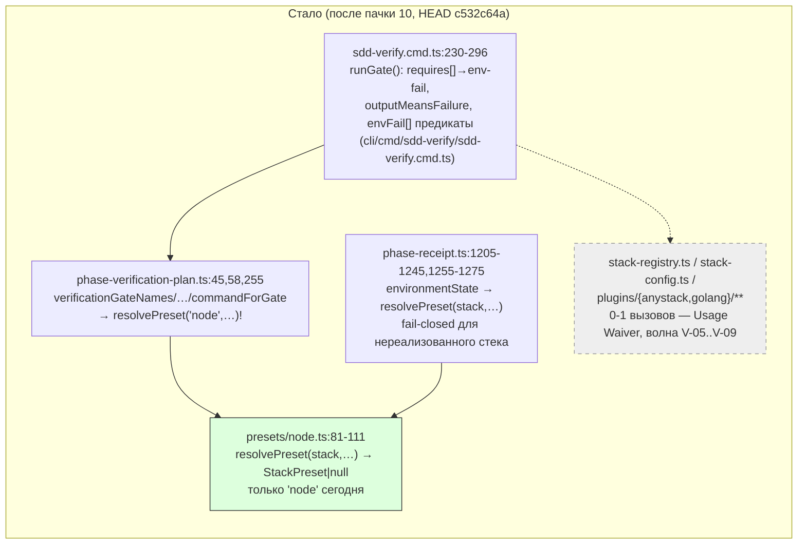

ОТЧЁТ Пачка 10 — «Verify считает окружение и гейты как данные» (V-02, V-03, V-04, V-04a)

СТАТУС: ВЫПОЛНЕНО. Ветка `lead/verify-core`, 4 коммита, база `origin/codex/sdd-v2-rc52-followup`
@ `84eeec60` (PR #28, уже влит). Работу вёл `rc-executor`; сессия оборвалась по лимиту API
посреди V-04a (незакоммиченный fail-closed guard без тестов) — этот же именованный агент
продолжил и закрыл задачу, восстановил отчёты V-02 (обновление)/V-03/V-04 (написаны по факту
уже существующих коммитов — они были сделаны предыдущими проходами без отчётов) и написал
V-04a с нуля.

**Не запушено** (правило: `git push` делает только Lead). Команды пуша — в конце документа.

## Черновик для PR (простым языком)

Verify — это движок сборки-и-проверки RC (`gennady sdd-verify`), который до этой пачки был
жёстко зашит под Node.js: имена гейтов (`fix`, `type-check`, `test`…), команды (`npm run …`) и
«отпечаток окружения» (по которому receipt понимает, что код действительно проверялся тем же
набором скриптов, что заявлен) — всё это было списками констант прямо внутри общей фазовой
логики. Пачка переносит из старой версии продукта (MAIN) настоящий движок стеков — тот же
принцип, что там уже работает для Go и «любого стека» (`anystack`) — и подключает его к RC по
одному реальному вызову за раз, не трогая при этом ни строчки видимого поведения для Node:
каждая задача доказывается «эталоном» (golden-тестом), снятым с рабочего RC ДО начала переноса.

Итог этой пачки: (1) примитивы стека (детект, конфиг `gennady.yaml`, Go/anystack-плагины)
физически лежат в дереве RC, но пока не подключены (0-1 вызовов — это ожидаемо и явно
задокументировано записями `Usage Waiver` в контракте модуля, у каждой — своя будущая задача);
(2) гейты (`fix`/`type-check`/`test`/…) обзавелись данными для будущих возможностей — «эта
проверка проверяет окружение, а не код» (`env-fail`), «таймаут», «песочница нарушена» — но ни
одна существующая проверка их пока не использует, поведение то же; (3) имена и команды гейтов
для Node теперь читаются из одного «пресета» (`resolvePreset('node', …)`), а не пишутся дважды
в разных местах кода — тоже без изменения вывода; (4) «отпечаток окружения» (`environmentState`)
теперь тоже спрашивает у пресета, есть ли у него вообще способ его посчитать, и явно
отказывается для стека, для которого такого способа ещё нет — вместо того чтобы тихо и неверно
посчитать его как Node-проект. Для Node — байт в байт то же самое, что доказывает эталон,
снятый на замороженной версии RC.

## 1. Таблица файлов (271 файл всего, сгруппировано по каталогам)

| Каталог | Файлов | Задача | Смысл |
|---|---|---|---|
| `plugins/golang/e2e/**` | 210 | V-02 | e2e-фикстуры Go-плагина, перенесены дословно из MAIN `d37d5910` |
| `plugins/golang/{__tests__,specs,skills,directives,*.ts,plugin.json}` | 11 | V-02 | сам Go-плагин (детект/scope/план), unit-тесты, спека, директива/скилл |
| `plugins/anystack/e2e/**` | 20 | V-02 | e2e-фикстуры anystack-плагина |
| `plugins/anystack/{*.ts,plugin.json,specs}` | 3 | V-02 | сам anystack-плагин (read-only гейты из `gennady.yaml`) |
| `plugins/index.ts` | 1 | V-02 | реестр `BUILTIN_PLUGINS = [anystack, golang]` (без node — см. `R-V-02.md` §5 п.1) |
| `shared/verify/{verify.types.ts,env-fail.ts,tree-guard.ts,stack-registry.ts,stack-config.ts,plugin-api.ts,__tests__/*}` | 11 | V-02 | типы движка стека + примитивы (env-fail предикаты, tree-guard лок, реестр, конфиг-контракт), перенесены дословно |
| `shared/verify/presets/{node.ts,__tests__/node.test.ts}` | 2 | V-04 | новый: `resolvePreset(stack,…)` + node-пресет (гейт-имена/команды) |
| `services/config/config-loader.ts` + тест | 2 | V-02 | универсальный загрузчик секции конфига (переиспользован для `gennady.yaml`) |
| `shared/common/{exec.ts,__tests__/test-topology.test.ts}` | 2 | V-02 | сопутствующая проводка: `execFileTrimSafe` + список корней топологии тестов |
| `scripts/test-topology.ts`, `tsconfig.json` | 2 | V-02 | классификатор тестов + алиас пути `gennady/stack` |
| `shared/sdd/phase-verification-plan.ts` | 1 | V-04 | гейт-имена/команды делегированы в `resolvePreset('node',…)`, вывод не изменился |
| `shared/sdd/{phase-receipt.ts,__tests__/phase-receipt.test.ts}` | 2 | V-04a | `environmentState` резолвит пресет, фейлится явно для нереализованного стека |
| `cli/cmd/sdd-verify/{sdd-verify.types.ts,sdd-verify.cmd.ts,__tests__/sdd-verify.cmd.test.ts}` | 3 | V-03 | `Gate`/`GateStatus` данные (`envFail`/`timeout`/`violation`), `runGate` их применяет |
| `specs/cli/verify/verify.spec.md` | 1 | V-02/V-03/V-04/V-04a (по L-21) | waiver-контракт модуля + Overview-диаграмма, обновляется каждой задачей волны |

## 2. Архитектура — было/стало (Engine ↔ Preset ↔ Detector)





_Серым/пунктиром — перенесённый, но ещё не подключённый код (следующие задачи волны 2:
V-05 детект стека, V-07 конфиг, V-08 anystack-пресет, V-09 golang-пресет). Зелёным — код,
получивший реальный вызов в этой пачке._

## 3. Доказательства (сводно; построчно — в `R-V-03.md`/`R-V-04.md`/`R-V-04a.md`)

| Команда | Вывод | Статус |
|---|---|---|
| `npm --prefix <tree> test` (HEAD `c532c64a`) | `# tests 3715 / # pass 3705 / # fail 0 / # skipped 10` | ВЫПОЛНЕНО |
| `npm --prefix <tree> run check` | `[sdd-verify] ✅ ALL PASS (5/5)` (type-check/test:coverage/lint/format/yagni) | ВЫПОЛНЕНО |
| `npm --prefix <tree> run build` | `✓ built in 4.89s`, exit 0 | ВЫПОЛНЕНО |
| `npm --prefix <tree> run gate:sdd-check-baseline` | `[sdd-check-zero-new-error] OK` (baseline `227c03a8`, tag `rc-baseline-1`) | ВЫПОЛНЕНО |
| `node dist/gennady.js sdd-check --all <tree>` | `198 error(s), 433 warning(s) across 213 file(s)` (потолок брифа — ≤198, 0 новых) | ВЫПОЛНЕНО |
| `preset-node-golden.test.ts` + `parity-node.test.ts` (V-01 golden) | `# tests 45 / # pass 45 / # fail 0` — не регенерировался ни разу за всю пачку | ВЫПОЛНЕНО, И-1/И-2 подтверждены |

## 4. Остаток waiver — владельцы по задачам (волна 2+)

Реестр `Usage Waiver` в `specs/cli/verify/verify.spec.md` §8 после этой пачки:

| Символ(ы) | Владелец |
|---|---|
| `ANYSTACK_GATE_IDS` | V-08 |
| `C`, `I`, `Bad` (approximate-declaration ложноположительные) | V-09 |
| `scopeHasGoGenerate`, `isStructuralListError` | V-09 |
| `PROJECT_CONFIG_FILENAME`, `ConfigSectionLoad`, `formatDuration` | V-07 |
| `allOf` | V-07 (пересмотрен с V-03 в рамках самой V-03 — машина построена, но ни одна `GATES`-запись `envFail` не задаёт) |
| `StackConfigError`, `StackConfigLoad`, `validateStackConfig`, `loadStackConfig`, `pluginConfigOf`, `unmatchedGateOverrides`, `applyStackConfig`, `BUILTIN_GATE_IDS` | V-07 |
| `detectStacks` | V-05 |
| `TreeGuard`, `TreeGuardOptions`, `GuardAcquisition`, `acquireTreeGuard` | V-18 (вне этой волны) |
| `StackRun`, `VerifyReport` | V-16a (пересмотрено при закрытии V-04) либо кандидаты на удаление вне волны |
| `StackPreset` | V-08 (первый второй пресет) |

Ни одна запись не снята задачами V-03/V-04/V-04a (подтверждено в `R-V-04a.md` §4) — единственный
символ, реально получивший второй продакшн-вызов за пачку, это `resolvePreset` сам (владелец
V-04, никогда не был в waiver-реестре).

## 5. База и перебазирование

База пачки — PR #28 (уже влит в `codex/sdd-v2-rc52-followup`), коммит `84eeec60`. Ветка
`lead/verify-core` создана от него в отдельном дереве (`scratchpad/rc-w2`), не от текущей
головы `codex/sdd-v2-rc52-followup` — если голова с тех пор продвинулась дальше `84eeec60`,
**Lead обязан перебазировать `lead/verify-core` на актуальную голову RC перед пушем/PR**
(конфликтов не ожидается — пачка трогает только `plugins/**`, `shared/verify/**`,
`shared/sdd/{phase-receipt,phase-verification-plan}.ts`, `cli/cmd/sdd-verify/**`,
`specs/cli/verify/verify.spec.md`, `services/config/**`, `shared/common/{exec.ts,__tests__/test-topology.test.ts}`,
`scripts/test-topology.ts`, `tsconfig.json` — узкий, стабильный периметр).

## 6. Команды пуша для Lead

```bash
# из дерева rc-w2:
git -C /private/tmp/claude-503/-Users-k-lebedev-Developer-gennady--claude-worktrees-nice-panini-8aa14e/400aa5cc-7ed6-4bdd-aa81-d8e4a3003aaf/scratchpad/rc-w2 \
  fetch origin codex/sdd-v2-rc52-followup
# если голова продвинулась дальше 84eeec60 — перебазировать перед пушем:
git -C .../rc-w2 rebase origin/codex/sdd-v2-rc52-followup
git -C .../rc-w2 push origin lead/verify-core
gh pr create --base codex/sdd-v2-rc52-followup --head lead/verify-core \
  --title "verify: Engine+Preset core (V-02..V-04a)" \
  --body "$(cat ai/drafts/research/sdd-v1-to-v2-transfer/_raw/reports/R-BATCH-10-verify-core.md)"
```

Коммиты на ветке (по порядку): `4da13fc4` (V-02), `b91d90d8` (V-03), `313dbbd8` (V-04),
`c532c64a` (V-04a).

## 7. Открытые вопросы

Нет.
