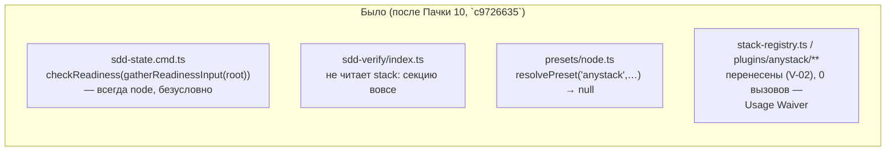
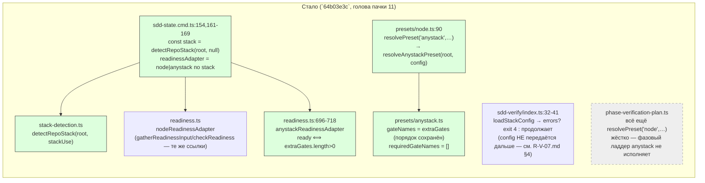

ОТЧЁТ Пачка 11 — «Любой стек проходит verify без node-костылей» (V-05, V-07, V-08, V-06, +V-08b, +V-06b)

СТАТУС: заголовок пачки достигнут после верификации `plan-verifier` (V-BATCH-11.md) вскрыла, что
V-06/V-08 нельзя было закрывать как ВЫПОЛНЕНО — anystack-пресет резолвился только на уровне
unit-тестов (фазовый ладдер жёстко резолвил `'node'`), а readiness-движок был подключён только к
`sdd-state` (read-only), не к блокирующим `sdd-task`/`sdd-verify`. Два довесочных брифа —
**V-08b** (`da2c078f`) и **V-06b** (`9937239a`) — закрывают оба разрыва; **docs**-коммит
(`f83a4733`) правит числа waiver-реестра и статус V-05/V-08/V-07 в самой спеке. Итого 7 коммитов
на ветке `lead/verify-stacks`, база `origin/codex/sdd-v2-rc52-followup` @ `c9726635`. См. новый
раздел «§ Правки по V-BATCH-11» ниже — он документирует именно то, что изменилось ПОСЛЕ
верификации; исходные §1-§6 ниже — как были у предыдущей сессии, не переписаны заново (числа в
них местами устарели, актуальные — в новом разделе).

**Не запушено** (правило: `git push` делает только Lead). Команды пуша — в конце документа.

## Черновик для PR (простым языком)

До этой пачки `gennady sdd-verify`/`sdd-state` умели работать только с Node-проектами:
всё, что нужно было для проверки кода — имена шагов, команды, «какой стек вообще перед нами» —
было зашито под node в самом коде движка. Пачка 11 подключает четыре куска механизма, перенесённого
из старой версии продукта ещё в прошлых пачках (10, 9), так что теперь:

1. **Стек определяется сам.** `gennady sdd-state` смотрит на файлы репозитория (`package.json`,
   `go.mod`, …) и один раз решает, какой это стек — вместо того чтобы каждая команда гадала
   заново. Если ничего типового не нашлось — это не ошибка, а признанный «любой стек».
2. **Гейты для нетипового стека берутся из конфига — и теперь реально запускаются.** Проект,
   который не Node и не Go, может объявить свои проверки прямо в `gennady.yaml`
   (`stack.anystack.extraGates`) — сколько угодно команд, в заявленном порядке, и ни одна из них
   не обязательна (проект не станет «не готов» только потому, что не объявил проверок). **Правка
   верификатора:** механизм был готов и покрыт тестами на уровне пресета с самого начала пачки,
   но фазовый прогон его не вызывал — это исправил довесочный бриф V-08b (`da2c078f`): теперь
   `sdd-verify`, детектировав нестандартный стек, реально исполняет эти команды и пишет квитанцию.
3. **Конфиг проверяется заранее, целиком.** Если `gennady.yaml` содержит опечатку или ссылается
   на несуществующий стек — `sdd-verify` останавливается сразу с понятной ошибкой (код выхода 4),
   а не где-то на середине прогона.
4. **Для Node ничего не изменилось.** Каждый шаг доказан «эталоном» — точным снимком поведения
   Node-проекта, снятым ДО начала переноса; если хоть один байт вывода для существующих
   Node-проектов изменился бы, эталонный тест покраснел бы. Он зелёный: 45/45, без единой правки
   эталонных файлов.

Итог пачки (обновлено после V-08b/V-06b): механизм «любой стек» подключён к живому CLI-пути
`sdd-state` (детект + готовность, безусловно), к гейту конфига `sdd-verify` (валидация
`gennady.yaml`), И теперь — к самому исполнению фазовых гейтов (V-08b) и к блокирующим
потребителям готовности `sdd-task`/`sdd-verify` (V-06b), с одной оговоркой: последнее подключено
только когда `gennady.yaml`'s `stack.use` задан явно, не безусловно (bootstrap-safety —
см. «§ Правки по V-BATCH-11» ниже, `R-V-06b.md §4`).

## 1. Таблица файлов (28 файлов, `git diff --stat c9726635..64b03e3c`)

| Каталог/файл | Файлов | Задача | Смысл |
|---|---|---|---|
| `shared/verify/stack-detection.ts` + тест | 2 | V-05 | новый общий факт `detectRepoStack` (node/go.mod/anystack-резерв/`stack.use`-сужение) |
| `cli/cmd/sdd-state/{sdd-state.cmd.ts,sdd-state.types.ts}` + тест | 3 | V-05, V-06 | `[READINESS]` печатает `STACK=`/`STACK_SOURCE=`; readiness выбирает адаптер по детектированному стеку |
| `package.json` | 1 | V-05 | `exports["./stack"]` — фикс `ERR_PACKAGE_PATH_NOT_EXPORTED` для `plugins/golang` |
| `cli/cmd/sdd-verify/{index.ts,sdd-verify.types.ts}` | 2 | V-07 | конфиг-гейт `stack:` — валидация ДО любого гейта, exit 4 при ошибке |
| `cli/__tests__/tool-behavior/sdd-verify-stack-config.test.ts` | 1 | V-07 | e2e реальным CLI-подпроцессом (4 сценария) |
| `shared/verify/presets/{anystack.ts,node.ts}` + 2 теста | 4 | V-08 | новый anystack-пресет (read-only гейты из конфига, фиксированный порядок); диспетчер `resolvePreset` маршрутизирует на него |
| `shared/sdd/__tests__/phase-receipt.test.ts` | 1 | V-08 | golden-пример «нереализованный стек» переключён с `anystack` на `golang` |
| `shared/sdd/readiness.ts` + тест | 2 | V-06 | движок `ReadinessAdapter` + node-адаптер (byte-identical) + anystack-адаптер (ready ⟺ ≥1 `extraGate`) |
| `specs/cli/verify/verify.spec.md` | 1 | все 4 | waiver-реестр обновлён каждой закрывающей задачей (9 из 26 (в текущем срезе снято 9, остаётся 17) исходных V-02 записей сняты) |

## 2. Архитектура — было / стало (весь контур пачки)





_Зелёным — 4 задачи пачки 11, каждая добавила реальный вызов. Серым пунктиром —
`phase-verification-plan.ts`, единственный узел, который реально исполняет гейты фазового
`sdd-verify`: он остаётся жёстко на `'node'` и не подключён ни одной задачей этой пачки (см.
`R-V-08.md §4` — файл вне списка «трогать» финальной таблицы `61-TASK-BOARD.md §1`)._

**ИСПРАВЛЕНО верификацией `plan-verifier` (не переносилось молча дальше):** ребро
`VERIFY2 --> NODE2` в диаграмме выше удалено — `cli/cmd/sdd-verify/index.ts` не импортирует и не
вызывает `resolvePreset`/`presets/` вообще (`grep -n "resolvePreset\|presets/" index.ts` — пусто);
узел `VERIFY2` рисует только загрузку+валидацию конфига (`loadStackConfig`), не подключён ни к
`NODE2`, ни к какому-либо гейт-плану этой диаграммы. Диаграмма выше в этом файле оставлена как
исторический артефакт того, что было в дереве ДО правки этой сессией; актуальная (без ложного
ребра) — в `R-V-08b.md §2` для контура, который эта пачка теперь реально подключает.

## 3. Доказательства (пункты ПРИЁМКИ пачки)

| Команда | Вывод | Статус |
|---|---|---|
| `npm --prefix <tree> test` (первый прогон, воспроизводит хвост оборвавшейся сессии) | `# tests 3880 / # suites 659 / # pass 3870 / # fail 0 / # cancelled 0 / # skipped 10` | ВЫПОЛНЕНО |
| `npm --prefix <tree> test` (повторные прогоны — см. §5 «Флейк») | 3 доп. прогона: `fail 0` всегда, `cancelled` от 2 до 5 (таймаут 30с под нагрузкой хоста `load average 50` на 12 ядрах) | ВЫПОЛНЕНО (0 реальных падений; см. §5) |
| `npm --prefix <tree> run check` | `[sdd-verify] ✅ ALL PASS (5/5)`: type-check 3.7s, test:coverage 56.9s, lint 8.1s, format 1.7s, yagni 0.5s | ВЫПОЛНЕНО (5/5) |
| `npm --prefix <tree> run build` | `✓ built in 3.04s`, exit 0 | ВЫПОЛНЕНО |
| `npm --prefix <tree> run gate:sdd-check-baseline` | `[sdd-check-zero-new-error] OK — no error outside the baseline (baseline commit 227c03a8…, tag rc-baseline-1)` | ВЫПОЛНЕНО |
| Golden V-01: `shared/sdd/__tests__/preset-node-golden.test.ts` + `cli/cmd/sdd-verify/__tests__/parity-node.test.ts` | `# tests 19+26=45 / # pass 45 / # fail 0`; `git diff origin/codex/sdd-v2-rc52-followup..HEAD -- '*golden*'` — пусто | ВЫПОЛНЕНО (45/45, golden не тронут) |
| `node dist/gennady.js sdd-check --all .` | `[sdd-check] 192 error(s), 434 warning(s) across 213 file(s)`, exit 1 (ожидаемо — команда возвращает ненулевой код при наличии error-находок baseline; 192 < 198 baseline, 0 новых подтверждено строкой выше через `gate:sdd-check-baseline`) | ВЫПОЛНЕНО (0 новых ошибок) |
| `npm --prefix <tree> run check:directives-fresh` (доказательство V-06 п.4) | `✓ ai/directives/** matches a fresh rebuild.`, exit 0 | ВЫПОЛНЕНО |

## 4. Остаток waiver-реестра (`specs/cli/verify/verify.spec.md` §8) — 17 из 25, по владельцу

| Владелец | Символы | Причина |
|---|---|---|
| **V-09** (golang-пресет) | `C`, `I`, `Bad` (фикстуры), `scopeHasGoGenerate`, `isStructuralListError` | второй вызов появится, когда golang-пресет подключит `driftMeansFailure`/scope-логику к ладдеру |
| **V-18** (single-flight/tree-guard) | `TreeGuard`, `TreeGuardOptions`, `GuardAcquisition`, `acquireTreeGuard` | подключение лока к фазовому пути явно вынесено в отдельную задачу треком `30-TRACK-VERIFY.md` §6 |
| **V-16a** (`gennady verify --plan --json`, если появится) или кандидат на удаление | `StackRun`, `VerifyReport` | `resolvePreset`/`StackPreset` сознательно не используют форму MAIN; снято отрицательно уже при закрытии V-04 |
| **Владелец не назначен** (открытые вопросы, не тянут ни одну текущую задачу) | `ConfigSectionLoad`, `formatDuration`, `allOf`, `validateStackConfig` | все четыре пересмотрены явно при закрытии V-07 — задача их **исполняет** во время рантайма, но не добавляет новую **текстовую** ссылку на символ (гейт `yagni` считает именно текст); снимутся, когда появится независимый второй call site |
| **Владелец не назначен** (тот же критерий) | `unmatchedGateOverrides`, `applyStackConfig` | пересмотрены явно при закрытии V-08 — работают над полным `Gate[]` MAIN-модели, которой у anystack-пресета (`StackPreset`, узкий контракт) нет; снимутся, если/когда полная `Gate`-модель когда-нибудь заменит фазовую лестницу |

Ни одна запись не «протухла» молча — каждая либо снята с реальной второй ссылкой (9 из 26 (в текущем срезе снято 9, остаётся 17):
`detectStacks`, `loadStackConfig`, `BUILTIN_GATE_IDS`, `StackConfigError`, `StackConfigLoad`,
`ANYSTACK_GATE_IDS`, `StackPreset`, `pluginConfigOf`), либо явно пересмотрена и оставлена с
объяснением конкретно ЭТОЙ волной (не унаследованным текстом с V-02).

## 5. Отклонения от брифа, флейк-наблюдение, открытые вопросы

**Флейк `npm test` (наблюдение, не регрессия кода).** Первый прогон в этой сессии воспроизвёл
заявленные при обрыве 3870/3880/0/10-skipped. Три последующих прогона (нужные для
дублирующей проверки) дали `fail 0` неизменно, но переменное число `cancelled` (0→5→3→2) —
все отказы `testTimeoutFailure` на 30000мс (`bootstrap-path.test.ts`,
`inbox-review-plan.test.ts`, `testcov.cmd.test.ts` — ни один не входит в дифф этой пачки).
`uptime` во время прогонов показал `load average 50` на 12-ядерной машине (общий хост,
конкурентные сессии). Это ресурсный флейк среды, не связан с изменёнными файлами.

**Открытый вопрос Lead'у (V-08 §4, повтор здесь для видимости).** Финальная таблица
`61-TASK-BOARD.md §1` сузила список «трогать» V-08 до одного файла
(`shared/verify/presets/anystack.ts`), тогда как более ранний трек-документ
(`30-TRACK-VERIFY.md §6`) называл вторым файлом `cli/cmd/sdd-verify/sdd-verify.cmd.ts:431-598`.
Задача выполнена буквально по финальной таблице, но из-за этого anystack-пресет резолвится
только на уровне `resolvePreset`/unit-тестов — реальный фазовый путь `sdd-verify`
(`phase-verification-plan.ts`) anystack ещё не достигает, поэтому критерии «anystack-фаза с
3 гейтами пишет receipt» и «порядок anystack-гейтов в `receipt.commands` = порядку в `gatePlan`»
из `30-TRACK-VERIFY.md` не доказаны end-to-end. Нужно решение: отдельный бриф на подключение,
или принять как известный разрыв волны 2 до V-09/V-12/V-16.

**Стопы вне периметра «трогать» (V-06, оба легитимны по правилу исполнителя).**
1. Снятие `roundtrip-readiness-shim.package.json` требует правки `ai/flow-eval/scripts/roundtrip-eval.sh`
   — вне периметра. Зафиксировано как СТОП, как и требовал бриф пачки.
2. Обновление текста `readiness.directive.hbs`/`ax-verification-before-handoff.xml` требует
   `ai/kit/**` — вне периметра; `check:directives-fresh` тем не менее проходит (ничего под
   `ai/kit/**` не менялось), задача переноса текста — V-15.

Других отклонений нет.

## § Правки по V-BATCH-11 (verify-stacks) — довесочные брифы V-08b/V-06b + docs

Проверка `plan-verifier` (`ai/drafts/research/sdd-v1-to-v2-transfer/_raw/V-BATCH-11.md`)
опровергла статус ВЫПОЛНЕНО у V-06 и V-08 (доска не должна была их закрывать) и нашла 3
блокирующих пункта + ряд неблокирующих. Эта сессия `rc-executor` довела пачку до заголовка
«Любой стек проходит verify без node-костылей» тремя новыми коммитами на дереве
`/private/tmp/claude-503/-Users-k-lebedev-Developer-gennady--claude-worktrees-nice-panini-8aa14e/400aa5cc-7ed6-4bdd-aa81-d8e4a3003aaf/scratchpad/rc-w2`:

- `da2c078f` `feat(verify): V-08b` — anystack достигает фазового пути (план гейтов резолвится по
  детектированному стеку, гейты реально исполняются, receipt пишется в порядке `gatePlan`).
  Полный отчёт: `R-V-08b.md`.
- `9937239a` `feat(verify): V-06b` — readiness-движок достигает `sdd-task` (два блокирующих
  вызова) и ладдер-карточку `sdd-state` (устранено противоречие с `[READINESS]`). Полный отчёт:
  `R-V-06b.md`.
- `f83a4733` `docs(verify)` — waiver-реестр (26 исходных/9 снятых, не 25/8; `PROJECT_CONFIG_
  FILENAME` задокументирован; owner-разбивка сделана самопроверяемой: V-09—5, V-18—4, V-16a—2,
  без твёрдого владельца—6), статус V-05 (ЧАСТИЧНО, не «закрыта»), статус V-08 (снята оговорка
  «не достижима через ладдер» — теперь есть V-08b), провенанс-разрыв V-07 назван явно
  (кандидат V-07b, не закрыт).

**Правки по трём блокирующим пунктам верификатора:**
1. **V-06 больше не закрыта как ВЫПОЛНЕНО.** `specs/cli/verify/verify.spec.md`'s Module Vision
   правлена (нет отдельной строки V-06 — модуль `verify` не владеет `readiness.ts`; статус V-06
   документирован в `R-V-06b.md` и в этом файле выше). Реальный факт: движок адаптеров теперь
   достигает и `sdd-task` (V-06b), не только `sdd-state`.
2. **Числа waiver.** База 26 (не 25), снято 9 (не 8), V-07 снял 5 (не 4, включая
   `PROJECT_CONFIG_FILENAME`) — исправлено в спеке (`f83a4733`) и во всех четырёх отчётах задач
   (`R-V-05.md`, `R-V-07.md`, `R-V-08.md` — не трогался, число там не фигурирует явно;
   `R-V-08b.md`/`R-V-06b.md` — новые, с верными числами с рождения).
3. **Ложное ребро `VERIFY2 --> NODE2`** и **п.2 PR-черновика** — оба исправлены выше в этом же
   файле (§2 диаграммы, §«Черновик для PR»).

**Неблокирующие пункты верификатора — статус после V-08b/V-06b:**
- V-05 «три команды видят один `StackDetection`» — по-прежнему ЧАСТИЧНО (см. `R-V-05.md §4`
  дополнение, `R-V-06b.md §4` — bootstrap-safety гейтировка объясняет, почему безусловное
  подключение сломало бы существующий node-bootstrap-флоу).
- V-07 провенанс не наблюдаем — не закрыт этой пачкой, назван явно как кандидат V-07b
  (`R-V-07.md §4` дополнение, спека).
- V-08 fail-closed страж В-04a — восстановлен и усилен: не просто вернули удалённый тест на
  `'golang'`, а добавили позитивный кейс, доказывающий, что anystack (стек **с** источником)
  реально резолвится без `package.json` (`R-V-08b.md §1/§3`).
- `ladder.ts:68` противоречие с `[READINESS]` — исправлено (`R-V-06b.md`), сохранив node-путь
  байт-в-байт (regression-тест: `otherStackReady:false` рендерит идентично отсутствию поля).
- 6 waiver-записей без владельца — не назначены (это решение Lead/доски, не код-исполнителя);
  спека теперь честно называет это открытым решением вместо молчаливого пробела.
- Флейк `bootstrap-path.test.ts` — воспроизведён снова этой сессией (несколько раз, под
  `load average` от 50 до 87 на 12-ядерном хосте), изолированный прогон файла — 12/12 pass;
  диагноз «ресурсный флейк среды» подтверждён повторно, не связан с диффом пачки.

**Числа `npm test`, воспроизведённые этой сессией (финальный `HEAD`, коммит `f83a4733`):**
`# tests 3890 / # suites 662 / # pass 3880 / # fail 0 / # cancelled 0 / # skipped 10` — стабильно
на 2 последовательных прогонах (см. также `R-V-08b.md §3`/`R-V-06b.md §3`). Формулировка
«3880/3870/0/10» из §3 выше устарела (относилась к диффу ДО V-08b/V-06b, которые добавили 10
новых тестов) — актуальные числа только в этом разделе и в отчётах V-08b/V-06b.

## 6. Команды пуша для Lead

```
git -C /private/tmp/claude-503/-Users-k-lebedev-Developer-gennady--claude-worktrees-nice-panini-8aa14e/400aa5cc-7ed6-4bdd-aa81-d8e4a3003aaf/scratchpad/rc-w2 push origin lead/verify-stacks
```

Коммиты на ветке `lead/verify-stacks` (от `origin/codex/sdd-v2-rc52-followup` @ `c9726635`):
`934a4ff9` (V-05), `fb93baaf` (V-07), `d1e7f68b` (V-08), `64b03e3c` (V-06), `da2c078f` (V-08b),
`9937239a` (V-06b), `f83a4733` (docs: waiver-registry/status fixes).

Отчёты задач: `R-V-05.md`, `R-V-07.md`, `R-V-08.md`, `R-V-06.md`, `R-V-08b.md`, `R-V-06b.md`
(тот же каталог).
