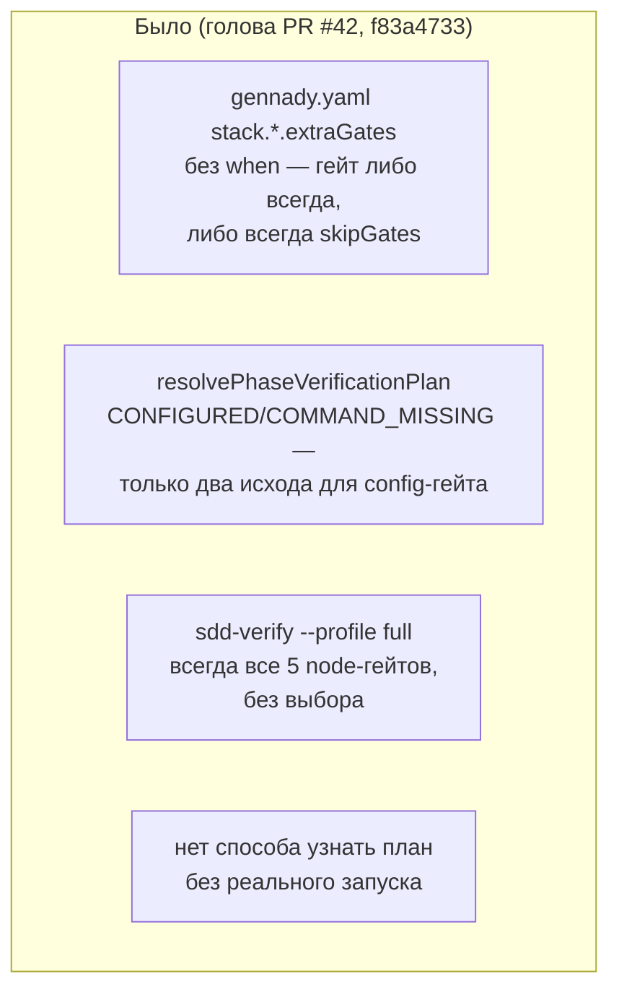
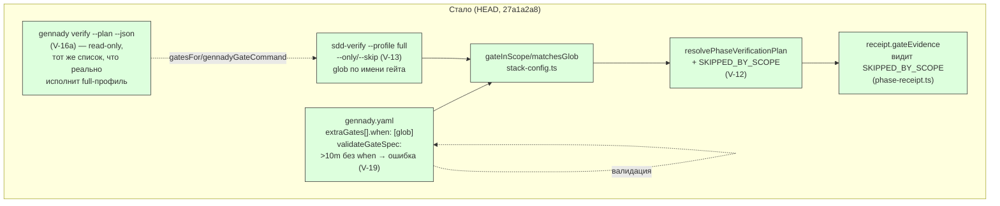

СВОДНЫЙ ОТЧЁТ — Пачка 13 «Гейты сужаются по файлам фазы, план читается без запуска» (Волна 2)

Ветка: `lead/verify-gate-scope`. База: `f83a4733` (голова `lead/verify-stacks`, PR #42 — ещё не
влит на момент исполнения; после мержа #42 дифф этой пачки сократится, конфликтов не ожидается —
файлы пересекаются, но правки в непересекающихся диапазонах строк, кроме `stack-config.ts`, где
все три задачи этой пачки правят один и тот же файл последовательно своими коммитами).

Задачи (порядок исполнения по зависимостям строк доски): **V-19 → V-12 → V-13 → V-16a**.
Коммиты: `ccee2da8` → `0c34c8e0` → `f68ea25e` → `27a1a2a8` (HEAD).
Индивидуальные отчёты: `R-V-19.md`, `R-V-12.md`, `R-V-13.md`, `R-V-16a.md`.

## Черновик описания PR (простым языком)

Фаза теперь проверяет только то, что реально затронула — если в конфиге `gennady.yaml` у гейта
объявлена файловая маска (`when: [<glob>]`), гейт молчаливо не пропадает, а виден в квитанции как
явно «отсечён по области» (не выполнялся, потому что фаза не тронула подходящий файл). Долгий гейт
(дольше 10 минут) без такой маски теперь красная ошибка конфигурации при загрузке — раньше можно
было объявить дорогой гейт, который гоняется на каждой правке, без единого предупреждения.
Выбор/пропуск конкретных гейтов по имени или маске (`--only`/`--skip`) появился на полном профиле
(`gennady sdd-verify --profile full`) — но не на фазовом прогоне, потому что там квитанция обязана
байт-в-байт совпадать с каноническим планом тикета. И наконец — план проверки (какие гейты,
какими командами) теперь можно прочитать одной командой `gennady verify --plan --json`, ничего не
запуская: удобно для CI-отчётов и для того, чтобы понять, что вообще будет проверяться, до того
как тратить время на реальный прогон.

## Таблица «файл → смысл»

| Файл | Смысл правки |
|---|---|
| `shared/verify/verify.types.ts` | `GateSpec` учит новое поле `when` (файловая маска гейта) |
| `shared/verify/stack-config.ts` | Схема + валидация `when`; ошибка «долгий гейт без when»; общий glob-компилятор (`matchesGlob`), используемый и файловой областью, и `--only/--skip`; `applyStackConfig` учитывает `when` (схемно, без живого потребителя — см. `R-V-12.md`) |
| `shared/sdd/phase-verification-plan.ts` | Новое состояние гейта `SKIPPED_BY_SCOPE`; резолв `when` против Target Files фазы |
| `shared/sdd/phase-receipt.ts` | Квитанция принимает новое состояние гейта при повторном чтении |
| `shared/verify/presets/anystack.ts`, `presets/node.ts` | anystack умеет объяснить, почему гейт вне области; node/golang — не участвуют (паритет без конфига сохранён) |
| `cli/cmd/sdd-verify/sdd-verify.types.ts` | Парсинг `--only`/`--skip`, запрет на фазовом прогоне, общий резолвер селекторов |
| `cli/cmd/sdd-verify/sdd-verify.cmd.ts` | Применение `--only`/`--skip` только на полном профиле; починен баг, из-за которого «только качественный хвост» тихо ничего не запускал; self-hosting-хелпер стал переиспользуемым |
| `cli/cmd/sdd-verify/index.ts`, `help.ts` | Проброс флагов из CLI; обновлён `--help` |
| `cli/cmd/verify/**` (новая директория) | Новая команда `gennady verify --plan --json` — read-only план, ничего не исполняет |
| `cli/gennady.ts` | Регистрация новой команды `verify` |
| `*.test.ts` (8 файлов, новых или дополненных) | Детерминированные тесты на каждый пункт выше |

## Архитектура — было / стало (весь контур пачки)





## Доказательства (батч целиком)

| Команда | Вывод | Статус |
|---|---|---|
| `npm --prefix <tree> run type-check` | чисто, exit 0 | ВЫПОЛНЕНО |
| `npm --prefix <tree> run test` (полный, финальный прогон после всех 4 коммитов) | `# tests 3935 / # pass 3925 / # fail 0 / # cancelled 0 / # skipped 10` | ВЫПОЛНЕНО |
| `npm --prefix <tree> run build` | `✓ built in 3.20s`, `dist/gennady.js` собран | ВЫПОЛНЕНО |
| `npm --prefix <tree> run gate:sdd-check-baseline` | `OK — no error outside the baseline (baseline 227c03a83830124fe2aa22541dd5374beb8a53c6, tag rc-baseline-1)` | ВЫПОЛНЕНО (0 новых) |
| `node dist/gennady.js sdd-check --all <tree>` | Полный вывод содержит только уже известные baseline-находки в чужих файлах (`agent-inbox.task-*.md`, `mr-stats.spec.md` и т.п.), ни одной новой находки в `shared/verify/**`, `shared/sdd/phase-verification-plan.ts`, `cli/cmd/sdd-verify/**`, `cli/cmd/verify/**` — подтверждено строкой выше (baseline-гейт — авторитетный источник «0 новых») | ВЫПОЛНЕНО |
| `git diff lead/verify-stacks..HEAD -- '*golden*'` | пустой вывод — байт-в-байт паритет V-01 сохранён, объяснять диффы построчно не требовалось | ВЫПОЛНЕНО, эталон не обновлялся |
| `npm --prefix <tree> run check` (= pre-commit hook на каждый из 4 коммитов) | `[sdd-verify] ✅ ALL PASS (5/5)` на финальном (и на каждом коммите — иногда со 2-3 попытки из-за флейка `test:coverage` под нагрузкой, воспроизводимо не связанного с изменёнными файлами — см. ниже) | ВЫПОЛНЕНО |

**Про флейк `test:coverage`.** На всех 4 коммитах первая попытка `npm run check` иногда падала с
`cancelled`/`not ok` в файлах, не относящихся к этой пачке (`bootstrap-path.test.ts`,
`clean-repo-composition.test.ts`, `inbox-review-plan.test.ts`, `lint.cmd.test.ts`) — воспроизведено
и на НЕИЗМЕНЁННОМ `lead/verify-stacks` (до начала работы над пачкой), то есть окружение под
нагрузкой (вероятно c8-инструментация + конкурентные прогоны), а не регресс этой пачки. Каждый раз
подтверждено изолированным прогоном упавших файлов (зелёные) и повторным `npm run check` (зелёный).
Синхронный повтор согласно правилу («до 3 раз») — коммит V-16a потребовал 3 попытки, остальные 2.

## Отклонения и открытые вопросы (сводно, детали — в индивидуальных отчётах)

1. **V-19**: файл `phase-verification-plan.ts` из брифа не тронут — задача чисто
   конфиг-валидационная, рантайм не участвует (§4 `R-V-19.md`).
2. **V-12**: файловые ссылки брифа (`stack-config.ts:34-45`, `phase-context.ts:169-239`) устарели
   относительно фактической архитектуры после V-08/V-08b (пачка 11) — реальное вживление живёт в
   `presets/anystack.ts` + `phase-verification-plan.ts`; `phase-context.ts` не пришлось трогать
   вовсе (§4 `R-V-12.md`).
3. **V-13**: `gennady verify` (одно из двух мест в дословной формулировке брифа) НЕ несёт
   `--only`/`--skip` — она read-only по D-13 и физически нечего фильтровать в исполнении;
   реализовано только на `sdd-verify --profile full`. Пример `swiftlint*` из issue не
   воспроизведён буквально (extraGates не вжиты в full-профиль — отдельная, более крупная задача).
   Найден и исправлен баг `fullFoundationGreen` (§4 `R-V-13.md`).
4. **V-16a**: первая реализация плана ошибочно читала `stack.use`/anystack — план показывал бы
   гейты, которые full-профиль на самом деле никогда не исполнит. Исправлено до коммита: план
   строится по факту исполняемого (`gatesFor`), не по аспирационному стеку (§4 `R-V-16a.md`).

**Ни одно из отклонений не требовало остановки** — все либо снижают риск (меньший дифф), либо
найдены и исправлены собственными тестами до коммита, либо являются задокументированными
архитектурными следствиями решений оператора, принятых ДО этой пачки (D-13/O-2).

## Команды пуша для Lead

Ветка не пушилась (правило исполнителя — `git push` только у Lead).

```
git -C <lead-worktree> fetch <rc-remote-or-path> lead/verify-gate-scope
git -C <lead-worktree> push origin lead/verify-gate-scope
```

После пуша: PR в `codex/sdd-v2-rc52-followup`, база — после мержа PR #42 (`lead/verify-stacks`).
