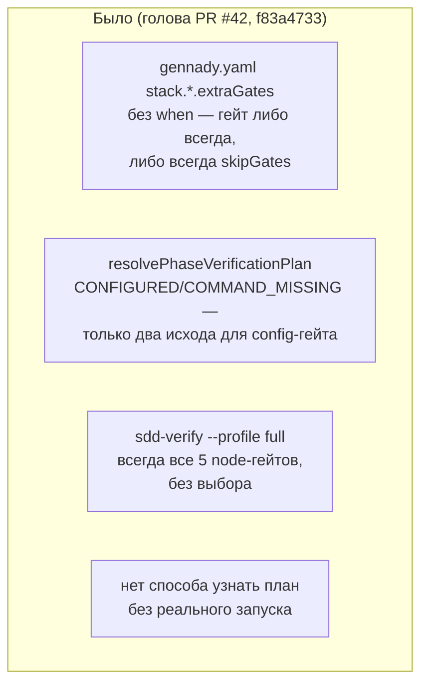
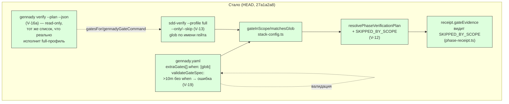

СВОДНЫЙ ОТЧЁТ — Пачка 13 «Гейты сужаются по файлам фазы, план читается без запуска» (Волна 2)

Ветка: `lead/verify-gate-scope`. База: `f83a4733` (голова `lead/verify-stacks`, PR #42 — ещё не
влит на момент исполнения; после мержа #42 дифф этой пачки сократится, конфликтов не ожидается —
файлы пересекаются, но правки в непересекающихся диапазонах строк, кроме `stack-config.ts`, где
все три задачи этой пачки правят один и тот же файл последовательно своими коммитами).

Задачи (порядок исполнения по зависимостям строк доски): **V-19 → V-12 → V-13 → V-16a**.
Коммиты: `ccee2da8` → `0c34c8e0` → `f68ea25e` → `27a1a2a8` (HEAD).
Индивидуальные отчёты: `R-V-19.md`, `R-V-12.md`, `R-V-13.md`, `R-V-16a.md`.

## Черновик описания PR (простым языком)

Фаза теперь проверяет только то, что реально затронула — если в конфиге `gennady.yaml` у гейта
объявлена файловая маска (`when: [<glob>]`), гейт молчаливо не пропадает, а виден в квитанции как
явно «отсечён по области» (не выполнялся, потому что фаза не тронула подходящий файл). Долгий гейт
(дольше 10 минут) без такой маски теперь красная ошибка конфигурации при загрузке — раньше можно
было объявить дорогой гейт, который гоняется на каждой правке, без единого предупреждения.
Выбор/пропуск конкретных гейтов по имени или маске (`--only`/`--skip`) появился на полном профиле
(`gennady sdd-verify --profile full`) — но не на фазовом прогоне, потому что там квитанция обязана
байт-в-байт совпадать с каноническим планом тикета. И наконец — план проверки (какие гейты,
какими командами) теперь можно прочитать одной командой `gennady verify --plan --json`, ничего не
запуская: удобно для CI-отчётов и для того, чтобы понять, что вообще будет проверяться, до того
как тратить время на реальный прогон.

## Таблица «файл → смысл»

| Файл | Смысл правки |
|---|---|
| `shared/verify/verify.types.ts` | `GateSpec` учит новое поле `when` (файловая маска гейта) |
| `shared/verify/stack-config.ts` | Схема + валидация `when`; ошибка «долгий гейт без when»; общий glob-компилятор (`matchesGlob`), используемый и файловой областью, и `--only/--skip`; `applyStackConfig` учитывает `when` (схемно, без живого потребителя — см. `R-V-12.md`) |
| `shared/sdd/phase-verification-plan.ts` | Новое состояние гейта `SKIPPED_BY_SCOPE`; резолв `when` против Target Files фазы |
| `shared/sdd/phase-receipt.ts` | Квитанция принимает новое состояние гейта при повторном чтении |
| `shared/verify/presets/anystack.ts`, `presets/node.ts` | anystack умеет объяснить, почему гейт вне области; node/golang — не участвуют (паритет без конфига сохранён) |
| `cli/cmd/sdd-verify/sdd-verify.types.ts` | Парсинг `--only`/`--skip`, запрет на фазовом прогоне, общий резолвер селекторов |
| `cli/cmd/sdd-verify/sdd-verify.cmd.ts` | Применение `--only`/`--skip` только на полном профиле; починен баг, из-за которого «только качественный хвост» тихо ничего не запускал; self-hosting-хелпер стал переиспользуемым |
| `cli/cmd/sdd-verify/index.ts`, `help.ts` | Проброс флагов из CLI; обновлён `--help` |
| `cli/cmd/verify/**` (новая директория) | Новая команда `gennady verify --plan --json` — read-only план, ничего не исполняет |
| `cli/gennady.ts` | Регистрация новой команды `verify` |
| `*.test.ts` (6 файлов, новых или дополненных — исправлено по `V-BATCH-13` Н-6, было ошибочно «8») | Детерминированные тесты на каждый пункт выше |

## Архитектура — было / стало (весь контур пачки)





## Доказательства (батч целиком)

| Команда | Вывод | Статус |
|---|---|---|
| `npm --prefix <tree> run type-check` | чисто, exit 0 | ВЫПОЛНЕНО |
| `npm --prefix <tree> run test` (полный, финальный прогон после всех 4 коммитов) | `# tests 3935 / # pass 3925 / # fail 0 / # cancelled 0 / # skipped 10` | ВЫПОЛНЕНО |
| `npm --prefix <tree> run build` | `✓ built in 3.20s`, `dist/gennady.js` собран | ВЫПОЛНЕНО |
| `npm --prefix <tree> run gate:sdd-check-baseline` | `OK — no error outside the baseline (baseline 227c03a83830124fe2aa22541dd5374beb8a53c6, tag rc-baseline-1)` | ВЫПОЛНЕНО (0 новых) |
| `node dist/gennady.js sdd-check --all <tree>` | Полный вывод содержит только уже известные baseline-находки в чужих файлах (`agent-inbox.task-*.md`, `mr-stats.spec.md` и т.п.), ни одной новой находки в `shared/verify/**`, `shared/sdd/phase-verification-plan.ts`, `cli/cmd/sdd-verify/**`, `cli/cmd/verify/**` — подтверждено строкой выше (baseline-гейт — авторитетный источник «0 новых») | ВЫПОЛНЕНО |
| `git diff lead/verify-stacks..HEAD -- '*golden*'` | пустой вывод — байт-в-байт паритет V-01 сохранён, объяснять диффы построчно не требовалось | ВЫПОЛНЕНО, эталон не обновлялся |
| `npm --prefix <tree> run check` (= pre-commit hook на каждый из 4 коммитов) | `[sdd-verify] ✅ ALL PASS (5/5)` на финальном (и на каждом коммите — иногда со 2-3 попытки из-за флейка `test:coverage` под нагрузкой, воспроизводимо не связанного с изменёнными файлами — см. ниже) | ВЫПОЛНЕНО |

**Про флейк `test:coverage`.** На всех 4 коммитах первая попытка `npm run check` иногда падала с
`cancelled`/`not ok` в файлах, не относящихся к этой пачке (`bootstrap-path.test.ts`,
`clean-repo-composition.test.ts`, `inbox-review-plan.test.ts`, `lint.cmd.test.ts`) — воспроизведено
и на НЕИЗМЕНЁННОМ `lead/verify-stacks` (до начала работы над пачкой), то есть окружение под
нагрузкой (вероятно c8-инструментация + конкурентные прогоны), а не регресс этой пачки. Каждый раз
подтверждено изолированным прогоном упавших файлов (зелёные) и повторным `npm run check` (зелёный).
Синхронный повтор согласно правилу («до 3 раз») — коммит V-16a потребовал 3 попытки, остальные 2.

## Отклонения и открытые вопросы (сводно, детали — в индивидуальных отчётах)

1. **V-19**: файл `phase-verification-plan.ts` из брифа не тронут — задача чисто
   конфиг-валидационная, рантайм не участвует (§4 `R-V-19.md`).
2. **V-12**: файловые ссылки брифа (`stack-config.ts:34-45`, `phase-context.ts:169-239`) устарели
   относительно фактической архитектуры после V-08/V-08b (пачка 11) — реальное вживление живёт в
   `presets/anystack.ts` + `phase-verification-plan.ts`; `phase-context.ts` не пришлось трогать
   вовсе (§4 `R-V-12.md`).
3. **V-13**: `gennady verify` (одно из двух мест в дословной формулировке брифа) НЕ несёт
   `--only`/`--skip` — она read-only по D-13 и физически нечего фильтровать в исполнении;
   реализовано только на `sdd-verify --profile full`. Пример `swiftlint*` из issue не
   воспроизведён буквально (extraGates не вжиты в full-профиль — отдельная, более крупная задача).
   Найден и исправлен баг `fullFoundationGreen` (§4 `R-V-13.md`).
4. **V-16a**: первая реализация плана ошибочно читала `stack.use`/anystack — план показывал бы
   гейты, которые full-профиль на самом деле никогда не исполнит. Исправлено до коммита: план
   строится по факту исполняемого (`gatesFor`), не по аспирационному стеку (§4 `R-V-16a.md`).

**Ни одно из отклонений не требовало остановки** — все либо снижают риск (меньший дифф), либо
найдены и исправлены собственными тестами до коммита, либо являются задокументированными
архитектурными следствиями решений оператора, принятых ДО этой пачки (D-13/O-2).

## Правки по вердикту верификатора (`V-BATCH-13.md`, применены `rc-executor` в дереве
`.../scratchpad/rc-w2`, ветка `lead/verify-gate-scope`, поверх `27a1a2a8` — 4 новых коммита)

| Находка | Что сделано | Где |
|---|---|---|
| **Б-1** (`--help` лжёт про детект стека) | Строка справки переписана: «`stack` is always `node` … does not read `stack:`/`extraGates` (they reach only the phase path, V-08/V-08b) — `--plan` reports what will actually run» | `cli/cmd/verify/help.ts`, коммит `a9d7ad75` |
| **Б-2** (0 правок спек при закрытии 4 задач; `Usage Waiver` `StackRun`/`VerifyReport`/`formatDuration`/`applyStackConfig` не пересмотрены) | `StackRun`/`VerifyReport`/`formatDuration` пересмотрены при закрытии V-16a (владелец исчерпан, форма MAIN не принята → successor «extraGates/anystack вживляются в полный профиль»); `applyStackConfig` пересмотрена при закрытии V-12 (новые `when`/`targets`, всё ещё 0 живых call site); «модуль не имеет собственного CLI-входа» исправлено (`cli/cmd/verify/**` — read-only вход, V-16a); `<summary>` пересчитан; в `sdd-verify.spec.md` добавлены `--only`/`--skip`, `resolveGateSelectors`, `ERR_CLI_SDD_VERIFY_UNKNOWN_SELECTOR`, `ERR_CLI_SDD_VERIFY_EMPTY_SELECTION`, ветка `exitCode: 4` | `specs/cli/verify/verify.spec.md`, `specs/cli/sdd-verify/sdd-verify.spec.md`, коммит `a501929e` |
| **Б-3** (V-16 «явно маркирует вывод как не-evidence» не выполнен в машинном выводе) | `VerifyPlanDocument` получил `kind: 'plan'` + `evidence: false` (DbC `@invariant`); утверждение в `verify.cmd.test.ts` и в live-CLI тесте `cli/__tests__/tool-behavior/verify.test.ts` | `cli/cmd/verify/verify.types.ts` + `verify.cmd.ts`, коммит `a9d7ad75`; тесты — коммит `f1abfb5a` |
| **Н-1** (взаимоуничтожающиеся `--only`/`--skip` → зелёный `ALL PASS (0/0)`) | Пустой набор гейтов после резолва `--only`/`--skip` → `ERR_CLI_SDD_VERIFY_EMPTY_SELECTION`, exit 4, «selectors select no gate»; 2 регресс-теста (`--only=x --skip=x`, `--skip=*`) | `cli/cmd/sdd-verify/sdd-verify.cmd.ts`, коммит `61bf695c`; тесты — коммит `f1abfb5a` |
| **Н-2** («видно в receipt» доказано чтением, не тестом) | Новый e2e-кейс поверх anystack-фикстуры (V-08b): гейт `SKIPPED_BY_SCOPE` пишется в `gateEvidence`, файл перечитывается, `phaseReceiptCommandIssue` подтверждает | `cli/cmd/sdd-verify/__tests__/phase-run.test.ts`, коммит `f1abfb5a` |
| **Н-5** (комментарий ссылался на несуществующий по смыслу §3.0) | Заменено на ссылку на L-24 + факт `gatesFor` | `cli/cmd/verify/verify.cmd.ts`, коммит `a9d7ad75` |
| **Н-6** (арифметика «8 тест-файлов» вместо 6) | Строка таблицы выше в этом отчёте исправлена на 6 | Этот файл, раздел «Таблица „файл → смысл“» |
| **Н-8** (семантика `gateInScope` при пустом Target Files/`deletedFiles` не задокументирована) | Одно предложение в `@invariant`: пустой `targets` отсекает любой `when`-гейт; `deletedFiles` не учитывается. Документация, поведение не менялось | `shared/verify/stack-config.ts`, коммит `a501929e` |
| **Н-3** (`--only=swiftlint*` структурно недостижим) | Код не тронут (по прямому указанию Lead) — задокументировано как остаток ниже | — |
| **Н-4** (4-я точка `resolvePreset(...)!`, L-24 устарела) | Код не тронут (`phase-verification-plan.ts` вне периметра «трогать» этой ветки) — актуальные номера строк подтверждены и приведены ниже | — |
| **Н-7** (независимый прогон `yagni` непроверяем) | Код не тронут — не поведенческая находка, нечего чинить в этой ветке | — |

Доказательства правок (все команды перезапущены после всех 4 коммитов, дерево RC-исполнителя):

| Команда | Вывод |
|---|---|
| `gennady verify --help` | больше не утверждает детект стека (см. текст выше) |
| `gennady verify --plan --json` | `{"kind":"plan","evidence":false,"profile":"full","stack":"node",...}` |
| `gennady sdd-verify --profile full --only=yagni --skip=yagni` | `ERR_CLI_SDD_VERIFY_EMPTY_SELECTION: --only/--skip selectors select no gate — nothing would run.` exit 4 (было `ALL PASS (0/0)` exit 0) |
| `npm --prefix <tree> test` (финальный, после всех 4 новых коммитов) | `# tests 3938 / # pass 3928 / # fail 0 / # cancelled 0 / # skipped 10` |
| `npm --prefix <tree> run check` | `[sdd-verify] ✅ ALL PASS (5/5)` |
| `npm --prefix <tree> run lint:contracts` | `✅ … no errors` |
| `npm --prefix <tree> run build` | `✓ built in 3.64s` |
| `npm --prefix <tree> run gate:sdd-check-baseline` | `OK — no error outside the baseline (baseline commit 227c03a8…, tag rc-baseline-1)` |
| `git diff 27a1a2a8..HEAD -- '*golden*'` | пусто — паритет с `lead/verify-stacks` сохранён |

Про pre-commit под нагрузкой: коммит `61bf695c` (Н-1 fix) потребовал 3 попытки (1-я: посторонний
`lint.cmd.test.ts` fail; 2-я: `test:coverage` halt с `cancelled 4`; 3-я — зелёная); коммит `f1abfb5a`
(тесты) и `a501929e` (доки) каждый потребовали 1 автофикс форматирования (`npm run format:fix` на
конкретный файл, затем `git add -u`) — не `--no-verify`, файлы переформатированы честно перед
повторным коммитом.

**Предупреждение о рисках shared `refs/stash` в git worktree.** При подготовке коммитов C/D этой
ветки использование `git stash push/pop` для временного разведения по коммитам столкнулось с тем,
что `refs/stash` — общий на все worktree одного репозитория: один `git stash pop` в этом дереве
подхватил и удалил из списка чужой конкурентный стеш другого агента (`lead/reopen-by-cause: F-3
audit-contract-activation.mjs wip`, 3 файла вне периметра этой ветки). Инцидент обнаружен сразу
(рабочее дерево не совпало с ожидаемым), чужой стеш восстановлен (`git stash store`) и получен
обратно тем агентом в течение секунд; свой стеш затем применён точным хешем (`git stash apply
<hash>`, не по индексу) и сброшен только после проверки. Для коммитов C/D далее использовалось
исключительно файловое копирование (`cp`/`git restore --source=HEAD`) без `git stash`, чтобы
исключить повтор. Рабочее дерево и история этой ветки не пострадали; чужая ветка/сессия — тоже
(проверено: список стешей после инцидента содержит ровно те же посторонние записи, что и до начала
работы).

## Остатки (обновление после `V-BATCH-13`)

1. **V-13 — успешник для Н-3:** «`extraGates`/anystack вживляются в полный профиль» (M, зависит от
   V-08b) — без этой задачи `--only`/`--skip` навсегда ограничены фиксированной node-лестницей
   `gatesFor`; она же — новый предполагаемый владелец `StackRun`/`VerifyReport`/`formatDuration` в
   `specs/cli/verify/verify.spec.md` (см. `R-V-13.md §6`, `R-V-12.md §6`, `R-V-16a.md §6`).
2. **Вопрос оператору: `gennady verify --plan --json`'s node-only план — временно или навсегда?**
   Для anystack-репозитория план сегодня печатает node-лестницу с `command: null` — формально
   честно (совпадает с исполняемым full-профилем), практически бесполезно для CI-отчёта такого
   репозитория. Развязка — та же задача из п. 1. Токен: `pending-operator` (по образцу D-49/L-16).
3. **Н-4 — обновить L-24 (перечень точек `resolvePreset(...)!` для V-08c/V-09):** подтверждено на
   HEAD этой ветки (`shared/sdd/phase-verification-plan.ts`, не тронут этой правкой): было
   `:53,71,282` на `f83a4733`, стало `:53,71,285,297` — 4-я точка (`scopeReasonForGate`, `:297`)
   добавлена задачей V-12. Правка самой L-24 — задача plan-editor'а на доске, не этой ветки.
4. **Н-7 — независимый прогон `yagni`:** без изменений, требует повторной проверки внутри
   pre-commit-хука самим оператором/верификатором; в этой ветке нечего чинить (не поведенческая
   находка).

## Команды пуша для Lead

Ветка не пушилась (правило исполнителя — `git push` только у Lead).

```
git -C <lead-worktree> fetch <rc-remote-or-path> lead/verify-gate-scope
git -C <lead-worktree> push origin lead/verify-gate-scope
```

После пуша: PR в `codex/sdd-v2-rc52-followup`, база — после мержа PR #42 (`lead/verify-stacks`).
Коммиты правок по вердикту (поверх `27a1a2a8`, все на той же ветке `lead/verify-gate-scope`):
`a9d7ad75` (fix: Б-1/Б-3/Н-5) → `61bf695c` (fix: Н-1) → `f1abfb5a` (test: Б-3/Н-1/Н-2) → `a501929e`
(docs: Б-2/Н-8, HEAD).
