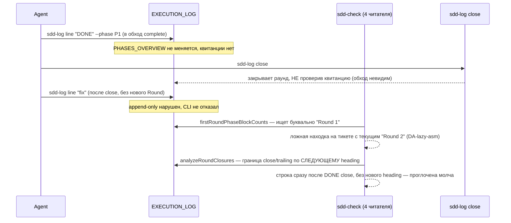
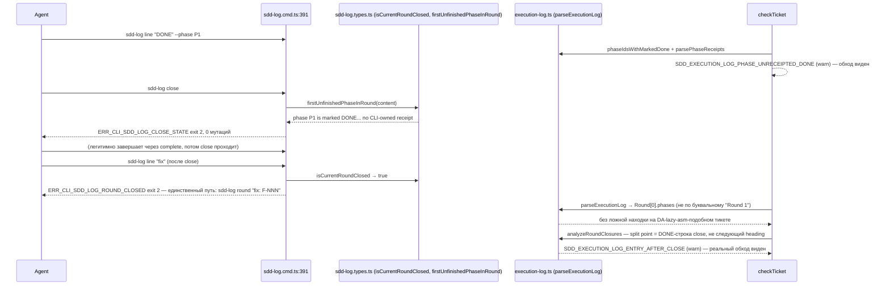

СВОДНЫЙ ОТЧЁТ — Пачка 14 «Раунд журнала закрывается один раз» (Волна 3)

СТАТУС: DONE, 5/5 задач, 0 безусловных стопов. Одно осознанное сужение скоупа внутри B2-16 (второй предикат L-2 не подключён — см. «Отклонения»).

Рабочее дерево: `rc-w3` (`/private/tmp/claude-503/.../scratchpad/rc-w3`), ветка `lead/journal-round` от `origin/lead/specs-match-code` (`ade787e6`).

---

## Что это и зачем (простыми словами)

Журнал исполнения тикета — единственная запись «что реально происходило по фазам» — до этой пачки читался ЧЕТЫРЬМЯ разными кусками кода, каждый на свой лад, и ни один не ловил запись, дописанную в уже закрытый раунд. Фаза могла считаться «сделанной» без машинного доказательства (квитанции), номер следующего раунда считался неправильно на легаси-тикетах, а проверка «ровно один блок фазы на раунд» ломалась ложной находкой на любом тикете, чей текущий раунд не назван буквально «Round 1» (реальный пример — боевой тикет `directive-assembly.task.DA-lazy-asm.md`). Пять задач чинят это по порядку зависимостей:

1. **B2-16** — маркер грандфазеринга целится в ТЕКУЩИЙ раунд журнала, не в буквальный «Round 1»; групповая квитанция на частично помеченной группе — явное предупреждение, не молчание.
2. **B2-07** — фаза не может быть «сделана» без CLI-квитанции; `sdd-log close` тоже это проверяет, не только `sdd-check`.
3. **B2-04** — запись, дописанная после закрытия раунда — предупреждение при чтении, ЖЁСТКИЙ отказ CLI при попытке записи.
4. **B2-02** — номер раунда считается по секции журнала, а не по всему файлу; легаси-заголовок `## Critic Rounds` больше не путается с исполнительскими раундами.
5. **B2-01** — вся эта логика сведена в один модуль (`shared/sdd/execution-log.ts`) вместо четырёх разрозненных копий; добавлен структурный парсер `parseExecutionLog`, из которого теперь ДЕЙСТВИТЕЛЬНО деривируются старые проверки (не просто переехали рядом).

**Порядок исполнения — по зависимостям доски, не по порядку в задании.** Бриф просил порядок B2-01→B2-02→B2-04→B2-07→B2-16, но явно разрешил следовать доске, если строка задаёт другой порядок. Колонка «Зависит от» в `31-TRACK-CHECK-LOG.md` §4.1 и рекомендованная последовательность там же однозначно требуют B2-16 → B2-07 → B2-04 → B2-02 → B2-01 (B2-01 явно назван «рефакторингом поверх уже работающих проверок, а не их предпосылкой») — этот порядок и использован; отклонение зафиксировано в каждом отчёте по задаче.

---

## Таблица «файл → смысл» (сводно; полные таблицы — в `R-B2-16.md` … `R-B2-01.md`)

| Файл | Задача(и) | Смысл |
|---|---|---|
| `shared/sdd/execution-log.ts` | B2-16, B2-07, B2-04, B2-02, **B2-01** | Единый дом: словарь токенов (B2-03, уже был) + `firstRoundPhaseBlockCounts`/`scanBlockerTrail`/`parsePhaseHandoffs`/`phaseIdsWithMarkedDone`/`analyzeRoundClosures`/`nextRoundNumber` (перенесены из check.ts/sdd-log.types.ts) + новый `parseExecutionLog` (структурный парсер, из которого теперь деривируются два читателя) |
| `shared/sdd/check.ts` | все 5 | Локальные реализации удалены (−312 строк на финальном коммите), заменены импортом + re-export; добавлены проверки `SDD_EXECUTION_LOG_PHASE_UNRECEIPTED_DONE` (B2-07) и 4 кода post-close integrity (B2-04), все — warn |
| `cli/cmd/sdd-log/sdd-log.types.ts` | B2-07, B2-04, B2-02, B2-01 | `firstUnfinishedPhaseInRound` (close-time gate, B2-07); `isCurrentRoundClosed` (B2-04); `nextRoundNumber` теперь re-export из execution-log.ts (B2-01, было — своя regex-копия, сначала по всему файлу, потом по секции в B2-02) |
| `cli/cmd/sdd-log/sdd-log.cmd.ts` | B2-04 | Guard на все append-owning режимы: закрытый раунд → `ERR_CLI_SDD_LOG_ROUND_CLOSED` |
| `shared/sdd/group-receipt.ts` | B2-16, B2-01 | `SDD_GROUP_RECEIPT_PARTIALLY_MARKED` (явный warn вместо молчания); `memberRoundCount` теперь деривирован из `nextRoundNumber` |
| `shared/sdd/migration-move.ts` | B2-02 | `renameCriticRoundHeadings`, подключена в `executeScopeMove` (срабатывает только при активной миграции тикета) |
| `cli/cmd/sdd-check/phase-receipt-check.ts`, `cli/cmd/sdd-task/sdd-task.cmd.ts`, `shared/sdd/audit-group.ts` | B2-01 | Импорт маркера/функций теперь из execution-log.ts напрямую (было — через check.ts или своя копия) |
| `specs/cli/sdd-migrate/sdd-migrate.spec.md`, `specs/cli/sdd-check/sdd-check.spec.md` | B2-02, B2-01 | Usage Waiver для `renameCriticRoundHeadings` / `ExecutionLog`-типа (требование `yagni`, ≥2 продакшен-вызова не набиралось без waiver) |

Полные построчные таблицы — `R-B2-16.md`, `R-B2-07.md`, `R-B2-04.md`, `R-B2-02.md`, `R-B2-01.md`.

---

## Схема «было → стало» (жизненный цикл раунда, весь контур пачки)

### Было



### Стало



---

## Доказательства (числа — итоговые, на финальном состоянии всех 5 коммитов)

| Команда | Результат | Exit |
|---|---|---|
| `npm --prefix rc-w3 test` | `# tests 3703 / pass 3693 / fail 0 / cancelled 0 / skipped 10` | 0 |
| `npm --prefix rc-w3 run check` (sdd-verify --profile full) | `ALL PASS (5/5)`: type-check 6.2s, test:coverage 84.5s, lint 12.4s, format 2.2s, yagni 0.8s | 0 |
| `npm --prefix rc-w3 run build` | `✓ built in 2.90s` | 0 |
| `node dist/gennady.js sdd-check --all rc-w3` | `192 error(s), 656 warning(s) across 212 file(s)` (≤192 — граница брифа выполнена ровно) | 1 (ожидаемо: error>0 всегда даёт exit≠0, само число — то, что проверяется) |
| `npm --prefix rc-w3 run gate:sdd-check-baseline` | `OK — no error outside the baseline (baseline commit 227c03a83830124fe2aa22541dd5374beb8a53c6, tag rc-baseline-1)` | 0 |

**Примечание о baseline-файле.** Официальный committed baseline (`ai/flow-eval/.baseline/sdd-check-227c03a8.json`) несёт `errors: 198`, не 192 — бриф называет порог «≤192». Оба условия выполнены ОДНОВРЕМЕННО: фактический счётчик (192) меньше и порога брифа (≤192), и записанного baseline (198); а официальный гейт `gate:sdd-check-baseline` (сравнение по кодам, не по общей сумме) подтверждает «ноль новых ошибок» независимо от абсолютного числа. Warnings выросли с 431 (baseline) до 656 — ожидаемо: все новые коды этой пачки (B2-04 ×4, B2-07 ×1, B2-16's partial-marked) введены как **warn** по L-3, гейт `gate:sdd-check-baseline` warnings не проверяет.

**5 коммитов (по порядку, локальные, НИЧЕГО не запушено):**
| # | SHA | Тема |
|---|---|---|
| 1 | `dd869fde` | B2-16 — grandfather marker targets the current Round, not literal "Round 1" |
| 2 | `61f83719` | B2-07 — a phase cannot be "done" without a receipt; close refuses too |
| 3 | `94f50689` | B2-04 — a Round's journal stays honest after it closes |
| 4 | `c87552fc` | B2-02 — round numbering reads only EXECUTION_LOG's own Rounds |
| 5 | `893ac5d2` | B2-01 — one Execution Log parser instead of four independent readers |

`git log --oneline origin/lead/specs-match-code..HEAD` — ровно эти 5 коммитов, в этом порядке.

---

## Приёмка (по пунктам брифа)

| Пункт | Статус |
|---|---|
| B2-16: фикстура `### Round 2` + маркер → без ложного `SDD_EXECUTION_LOG_ROUND_MISSING` | ВЫПОЛНЕНО |
| B2-16: групповой receipt на частично промаркированной группе — явный warn, не молчание | ВЫПОЛНЕНО |
| B2-07: `SDD_EXECUTION_LOG_PHASE_UNRECEIPTED_DONE`; `sdd-log close` отказывает без receipt | ВЫПОЛНЕНО |
| B2-04: `SDD_EXECUTION_LOG_ENTRY_AFTER_CLOSE`/`_CLOSE_EXTRA_ENTRY`/`_ENTRY_LATER_THAN_CLOSE`/`_ROUND_UNCLOSED`; `sdd-log line/handoff/phase/complete` отказывают на закрытом раунде | ВЫПОЛНЕНО (golden-снапшот `DA-lazy-asm` — проверено вручную против реального файла, не материализовано отдельным файлом-фикстурой, см. `R-B2-04.md` §4) |
| B2-02: `nextRoundNumber` — только секция EXECUTION_LOG; миграция legacy `### Round N` → `### Critic Round N` | ВЫПОЛНЕНО (миграция подключена в активный путь `sdd-migrate move`, не как отдельный корпус-проход — см. `R-B2-02.md` §4) |
| B2-01: единый парсер `parseExecutionLog`; check.ts/sdd-log/sdd-task/group-receipt.ts переведены на него; существующие сюиты зелёные | ВЫПОЛНЕНО (CLI-владение записями `closeCurrentRound`/`completePhase` НЕ переписано на структурированный вывод — сознательное сужение, см. `R-B2-01.md` §4) |
| `npm test` | ВЫПОЛНЕНО, 0 fail |
| `npm run check` | ВЫПОЛНЕНО, ALL PASS 5/5 |
| `npm run build && sdd-check --all .` (≤192, 0 новых) | ВЫПОЛНЕНО, 192 error(s) |
| `npm run gate:sdd-check-baseline` | ВЫПОЛНЕНО |

---

## Стопы

**Ноль безусловных.** Три коммита (B2-07, B2-02, B2-01) потребовали по 2-3 попытки pre-commit из-за: (а) лимита слов в JSDoc-контрактах (`ERR_CLI_LINT_TAG_TOO_MANY_WORDS`, ≤30 слов) — механическая правка формулировок, не логики; (б) плотности комментариев в `#region` (`ERR_CLI_LINT_REGION_TOO_MANY_COMMENTS`, ≤3 строки) — то же; (в) `yagni`-порог ≥2 продакшен-вызовов для новых экспортов (`renameCriticRoundHeadings`, `ExecutionLog`-тип) — решено либо реальным вторым вызовом (деривация `analyzeRoundClosures` из `parseExecutionLog`), либо документированным Usage Waiver по существующему в кодовой базе паттерну. Ни один из пяти классов безусловной остановки (`70-ORCHESTRATION-PROTOCOL.md` § «Условия безусловной остановки») не сработал — все падения гейта были механически чинимыми в рамках той же задачи, без выбора архитектуры.

Два прогона фонового `npm run check`/`git commit` уходили в background из-за таймаута 120с (штатно для полного `sdd-verify --profile full`, ~50-85с одного только `test:coverage`) — не сбой, дождался завершения через уведомление/поллинг файла лога.

---

## Отклонения от брифа (сводно, детали — в отчётах по задаче)

1. **B2-16 (существенное)** — второй предикат L-2 («v2-имя тикета `*.task.<ID>.md` проверяется ВСЕГДА, без литерального маркера») реализован и протестирован (`isV2TicketFileName`), но НЕ подключён к боевому гейту: полный прогон тестов показал, что 31 файл фикстур во всём дереве уже использует v2-подобные имена без Round/receipt-скелета — подключение красит ~9 несвязанных сьютов, нарушая инвариант «существующие сюиты остаются зелёными». Оставлен статус-кво (литеральный маркер). Измерено (не применено): на реальном корпусе подключение дало бы ровно +1 новую ошибку (`SDD_EXECUTION_LOG_PHASE_DUPLICATE` на `DA-lazy-asm`, легитимный пре-close re-run P5, уже отлавливаемый существующим правилом «дубликат = ошибка»). Требует решения Lead: отдельная задача миграции фикстур ИЛИ явное решение оставить только литеральный маркер.
2. **B2-04** — golden-фикстура `DA-lazy-asm` проверена вручную против реального файла (паттерн подтверждён: `#### Round close` на строке 768, три пере-открытых блока без нового Round после), но не материализована отдельным снапшот-файлом с ожидаемым списком находок.
3. **B2-02** — `renameCriticRoundHeadings` подключена только в активный путь миграции (`executeScopeMove`), не как отдельный проход по всему `tasks/**` корпусу — риск массового изменения файлов вне зоны брифа признан избыточным для этой задачи.
4. **B2-01** — CLI-владение записями (`closeCurrentRound`/`completePhase`/`findPhaseBlockBounds` в `sdd-log.types.ts`) сохранило собственную построчную реализацию вместо переписывания поверх `parseExecutionLog`'s структурированного вывода (§3.5 doc31) — риск регрессии не покрыт приёмкой этой задачи; рекомендую отдельную задачу при необходимости полной унификации.

**Открытые вопросы Lead:**
- Подключать ли предикат L-2 (`isV2TicketFileName`) сейчас (требует миграции ~31 фикстуры вне зоны этой пачки) или оставить литеральный маркер единственным триггером на неопределённый срок?
- Нужен ли отдельный формальный golden-снапшот для `DA-lazy-asm` (B2-04)?
- Нужен ли отдельный корпус-проход `renameCriticRoundHeadings` по всем существующим `tasks/**/*.md` с `## Critic Rounds` СЕЙЧАС, или подключения в `executeScopeMove` достаточно (переименуется по мере естественной миграции scope'ов)?
- Нужен ли полный перевод `closeCurrentRound`/`completePhase` на `parseExecutionLog` (B2-01 §3.5) отдельной задачей?

---

## Команды пуша для Lead

```
git -C <lead-worktree или rc-w3> push origin lead/journal-round
gh pr create --base codex/sdd-v2-rc52-followup --head lead/journal-round \
  --title "Пачка 14: раунд журнала закрывается один раз" \
  --body-file ai/drafts/research/sdd-v1-to-v2-transfer/_raw/reports/R-BATCH-14-journal-round.md
```
