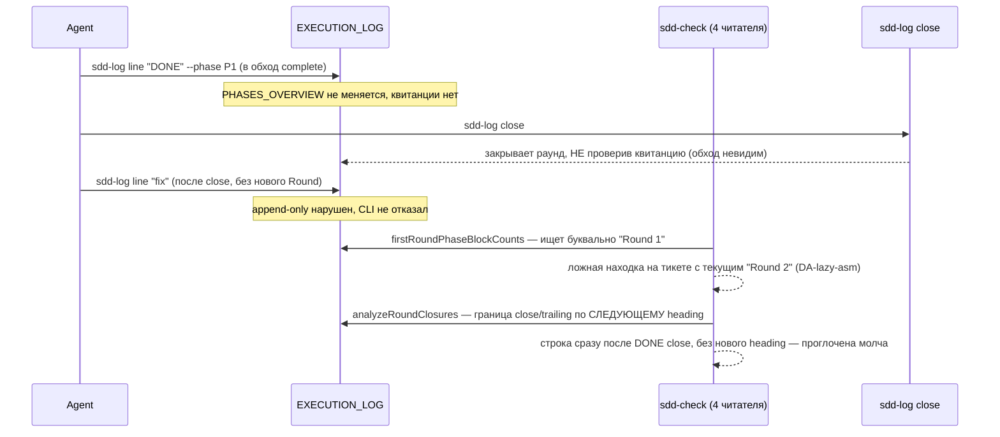
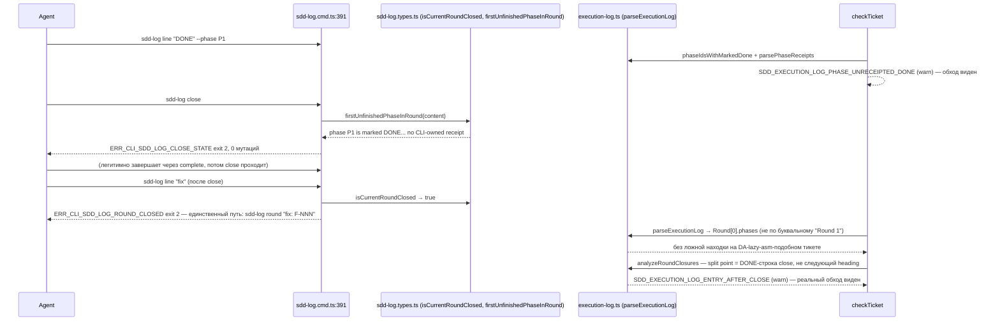

СВОДНЫЙ ОТЧЁТ — Пачка 14 «Раунд журнала закрывается один раз» (Волна 3)

СТАТУС: DONE, 5/5 задач + V-BATCH-14 follow-up (2 блокирующих + 4 из 7 неблокирующих закрыты, 4 доп. коммита), 0 безусловных стопов. Одно осознанное сужение скоупа внутри B2-16 (второй предикат L-2 написан и полностью откачен, не «реализован, но не подключён» — см. «Отклонения» и §«Правки по V-BATCH-14»).

Рабочее дерево: `rc-w3` (`/private/tmp/claude-503/.../scratchpad/rc-w3`), ветка `lead/journal-round` от `origin/lead/specs-match-code` (`ade787e6`).

---

## Что это и зачем (простыми словами)

Журнал исполнения тикета — единственная запись «что реально происходило по фазам» — до этой пачки читался ЧЕТЫРЬМЯ разными кусками кода, каждый на свой лад, и ни один не ловил запись, дописанную в уже закрытый раунд. Фаза могла считаться «сделанной» без машинного доказательства (квитанции), номер следующего раунда считался неправильно на легаси-тикетах, а проверка «ровно один блок фазы на раунд» ломалась ложной находкой на любом тикете, чей текущий раунд не назван буквально «Round 1» (реальный пример — боевой тикет `directive-assembly.task.DA-lazy-asm.md`). Пять задач чинят это по порядку зависимостей:

1. **B2-16** — маркер грандфазеринга целится в ПЕРВЫЙ (самый ранний) раунд журнала, не в буквальный «Round 1» (правка формулировки по V-BATCH-14 неблокирующему п.6: код и его JSDoc всегда называли это «FIRST», прежняя формулировка здесь и в тестовом комментарии ошибочно говорила «ТЕКУЩИЙ» — исправлен комментарий, не код, см. «§ Правки по V-BATCH-14»); групповая квитанция на частично помеченной группе — явное предупреждение, не молчание.
2. **B2-07** — фаза не может быть «сделана» без CLI-квитанции; `sdd-log close` тоже это проверяет, не только `sdd-check`.
3. **B2-04** — запись, дописанная после закрытия раунда — предупреждение при чтении, ЖЁСТКИЙ отказ CLI при попытке записи.
4. **B2-02** — номер раунда считается по секции журнала, а не по всему файлу; легаси-заголовок `## Critic Rounds` больше не путается с исполнительскими раундами.
5. **B2-01** — вся эта логика сведена в один модуль (`shared/sdd/execution-log.ts`) вместо четырёх разрозненных копий; добавлен структурный парсер `parseExecutionLog`, из которого теперь ДЕЙСТВИТЕЛЬНО деривируются старые проверки (не просто переехали рядом).

**Порядок исполнения — по зависимостям доски, не по порядку в задании.** Бриф просил порядок B2-01→B2-02→B2-04→B2-07→B2-16, но явно разрешил следовать доске, если строка задаёт другой порядок. Колонка «Зависит от» в `31-TRACK-CHECK-LOG.md` §4.1 и рекомендованная последовательность там же однозначно требуют B2-16 → B2-07 → B2-04 → B2-02 → B2-01 (B2-01 явно назван «рефакторингом поверх уже работающих проверок, а не их предпосылкой») — этот порядок и использован; отклонение зафиксировано в каждом отчёте по задаче.

---

## Таблица «файл → смысл» (сводно; полные таблицы — в `R-B2-16.md` … `R-B2-01.md`)

| Файл | Задача(и) | Смысл |
|---|---|---|
| `shared/sdd/execution-log.ts` | B2-16, B2-07, B2-04, B2-02, **B2-01** | Единый дом: словарь токенов (B2-03, уже был) + `firstRoundPhaseBlockCounts`/`scanBlockerTrail`/`parsePhaseHandoffs`/`phaseIdsWithMarkedDone`/`analyzeRoundClosures`/`nextRoundNumber` (перенесены из check.ts/sdd-log.types.ts) + новый `parseExecutionLog` (структурный парсер, из которого теперь деривируются два читателя) |
| `shared/sdd/check.ts` | все 5 | Локальные реализации удалены (−312 строк на финальном коммите), заменены импортом + re-export; добавлены проверки `SDD_EXECUTION_LOG_PHASE_UNRECEIPTED_DONE` (B2-07) и 4 кода post-close integrity (B2-04), все — warn |
| `cli/cmd/sdd-log/sdd-log.types.ts` | B2-07, B2-04, B2-02, B2-01 | `firstUnfinishedPhaseInRound` (close-time gate, B2-07); `isCurrentRoundClosed` (B2-04); `nextRoundNumber` теперь re-export из execution-log.ts (B2-01, было — своя regex-копия, сначала по всему файлу, потом по секции в B2-02) |
| `cli/cmd/sdd-log/sdd-log.cmd.ts` | B2-04 | Guard на все append-owning режимы: закрытый раунд → `ERR_CLI_SDD_LOG_ROUND_CLOSED` |
| `shared/sdd/group-receipt.ts` | B2-16, B2-01 | `SDD_GROUP_RECEIPT_PARTIALLY_MARKED` (явный warn вместо молчания); `memberRoundCount` теперь деривирован из `nextRoundNumber` |
| `shared/sdd/migration-move.ts` | B2-02 | `renameCriticRoundHeadings`, подключена в `executeScopeMove` (срабатывает только при активной миграции тикета) |
| `cli/cmd/sdd-check/phase-receipt-check.ts`, `cli/cmd/sdd-task/sdd-task.cmd.ts`, `shared/sdd/audit-group.ts` | B2-01 | Импорт маркера/функций теперь из execution-log.ts напрямую (было — через check.ts или своя копия) |
| `specs/cli/sdd-migrate/sdd-migrate.spec.md`, `specs/cli/sdd-check/sdd-check.spec.md` | B2-02, B2-01 | Usage Waiver для `renameCriticRoundHeadings` / `ExecutionLog`-типа (требование `yagni`, ≥2 продакшен-вызова не набиралось без waiver) |

Полные построчные таблицы — `R-B2-16.md`, `R-B2-07.md`, `R-B2-04.md`, `R-B2-02.md`, `R-B2-01.md`.

---

## Схема «было → стало» (жизненный цикл раунда, весь контур пачки)

### Было



### Стало



---

## Доказательства (числа — итоговые, на финальном состоянии всех 9 коммитов, вкл. 4 follow-up по V-BATCH-14)

| Команда | Результат | Exit |
|---|---|---|
| `npm --prefix rc-w3 test` | `# tests 3707 / pass 3697 / fail 0 / cancelled 0 / skipped 10` (+4 теста — два для nextRoundNumber, два для DA-lazy-asm golden) | 0 |
| `npm --prefix rc-w3 run check` (sdd-verify --profile full) | `ALL PASS (5/5)`: type-check 6.1s, test:coverage 57.2s, lint 11.1s, format 2.4s, yagni 0.7s | 0 |
| `npm --prefix rc-w3 run build` | `✓ built in 4.24s` | 0 |
| `node dist/gennady.js sdd-check --all rc-w3` | `192 error(s), 656 warning(s) across 212 file(s)` — не изменилось follow-up коммитами (они не трогают `check.ts`); (≤192 — граница брифа выполнена ровно) | 1 (ожидаемо: error>0 всегда даёт exit≠0, само число — то, что проверяется) |
| `npm --prefix rc-w3 run gate:sdd-check-baseline` | `OK — no error outside the baseline (baseline commit 227c03a83830124fe2aa22541dd5374beb8a53c6, tag rc-baseline-1)` | 0 |

**Примечание о baseline-файле.** Официальный committed baseline (`ai/flow-eval/.baseline/sdd-check-227c03a8.json`) несёт `errors: 198`, не 192 — бриф называет порог «≤192». Оба условия выполнены ОДНОВРЕМЕННО: фактический счётчик (192) меньше и порога брифа (≤192), и записанного baseline (198); а официальный гейт `gate:sdd-check-baseline` (сравнение по кодам, не по общей сумме) подтверждает «ноль новых ошибок» независимо от абсолютного числа.

**Warnings (правка по V-BATCH-14 неблокирующему п.3 — два разных «было» не смешивать).** «431» — это `totals.warnings` из `ai/flow-eval/.baseline/sdd-check-227c03a8.json`, срез на коммите `227c03a8`, а НЕ «было» этой пачки. «Было» пачки (база ветки `ade787e6`, измерено прогоном на извлечённой базе) = **434**; «стало» (`893ac5d2`..текущая голова, не меняется этими 4 follow-up коммитами — они не трогают `check.ts`) = **656**; вклад пачки = **434 → 656, +222**, а не «431→656, +225». Разложение +222 по кодам (per-finding diff base↔head, `git diff ade787e6..893ac5d2`):

| код | severity | +N | файлов |
|---|---|---|---|
| `SDD_EXECUTION_LOG_PHASE_UNRECEIPTED_DONE` (B2-07) | warn | 82 | 30 |
| `SDD_EXECUTION_LOG_ENTRY_LATER_THAN_CLOSE` (B2-04) | warn | 55 | 5 |
| `SDD_EXECUTION_LOG_ROUND_UNCLOSED` (B2-04) | warn | 43 | 17 |
| `SDD_EXECUTION_LOG_CLOSE_EXTRA_ENTRY` (B2-04) | warn | 40 | 18 |
| `SDD_EXECUTION_LOG_ENTRY_AFTER_CLOSE` (B2-04) | warn | 2 | 2 |
| **итого** | | **222** | **41** |

Новых error — 0 (per-finding diff: ноль error-находок, отсутствующих в базе; ноль удалённых кодов-эмиттеров). Все пять кодов введены как **warn** по L-3 (вариант 2); `gate:sdd-check-baseline` сравнивает по кодам и warnings не проверяет вовсе, так что рост warn не влияет на его вердикт.

**Предупреждение о грандфазеринге (правка по V-BATCH-14 неблокирующему п.4).** Ни `SDD_EXECUTION_LOG_PHASE_UNRECEIPTED_DONE` (B2-07, `check.ts:426`), ни четыре кода B2-04 (`check.ts:388`) не закрыты маркером грандфазеринга `<!--PHASE_RECEIPTS:v1-->` — оба стоят под `if (logSec.status === 'ok')` без проверки маркера, в отличие от соседнего блока `check.ts:458`. Маркер сегодня не несёт ни один тикет в дереве (`grep -rl 'PHASE_RECEIPTS:v1' tasks/ specs/` → 2 спеки, обе до пачки), поэтому из 41 файла с новыми находками 40 — легаси-тикеты `tasks/**` без маркера, и только `DA-lazy-asm` — v2-именованный. Трек `31 §3.4` предписывает двухчастное правило («error на receipt-aware тикетах, warn на legacy»); реализация свернула его в «warn везде, без гейта». Это согласуется с L-3 (вариант 2, «warn сейчас»), но фиксирую явно: **отсутствие маркерного расщепления — предусловие переключения B2-20 (warn→error, гейт D-4/O-6 «только после самомиграции»)** — при будущем flip'е 222 легаси-предупреждения станут ошибками на легаси-корпусе, если это расщепление не будет восстановлено до или вместе с B2-20.

**9 коммитов (по порядку, локальные, НИЧЕГО не запушено — первые 5 брифа + 4 follow-up по V-BATCH-14):**
| # | SHA | Тема |
|---|---|---|
| 1 | `dd869fde` | B2-16 — grandfather marker targets the current Round, not literal "Round 1" |
| 2 | `61f83719` | B2-07 — a phase cannot be "done" without a receipt; close refuses too |
| 3 | `94f50689` | B2-04 — a Round's journal stays honest after it closes |
| 4 | `c87552fc` | B2-02 — round numbering reads only EXECUTION_LOG's own Rounds |
| 5 | `893ac5d2` | B2-01 — one Execution Log parser instead of four independent readers |
| 6 | `0a108f81` | fix(b2-02) — nextRoundNumber never repeats an existing Round heading (V-BATCH-14 blocking #1) |
| 7 | `4baefc5e` | refactor(b2-01b) — dedupe MARKED_DONE_LINE_RE into its one home (V-BATCH-14 nonblocking #5) |
| 8 | `dc538410` | docs(b2-16) — correct check-phases.test.ts comment to FIRST round, not current (V-BATCH-14 nonblocking #6) |
| 9 | `fcdba417` | test(b2-04) — materialize the DA-lazy-asm golden L-3 precondition (V-BATCH-14 nonblocking #7) |

`git log --oneline origin/lead/specs-match-code..HEAD` — ровно эти 9 коммитов, в этом порядке.

---

## Приёмка (по пунктам брифа)

| Пункт | Статус |
|---|---|
| B2-16: фикстура `### Round 2` + маркер → без ложного `SDD_EXECUTION_LOG_ROUND_MISSING` | ВЫПОЛНЕНО |
| B2-16: групповой receipt на частично промаркированной группе — явный warn, не молчание | ВЫПОЛНЕНО |
| B2-07: `SDD_EXECUTION_LOG_PHASE_UNRECEIPTED_DONE`; `sdd-log close` отказывает без receipt | ВЫПОЛНЕНО |
| B2-04: `SDD_EXECUTION_LOG_ENTRY_AFTER_CLOSE`/`_CLOSE_EXTRA_ENTRY`/`_ENTRY_LATER_THAN_CLOSE`/`_ROUND_UNCLOSED`; `sdd-log line/handoff/phase/complete` отказывают на закрытом раунде | ВЫПОЛНЕНО (golden-снапшот `DA-lazy-asm` теперь материализован отдельными файлами-фикстурами — `fixtures/round-close/DA-lazy-asm.execution-log.{frozen.md,golden.json}`, коммит `fcdba417`, V-BATCH-14 nonblocking #7 — было «проверено вручную, не материализовано», см. §«Правки по V-BATCH-14») |
| B2-02: `nextRoundNumber` — только секция EXECUTION_LOG; миграция legacy `### Round N` → `### Critic Round N` | ВЫПОЛНЕНО (миграция подключена в активный путь `sdd-migrate move`, не как отдельный корпус-проход — см. `R-B2-02.md` §4); регрессия на `cli-sync-skills.task-57.md` (V-BATCH-14 blocking #1) исправлена коммитом `0a108f81` — см. §«Правки по V-BATCH-14» |
| B2-01: единый парсер `parseExecutionLog`; check.ts/sdd-log/sdd-task/group-receipt.ts переведены на него; существующие сюиты зелёные | ВЫПОЛНЕНО с оговоркой «один модуль-дом, не один парсер» (V-BATCH-14 нефинблокирующий п.5): `parseExecutionLog` имеет 2 продакшен-вызова, оба внутри своего модуля; 11 самостоятельных обходов журнала остаются вне него (5 в `execution-log.ts`, 6 в `sdd-log.types.ts`) — деривация одного из них (`MARKED_DONE_LINE_RE`) снята коммитом `4baefc5e`, полная деривация всех 11 — новая задача **B2-01b**, вне зоны этой пачки. CLI-владение записями (`closeCurrentRound`/`completePhase`) НЕ переписано на структурированный вывод — сознательное сужение, см. `R-B2-01.md` §4 |
| `npm test` | ВЫПОЛНЕНО, 0 fail (3707/3697/0/10 после follow-up) |
| `npm run check` | ВЫПОЛНЕНО, ALL PASS 5/5 |
| `npm run build && sdd-check --all .` (≤192, 0 новых) | ВЫПОЛНЕНО, 192 error(s) |
| `npm run gate:sdd-check-baseline` | ВЫПОЛНЕНО |
| V-BATCH-14 блокирующее п.1: `nextRoundNumber` регрессия на `cli-sync-skills.task-57.md` | ВЫПОЛНЕНО, коммит `0a108f81` + фикстура + 2 теста |
| V-BATCH-14 блокирующее п.2: ложное «реализован, но не подключён» про L-2/`isV2TicketFileName` | ВЫПОЛНЕНО — формулировка исправлена на «полностью откачен» в `R-B2-16.md` (уже была верной) и в этом отчёте (см. выше) |

---

## Стопы

**Ноль безусловных.** Три коммита (B2-07, B2-02, B2-01) потребовали по 2-3 попытки pre-commit из-за: (а) лимита слов в JSDoc-контрактах (`ERR_CLI_LINT_TAG_TOO_MANY_WORDS`, ≤30 слов) — механическая правка формулировок, не логики; (б) плотности комментариев в `#region` (`ERR_CLI_LINT_REGION_TOO_MANY_COMMENTS`, ≤3 строки) — то же; (в) `yagni`-порог ≥2 продакшен-вызовов для новых экспортов (`renameCriticRoundHeadings`, `ExecutionLog`-тип) — решено либо реальным вторым вызовом (деривация `analyzeRoundClosures` из `parseExecutionLog`), либо документированным Usage Waiver по существующему в кодовой базе паттерну. Ни один из пяти классов безусловной остановки (`70-ORCHESTRATION-PROTOCOL.md` § «Условия безусловной остановки») не сработал — все падения гейта были механически чинимыми в рамках той же задачи, без выбора архитектуры.

Два прогона фонового `npm run check`/`git commit` уходили в background из-за таймаута 120с (штатно для полного `sdd-verify --profile full`, ~50-85с одного только `test:coverage`) — не сбой, дождался завершения через уведомление/поллинг файла лога.

---

## Отклонения от брифа (сводно, детали — в отчётах по задаче)

1. **B2-16 (существенное; формулировка исправлена по V-BATCH-14 блокирующему п.2)** — второй предикат L-2 («v2-имя тикета `*.task.<ID>.md` проверяется ВСЕГДА, без литерального маркера») в ходе работы был написан и протестирован (`isV2TicketFileName`), но **полностью откачен** — не «реализован, но не подключён»: `grep -rn 'isV2TicketFileName'` по всему дереву (`*.ts`, `*.md`) даёт ноль совпадений, в поставке функции нет вовсе, остался только тест-документ отклонения (`check-phases.test.ts`). Причина отката та же: полный прогон тестов показал, что 31 файл фикстур во всём дереве уже использует v2-подобные имена без Round/receipt-скелета — подключение красит ~9 несвязанных сьютов, нарушая инвариант «существующие сюиты остаются зелёными». Оставлен статус-кво (литеральный маркер). Измерено (не применено): на реальном корпусе подключение дало бы ровно +1 новую ошибку (`SDD_EXECUTION_LOG_PHASE_DUPLICATE` на `DA-lazy-asm`, легитимный пре-close re-run P5, уже отлавливаемый существующим правилом «дубликат = ошибка»). Предикат L-2 отложен до **E-14** (самомиграция v1→v2, после которой весь корпус — v2-имена и литеральный маркер перестаёт быть ограничителем) и идёт в связке с **B2-20**; владелец — новая строка доски **B2-16b** («предикат L-2 (`isV2TicketFileName`) + миграция v2-именованных тест-фикстур»), заводит Lead. Читатель не должен считать, что осталось «дописать один вызов» — предикат нужно писать заново.
2. **B2-04 (закрыто follow-up коммитом `fcdba417`)** — golden-фикстура `DA-lazy-asm` была проверена только вручную против реального файла; теперь материализована отдельными снапшот-файлами с committed списком ожидаемых находок (`fixtures/round-close/DA-lazy-asm.execution-log.{frozen.md,golden.json}`, `UPDATE_ROUND_CLOSE_GOLDEN=1 npm test` для регенерации) — V-BATCH-14 назвала это предусловием переключения B2-20 warn→error, не «доработкой по желанию».
3. **B2-02** — `renameCriticRoundHeadings` подключена только в активный путь миграции (`executeScopeMove`), не как отдельный проход по всему `tasks/**` корпусу — риск массового изменения файлов вне зоны брифа признан избыточным для этой задачи. Отдельно (закрыто `0a108f81`): регрессия V-BATCH-14 blocking #1 на `cli-sync-skills.task-57.md` (`nextRoundNumber` было 3 → стало 1 из-за секции, парсящейся как `ok` и пустой при смещённых якорях) исправлена; 2 из 3 названных `31 §C7` тикетов (`task-56`, `sdd-skills.task-61`, оба `not_found`-секция) остаются не починенными — цена отложенного корпус-прохода не измерялась, вне зоны follow-up.
4. **B2-01** — CLI-владение записями (`closeCurrentRound`/`completePhase`/`findPhaseBlockBounds` в `sdd-log.types.ts`) сохранило собственную построчную реализацию вместо переписывания поверх `parseExecutionLog`'s структурированного вывода (§3.5 doc31) — риск регрессии не покрыт приёмкой этой задачи; рекомендую отдельную задачу при необходимости полной унификации. Отдельно (частично закрыто `4baefc5e`): «one parser instead of four readers» переформулирован как «один модуль-дом», не «один парсер» — `parseExecutionLog` имеет только 2 внутренних вызова, 11 самостоятельных обходов остаются; один точный дубликат (`MARKED_DONE_LINE_RE`/`CLOSE_MARKED_DONE_LINE_RE`) снят, полная деривация остальных 10 — новая задача **B2-01b**.

**Открытые вопросы Lead:**
- Формулировка для доски по L-2 (см. V-BATCH-14 «Отдельно — рекомендация по L-2», вариант ii принят): новая строка **B2-16b** — «предикат L-2 (`isV2TicketFileName`) + миграция v2-именованных тест-фикстур», зависит от **E-14**, в связке с **B2-20**; в строке B2-16 отметить, что маркерная механика выполнена, а политика включения предиката вынесена в B2-16b.
- Нужен ли отдельный корпус-проход `renameCriticRoundHeadings` по всем существующим `tasks/**/*.md` с `## Critic Rounds` СЕЙЧАС, или подключения в `executeScopeMove` достаточно (переименуется по мере естественной миграции scope'ов)?
- Нужен ли полный перевод `closeCurrentRound`/`completePhase` на `parseExecutionLog` (B2-01 §3.5), а также полная деривация оставшихся 10 самостоятельных обходов (**B2-01b**) — одной задачей или раздельно?
- B2-02: чинить ли оставшиеся 2 из 3 тикетов (`task-56`, `sdd-skills.task-61`) отдельным корпус-проходом, или оставить как есть (оба были «не починены» уже до follow-up, регрессия закрыта только на `task-57`)?
- Восстанавливать ли маркерное расщепление error/warn из `31 §3.4` до или вместе с **B2-20** (см. §«Правки по V-BATCH-14» — предусловие переключения)?

---

## § Правки по V-BATCH-14

Верификатор (`plan-verifier`, свежие глаза, дерево `rc-w3`, база `ade787e6`, голова `893ac5d2`) дал 2 блокирующих и 7 неблокирующих находок; рекомендация — «PR — после правок», содержательно пачка сильная. Все 2 блокирующих и 4 из 7 неблокирующих закрыты 4 follow-up коммитами поверх исходных пяти (голова теперь на 4 коммита дальше, `git log --oneline origin/lead/specs-match-code..HEAD` даёт 9 коммитов). Оставшиеся неблокирующие — правки текста, уже внесённые прямо в этот отчёт (см. правки внутри разделов выше), либо решения, оставленные Lead (см. «Открытые вопросы Lead»).

| # | Находка V-BATCH-14 | Класс | Статус | Как закрыто |
|---|---|---|---|---|
| 1 | Регрессия B2-02 на `cli-sync-skills.task-57.md`: `nextRoundNumber` было 3 → стало 1, дубль `### Round 1` при следующем `sdd-log round` | БЛОКИРУЮЩЕЕ | ВЫПОЛНЕНО | `fix(b2-02)` `0a108f81`: `nextRoundNumber` теперь всегда возвращает максимум существующих `### Round N` + 1 (не счётчик); откат на посекционное сканирование только когда секция читается пусто; фикстура-копия `cli-sync-skills.task-57.frozen.md` + общий синтетический тест на тот же паттерн смещённых якорей |
| 2 | Ложное «реализован, но не подключён» про предикат L-2/`isV2TicketFileName` в двух отчётах | БЛОКИРУЮЩЕЕ | ВЫПОЛНЕНО | `R-B2-16.md` уже нёс верную формулировку («полностью откачен») на момент проверки — правки не потребовалось; сводный отчёт (этот файл) переписан на ту же формулировку, с владельцем **B2-16b** и зависимостью от **E-14**/**B2-20** (см. «Отклонения», п.1) |
| 3 | «431 → 656» смешивает baseline `227c03a8` с базой ветки; корректно 434 → 656 (+222) | неблокирующее | ВЫПОЛНЕНО (текст) | Раздел «Доказательства» переписан: два числа названы раздельно, +222 разложены по 5 кодам в отдельной таблице |
| 4 | Новые коды не закрыты маркером грандфазеринга; расщепление error/warn из `31 §3.4` потеряно — не названо предусловием B2-20 | неблокирующее | ВЫПОЛНЕНО (текст) | Явный абзац «Предупреждение о грандфазеринге» в разделе «Доказательства»: фиксирует расщепление как предусловие переключения B2-20 (D-4/O-6). Правка строки доски B2-20 самой — вне мандата этой сессии (код/отчёты рабочего дерева, не `61-TASK-BOARD.md`); передаю Lead/`plan-editor` |
| 5 | «One parser instead of four readers» — фактически один модуль; `MARKED_DONE_LINE_RE`/`CLOSE_MARKED_DONE_LINE_RE` продублированы байт-в-байт | неблокирующее | ЧАСТИЧНО ВЫПОЛНЕНО | `refactor(b2-01b)` `4baefc5e`: `MARKED_DONE_LINE_RE` экспортирован из `execution-log.ts`, `sdd-log.types.ts` импортирует его вместо своей копии — единственный точный дубликат снят. Остальные 10 самостоятельных обходов журнала (5 в `execution-log.ts`, 6 в `sdd-log.types.ts`) НЕ дериватированы из `parseExecutionLog` — полная унификация вынесена в новую задачу **B2-01b**, вне зоны этого follow-up |
| 6 | B2-16: `firstRoundPhaseBlockCounts` берёт ПЕРВЫЙ раунд, а комментарий `check-phases.test.ts:177`/доска/сводный отчёт говорят «текущий» | неблокирующее | ВЫПОЛНЕНО | `docs(b2-16)` `dc538410`: код (`execution-log.ts:107`, `parsed?.rounds[0]`) был и остаётся верным «FIRST» — исправлен только вводящий в заблуждение комментарий и название теста в `check-phases.test.ts`, плюс формулировка в этом отчёте (раздел «Что это и зачем», п.1) |
| 7 | Golden `DA-lazy-asm` подан как «по желанию», хотя L-3 называет его предусловием снятия warn→error | неблокирующее | ВЫПОЛНЕНО | `test(b2-04)` `fcdba417`: заморожен `fixtures/round-close/DA-lazy-asm.execution-log.frozen.md` (байт-в-байт копия EXECUTION_LOG реального тикета, `#### Round close` на строке 768 + три re-run блока) + committed golden `…golden.json` со всеми находками `checkTicket` на нём сегодня; регенерация через `UPDATE_ROUND_CLOSE_GOLDEN=1 npm test`; в Приёмке и Отклонениях этого отчёта поднят из «по желанию» в закрытое предусловие B2-20 |
| 8 | B2-02: 2 из 3 тикетов `31 §C7` (`task-56`, `sdd-skills.task-61`) не починены; цена отложенного корпус-прохода не измерена | неблокирующее | НЕ ЗАКРЫТО (решение Lead) | Вне зоны follow-up-брифа (только `task-57`-регрессия и словесные правки); зафиксировано в «Отклонения» п.3 и «Открытые вопросы Lead» |
| 9 | Mermaid «стало»: `firstUnfinishedPhaseInRound` не реальный вызов (приватная функция); `npm test` 3703 — до-мержевое число; «−312 строк» фактически −301/+11 | неблокирующее | НЕ ЗАКРЫТО (текст диаграммы/чисел вне follow-up-брифа) | Числа `npm test` в этом отчёте обновлены на факт follow-up (3707/3697); правка самой mermaid-стрелки и «−312»/«−301» — не входила в переданный follow-up-бриф, оставляю как открытый пункт для Lead при следующей правке отчёта |

Все 4 команды приёмки (`npm test`, `npm run check`, `npm run build && sdd-check --all .`, `npm run gate:sdd-check-baseline`) перепрогнаны на финальном состоянии (голова `fcdba417`) — см. обновлённую таблицу «Доказательства» выше; ни одна не сломалась follow-up коммитами.

---

## Команды пуша для Lead

```
git -C <lead-worktree или rc-w3> push origin lead/journal-round
gh pr create --base codex/sdd-v2-rc52-followup --head lead/journal-round \
  --title "Пачка 14: раунд журнала закрывается один раз" \
  --body-file ai/drafts/research/sdd-v1-to-v2-transfer/_raw/reports/R-BATCH-14-journal-round.md
```
