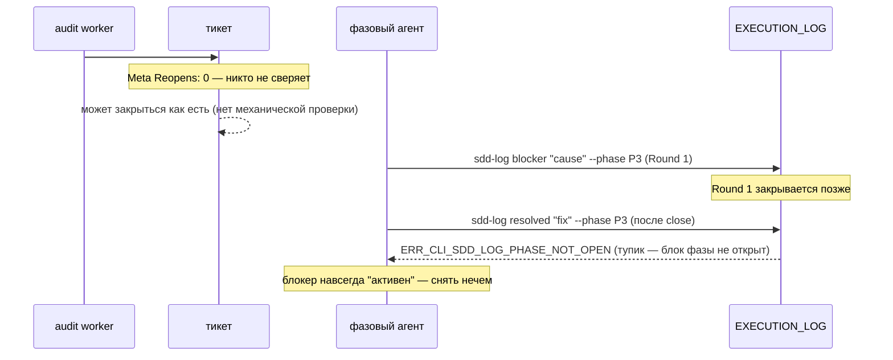
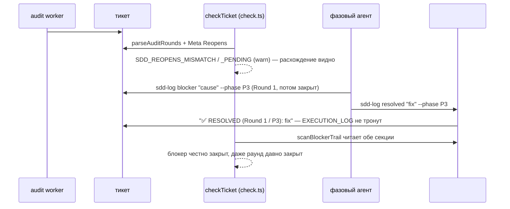

СВОДНЫЙ ОТЧЁТ — Пачка 15 «Реопен, блокер и готовность к работе считаются по причине» (Волна 3)

СТАТУС: DONE, 5/5 задач, 5 коммитов, 0 безусловных стопов. Одно осознанное расширение зоны у E-05 (см. «Отклонения», п.1) и одно у B2-18 (попутное подключение `AX_BLOCKER_ESCALATION`, см. п.2) — оба зафиксированы, ничего не скрыто.

Рабочее дерево: `rc-v6` (`/private/tmp/claude-503/.../scratchpad/rc-v6`), ветка `lead/reopen-by-cause` от `origin/lead/journal-round` (стек поверх PR #40 «Пачка 14»).

---

## Что это и зачем (простыми словами)

До этой пачки в v2 можно было объявить реопен тикета аудитом («блокер найден, нужен Round 2»), но само содержимое тикета никак не подтверждало, что реопен реально случился — счётчик `Reopens` был свободным текстом, который никто не сверял. Тикет мог тихо закрыться со старым `Reopens: 0`, хотя аудит уже объявил `triggered-reopen=Round-2`. Такой же разрыв был и со снятием блокера: единственный способ его зафиксировать требовал ПИСАТЬ ВНУТРЬ уже закрытого раунда — механически невозможно после закрытия, поэтому агент упирался в тупик. А семь готовых форматных документов из библиотеки контрактов лежали мёртвым грузом — ни одна директива их не подключала, включая формат самого блокера. Пять задач чинят это по цепочке причин:

1. **B2-06** — реопен теперь связан с породившей его находкой: `Reopens` в Meta сверяется со счётом причинных записей `@audit … triggered-reopen≠none` в `## Audit Rounds`, и отдельно проверяется, что заявленный раунд реально создан.
2. **T-B6-17** — та же проверка теперь видна и аудит-агенту: неподключённый библиотечный аксиом собран в директиву аудита и переписан под механику B2-06.
3. **B2-19** — снятие блокера переехало в собственную секцию `## Blocker Trail` с обратной ссылкой на раунд и фазу — append-only больше не нарушается, даже если раунд, в котором был объявлен блокер, уже закрыт.
4. **B2-18** — семь неподключённых форматных документов разобраны по одному: три реально нужны фазовому агенту (формат блокера, формат журнальной записи, формат эскалации) и подключены; четыре — прямой запрет `AX_NO_PROCESS_NARRATION` (нарративный прогресс-бар, глиф-заголовки трассировки) и удалены.
5. **E-05** — весь механизм закрыт синтетическими both-way тестами: 4 группы (неизвестный токен, правка закрытого раунда, рассинхрон Reopens, `nextRoundNumber` по секции), каждая — пара «срабатывает / молчит на честном тикете».

**Порядок исполнения — как в брифе** (по зависимостям строк доски): B2-06 → T-B6-17 → B2-19 → B2-18 → E-05.

---

## Таблица «файл → смысл» (сводно; полные таблицы — в `R-B2-06.md` … `R-E-05.md`)

| Файл | Задача(и) | Смысл |
|---|---|---|
| `shared/sdd/execution-log.ts` | B2-06, B2-19, E-05 | `parseAuditRounds`/`isValidRoundReason`/`META_REOPENS_RE` (B2-06); `scanBlockerTrail` получил 2-й опциональный параметр (Blocker Trail), новый `oldestActiveBlockerRound` (B2-19); новый `unknownTokenLines` (E-05, обнаружена и закрыта отсутствующая механическая проверка) |
| `shared/sdd/check.ts` | B2-06, B2-19, E-05 | `checkTicket` region `START_REOPENS` (SDD_REOPENS_MISMATCH/_PENDING); `SDD_DONE_WITH_ACTIVE_BLOCKER`/`SDD_BLOCKER_OPEN` читают Blocker Trail; новый `SDD_EXECUTION_LOG_UNKNOWN_TOKEN` |
| `cli/cmd/sdd-log/sdd-log.cmd.ts`, `sdd-log.types.ts` | B2-06, B2-19 | `round`-режим отказывает вне закрытого словаря причин (exit 4); `resolved`-режим переписан целиком — не требует открытого блока фазы, пишет в `## Blocker Trail`, новая ошибка `ERR_CLI_SDD_LOG_NO_ACTIVE_BLOCKER` |
| `ai/kit/templates/sdd-v2/audit.directive.hbs` | T-B6-17 | Подключён `ax-stale-after-pivot-verification`; таблица «Task requiring reopen» переписана под B2-06 |
| `ai/kit/templates/sdd-v2/phase-execution-protocol.directive.hbs` | B2-18 | Подключены `blocker-format`, `phase-block-format`, `return-summary-format` + аксиомы `ax-blocker-escalation`, `ax-blocker-resolution-trail`; реальные `<ToolCall>` для `sdd-log line`/`sdd-log blocker` |
| `ai/kit/contract/process/{blocker-format,phase-block-format}.xml`, `ai/kit/axiom/process/ax-blocker-resolution-trail.xml` | B2-19, B2-18 | Переписаны под Blocker Trail; список токенов де-захардкожен | 
| `ai/kit/contract/process/{orchestrator-progress-format,phase-progress-format,side-dive-format,trace-header-format}.xml` | B2-18 | Удалены — v1-нарратив, запрещённый `AX_NO_PROCESS_NARRATION`, нигде не дублируется |
| `shared/sdd/templates.ts` | B2-19 | `TASK_SKELETON` документирует `## Blocker Trail` как «создаётся при первом использовании» |
| `shared/sdd/__tests__/reopens.test.ts`, `log-vocabulary-eval.test.ts` | B2-06, E-05 | Новые тестовые файлы — 9 и 8 тестов соответственно |
| `cli/cmd/sdd-log/__tests__/sdd-log.cmd.test.ts` | B2-06, B2-19 | Сьют «resolved mode» переписан под новую механику; +2 новых теста в других местах |

Полные построчные таблицы — `R-B2-06.md`, `R-T-B6-17.md`, `R-B2-19.md`, `R-B2-18.md`, `R-E-05.md`.

---

## Схема «было → стало» (весь контур пачки: причинный реопен + снятие блокера)

### Было



### Стало



---

## Доказательства (числа — итоговые, финальное состояние всех 5 коммитов)

| Команда | Результат | Exit |
|---|---|---|
| `npm --prefix rc-v6 test` | `# tests 3726 / pass 3716 / fail 0 / cancelled 0 / skipped 10` | 0 |
| `npm --prefix rc-v6 run check` (sdd-verify --profile full) | `ALL PASS (5/5)`: type-check 4.6s, test:coverage 62.7s, lint 9.2s, format 2.1s, yagni 0.9s | 0 |
| `npm --prefix rc-v6 run build` | `✓ built in 15.45s` | 0 |
| `node dist/gennady.js sdd-check --all rc-v6` | `192 error(s), 1034 warning(s) across 212 file(s)` (было 192/656 на базе `fcdba417` до пачки — измерено отдельным прогоном на том же коммите с полной пересборкой `dist/`) | 1 (ожидаемо: error>0 всегда даёт exit≠0) |
| `npm --prefix rc-v6 run gate:sdd-check-baseline` | `OK — no error outside the baseline (227c03a8, tag rc-baseline-1)` | 0 |
| `npm --prefix rc-v6 run check:directives-fresh` | `✓ ai/directives/** matches a fresh rebuild.` | 0 |
| `npm --prefix rc-v6 run audit:sdd-templates` | все 4 под-аудита (`directives-fresh`, `axioms`, `contracts`, `halts`) + `check:directive-budgets` — ✓ clean | 0 |

**Разложение +378 warnings по кодам** (per-finding diff, `fcdba417` → HEAD, оба измерения — полная пересборка `dist/` на соответствующем коммите, не смешаны):

| код | +N | файлов | природа |
|---|---|---|---|
| `SDD_EXECUTION_LOG_UNKNOWN_TOKEN` (E-05) | 374 | 31 | 272 записи — легаси-тикеты БЕЗ backtick-обёртки таймстампа (первым «словом» читается сама метка времени, не токен); 102 записи — легаси free-text журнальные строки, предшествующие закрытому словарю (`wire`/`persist`/`scope`/`recompute`/…). Оба класса — реальный, ожидаемый долг корпуса, не ложные срабатывания парсера (проверено вручную выборочно). |
| `SDD_REOPENS_MISMATCH` (B2-06) | 3 | 3 | Реальные, ранее невидимые случаи причинной нечестности Reopens в существующем корпусе (см. ниже). |
| `SDD_REOPENS_PENDING` (B2-06) | 1 | 1 | Тот же `vcs-client.task-71.md` — объявленный реопен объявлен, но раунд не создан. |
| **итого** | **378** | | Новых **error** — 0 (per-finding diff подтверждает: ни одной error-находки, отсутствовавшей в базе). |

**Живая находка на реальном корпусе (не синтетика).** `tasks/vcs/vcs-client/vcs-client.task-71.md` уже сегодня несёт РЕАЛЬНЫЙ экземпляр issue #13: `Meta Reopens: 0`, при этом `## Audit Rounds` содержит `@audit … triggered-reopen=Round-2`, а `Round 2` в `EXECUTION_LOG` не создан. Это ровно тот сценарий, ради которого затевалась вся пачка, и `SDD_REOPENS_MISMATCH`/`SDD_REOPENS_PENDING` поймали его на первом же прогоне после мержа — без единой синтетической фикстуры.

**5 коммитов (по порядку, локальные, НИЧЕГО не запушено):**
| # | SHA | Тема |
|---|---|---|
| 1 | `65f3a411` | feat(B2-06) — reopen is causally linked to the audit finding that caused it |
| 2 | `b558c64c` | feat(T-B6-17) — [REOPENS] mechanical check is assembled into the audit directive |
| 3 | `9b8bf7b3` | feat(B2-19) — a resolved blocker keeps append-only alive past a Round close |
| 4 | `96ac2097` | feat(B2-18) — the seven unconnected process bricks are wired in or deleted |
| 5 | `f2c64a56` | test(E-05) — 4 both-way groups lock the log-vocabulary eval (E-G3-log-vocabulary) |

`git log --oneline origin/lead/journal-round..HEAD` — ровно эти 5 коммитов, в этом порядке.

---

## Приёмка (по пунктам брифа)

| Пункт | Статус |
|---|---|
| B2-06: причинный `Reopens` (`parseAuditRounds` + механика в `checkTicket`); словарь причин раунда | ВЫПОЛНЕНО |
| T-B6-17: `[REOPENS]` собран и в директивной половине; тикет `triggered-reopen=Round-2`+`Reopens:0` → finding | ВЫПОЛНЕНО (как текст директивы + как реальный механический код B2-06, покрыто тестами обеих задач) |
| B2-19: секция `## Blocker Trail`; `sdd-log resolved` пишет туда с обратной ссылкой; анкор для `sdd-extract` | ВЫПОЛНЕНО; миграционная фикстура для СУЩЕСТВУЮЩИХ инлайновых резолюций НЕ написана (см. «Отклонения» в `R-B2-19.md`) — обратная совместимость чтения доказана, активной миграции нет |
| B2-18: семь кирпичей достроены или удалены | ВЫПОЛНЕНО — 3 достроены, 4 удалены с обоснованием (см. `R-B2-18.md`) |
| E-05: словарь журнала покрыт 4 both-way группами | ВЫПОЛНЕНО, с попутной починкой отсутствовавшего кода (см. `R-E-05.md`) |
| `npm test` | ВЫПОЛНЕНО, 0 fail |
| `npm run check` | ВЫПОЛНЕНО, ALL PASS 5/5 |
| `npm run build && node dist/gennady.js sdd-check --all .` (≤192 ошибок, 0 новых) | ВЫПОЛНЕНО, 192 error(s), 0 новых (гейт baseline подтверждает) |
| `npm run gate:sdd-check-baseline` | ВЫПОЛНЕНО |
| `npm run check:directives-fresh` | ВЫПОЛНЕНО |
| `npm run audit:sdd-templates` | ВЫПОЛНЕНО |

---

## Стопы

**Ноль безусловных.** Несколько коммитов потребовали 2-3 попытки `npm run fix`/pre-commit из-за:
- лимита слов в JSDoc-контрактах (`ERR_CLI_LINT_TAG_TOO_MANY_WORDS`, ≤30 слов) — механическая правка формулировок;
- плотности комментариев в `#region` (`ERR_CLI_LINT_REGION_TOO_MANY_COMMENTS`, ≤3 строки) — то же;
- `gennady yagni` (`ERR_CLI_YAGNI_UNDERUSED`) на двух новых сущностях B2-06 (`ROUND_REASON_RE`, `parseAuditRounds`) — решено инлайном регекспа (первая) и реальным вторым продакшен-вызовом вместо barrel-реэкспорта (вторая), без Usage Waiver в `specs/**` (запрещённая зона брифа);
- отсутствующей разметки `<ToolCall>` в новой прозе `phase-execution-protocol.directive.hbs` (B2-18) — поймано контрактным тестом `directive-tool-contract.test.ts`, почитано и починено правильной XML-разметкой + верной CLI-формой (`blocker --payload-file`, не инлайновые флаги);
- одной golden-регрессии (E-05): без явного исключения маркерных строк (`✅ RESOLVED: …` без обратной ссылки, легаси-формат) `SDD_EXECUTION_LOG_UNKNOWN_TOKEN` ложно триггерился на замороженной фикстуре `DA-lazy-asm` — починено до коммита, не после.

Ни один из классов безусловной остановки не сработал — все падения гейта были механически чинимыми в рамках той же задачи, без выбора архитектуры, требующего решения оператора.

Три полных прогона `npm run check`/`git commit` уходили в фон из-за таймаута 120с (штатно для `sdd-verify --profile full`, ~60-120с одного `test:coverage`) — не сбой, дождался завершения через уведомление, без опроса вручную.

---

## Отклонения от брифа (сводно, детали — в отчётах по задаче)

1. **E-05 — расширение файловой зоны.** Буквальный список файлов задачи в `61-TASK-BOARD.md` называет только «синтетические тикеты», но диагностика ПЕРЕД написанием тестов показала: группа 1 («неизвестный токен») не имела МЕХАНИЧЕСКОЙ проверки вовсе — `execution-log.ts` уже нёс всю инфраструктуру (`isVocabularyToken`, `LogEvent.known`, с B2-01/B2-03), но `check.ts` никогда не вызывал её. Тестировать было нечего. Добавлен `unknownTokenLines` (`execution-log.ts`) + вызов в `checkTicket` (`check.ts`) — оба файла входят в общую «Зону» брифа пачки (названы на верхнем уровне), так что формально это не выход за полномочия, но является отклонением от узкой строки задачи E-05. Альтернатива (не проверять группу 1 вовсе) была отвергнута — без неё «4 both-way группы» невыполнимы честно.
2. **B2-18 — попутное подключение `AX_BLOCKER_ESCALATION`.** Задача называет только `ai/kit/contract/process/**`, но `RETURN_SUMMARY_FORMAT` (один из семи) документирует типовую эскалацию (`RECOVERABLE_TECHNICAL`/`SPEC_GOAL_CONFLICT`/`EXTERNAL_AUTHORITY_REQUIRED`), для которой аксиом «когда именно эскалировать» (`AX_BLOCKER_ESCALATION`, из `ai/kit/axiom/process/**`, тоже неподключённый) — естественная пара. Подключены оба вместе, иначе контракт остался бы «плавать» без объясняющего его аксиома — свой вид «лжи агенту» (AUTHORING.md §7), только с другой стороны.
3. **B2-19 — миграция существующих `✅ RESOLVED`.** Строка доски называет `migration-v1-v2.directive.xml` как файл задачи; в этой пачке миграция НЕ реализована (обоснование и рекомендация — в `R-B2-19.md` §4). Обратная совместимость ЧТЕНИЯ старого формата доказана (DA-lazy-asm golden, 11/11 зелёных).
4. **Известный, не блокирующий побочный эффект.** `cli/cmd/sdd-task/sdd-task.cmd.ts`'s собственный вызов `scanBlockerTrail` для секции `[BLOCKERS]` не обновлён передавать `blockerTrailBody` — новые (через `## Blocker Trail`) резолюции не будут учтены в отчёте оркестратору `[BLOCKERS]`, хотя `check.ts`'s `SDD_DONE_WITH_ACTIVE_BLOCKER`/`SDD_BLOCKER_OPEN` их уже видят корректно. Файл вне явной зоны пачки; рекомендую отдельную мелкую задачу для Lead.

**Открытые вопросы Lead:**
- Нужна ли миграция legacy инлайновых `✅ RESOLVED` в `## Blocker Trail` отдельной задачей, или текущая обратная совместимость чтения (без миграции) — окончательное состояние?
- Обновить ли `sdd-task.cmd.ts`'s вызов `scanBlockerTrail`, чтобы `[BLOCKERS]`-отчёт видел новые Blocker-Trail-резолюции (см. «Отклонения», п.4)?
- 3 реальных тикета корпуса (`agent-inbox.task-162.md`, `agent-inbox.task-166.md`, `vcs-client.task-71.md`) теперь несут `SDD_REOPENS_MISMATCH`/`_PENDING` — чинить ли их Meta Reopens отдельным точечным проходом, или оставить как накопленный долг до следующей самомиграции?
- Severity `SDD_REOPENS_MISMATCH`/`_PENDING`/`SDD_EXECUTION_LOG_UNKNOWN_TOKEN` = warn (L-3, вариант 2) — подтверждаете ли этот выбор, или считаете, что `SDD_REOPENS_MISMATCH` (расхождение счётчика, не просто «ещё не создан раунд») достаточно серьёзен для немедленного error вопреки общему прецеденту сиблингов?

---

## Команды пуша для Lead

```
git -C <lead-worktree или rc-v6> push origin lead/reopen-by-cause
gh pr create --base codex/sdd-v2-rc52-followup --head lead/reopen-by-cause \
  --title "Пачка 15: реопен, блокер и готовность к работе считаются по причине" \
  --body-file ai/drafts/research/sdd-v1-to-v2-transfer/_raw/reports/R-BATCH-15-reopen-by-cause.md
```
