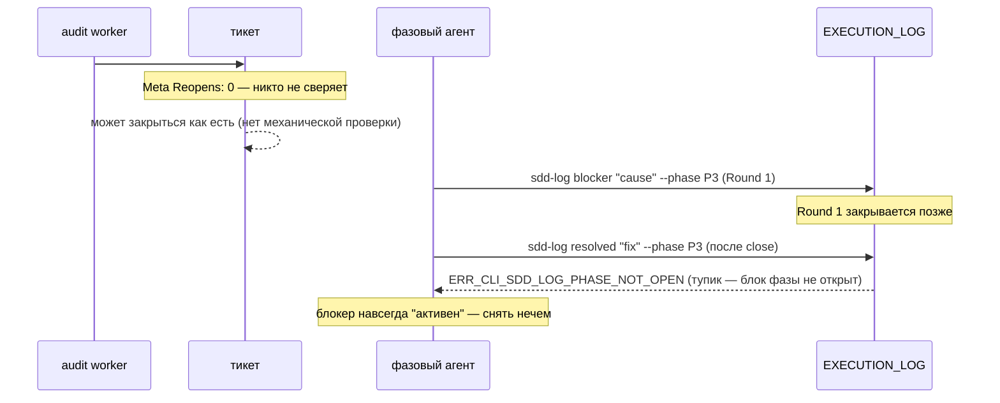
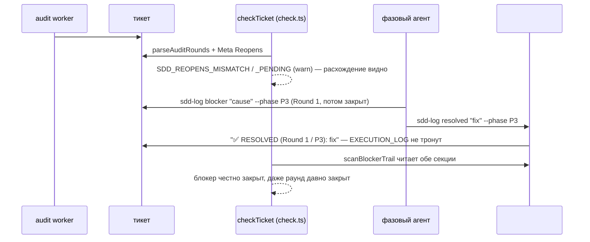

СВОДНЫЙ ОТЧЁТ — Пачка 15 «Реопен, блокер и готовность к работе считаются по причине» (Волна 3)

СТАТУС: DONE, 5/5 задач, 5 коммитов, 0 безусловных стопов. Одно осознанное расширение зоны у E-05 (см. «Отклонения», п.1) и одно у B2-18 (попутное подключение `AX_BLOCKER_ESCALATION`, см. п.2) — оба зафиксированы, ничего не скрыто.

**Обновление после V-BATCH-15 (вердикт: ПРИНЯТЬ С ПРАВКАМИ):** +6 коммитов поверх — 5 правок по вердикту (F-1..F-4, F-7, правка 8) + 1 golden-коммит после слияния релизной ветки в базу. HEAD теперь `2f726c3a`, 11 коммитов от новой базы. См. «Правки по вердикту верификатора», «База обновлена», «Остатки» ниже.

Рабочее дерево: `rc-v6` (`/private/tmp/claude-503/.../scratchpad/rc-v6`), ветка `lead/reopen-by-cause` от `origin/lead/journal-round` (стек поверх PR #40 «Пачка 14»).

---

## Что это и зачем (простыми словами)

До этой пачки в v2 можно было объявить реопен тикета аудитом («блокер найден, нужен Round 2»), но само содержимое тикета никак не подтверждало, что реопен реально случился — счётчик `Reopens` был свободным текстом, который никто не сверял. Тикет мог тихо закрыться со старым `Reopens: 0`, хотя аудит уже объявил `triggered-reopen=Round-2`. Такой же разрыв был и со снятием блокера: единственный способ его зафиксировать требовал ПИСАТЬ ВНУТРЬ уже закрытого раунда — механически невозможно после закрытия, поэтому агент упирался в тупик. А семь готовых форматных документов из библиотеки контрактов лежали мёртвым грузом — ни одна директива их не подключала, включая формат самого блокера. Пять задач чинят это по цепочке причин:

1. **B2-06** — реопен теперь связан с породившей его находкой: `Reopens` в Meta сверяется со счётом причинных записей `@audit … triggered-reopen≠none` в `## Audit Rounds`, и отдельно проверяется, что заявленный раунд реально создан.
2. **T-B6-17** — та же проверка теперь видна и аудит-агенту: неподключённый библиотечный аксиом собран в директиву аудита и переписан под механику B2-06.
3. **B2-19** — снятие блокера переехало в собственную секцию `## Blocker Trail` с обратной ссылкой на раунд и фазу — append-only больше не нарушается, даже если раунд, в котором был объявлен блокер, уже закрыт.
4. **B2-18** — семь неподключённых форматных документов разобраны по одному: три реально нужны фазовому агенту (формат блокера, формат журнальной записи, формат эскалации) и подключены; четыре — прямой запрет `AX_NO_PROCESS_NARRATION` (нарративный прогресс-бар, глиф-заголовки трассировки) и удалены.
5. **E-05** — весь механизм закрыт синтетическими both-way тестами: 4 группы (неизвестный токен, правка закрытого раунда, рассинхрон Reopens, `nextRoundNumber` по секции), каждая — пара «срабатывает / молчит на честном тикете».

**Порядок исполнения — как в брифе** (по зависимостям строк доски): B2-06 → T-B6-17 → B2-19 → B2-18 → E-05.

---

## Таблица «файл → смысл» (сводно; полные таблицы — в `R-B2-06.md` … `R-E-05.md`)

| Файл | Задача(и) | Смысл |
|---|---|---|
| `shared/sdd/execution-log.ts` | B2-06, B2-19, E-05 | `parseAuditRounds`/`isValidRoundReason`/`META_REOPENS_RE` (B2-06); `scanBlockerTrail` получил 2-й опциональный параметр (Blocker Trail), новый `oldestActiveBlockerRound` (B2-19); новый `unknownTokenLines` (E-05, обнаружена и закрыта отсутствующая механическая проверка) |
| `shared/sdd/check.ts` | B2-06, B2-19, E-05 | `checkTicket` region `START_REOPENS` (SDD_REOPENS_MISMATCH/_PENDING); `SDD_DONE_WITH_ACTIVE_BLOCKER`/`SDD_BLOCKER_OPEN` читают Blocker Trail; новый `SDD_EXECUTION_LOG_UNKNOWN_TOKEN` |
| `cli/cmd/sdd-log/sdd-log.cmd.ts`, `sdd-log.types.ts` | B2-06, B2-19 | `round`-режим отказывает вне закрытого словаря причин (exit 4); `resolved`-режим переписан целиком — не требует открытого блока фазы, пишет в `## Blocker Trail`, новая ошибка `ERR_CLI_SDD_LOG_NO_ACTIVE_BLOCKER` |
| `ai/kit/templates/sdd-v2/audit.directive.hbs` | T-B6-17 | Подключён `ax-stale-after-pivot-verification`; таблица «Task requiring reopen» переписана под B2-06 |
| `ai/kit/templates/sdd-v2/phase-execution-protocol.directive.hbs` | B2-18 | Подключены `blocker-format`, `phase-block-format`, `return-summary-format` + аксиомы `ax-blocker-escalation`, `ax-blocker-resolution-trail`; реальные `<ToolCall>` для `sdd-log line`/`sdd-log blocker` |
| `ai/kit/contract/process/{blocker-format,phase-block-format}.xml`, `ai/kit/axiom/process/ax-blocker-resolution-trail.xml` | B2-19, B2-18 | Переписаны под Blocker Trail; список токенов де-захардкожен | 
| `ai/kit/contract/process/{orchestrator-progress-format,phase-progress-format,side-dive-format,trace-header-format}.xml` | B2-18 | Удалены — v1-нарратив, запрещённый `AX_NO_PROCESS_NARRATION`, нигде не дублируется |
| `shared/sdd/templates.ts` | B2-19 | `TASK_SKELETON` документирует `## Blocker Trail` как «создаётся при первом использовании» |
| `shared/sdd/__tests__/reopens.test.ts`, `log-vocabulary-eval.test.ts` | B2-06, E-05 | Новые тестовые файлы — 9 и 8 тестов соответственно |
| `cli/cmd/sdd-log/__tests__/sdd-log.cmd.test.ts` | B2-06, B2-19 | Сьют «resolved mode» переписан под новую механику; +2 новых теста в других местах |

Полные построчные таблицы — `R-B2-06.md`, `R-T-B6-17.md`, `R-B2-19.md`, `R-B2-18.md`, `R-E-05.md`.

---

## Схема «было → стало» (весь контур пачки: причинный реопен + снятие блокера)

### Было



### Стало



---

## Доказательства (числа — итоговые, финальное состояние всех 5 коммитов)

**Финальный прогон, после правок по вердикту верификатора и слияния релизной ветки (см. раздел «Правки по вердикту верификатора» и «База обновлена» ниже) — HEAD `2f726c3a`:**

| Команда | Результат | Exit |
|---|---|---|
| `npm --prefix rc-v6 test` | `# tests 3719 / pass 3711 / fail 0 / cancelled 0 / skipped 8` | 0 |
| `npm --prefix rc-v6 run check` (sdd-verify --profile full) | `ALL PASS (5/5)`: type-check 4.3s, test:coverage 46.0s, lint 10.1s, format 2.0s, yagni 0.4s | 0 |
| `npm --prefix rc-v6 run build` | `✓ built in 2.91s` | 0 |
| `node dist/gennady.js sdd-check --all rc-v6` | `192 error(s), 1038 warning(s) across 213 file(s)` (0 новых error сверх baseline; 213 файлов и 1038 warn — на 1 файл и 4 warn больше, чем на `f2c64a56` до слияния релизной ветки — см. «База обновлена») | 1 (ожидаемо: error>0 всегда даёт exit≠0) |
| `npm --prefix rc-v6 run gate:sdd-check-baseline` | `OK — no error outside the baseline (227c03a8, tag rc-baseline-1)` | 0 |
| `npm --prefix rc-v6 run check:directives-fresh` | `✓ ai/directives/** matches a fresh rebuild.` | 0 |
| `npm --prefix rc-v6 run audit:sdd-templates` | все 4 под-аудита (`directives-fresh`, `axioms`, `contracts`, `halts`) + `check:directive-budgets` — ✓ clean; `audit:contracts` теперь также PART 3 (F-3): `28 template(s) + 33 assembled directive(s) + 54 contract file(s), against 55 template file(s) (recursive)` | 0 |

**Разложение warnings по кодам новых кодов этой пачки** (per-finding, полная пересборка `dist/` на HEAD `2f726c3a`; **правка по вердикту F-5.2** — заменяет недостоверное «272/102, 31 файл» измеренными числами и правильно называет вторую природу):

| код | N | файлов | природа |
|---|---|---|---|
| `SDD_EXECUTION_LOG_TIMESTAMP_UNQUOTED` (E-05, разделён по F-4) | 290 | 14 | таймстамп **не** обёрнут в backticks, из-за чего штамп читается как токен (грамматический дефект, не нарушение словаря) — включает 4 строки без таймстампа вовсе (`tasks/cli/orient/orient.task-55.md`), ранее молчаливо проходившие, т.к. считанное «слово» случайно совпадало с легальным токеном (`DONE`) |
| `SDD_EXECUTION_LOG_UNKNOWN_TOKEN` (E-05) | 88 | 17 | таймстамп **в** backticks, первое слово после него реально вне словаря (`port`, `wire`, `sync`, …) — честное нарушение |
| `SDD_REOPENS_MISMATCH` (B2-06) | 3 | 3 | Реальные, ранее невидимые случаи причинной нечестности Reopens в существующем корпусе (см. ниже). |
| `SDD_REOPENS_PENDING` (B2-06) | 1 | 1 | Тот же `vcs-client.task-71.md` — объявленный реопен объявлен, но раунд не создан. |
| **итого (2 кода E-05)** | **378** | **27 (union)** | Новых **error** — 0 (per-finding diff подтверждает: ни одной error-находки, отсутствовавшей в базе). |

**Живая находка на реальном корпусе (не синтетика).** `tasks/vcs/vcs-client/vcs-client.task-71.md` уже сегодня несёт РЕАЛЬНЫЙ экземпляр issue #13: `Meta Reopens: 0`, при этом `## Audit Rounds` содержит `@audit … triggered-reopen=Round-2`, а `Round 2` в `EXECUTION_LOG` не создан. Это ровно тот сценарий, ради которого затевалась вся пачка, и `SDD_REOPENS_MISMATCH`/`SDD_REOPENS_PENDING` поймали его на первом же прогоне после мержа — без единой синтетической фикстуры.

**Исходные 5 коммитов пачки (перед вердиктом верификатора; SHA изменились после rebase на обновлённый `lead/journal-round`, см. «База обновлена»):**
| # | Тема |
|---|---|
| 1 | feat(B2-06) — reopen is causally linked to the audit finding that caused it |
| 2 | feat(T-B6-17) — [REOPENS] mechanical check is assembled into the audit directive |
| 3 | feat(B2-19) — a resolved blocker keeps append-only alive past a Round close |
| 4 | feat(B2-18) — the seven unconnected process bricks are wired in or deleted |
| 5 | test(E-05) — 4 both-way groups lock the log-vocabulary eval (E-G3-log-vocabulary) |

**+5 коммитов правок по вердикту верификатора (V-BATCH-15), после rebase — HEAD `2f726c3a`, локальные, НИЧЕГО не запушено:**
| # | SHA | Тема |
|---|---|---|
| 6 | `6a9b0271` | test(surface) — drop four B2-18 bricks from frozen tarball list (golden после слияния релизной ветки) |
| 7 | `813da3fd` | fix(sdd-task) — read ## Blocker Trail resolutions in scanBlockerTrail (F-1, блокирующее) |
| 8 | `b7360692` | test(check) — both-way lock on checkTicket reading ## Blocker Trail (F-2, блокирующее) |
| 9 | `f80c27f2` | feat(audit-contracts) — gate every contract/* file for at least one template include (F-3, блокирующее; + F-7) |
| 10 | `47f33730` | fix(execution-log) — split unquoted-timestamp from real unknown-token (F-4, неблокирующее major) |
| 11 | `2f726c3a` | test(sdd-extract) — lock the ## Blocker Trail anchor B2-19 relies on (правка 8, желательная) |

`git log --oneline 5813eb68..HEAD` (от merge-коммита «База обновлена» до HEAD `2f726c3a`) — ровно 11 коммитов: исходные 5 задач (после rebase, темы без изменений) + 6 коммитов правок выше, в этом порядке. (`origin/lead/journal-round` как база устарела — локальный `lead/journal-round` теперь включает слияние релизной ветки, см. «База обновлена»; Lead должен запушить и `lead/journal-round`, и `lead/reopen-by-cause`.)

---

## Приёмка (по пунктам брифа)

| Пункт | Статус |
|---|---|
| B2-06: причинный `Reopens` (`parseAuditRounds` + механика в `checkTicket`); словарь причин раунда | ВЫПОЛНЕНО |
| T-B6-17: `[REOPENS]` собран и в директивной половине; тикет `triggered-reopen=Round-2`+`Reopens:0` → finding | ВЫПОЛНЕНО (как текст директивы + как реальный механический код B2-06, покрыто тестами обеих задач) |
| B2-19: секция `## Blocker Trail`; `sdd-log resolved` пишет туда с обратной ссылкой; анкор для `sdd-extract` | ВЫПОЛНЕНО; анкор `sdd-extract <ticket>#blocker-trail` теперь залочен тестом (правка 8); «готовность к работе» (`sdd-task`) теперь согласована с `sdd-check` (F-1). Миграционная фикстура для СУЩЕСТВУЮЩИХ инлайновых резолюций НЕ написана (см. «Отклонения» в `R-B2-19.md` и «Остатки» ниже) — обратная совместимость чтения доказана, активной миграции нет |
| B2-18: семь кирпичей достроены или удалены; «гейт «каждый кирпич подключён»» | ВЫПОЛНЕНО — 3 достроены, 4 удалены с обоснованием (см. `R-B2-18.md`); гейт добавлен правкой F-3 (изначально был ручным grep, не гейтом — см. «Правки по вердикту верификатора») |
| E-05: словарь журнала покрыт 4 both-way группами | ВЫПОЛНЕНО, с попутной починкой отсутствовавшего кода (см. `R-E-05.md`); диагностика двух разных грамматических дефектов исправлена правкой F-4 |
| `npm test` | ВЫПОЛНЕНО, 0 fail (финальный прогон: см. таблицу выше) |
| `npm run check` | ВЫПОЛНЕНО, ALL PASS 5/5 |
| `npm run build && node dist/gennady.js sdd-check --all .` (≤192 ошибок, 0 новых) | ВЫПОЛНЕНО, 192 error(s), 0 новых (гейт baseline подтверждает); warn 1038 (1034 на `f2c64a56` до слияния и после слияния релизной ветки — сама метрика от merge не сдвинулась, 213 файлов вместо 212; +4 добавила только F-4, см. разложение выше) |
| `npm run gate:sdd-check-baseline` | ВЫПОЛНЕНО |
| `npm run check:directives-fresh` | ВЫПОЛНЕНО |
| `npm run audit:sdd-templates` / `audit:contracts` | ВЫПОЛНЕНО |

---

## Стопы

**Ноль безусловных.** Несколько коммитов потребовали 2-3 попытки `npm run fix`/pre-commit из-за:
- лимита слов в JSDoc-контрактах (`ERR_CLI_LINT_TAG_TOO_MANY_WORDS`, ≤30 слов) — механическая правка формулировок;
- плотности комментариев в `#region` (`ERR_CLI_LINT_REGION_TOO_MANY_COMMENTS`, ≤3 строки) — то же;
- `gennady yagni` (`ERR_CLI_YAGNI_UNDERUSED`) на двух новых сущностях B2-06 (`ROUND_REASON_RE`, `parseAuditRounds`) — решено инлайном регекспа (первая) и реальным вторым продакшен-вызовом вместо barrel-реэкспорта (вторая), без Usage Waiver в `specs/**` (запрещённая зона брифа);
- отсутствующей разметки `<ToolCall>` в новой прозе `phase-execution-protocol.directive.hbs` (B2-18) — поймано контрактным тестом `directive-tool-contract.test.ts`, почитано и починено правильной XML-разметкой + верной CLI-формой (`blocker --payload-file`, не инлайновые флаги);
- одной golden-регрессии (E-05): без явного исключения маркерных строк (`✅ RESOLVED: …` без обратной ссылки, легаси-формат) `SDD_EXECUTION_LOG_UNKNOWN_TOKEN` ложно триггерился на замороженной фикстуре `DA-lazy-asm` — починено до коммита, не после.

Ни один из классов безусловной остановки не сработал — все падения гейта были механически чинимыми в рамках той же задачи, без выбора архитектуры, требующего решения оператора.

Три полных прогона `npm run check`/`git commit` уходили в фон из-за таймаута 120с (штатно для `sdd-verify --profile full`, ~60-120с одного `test:coverage`) — не сбой, дождался завершения через уведомление, без опроса вручную.

---

## Отклонения от брифа (сводно, детали — в отчётах по задаче)

1. **E-05 — расширение файловой зоны.** Буквальный список файлов задачи в `61-TASK-BOARD.md` называет только «синтетические тикеты», но диагностика ПЕРЕД написанием тестов показала: группа 1 («неизвестный токен») не имела МЕХАНИЧЕСКОЙ проверки вовсе — `execution-log.ts` уже нёс всю инфраструктуру (`isVocabularyToken`, `LogEvent.known`, с B2-01/B2-03), но `check.ts` никогда не вызывал её. Тестировать было нечего. Добавлен `unknownTokenLines` (`execution-log.ts`) + вызов в `checkTicket` (`check.ts`) — оба файла входят в общую «Зону» брифа пачки (названы на верхнем уровне), так что формально это не выход за полномочия, но является отклонением от узкой строки задачи E-05. Альтернатива (не проверять группу 1 вовсе) была отвергнута — без неё «4 both-way группы» невыполнимы честно.
2. **B2-18 — попутное подключение `AX_BLOCKER_ESCALATION`.** Задача называет только `ai/kit/contract/process/**`, но `RETURN_SUMMARY_FORMAT` (один из семи) документирует типовую эскалацию (`RECOVERABLE_TECHNICAL`/`SPEC_GOAL_CONFLICT`/`EXTERNAL_AUTHORITY_REQUIRED`), для которой аксиом «когда именно эскалировать» (`AX_BLOCKER_ESCALATION`, из `ai/kit/axiom/process/**`, тоже неподключённый) — естественная пара. Подключены оба вместе, иначе контракт остался бы «плавать» без объясняющего его аксиома — свой вид «лжи агенту» (AUTHORING.md §7), только с другой стороны.
3. **B2-19 — миграция существующих `✅ RESOLVED`.** Строка доски называет `migration-v1-v2.directive.xml` как файл задачи; в этой пачке миграция НЕ реализована (обоснование и рекомендация — в `R-B2-19.md` §4). Обратная совместимость ЧТЕНИЯ старого формата доказана (DA-lazy-asm golden, 11/11 зелёных).
4. **Известный, не блокирующий побочный эффект — УСТРАНЁН правкой по вердикту верификатора.** `cli/cmd/sdd-task/sdd-task.cmd.ts`'s собственный вызов `scanBlockerTrail` не передавал `blockerTrailBody` — новые (через `## Blocker Trail`) резолюции не были видны отчёту оркестратору `[BLOCKERS]`, хотя `check.ts` их уже видел корректно. Верификатор поднял это до **F-1, блокирующее** (это и есть «готовность к работе» из заголовка пачки). Исправлено коммитом `813da3fd`.

**Открытые вопросы Lead (актуальные после правок по вердикту — см. «Остатки» ниже для полного списка из V-BATCH-15 §J):**
- Нужна ли миграция legacy инлайновых `✅ RESOLVED` в `## Blocker Trail` отдельной задачей, или текущая обратная совместимость чтения (без миграции) — окончательное состояние? (снят вопрос про `sdd-task.cmd.ts` — решён правкой F-1)
- 3 реальных тикета корпуса (`agent-inbox.task-162.md`, `agent-inbox.task-166.md`, `vcs-client.task-71.md`) теперь несут `SDD_REOPENS_MISMATCH`/`_PENDING` — чинить ли их Meta Reopens отдельным точечным проходом, или оставить как накопленный долг до следующей самомиграции?
- Severity `SDD_REOPENS_MISMATCH`/`_PENDING`/`SDD_EXECUTION_LOG_UNKNOWN_TOKEN`/`SDD_EXECUTION_LOG_TIMESTAMP_UNQUOTED` = warn (L-3, вариант 2) — подтверждаете ли этот выбор, или считаете, что `SDD_REOPENS_MISMATCH` (расхождение счётчика, не просто «ещё не создан раунд») достаточно серьёзен для немедленного error вопреки общему прецеденту сиблингов? `62-BATCH-QUEUE.md`/`31-TRACK-CHECK-LOG.md:525` читаются как «error» — нужен явный ОК оператора на warn, иначе приёмка читается как невыполненная.
- Два оставшихся сироты-контракта вне зоны B2-18 (`contract/uikit/spec-structure`, `contract/critic/oc-structured`) — сейчас в именованном allowlist гейта F-3; `critic/oc-structured` пересекается с темой пачки 20, стоит адресовать там.
- Порог по предупреждениям — его в плане нет вовсе; warn вырос 431 (`rc-baseline-1`) → 1038 в этой пачке. Нужен либо warn-бюджет в `gate:sdd-check-baseline`, либо явная фиксация «warn не гейтится никогда».

---

## Правки по вердикту верификатора (V-BATCH-15)

Вердикт: **ПРИНЯТЬ С ПРАВКАМИ**. Три блокирующие правки (F-1, F-2, F-3) и одна неблокирующая major (F-4) сделаны; одна желательная (правка 8) сделана; F-6, миграция legacy `RESOLVED` и порог предупреждений оставлены как остатки (раздел ниже). Каждая — отдельный conventional-коммит поверх обновлённой базы (см. «База обновлена»).

| Находка | Что сделано | Где |
|---|---|---|
| **F-1 (блокирующее).** `sdd-task.cmd.ts:422` вызывал `scanBlockerTrail` одним аргументом — не видел резолюции через `## Blocker Trail`, расходясь с `sdd-check` на одном и том же тикете (третья треть заголовка пачки, «готовность к работе», не достигнута). | `blockerTrailBody` теперь передаётся вторым аргументом, как в `check.ts`. Новый тест: закрытый раунд с 🛑 в логе + ✅-резолюция в `## Blocker Trail` → `blockers: none`. | `cli/cmd/sdd-task/sdd-task.cmd.ts`, `cli/cmd/sdd-task/__tests__/sdd-task.cmd.test.ts`. Коммит `813da3fd`. |
| **F-2 (блокирующее).** Связка `check.ts` ↔ `## Blocker Trail` не была залочена ни одним тестом — мутация M1 (вернуть `hasActiveBlocker` к одноаргументному вызову) оставляла 217/217 зелёными. | Both-way пара в `check.test.ts`: (а) 🛑 в закрытом раунде + ✅ с обратной ссылкой `(Round N / P<M>)` в `## Blocker Trail` → нет находки; (б) тот же тикет без секции → находка есть. | `shared/sdd/__tests__/check.test.ts`. Коммит `b7360692`. |
| **F-3 (блокирующее по букве приёмки).** «Гейт «каждый кирпич подключён»» из B2-18 не существовал — разовая ручная grep-уборка; мутация M4b (новый неподключённый файл контракта) проходила `audit:contracts`/`build:directives`/`check:directives-fresh` все зелёными. | Добавлен PART 3 в `ai/kit/audit-contract-activation.mjs` (вариант A из вердикта): перечисляет каждый `ai/kit/contract/**/*.xml`, требует хотя бы один `{{> "contract/<dir>/<name>"}}` в дереве шаблонов (recursive), сокращающийся именованный allowlist `KNOWN_DANGLING_CONTRACT_FILES` для двух подтверждённых сирот (`contract/uikit/spec-structure` → 61-TASK-BOARD.md T-11; `contract/critic/oc-structured` → пачка 20). Мутация того же вида — вручную воспроизведена, exit 1. | `ai/kit/audit-contract-activation.mjs`. Коммит `f80c27f2`. |
| **F-7 (инфо, тот же коммит).** Комментарий `audit-contract-activation.mjs:70` всё ещё приводил `SIDE_DIVE_FORMAT` (удалён B2-18) как пример «not allowlisted». | Убран из списка примеров, добавлена сноска о причине удаления. | `ai/kit/audit-contract-activation.mjs`. Коммит `f80c27f2`. |
| **F-4 (неблокирующее major).** 286 из 374 (по перемеру после слияния релизной ветки — 290 из 378) `SDD_EXECUTION_LOG_UNKNOWN_TOKEN`-находок несли неверный код/сообщение: когда таймстамп не в backticks, `parseLogEvent` читает саму метку времени как `token` — это грамматический дефект, не нарушение словаря (реальный токен, `decision`/`intro`/`DONE`/…, легален). | Разделено на два кода в `tokenVocabularyIssues` (бывш. `unknownTokenLines`): `SDD_EXECUTION_LOG_TIMESTAMP_UNQUOTED` (warn, `ts === null && token !== null`) и `SDD_EXECUTION_LOG_UNKNOWN_TOKEN` (warn, честное нарушение словаря). Both-way тесты добавлены в группу 1 `log-vocabulary-eval.test.ts`. Пересчитанное разложение — в таблице выше. | `shared/sdd/execution-log.ts`, `shared/sdd/check.ts`, `shared/sdd/__tests__/log-vocabulary-eval.test.ts`. Коммит `47f33730`. |
| **Правка 8 (желательная).** `sdd-extract <ticket>#blocker-trail` уже работал «из коробки» (`extractHeadingSection` резолвит любой slug), но не был залочен ни одним тестом. | Новый тест в «markdown heading anchors»: тикет с `## Blocker Trail` + резолюцией → `sdd-extract <file>#blocker-trail` возвращает тело секции. | `cli/cmd/sdd-extract/__tests__/sdd-extract.cmd.test.ts`. Коммит `2f726c3a`. |
| **F-5 (правки отчётов, без кода).** «dangling 36 → 35» в `R-T-B6-17.md` §3.1 и `R-B2-18.md` §5.2 — опровергнуто (метрика не двигалась; T-B6-17 −1 и B2-18 +1 компенсируют друг друга). «272/102, 31 файл» в этом отчёте — не воспроизводилось. `R-B2-06.md` §2: `execution-log.ts:~565` — фактически `:635`. | Заменены на воспроизводимое доказательство (отвязка → `✗ 5 undefined axiom reference(s)`, exit 1) и на измеренные числа (290/88, 27 файлов union, после F-4 и слияния релизной ветки). Строка кода поправлена. | `R-T-B6-17.md`, `R-B2-18.md`, `R-B2-06.md`, этот отчёт. Правки отчётов, без кода — не коммитятся в `rc-v6`. |

**F-6** (`SDD_REOPENS_MISMATCH` молчит при отсутствии `## Audit Rounds`) — **не менялось**, по решению вердикта («сознательный выбор, но стоит записать как известное ограничение при флипе на error в B2-20»). См. «Остатки».

## База обновлена

Шаг 0 брифа выполнен до правок по вердикту:
1. `git fetch origin` — `origin/lead/journal-round` = `fcdba417` (голова PR #40), `origin/codex/sdd-v2-rc52-followup` = `e7b5ba1e` (релизная ветка, как названо в вердикте).
2. `git switch lead/journal-round` (локальная ветка существовала) → `git merge --no-ff origin/codex/sdd-v2-rc52-followup -m "merge: release branch e7b5ba1e into lead/journal-round"` — **конфликтов не было**, как и предсказывал вердикт (раздел H); merge-коммит `5813eb68`, pre-commit хук прошёл целиком (без `--no-verify`).
3. `git switch lead/reopen-by-cause` → `git rebase lead/journal-round` — **чисто, без конфликтов** (5 исходных коммитов пачки).
4. `UPDATE_SURFACE_GOLDEN=1 npm test` → диф golden `shared/common/sync/__tests__/deployed-surface.tarball.golden.txt` — **ровно 4 удалённые строки** (`orchestrator-progress-format.xml`, `phase-progress-format.xml`, `side-dive-format.xml`, `trace-header-format.xml` — четыре B2-18-удаления), как и предсказывал вердикт §H.1. Закоммичено как `test(surface): drop four B2-18 bricks from frozen tarball list` (`6a9b0271`).
5. `npm run build:directives && npm run check:directives-fresh` → `✓ matches a fresh rebuild`.
6. `npm test` на слитом дереве до правок по вердикту — `# tests 3608 / pass 3590 / fail 0 / cancelled 10 / skipped 8` (флейк `cli/cmd/lint/__tests__/lint.cmd.test.ts` — `uncaughtException: Unable to deserialize cloned data due to invalid or unsupported version`, тот же, что задокументирован вердиктом §H.2 как «флейк, не регрессия»; изолированный прогон файла — зелёный. Этот же флейк повторялся ещё несколько раз во время коммитов правок F-1..F-4 — каждый раз только этот файл, изолированный прогон всегда зелёный, ретрай коммита проходит).

Итог: `lead/journal-round` (локальный) теперь на 45 коммитов впереди `origin/lead/journal-round` (весь релиз-бранч влит); `lead/reopen-by-cause` — на 11 коммитов впереди merge-коммита `5813eb68` (5 исходных + 6 правок). **Lead должен запушить ОБЕ ветки** — `lead/journal-round` (новая база) и `lead/reopen-by-cause` (эта пачка) — и открыть PR пачки 15 на новую базу.

## Остатки (из V-BATCH-15 §J — для доски)

- **B2-19 (миграция).** `61-TASK-BOARD.md:90` называет `migration-v1-v2.directive.xml` и «миграционную фикстуру»; в пачке не сделано. Завести отдельную задачу «перенос legacy инлайновых `✅ RESOLVED` в `## Blocker Trail`» **или** зафиксировать решением оператора, что чтение обоих форматов — окончательное состояние (тогда правится строка доски и «Чем доказываем»).
- **Порог по предупреждениям.** В плане нет вовсе; warn вырос 431 (`rc-baseline-1`) → 1038 (эта пачка). До флипа L-3 → error (B2-15/B2-20) нужен либо warn-бюджет в `gate:sdd-check-baseline`, либо явная фиксация «warn не гейтится никогда».
- **Три тикета с реальным долгом Reopens** (`agent-inbox.task-162.md`, `agent-inbox.task-166.md`, `vcs-client.task-71.md`) — чинить точечно или оставить до самомиграции (E-14). Вопрос оператору остаётся открытым.
- **Два оставшихся сироты-контракта** вне зоны B2-18, теперь в именованном allowlist гейта F-3: `ai/kit/contract/uikit/spec-structure.xml`, `ai/kit/contract/critic/oc-structured.xml`. Второй пересекается с темой пачки 20 (критик) — стоит адресовать там.
- **Severity `SDD_REOPENS_MISMATCH`.** `62-BATCH-QUEUE.md` («расхождение — ошибка») и `31-TRACK-CHECK-LOG.md:525` (`error`) против L-3 (warn до B2-15/B2-20). Исполнитель выбрал warn — правомерно; нужен явный ОК оператора и, если ОК дан, правка формулировки очереди.
- **F-6** (`SDD_REOPENS_MISMATCH` молчит без `## Audit Rounds`) — сознательный выбор, зафиксировать как известное ограничение при флипе B2-20.

---

## Команды пуша для Lead

```
git -C <lead-worktree или rc-v6> push origin lead/journal-round
git -C <lead-worktree или rc-v6> push origin lead/reopen-by-cause
gh pr create --base codex/sdd-v2-rc52-followup --head lead/reopen-by-cause \
  --title "Пачка 15: реопен, блокер и готовность к работе считаются по причине" \
  --body-file ai/drafts/research/sdd-v1-to-v2-transfer/_raw/reports/R-BATCH-15-reopen-by-cause.md
```

Примечание: `lead/reopen-by-cause` теперь построена поверх обновлённого `lead/journal-round` (который влил релизную ветку `codex/sdd-v2-rc52-followup`@`e7b5ba1e`), а не поверх устаревшего `origin/lead/journal-round`@`fcdba417` — пушить нужно обе ветки, иначе PR откроется с ложными конфликтами/лишним диффом.
