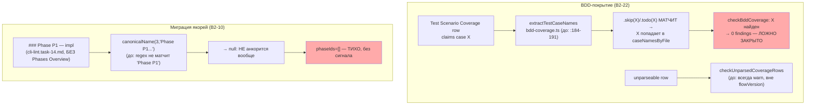
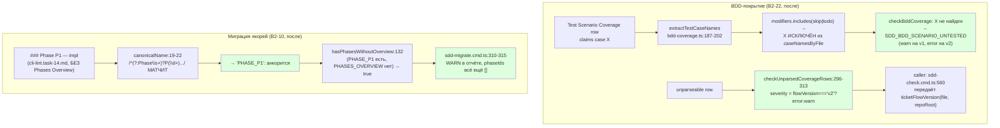

# Пачка 16 — «Легаси-тикеты проходят проверки без ложного закрытия» (Волна 3)

Ветка `lead/legacy-no-false-close` (от `lead/migrator-red-first` @ `e80d09fc` = поверх пачки 22 / PR #43).
Задачи в порядке брифа: **B2-22 → B2-10** (B2-13 отложена — её файл `execute.directive.xml`
принадлежит PR #38, предпосылка B2-16 отложена; не входит в эту пачку). Коммиты по порядку:
`f7b750c4` (B2-22) → `96276f54` (B2-10, HEAD ветки). Полные таблицы/доказательства — в
`R-B2-22.md`, `R-B2-10.md`.

## Черновик описания PR (простым языком)

Гейт адекватности нашёл дефект в двух местах: пропущенный или ещё не написанный тест
(`it.skip(...)`/`it.todo(...)`) сегодня молча закрывает BDD-сценарий — «тикет сделан» доказывает не
то, что заявлено, потому что закрывающий тест никогда не запускался. Отдельно — строка покрытия,
которую инструмент не смог разобрать, тоже не блокировала закрытие: она давала предупреждение
навсегда, вне зависимости от того, легаси это тикет или уже мигрированный на v2. **B2-22** чинит
оба случая: неактивный тест больше не считается доказательством, а строгость непарсящихся строк
теперь растёт вместе с миграцией скоупа на v2 (легаси — предупреждение как раньше, v2 — ошибка).
Переход намеренно не тронул существующий 140-строчный корпус — там, где сегодня всё ещё v1,
поведение не изменилось, значит новых ошибок в общем прогоне ноль.

Второй дефект — в самом миграторе якорей: часть реальных тикетов (17 штук) пишет заголовки фаз как
«### Phase P1 — …» (со словом «Phase»), а не «### P1 — …», и мигратор их просто не узнавал —
заголовок не анкорился вообще, без единого сигнала об этом. **B2-10** учит распознаватель обеим
формам и добавляет отдельную, более общую проверку: если у тикета есть анкорённые секции фаз, но
нет секции «Phases Overview», из которой берутся ID фаз для каркаса первого раунда — миграция теперь
явно предупреждает об этом в отчёте, а не молча оставляет `phaseIds = []`. Оба фикса подтверждены не
только на юнит-фикстурах, но и прогоном по всему реальному корпусу тикетов (127 файлов) — в
dry-run, без единой записи в корпус.

## Таблица «файл → смысл»

| Файл | Смысл | Задача |
|---|---|---|
| `shared/sdd/bdd-coverage.ts` | `.skip`/`.todo`-модификатор исключён из «observed» кейсов; `checkUnparsedCoverageRows` градуирована по `flowVersion` | B2-22 |
| `cli/cmd/sdd-check/sdd-check.cmd.ts` | Единственный вызов `checkUnparsedCoverageRows` теперь передаёт реальный `flowVersion` тикета (1 строка) | B2-22 |
| `shared/sdd/__tests__/bdd-coverage.test.ts` | +14 тестов: негативные фикстуры, фикстура-неудовлетворимость, градация по flowVersion | B2-22 |
| `shared/sdd/anchor-inject.ts` | `canonicalName` узнаёт `### Phase P<N>` и «Phases Overview» на `###`; новая `hasPhasesWithoutOverview` | B2-10 |
| `cli/cmd/sdd-migrate/sdd-migrate.cmd.ts` | Явный `WARN` в отчёте, когда фазы есть, а обзора нет | B2-10 |
| `shared/sdd/__tests__/anchor-inject.test.ts` | +9 тестов: Phase-слово, `_FIX`, «Phases Overview» на `###`, byte-for-byte patch-инвариант, `hasPhasesWithoutOverview` (4 кейса) | B2-10 |
| `cli/cmd/sdd-migrate/__tests__/sdd-migrate.cmd.test.ts` | +3 интеграционных теста (WARN на реальной форме тикета, анкоринг Phase-слова, тикет без фаз не триггерит WARN) | B2-10 |

## Mermaid: было → стало (объединённый контур BDD-покрытия + миграции якорей)





## Доказательства (сводно; полные — в R-B2-22.md, R-B2-10.md)

| Задача | Команда | Результат | Exit |
|---|---|---|---|
| B2-22 | `node --import tsx --test shared/sdd/__tests__/bdd-coverage.test.ts` | 41/41 pass | 0 |
| B2-22 | mutation: `git stash` правки → тест красный → `git stash pop` | red подтверждён (module export missing) | — |
| B2-10 | `node --import tsx --test shared/sdd/__tests__/anchor-inject.test.ts cli/cmd/sdd-migrate/__tests__/sdd-migrate.cmd.test.ts` | 44/44 pass | 0 |
| B2-10 | mutation: `git stash` правки → тест красный (`SyntaxError: does not provide an export named 'hasPhasesWithoutOverview'`) → `git stash pop` | red подтверждён | — |
| B2-10 | LCS-патч-инвариант по 91 реальному файлу корпуса | `checked=91; mismatches=0` — только вставки `<!--SECTION...-->`, ноль удалений/правок | — |
| B2-10 | `node dist/gennady.js sdd-migrate anchors --all <tree>` (dry-run) | 127 тикетов: 121 would / 6 skip / 19 WARN; `git status --short tasks/` → 0 (корпус не тронут) | 0 |
| batch | `npm --prefix <tree> test` | `# tests 3756 / # pass 3748 / # fail 0 / # cancelled 0 / # skipped 8` | 0 |
| batch | `npm --prefix <tree> run check` | `[sdd-verify] ✅ ALL PASS (5/5)` (type-check, test:coverage, lint, format, yagni) | 0 |
| batch | `node dist/gennady.js sdd-check --all . --format json` до/после ОБЕИХ задач | errors: 192→192 (**0 новых**); warnings: 434→435 (+1, реальная находка B2-22 на `vcs-context-resolver.task-68.md`); B2-10 не меняет ни одного sdd-check finding (не трогает `check.ts`) | 1 (сам sdd-check красный по числу error, не по регрессии) |
| batch | `npm --prefix <tree> run gate:sdd-check-baseline` | `OK — no error outside the baseline (baseline commit 227c03a8…, tag rc-baseline-1)` | 0 |
| batch | `npm --prefix <tree> run build` | `✓ built` | 0 |

### Предупреждения до/после, по кодам (весь корпус, `sdd-check --all .`)

| Код | До батча | После батча | Δ |
|---|---|---|---|
| `SDD_BDD_SCENARIO_UNTESTED` (warn) | 70 | 71 | **+1** (реальная находка B2-22) |
| `SDD_BDD_COVERAGE_ROW_UNPARSED` (warn) | 140 | 140 | 0 (весь корпус ещё v1 — ожидаемо) |
| `SDD_LEGACY_TICKET_UNANCHORED` (warn) | 76 | 76 | 0 (B2-10 не меняет sdd-check находки) |
| все остальные коды (error+warn) | — | — | 0 |
| **errors, итого** | 192 | 192 | **0** |
| **warnings, итого** | 434 | 435 | **+1** |

## Отклонения от брифа, открытые вопросы (сводно — детали в R-B2-22.md/R-B2-10.md)

1. **B2-22**: файл-приёмник `cli/cmd/sdd-check/sdd-check.cmd.ts` (не в списке «трогать», но и не в
   списке «не трогать») пришлось задеть одной строкой, чтобы градация по `flowVersion` реально
   работала в проде, а не оставалась мёртвым параметром. Токен: `accepted`.
2. **B2-22**: «swift-тикет с корректной строкой не должен становиться незакрываемым» — реальная
   причина такой неудовлетворимости (индекс тест-файлов не знает `.swift`) вне зоны этого брифа;
   реализован регрессионный тест, а не фикс расширения. Токен: `pending-operator`.
3. **B2-10**: `shared/sdd/migration-plan.ts` назван в брифе, но не содержит логики распознавания
   заголовков фаз — не потребовал правки. Токен: `accepted`.
4. **B2-10**: «явный отказ без PHASES_OVERVIEW» реализован как WARN-строка в отчёте (тикет всё равно
   мигрируется частично), а не как полный отказ от записи для этого тикета. Токен: `pending-operator`
   — если нужна более жёсткая семантика (полный skip тикета), требуется уточнение.
5. **Найдено попутно, не в этой пачке:** 19 реальных тикетов корпуса (`tasks/cli/lint/*`,
   `tasks/cli/alt-opinion/*`, `tasks/dbc/dbc-linter/*`, `tasks/vcs/vcs-client/*`,
   `tasks/cli/vcs-draft-note/*`) требуют РУЧНОЙ миграции (Phases Overview не может быть выдуман
   автоматически) — кандидат в отдельную будущую задачу, после решения по п.4.

## Стопы

Не было ни одной остановки класса «красный гейт»/«конфликт с невлитыми PR»/«открытое решение
оператора» — оба стоп-условия из «ВОПРОСЫ НАЗАД» (если бы бриф их содержал) не сработали:
B2-13 корректно не входит в эту пачку (файл `execute.directive.xml` — PR #38, вне зоны).

## Команды пуша для Lead

RC не пушит самостоятельно. После независимой проверки `plan-verifier`:
```
git push origin lead/legacy-no-false-close
```
База пачки — `lead/migrator-red-first` (пачка 22, PR #43); PR этой пачки — в `codex/sdd-v2-rc52-followup`
согласно `70-ORCHESTRATION-PROTOCOL.md` § «Пачки и PR».
