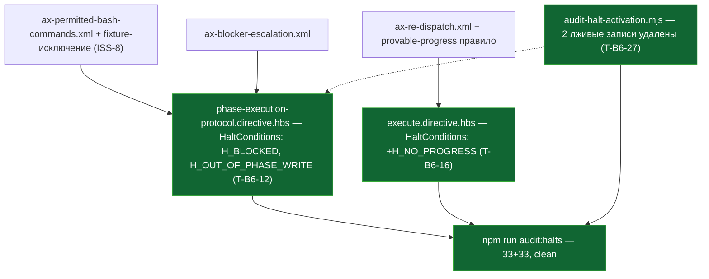

СВОДНЫЙ ОТЧЁТ — Пачка 17 «Фазовый агент не выходит за свои файлы и умеет остановиться»

СТАТУС: DONE, 4/4 задач, 0 стопов.

Рабочее дерево: `rc-v6` (`/private/tmp/claude-503/.../scratchpad/rc-v6`), ветка `lead/phase-agent-bounds`.

**База ветки (переписано по правке верификатора V-BATCH-17 — прежняя формулировка ошибочно утверждала, что PR #30 ещё не влит).** Ветка `lead/phase-agent-bounds` основана на `61b86fb8` (`fix(T-B6-23): critic-protocol restores the correct confusion triage` — голова PR #30, Пачка 5). PR #30 влит в `codex/sdd-v2-rc52-followup` **2026-09-08 19:21:19 UTC**, а первый коммит этой пачки (`70361d49`) датирован 19:42 UTC — то есть база уже была влита ДО старта пачки, а не после. Проверено: `git merge-base --is-ancestor 61b86fb8 origin/codex/sdd-v2-rc52-followup` → YES; `git diff --stat origin/codex/sdd-v2-rc52-followup...HEAD` уже даёт ровно 5 коммитов этой пачки (11 файлов, +224/−32 после довеска V-BATCH-17 ниже) без какого-либо ребейза. Ребейз перед PR НЕ ТРЕБУЕТСЯ и ничего не сократит — сокращать нечего.

---

## Что это и зачем (простыми словами)

Фазовый агент — модель, которую диспетчер запускает на одну фазу тикета — должна знать две вещи: (1) какие свои файлы она чинит, а какие чужие поломки не её забота, и какие bash-команды вообще разрешены; (2) когда упираться и звать оператора вместо того, чтобы импровизировать или бесконечно повторять одну и ту же неудачную попытку. Аудит трека 40 (раздел D7) и issue akkrat #19 нашли: оба инварианта существовали как аксиомы-файлы, но НИ ОДИН шаблон их не подключал — фазовый агент физически не мог их прочитать; комментарий в скрипте, который должен был это ловить, сам врал про то, что уже подключено; git был запрещён агенту трижды подряд, даже для теста guard-скрипта, которому нужен throwaway git-репозиторий; а цикл «диспетчер редиспатчит после правки» не имел правила остановки на повторяющемся наборе находок.

Четыре задачи чинят это:
1. **T-B6-12** — фазовый агент получает границу «свои файлы vs чужие», список разрешённых команд и объявленную остановку `H_BLOCKED`.
2. **T-B6-27** — лживый комментарий про то, что якобы уже подключено, исправлен целиком (обе фиктивные половины).
3. **ISS-8** — агенту, который тестирует guard-скрипт, разрешён СВОЙ временный git-репозиторий — строго в `.claude/tmp/`, без доступа к реальному репозиторию.
4. **T-B6-16** — если диспетчер повторно получает тот же самый блокирующий набор находок без нового доказательства, цикл останавливается вместо бесконечных попыток.

---

## Таблица «файл → смысл»

| Файл | Задача | Смысл | Чем доказано |
|---|---|---|---|
| `ai/kit/templates/sdd-v2/phase-execution-protocol.directive.hbs` | T-B6-12 | Подключены `ax-permitted-bash-commands`/`ax-blocker-escalation`; объявлены `H_BLOCKED`+`H_OUT_OF_PHASE_WRITE`; ERROR OWNERSHIP дословно в STEP_1_ORIENT | `audit:halts`, `check:directive-budgets`, `stateless-sdd-flow-contract.test.ts` |
| `ai/kit/audit-halt-activation.mjs` | T-B6-27 | Удалены 2 фиктивные записи `ALLOWLIST_CROSS_DIRECTIVE_REFS` (обе лгали про несуществующие подключения) | `audit:halts` зелен до/после (записи были инертны) |
| `ai/kit/axiom/process/ax-permitted-bash-commands.xml` | ISS-8 | +безусловный `git status --porcelain`; +throwaway-фикстура строго в `.claude/tmp/<fixture>/`; §5-граница не расширена | ручное чтение против #19; `audit:halts`/`check:directive-budgets` |
| `ai/kit/axiom/process/ax-re-dispatch.xml` | T-B6-16 | +правило: повтор блокирующего набора без нового evidence → `H_NO_PROGRESS` | ручное чтение; `audit:halts` |
| `ai/kit/templates/sdd-v2/execute.directive.hbs` | T-B6-16 | Подключён `ax-re-dispatch`; `H_NO_PROGRESS` объявлен и использован в STEP_6_AUDIT_REVIEW | `audit:halts`, `check:directive-budgets` |
| `ai/directives/sdd-v2/phase-execution-protocol.directive.xml` + `phase-execution-protocol/steps/STEP_{1,2,3}_*.xml` | T-B6-12, ISS-8 | Пересобранные производные шаблона (не редактировались вручную) | `check:directives-fresh` |
| `ai/directives/sdd-v2/execute.directive.xml` | T-B6-16 | Пересобранная производная шаблона | `check:directives-fresh` |
| `ai/inspector/core/__tests__/parse-directive.test.ts` | T-B6-16 (побочно) | Снапшот halt-id для `execute.directive.xml` дополнен `H_NO_PROGRESS` — вне зоны брифа, необходимое следствие (см. R-T-B6-16.md «Отклонения») | сам тест зелен |

Полные таблицы, точные проценты/номера строк — в `R-T-B6-12.md`, `R-T-B6-27.md`, `R-ISS-8.md`, `R-T-B6-16.md`.

---

## Схема «было → стало» (весь контур пачки)

### Было

```mermaid
flowchart TB
  AXPBC["ax-permitted-bash-commands.xml — 0 шаблонов"]
  AXBE["ax-blocker-escalation.xml — 0 шаблонов"]
  AXRD["ax-re-dispatch.xml — 0 шаблонов"]
  PEP["phase-execution-protocol.directive.hbs — БЕЗ HaltConditions"]
  EXE["execute.directive.hbs — БЕЗ H_NO_PROGRESS, цикл может повторяться бесконечно"]
  MJS["audit-halt-activation.mjs — 2 лживые записи в allowlist"]
  GITBAN["git запрещён фазе трижды подряд, даже для guard-теста (#19)"]
  style AXPBC fill:#611,stroke:#f66,color:#fff
  style AXBE fill:#611,stroke:#f66,color:#fff
  style AXRD fill:#611,stroke:#f66,color:#fff
  style MJS fill:#611,stroke:#f66,color:#fff
  style GITBAN fill:#611,stroke:#f66,color:#fff
```



### Стало



---

## Доказательства (числа — итоговые, на финальном состоянии всех 4 коммитов)

| Команда | Результат | Exit |
|---|---|---|
| `npm --prefix rc-v6 test` | `# tests 3605 / pass 3595 / fail 0 / cancelled 0 / skipped 10` | 0 |
| `npm --prefix rc-v6 run check` (sdd-verify --profile full) | `ALL PASS (5/5)`: type-check 5.8s, test:coverage 52.0s, lint 17.6s, format 6.3s, yagni 1.2s | 0 |
| `npm --prefix rc-v6 run build:directives && npm --prefix rc-v6 run check:directives-fresh` | «Generated 55 directive(s)»; «✓ ai/directives/** matches a fresh rebuild» | 0 |
| `npm --prefix rc-v6 run audit:sdd-templates` (fresh + audit:axioms + audit:contracts + audit:halts + check:directive-budgets) | все 5 под-гейтов «✓ clean» / «✓ within budget» | 0 |
| `npm --prefix rc-v6 run gate:sdd-check-baseline` | «no error outside the baseline (baseline commit 227c03a8..., tag rc-baseline-1)» | 0 |

Каждый из 4 коммитов ТАКЖЕ прошёл `pre-commit` целиком (тот же набор гейтов) без `--no-verify`, в порядке, зафиксированном ниже.

**4 коммита (по порядку, локальные, НИЧЕГО не запушено):**
| # | SHA | Тема |
|---|---|---|
| 1 | `70361d49` | T-B6-12 — permitted-command list, blocker escalation, H_BLOCKED |
| 2 | `e5e9a9b1` | T-B6-27 — halt-activation script comment fix (2 fabricated entries dropped) |
| 3 | `6b60f7e9` | ISS-8 — throwaway-fixture exception to the phase-agent git ban |
| 4 | `6de96024` | T-B6-16 — H_NO_PROGRESS on repeated blocking finding set |

`git diff --stat 61b86fb8..HEAD` — 11 файлов, +207/−27.

---

## Приёмка (по пунктам брифа)

| Пункт | Статус |
|---|---|
| T-B6-12: границы собраны как аксиомы, объявлена остановка «заблокирован», «phase worker owns failures only inside its own Target Files» — грепается | ВЫПОЛНЕНО |
| T-B6-27: комментарий исправлен целиком, `audit:halts` зелен | ВЫПОЛНЕНО |
| ISS-8: именованное исключение для черновикового репозитория (текст аксиома) | ВЫПОЛНЕНО (текст); сценарии G1/G3 (поведенческая проверка агентом) и код-сторона (`sdd-verify` snapshot exclusion, `ax-stale-after-pivot-verification` сборка) — НЕ ВЫПОЛНЕНО, вне зоны/инструментария этой пачки, см. `R-ISS-8.md` |
| T-B6-16: повтор блокирующего набора без нового evidence останавливает цикл, «halts on repeated finding set with no new evidence» — грепается | ВЫПОЛНЕНО (только правило останова; both-way про запись вердикта — сознательно НЕ реализовано, за отложенной темой §3.4 по риску батча) |
| `npm test` | ВЫПОЛНЕНО, 0 fail |
| `npm run check` | ВЫПОЛНЕНО, ALL PASS 5/5 |
| `npm run build:directives && npm run check:directives-fresh` | ВЫПОЛНЕНО |
| `npm run audit:sdd-templates` | ВЫПОЛНЕНО |
| `npm run gate:sdd-check-baseline` | ВЫПОЛНЕНО |

---

## Стопы

**Ноль.** Пре-коммит хук один раз потребовал вторую попытку (T-B6-12: первая версия правки STEP_3_VERIFY сломала regex-тест из-за переноса строки внутри искомой фразы — исправлено формулировкой, не логикой; см. `R-T-B6-12.md` §4 «Отклонение 3»). Задача T-B6-16 дополнительно потребовала правки файла вне списка «трогать» (`ai/inspector/core/__tests__/parse-directive.test.ts`) — механическое следствие нового halt-id, не поведенческое изменение, задокументировано отдельно (`R-T-B6-16.md` §4 «Отклонение 1»). Ни один из пяти классов безусловной остановки (`70-ORCHESTRATION-PROTOCOL.md` § «Условия безусловной остановки») не сработал.

---

## Отклонения от брифа (сводно, детали — в отчётах по задаче)

1. **T-B6-12** — файловый скоуп сужен до актуального (`62-BATCH-QUEUE.md`/`61-TASK-BOARD.md` §1), а не полной таблицы `40-TRACK-DIRECTIVES-SKILLS.md` §5.1: `ax-phase-scope-lock.xml` НЕ редактирован, ERROR OWNERSHIP вписан прозой в `phase-execution-protocol.directive.hbs` вместо библиотечного аксиома — не нарушает буквальный список «трогать», даёт требуемую строку-доказательство.
2. **T-B6-12** — побочно закрыт предсуществующий дефект: `H_OUT_OF_PHASE_WRITE` был упомянут `ax-phase-scope-lock` без строки в `HaltConditions` (таблицы не было вовсе до этого коммита); добавлена строка, иначе мой же `audit:halts` был бы красным.
3. **T-B6-27** — исправлены ОБЕ фиктивные записи комментария (диапазон брифа `:135-141` в актуальном дереве сместился на `:138-150` и покрывал обе), не только первую половину, названную в `40-TRACK` D7.4 как предмет именно T-B6-12/T-B6-27.
4. **ISS-8** — код-сторона #19 (snapshot-исключение `.claude/tmp/**`, сборка `ax-stale-after-pivot-verification`) осталась НЕ закрытой — файлы вне зоны брифа (`shared/**`, `cli/**`) и вне списка задач Пачки 17.
5. **T-B6-16** — both-way про запись `[verdict: pending-operator]` сознательно не реализован (механизма записи ещё нет в дереве; явно отложено на V14-2e согласно риск-примечанию батча); правка снапшот-теста инспектора вне зоны — необходимое следствие нового halt-id.

**Открытые вопросы Lead:**
- Нужна ли отдельная будущая задача на код-сторону #19 (пп. (a)/(b) из `R-ISS-8.md` «Отклонение 2»)?
- Нужна ли отдельная правка `ax-phase-scope-lock.xml`, чтобы ERROR OWNERSHIP жил в библиотечном аксиоме, а не только прозой в `phase-execution-protocol.directive.hbs` (T-B6-12 «Отклонение 1»)?

---

## Команды пуша для Lead

```
git -C <lead-worktree или rc-v6> push origin lead/phase-agent-bounds
gh pr create --base codex/sdd-v2-rc52-followup --head lead/phase-agent-bounds \
  --title "Пачка 17: фазовый агент не выходит за свои файлы и умеет остановиться" \
  --body-file ai/drafts/research/sdd-v1-to-v2-transfer/_raw/reports/R-BATCH-17-phase-agent-bounds.md
```
(Ветка основана на `61b86fb8` — голове PR #30, влитого в `codex/sdd-v2-rc52-followup` ДО старта этой пачки (2026-09-08 19:21:19 UTC против первого коммита пачки в 19:42 UTC). Ребейз перед PR не требуется: `git diff --stat origin/codex/sdd-v2-rc52-followup...HEAD` уже даёт ровно 5 коммитов этой пачки. `git merge-tree` против `origin/codex/sdd-v2-rc52-followup` и всех открытых PR (#33, #36, #37) — конфликтов нет, пересечение файловых множеств пустое.)
