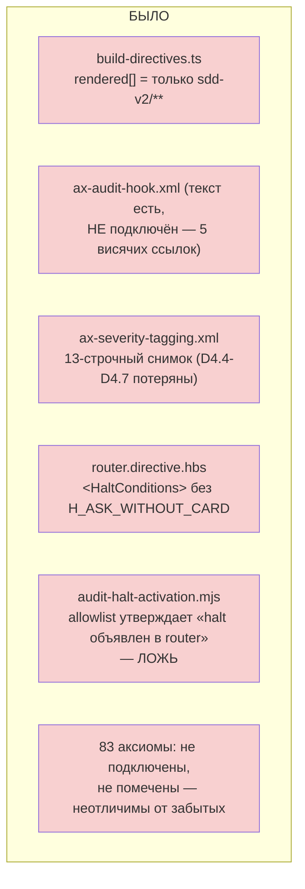
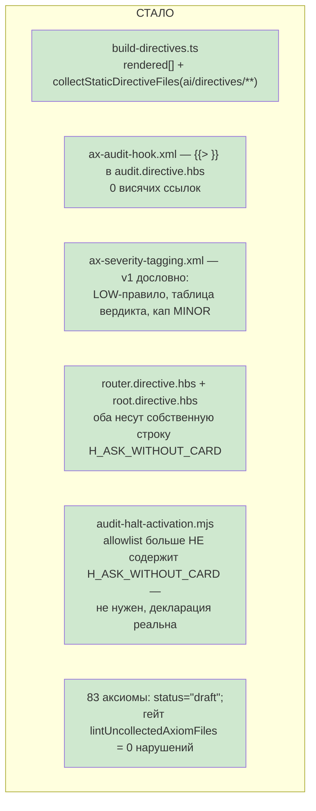

# R-BATCH-18 — «Аксиомы живут в одном доме и ни одна не висит в воздухе»

Ветка `lead/axioms-one-home`, база — `lead/reopen-by-cause` (PR #48, коммит `2f726c3a`). 5 задач, 5 коммитов, последовательно. `T-B6-02` — **отложена** до слияния PR #41 (её файл `module.directive.hbs` принадлежит той ветке); остаётся на доске.

## Черновик описания PR (простым языком)

Каждая аксиома либо реально собрана в директиву, либо честно помечена черновиком — третьего состояния («забыли») больше не существует незаметно. Самая цитируемая ранее не собранная аксиома (правило «раунд закрывается только после обязательного аудита») теперь подключена. Три аксиомы аудита, потерявшие часть текста при переносе из v1 (как считать вердикт, куда маршрутизировать находку про сломанное правило), восстановлены дословно. Область проверки «упомянуто — но не определено» расширена за пределы одной папки директив. И одна остановка («вопрос без карточки состояния») наконец объявлена там, где она реально нужна, а не спрятана в списке исключений аудитора — раньше комментарий в коде утверждал, что она объявлена, а на самом деле нет.

## 1. Таблица «файл → смысл» (по коммитам)

| Коммит | Задача | Файлы (кратко) | Смысл |
|---|---|---|---|
| `edeb71c3` | T-B6-24 | `lint-axioms.ts`, `build-directives.ts`, тест | Проверка «упомянуто, не определено» теперь видит статичные (не-темплейтные) деревья директив (`infra/`, `agent-inbox/` и т.д.), не только `sdd-v2/**` |
| `ae42e356` | T-B6-25 | `audit.directive.hbs`, `lint-axioms.ts` | Самая цитируемая несобранная аксиома (правило group-audit «раунд закрывается только после аудита») подключена |
| `40935c63` | T-B6-11 | `ax-severity-tagging.xml`, `ax-finding-routing.xml`, `ax-findings-as-proposals.xml`, тест | Как считать вердикт аудита (таблица + confidence-правило) и куда маршрутизировать находку про сломанный rule-файл — восстановлено дословно из v1 |
| `15b10585` | GAP-3 | `router.directive.hbs`, `root.directive.hbs`, `audit-halt-activation.mjs`, тест | Остановка «вопрос раньше карточки состояния» объявлена по-настоящему в двух директивах вместо ложной записи в списке исключений |
| `7db7e1de` | T-B6-19 | `lint-axioms.ts`, `build-directives.ts`, 83 файла `ai/kit/axiom/**`, тест | Каждая из 181 SDD-релевантной аксиомы теперь либо подключена (98), либо явно помечена черновиком (83) — гейт роняет билд, если появится третье, немаркированное, состояние |

## 2. Mermaid — было / стало (весь контур пачки)





## 3. Доказательства — числа до/после (воспроизводимые команды)

| Метрика | До пачки | После пачки | Команда |
|---|---|---|---|
| SDD-relevant аксиомы: подключено | 97 | 98 | обходной скрипт по `ai/kit/axiom/{process,spec,audit,scaffold,boundary,critic,truth,interview}` × `{{> "axiom/…"}}` в `ai/kit/templates/sdd-v2/**/*.hbs` (см. R-T-B6-19 §3) |
| SDD-relevant аксиомы: помечено `draft` | 0 | 83 | тот же скрипт |
| SDD-relevant аксиомы: ни то ни другое | 84 | **0** | тот же скрипт; гейт `lintUncollectedAxiomFiles` в `build-directives.ts` |
| Undefined axiom refs (T-B6-08 гейт, расширенная область) | 1 новая находка при расширении (`AX_CONTRACT_BUDGET`, вне зоны, allowlisted) | 0 | `node build-directives.ts --check` |
| `H_ASK_WITHOUT_CARD` allowlist-записей (маскировка) | 2 (`root`/`scope` → router, оба ложные/мёртвые) | 0 | `grep -c "H_ASK_WITHOUT_CARD" ai/kit/audit-halt-activation.mjs` |
| Dangling axiom warnings (обратное направление, не эта пачка) | 35 | 35 (не менялось) | `node build-directives.ts --check` |

| # | Команда | Exit | Статус |
|---|---|---|---|
| 1 | `npm run build:directives` (запись, после каждой задачи) | 0 | ВЫПОЛНЕНО |
| 2 | `npm run audit:sdd-templates` (check:directives-fresh + audit:axioms + audit:contracts + audit:halts + check:directive-budgets) | 0 | ВЫПОЛНЕНО |
| 3 | `npm test` (весь пакет) | 0 — `# tests 3732 / # pass 3724 / # fail 0 / # skipped 8` | ВЫПОЛНЕНО |
| 4 | `npm run check` (sdd-verify --profile full) | 0 — `ALL PASS (5/5)`: type-check 15.3s, test:coverage 73.4s, lint 11.9s, format 3.5s, yagni 1.0s | ВЫПОЛНЕНО |
| 5 | `npm run gate:sdd-check-baseline` | 0 — `OK — no error outside the baseline (227c03a8, tag rc-baseline-1)` | ВЫПОЛНЕНО |

## 4. Стопы, встреченные и снятые

- **`npm run check` дважды падал в pre-commit hook** (test:coverage — `bootstrap-path`/`clean-repo-composition`/`sdd-verify-repair-adapters`/`sdd-verify`/`testcov`/`lint.cmd`/`testcov.cmd`; во втором случае — `cancelled 1`). Ни разу код этой пачки не относился к упавшим файлам (все — CLI/tool-behavior тесты, вне зоны правок этого брифа). Ручной повторный прогон `npm run check` немедленно после падения — `ALL PASS (5/5)` оба раза. Класс совпадает с задокументированным L-26 (host-конкуренция, тип Б — таймауты под нагрузкой, не регресс). Синхронный повтор (правило брифа «до 3 раз») применён и сработал с первого повтора оба раза — коммит не блокировался дольше положенного.
- Иных стопов из закрытого списка (§ «Условия безусловной остановки», 70-ORCHESTRATION-PROTOCOL.md) не встречено: ни красного гейта после исправления, ни конфликта с невлитыми PR (T-B6-02 явно отложена заранее, не по факту конфликта), ни требующего оператора открытого решения.

## 5. T-B6-02 — отложена

`T-B6-02` (правила закрытого мира → модульный авторинг, `module.directive.hbs`) не входит в эту пачку: её единственный файл принадлежит открытому PR #41. Остаётся на доске в статусе, заданном Lead до старта («ОТЛОЖЕНА до слияния PR #41; остаток пачки 18»); брифом не переоткрывалась и не переформулировалась.

## 6. Отклонения и открытые вопросы (сводно; детали — в R-T-B6-24/25/11/GAP-3/T-B6-19)

1. Пример «3 ссылки `AX_BLOCKER_ESCALATION`» из плана устарел (аксиома уже подключена независимо) — расширение области T-B6-24 доказано другой, реально ещё висящей ссылкой (`AX_CONTRACT_BUDGET`, чужое дерево директив, вне зоны переноса).
2. `ax-audit-hook.xml` не переписан дословным v1-текстом — его контент уже был написан под v2-семантику group-audit и совпадает с Mission директивы; решение — подключить как есть, не перезаписывать.
3. `ax-drift-taxonomy.xml`'s `EXECUTION_LOG_INCOMPLETE` несёт меньше деталей, чем v1 (токены `sdd check` [LOG]) — вне D4.4-D4.7, принадлежит треку CHECK-LOG/B2-*, не тронуто.
4. `H_ASK_WITHOUT_CARD` объявлен в ДВУХ директивах (router и root), не в одной — обе реально могут поднять этот halt на своём entry-вопросе; альтернатива («объявить только в router, оставить root ссылкой») не позволяла безопасно снять allowlist-запись root'а.
5. `ax-default-accept.xml` (уже несущий дореформенный v1-текст, известный по L-25/пачке 20) помечен `status="draft"` этой задачей как часть общего множества 83 — не противоречит будущей работе пачки 20 по каноническому тексту и активации в `review-lifecycle`.

## 7. Правки по вердикту верификатора (V-BATCH-18.md, `ВЕРНУТЬ`)

Вердикт: 1 блокирующая (B-1) + 8 неблокирующих (F-2…F-9), все обработаны в дереве `rc-v6` тремя дополнительными коммитами (`d06bd5e5`, `764e7f42` + `682d338e` для F-3, `86fe23f4`) поверх пяти исходных. Таблица «находка → что сделано → где» (детали и mermaid — в соответствующих `R-T-B6-*.md`):

| Находка | Что сделано | Где (файлы) | Коммит |
|---|---|---|---|
| **B-1** (блокирующая, решение Lead L-27) — v1-фраза «orchestrator sets `[x] DONE` on PASS» подключена в ту же директиву, что v2's `AX_AUDIT_HOOK` group-audit | Переписан последний абзац `AX_SEVERITY_TAGGING` под v2-модель («on PASS the audit records the round verdict; `[x] DONE` is already the phase's mechanical close»), помечен `<!-- v2 close model (L-27) -->`; D4.1/D4.4-D4.7 не задеты | `ai/kit/axiom/audit/ax-severity-tagging.xml`, 3 сгенерированных файла, +1 тест в `stateless-sdd-flow-contract.test.ts` | `d06bd5e5` |
| **F-2** (серьёзная) — гейт молча принимал «подключена И `draft`» | `lintUncollectedAxiomFiles` проверяет все 3 легитимных состояния явно; добавлен именованный сокращающийся `PENDING_IN_OPEN_PR` для 7 файлов, которые открытые PR уже подключают | `ai/kit/lint-axioms.ts`, `ai/kit/build-directives.ts`, 6 из 7 axiom-файлов (см. F-3 про 7-й), `lint-axioms.test.ts` (+4 кейса) | `764e7f42` |
| **F-3** (серьёзная) — правка F-2 внесла НОВЫЙ конфликт слияния на `ax-default-accept.xml` против PR #45/#49 | Файл возвращён байт-в-байт к содержанию до пачки 18; мотивировка перенесена в значение карты `PENDING_IN_OPEN_PR` | `ai/kit/axiom/critic/ax-default-accept.xml`, `ai/kit/lint-axioms.ts` | `682d338e` |
| **F-4** (минорная) — недостоверная мотивировка записи `AX_CONTRACT_BUDGET` («typescript-rules.xml не существует» — неправда) | Комментарий переписан честно: файл существует, определяет соседний `AX_BASE_CONTRACT_SHAPE`; висит только `AX_CONTRACT_BUDGET`, владелец — `coding/`, не `agent-inbox/` | `ai/kit/lint-axioms.ts` (`STATIC_TREE_DANGLING_REFS`) | `764e7f42` (тот же коммит, что F-2 — общий файл) |
| **F-5** (минорная) — устаревшая самоссылка в `audit-halt-activation.mjs` на удалённые GAP-3 allowlist-записи | Подсказка указывает на живой пример (`H_UNFORMATTED_ASK`) вместо снятых `root/scope -> router H_ASK_WITHOUT_CARD` | `ai/kit/audit-halt-activation.mjs` | `86fe23f4` |
| **F-6 / D4.1** (минорная) — таблица строгости не доезжает до `STEP_3_ROUTE.xml` | НЕ исправлено — размещение в lazy-сборке вне зоны решения L-27 (правка B-1 ограничена текстом абзаца). Остаётся ЧАСТИЧНО, см. §9 | — | — |
| **F-7** (минорная) — жёсткий список `STATIC_DIRECTIVE_DIRS` вместо обхода `ai/directives/**` | НЕ исправлено — вне брифа правок верификатора (сегодня безвредно: `ai/directives/knowledge.xml` пуст по `AX_*`); зафиксировано как остаток | — | — |
| **F-8** (минорная) — 3 неточных `file:line` в mermaid отчётов | Исправлены в `R-T-B6-25.md` (`execute.directive.xml:67`, `audit.directive.hbs:24`) и `R-T-B6-24.md` (`lint-axioms.ts:332`, актуально на коммит `682d338e`) | документы `_raw/reports/*.md` (не код) | — |
| **F-9** (к перечитыванию доски) — `draft` легитимизировал сироту GAP-K-3 | НЕ исправлено — вне зоны `rc-v6` (доска — файл Lead); зафиксировано в R-T-B6-19.md §5 для перечитывания | — | — |

## 8. Порядок слияния (обязательное условие для снятия `PENDING_IN_OPEN_PR`)

`PENDING_IN_OPEN_PR` (F-2/F-3) — временный, ПО КОНСТРУКЦИИ сокращающийся аллоулист. После слияния каждого из перечисленных PR его запись(и) ОБЯЗАНЫ быть удалены из `ai/kit/lint-axioms.ts`, иначе гейт `lintUncollectedAxiomFiles` покраснеет с диагнозом `pending-but-connected`:

1. **PR #45 (`lead/review-critic-bounds`) и/или PR #49 (`lead/promises-not-wider`)** — снимают 4 записи: `critic/ax-default-accept`, `critic/ax-polish-mode`, `process/ax-dispatch-via-batch`, `process/ax-cap-5`. Оба PR подключают одни и те же 4 партиала — запись можно снять после ПЕРВОГО из двух, слившегося раньше (второй тогда просто рабазируется на уже подключённый партиал).
2. **PR #41 (`lead/spec-authoring`)** — снимает `spec/ax-refine-module-preserves-contracts` (и разблокирует отложенную `T-B6-02`, чей файл `module.directive.hbs` тоже принадлежит этому PR).
3. **PR #38 (`lead/phase-agent-bounds`)** — снимает `process/ax-re-dispatch`, `process/ax-permitted-bash-commands`.

После всех трёх слияний `PENDING_IN_OPEN_PR` должен быть пуст (или содержать только записи, добавленные ПОСЛЕ этого брифа) — это самостоятельно проверяемо: `lintUncollectedAxiomFiles` на слитом дереве вернёт находки `pending-but-connected` для любой забытой записи.

## 9. Остатки

1. **D4.1 частично (F-6).** Таблица вычисления вердикта живёт в `audit/steps/STEP_2_SEMANTIC.xml`, не доезжает до `STEP_3_ROUTE.xml`, как предполагал план. Решение L-27 (B-1) намеренно ограничено текстом одного абзаца и не трогает место в lazy-сборке — перенос партиала или явное признание ослабленного замка остаются задачей `40-TRACK-DIRECTIVES-SKILLS.md` §1.4 (правка доски, вне зоны `rc-v6`).
2. **V14-2a — доказательство пустое.** `61-TASK-BOARD.md:256` ссылается на удаление записи `'root.directive::H_ASK_WITHOUT_CARD'`, которую GAP-3 уже удалила совсем — формулировку нужно заменить на «зелёный БЕЗ записи `…::H_ASK_WITHOUT_CARD` в аллоулисте» (правка доски, вне зоны `rc-v6`; см. `V-BATCH-18.md` §5 п.1).
3. **T-B6-02 — ждёт PR #41.** `module.directive.hbs` принадлежит `lead/spec-authoring`; после его слияния T-B6-02 запускается, а заодно снимается запись `spec/ax-refine-module-preserves-contracts` из `PENDING_IN_OPEN_PR` (см. §8 п.2).

## Команды пуша для Lead

```
git -C <lead-worktree-путь-к-lead/axioms-one-home> log --oneline lead/reopen-by-cause..lead/axioms-one-home
git -C <lead-worktree-путь-к-lead/axioms-one-home> push origin lead/axioms-one-home
gh pr create --base codex/sdd-v2-rc52-followup --head lead/axioms-one-home \
  --title "Пачка 18: аксиомы живут в одном доме и ни одна не висит в воздухе" \
  --body-file <путь к этому отчёту или его краткая версия>
```

Восемь коммитов от `2f726c3a` (голова `lead/reopen-by-cause` / PR #48) до `86fe23f4`:
`edeb71c3` (T-B6-24) → `ae42e356` (T-B6-25) → `40935c63` (T-B6-11) → `15b10585` (GAP-3) → `7db7e1de` (T-B6-19) →
`d06bd5e5` (правка B-1/L-27) → `764e7f42` (правка F-2/F-4) → `682d338e` (правка F-3) → `86fe23f4` (правка F-5).
