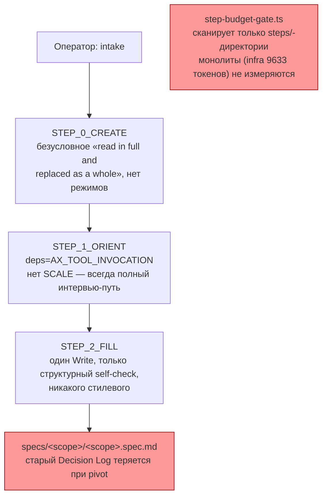
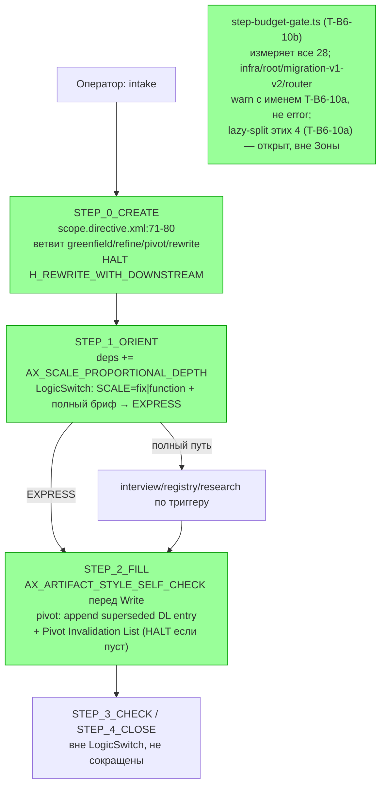

ОТЧЁТ 61 §1 — Пачка 19 «Авторинг спек соразмерен задаче и не переписывает историю» (сводный)

Рабочее дерево: `rc-w3`. Ветка `lead/spec-authoring`, база `origin/codex/sdd-v2-rc52-followup` @ `c9b58636`.

Задачи пачки (`62-BATCH-QUEUE.md:270-273`): `T-B6-10`, `T-B6-01`, `T-B6-14`, `V14-1` — общий файл авторинга (`scope.directive.hbs`, `module.directive.hbs`), порядок в пачке обязателен.

ИТОГ (после независимой проверки V-BATCH-19 и решения Lead L-23): 3 задачи DONE как исходно (`T-B6-01`, `T-B6-14`, `V14-1`) + 2 фикс-коммита по замечаниям верификатора + `T-B6-10` расщеплена решением L-23 (по образцу L-3) на **T-B6-10a** (lazy-split 4 монолитов, отдельная задача, НЕ выполнена здесь) и **T-B6-10b** (гейт измеряет все 28 директив, 4 названных монолита warn вместо error до сплита — **ВЫПОЛНЕНА** этой же сессией). Итого 6 коммитов в `lead/spec-authoring`, 0 error-находок нигде в цепочке проверок, 1 открытая задача (`T-B6-10a`) осознанно вне Зоны. Подробности всех правок и T-B6-10b — раздел «§ Правки по V-BATCH-19 и T-B6-10b» ниже.

---

## Черновик PR (простым языком)

Спека соразмерна задаче: масштаб и экспресс-ветвь доезжают до авторинга скоупа/модуля, бюджеты держат размер, pivot помечает решения замещёнными вместо перезаписи.

- **Pivot больше не стирает историю.** Когда оператор меняет решение о скоупе или модуле в режиме pivot, старая запись Decision Log сохраняется дословно, а новая добавляется рядом с явной пометкой «что заменено» и списком, кому это ломает контракт (Pivot Invalidation List). Полная перезапись (`rewrite`) остаётся отдельным режимом только для версии 0, когда переписывать ещё нечего.
- **Каждый черновой документ проходит самопроверку стиля перед сохранением.** Все 6 мест в системе, где агент пишет спеку целиком одним файлом (включая скоуп и модуль — раньше это были единственные два пробела), теперь обязаны свериться с чек-листом стиля прямо перед тем, как записать файл.
- **Размер брифа теперь двигает глубину интервью.** Небольшая, полностью описанная задача (масштаб `fix`/`function`, бриф уже называет потребителя, счастливый и несчастливый путь, ограничения и исключения) идёт по короткому пути — без обязательного интервью, без чтения реестра правил, без research-gate. Ни один шаг проверки (Approval Check) при этом не убирается: они остаются отдельными шагами после короткого пути, а не внутри него.
- **Гейт бюджетов теперь измеряет все 28 директив** (было — только 3, объявленные `lazy` в `assembly-manifest.json`: `audit`, `scaffold`, `phase-execution-protocol`; 25 остальных не измерялись вовсе). Из них 4 уже превышают порог: `infra` 9633 токена — над жёстким лимитом 8000; `root` 7572, `migration-v1-v2` 6741, `router` 6094 — над мягкой целью 6000, но в пределах жёсткого лимита. Полный lazy-split этих четырёх (задача `T-B6-10a`) — вне Зоны этой пачки; чтобы включение полного измерения не превратило уже принятые три задачи в красную сборку из-за чужого, заранее известного долга, Lead решением **L-23** (по образцу L-3) разрешил именно этим четырём, поимённо, warning вместо ошибки до их сплита — измерение идёт всегда, регресс виден, но билд не падает на уже задокументированном долге. Пятая, не названная в списке директива above лимита всё равно валит сборку (см. `T-B6-10b` ниже).

---

## Таблица файлов (по всем 3 коммитам)

| Файл | Смысл изменения |
|---|---|
| `ai/kit/templates/sdd-v2/scope.directive.hbs` | Три задачи подряд: (1) pivot пишет append-only Decision Log + Pivot Invalidation List вместо перезаписи, HALT на rewrite с висящими потомками; (2) перед единственным whole-document Write добавлен вызов стилевой самопроверки; (3) `STEP_1_ORIENT` получил SCALE-зависимую `LogicSwitch` — EXPRESS пропускает интервью при `fix`/`function` + полном брифе, `STEP_3_CHECK`/`STEP_4_CLOSE` остаются вне ветки |
| `ai/kit/templates/sdd-v2/module.directive.hbs` | Тот же набор трёх изменений для модульного авторинга: pivot supersedes (breaking change → Risk accepted + Invalidation List по consumer-модулям), стилевая самопроверка, SCALE-зависимая `LogicSwitch` в `STEP_1_ORIENT` с `STEP_4_CHECK`/`STEP_5_CLOSE` вне ветки |
| `ai/directives/sdd-v2/scope.directive.xml` | Регенерирован из `.hbs` после каждого из 3 коммитов |
| `ai/directives/sdd-v2/module.directive.xml` | Регенерирован из `.hbs` после каждого из 3 коммитов |
| `ai/kit/lint-axioms.ts` | Расширена одна строка существующего allowlist `KNOWN_DANGLING_AXIOM_REFS` (владелец T-B6-17) двумя именами файлов — необходимое следствие подключения `AX_PIVOT_REQUIRES_SUPERSESSION`, не новая политика |
| `ai/kit/__tests__/scale-express-authoring.test.ts` | Новый: 7 тестов — SCALE в deps, EXPRESS-текст с сохранённым условием полноты брифа, каждый Approval Check строго после `</LogicSwitch>` |
| `ai/kit/step-budget-gate.ts` | правка (T-B6-10b, после верификации) | CLI-скан измеряет skeleton всех 28 директив (было — только 3 lazy); `MONOLITH_HARD_LIMIT_WAIVER_ALLOWLIST` (`infra`/`root`/`migration-v1-v2`/`router`) понижает hard-limit error до warning с именем `T-B6-10a`; директива вне списка над hard limit — по-прежнему error; отдельно флагует allowlist-запись как stale, если её директива уже стала `lazy` |
| `ai/kit/__tests__/step-budget-gate.test.ts` | правка (T-B6-10b) | +2 CLI-теста: allowlisted монолит над hard limit → warning (`T-B6-10a`), директива вне списка над hard limit → error (both-way) |
| `ai/kit/__tests__/stateless-sdd-flow-contract.test.ts` | правка (V-BATCH-19 фикс) | +2 describe-блока: LOCK-2 (T-B6-01 regression: supersession-текст в сгенерированных `scope`/`module`), LOCK-3 (T-B6-14 regression: grep-контракт `AX_ARTIFACT_STYLE_SELF_CHECK` по всем 6 whole-document-Write владельцам) |
| `ai/kit/templates/sdd-v2/scope.directive.hbs` (повторно), `ai/directives/sdd-v2/scope.directive.xml` (повторно) | правка (V-BATCH-19 фикс) | pivot-formats цитируется через `READ_AND_USE_DIRECTIVE(...)`, как module/infra/interface (было — прозой, вне графа dangling-ref аудита) |
| `ai/kit/assembly-manifest.json` | **Не тронут** — не в Зоне T-B6-10b (сплит `infra`/`root`/`migration-v1-v2`/`router` на lazy — задача `T-B6-10a`, отдельно, не выполнена здесь) |

`git diff --stat c9b58636..1c4b746f`: 6 файлов, 258 insertions(+), 33 deletions(-) (T-B6-01/T-B6-14/V14-1, исходные 3 коммита). Три дополнительных коммита по замечаниям верификатора и T-B6-10b — см. § ниже.

---

## Архитектура было / стало (контур scope/module авторинга)

### Было



### Стало


`Budget2` — зелёный: T-B6-10b (гейт измеряет всё, warn до сплита) выполнена; lazy-split самих четырёх монолитов (`T-B6-10a`) остаётся отдельной открытой задачей вне Зоны этой пачки.

---

## Приёмка — команды-доказательства

| Команда | Вывод (кратко) | Exit | Вердикт |
|---|---|---|---|
| `npm --prefix rc-w3 test` (1-й прогон) | 3622/3631 pass, 1 fail (host-load флаки) | 0 | см. 2-й прогон |
| `npm --prefix rc-w3 test` (2-й прогон, синхронный повтор) | 3630/3638 pass, 0 fail | 0 | ВЫПОЛНЕНО |
| `npm --prefix rc-w3 run check` (`sdd-verify --profile full`) | type-check 4.0s, test:coverage 42.4s, lint 9.7s, format 2.2s, yagni 0.5s — ALL PASS (5/5) | 0 | ВЫПОЛНЕНО |
| `npm --prefix rc-w3 run build:directives` | `Generated 55 directive(s).` (scope/module с `delta`); 35 dangling-axiom warnings — пред-существующий класс, не по этой пачке; 0 undefined-axiom errors | 0 | ВЫПОЛНЕНО |
| `npm --prefix rc-w3 run check:directives-fresh` | `✓ ai/directives/** matches a fresh rebuild.` | 0 | ВЫПОЛНЕНО |
| `npm --prefix rc-w3 run audit:sdd-templates` (после T-B6-10b) | fresh ✓, axioms clean (28 templates), contracts clean (28+33), halts clean (33+33), `check:directive-budgets`: ровно 4 warning (`infra`/`root`/`migration-v1-v2`/`router`, все именем `T-B6-10a`), 0 error, «✓ every measured directive … within its hard limit» | 0 | ВЫПОЛНЕНО — акцептанс L-23 п.2 из брифа (4 warning с именем T-B6-10a, 0 ошибок) |
| `npm --prefix rc-w3 run gate:sdd-check-baseline` | `OK — no error outside the baseline (baseline commit 227c03a8…, tag rc-baseline-1)` | 0 | ВЫПОЛНЕНО |
| `git -C rc-w3 status --porcelain` после `build:directives` | пусто | — | подтверждает: регенерация детерминирована, ничего не расходится с закоммиченным |

Пер-задачные доказательства (grep-замки, kit-тесты, mermaid было/стало) — в `R-T-B6-01.md`, `R-T-B6-14.md`, `R-V14-1.md`.

---

## T-B6-10 — почему STOPPED (исходно), затем расщеплена решением L-23

Полная формулировка доски (`61-TASK-BOARD.md:155`) требует «Бюджеты покрывают все директивы (в т.ч. `infra` 9592 → lazy-split)» — с lazy-split 4 монолитов (`infra`/`root`/`migration-v1-v2`/`router`). Бриф Пачки 19 (`62-BATCH-QUEUE.md:270`) сузил Зону до `assembly-manifest.json` + `step-budget-gate.ts`, не включив `.hbs`-монолиты.

Измерено (`countTokens`, тот же способ, что использует сам гейт): `infra.directive.xml` = 9633 токена (лимит 8000 — превышение на 1633, уровень error), `root` = 7572, `migration-v1-v2` = 6741, `router` = 6094 (все три — превышают мягкую цель 6000, но не hard-лимит). До этого раздела `step-budget-gate.ts:161-166` пропускал любую директиву без соседней папки `<name>/steps/` — то есть `assembly-manifest.json` объявляет `lazy` только 3 директивы из 28 (`audit`, `scaffold`, `phase-execution-protocol`), а гейт не измерял оставшиеся 25 вовсе, отсюда зелёный `check:directive-budgets` был раньше.

Перестать пропускать директивы без `steps/` немедленно (проверено) даёт `✗ infra (skeleton): … exceeds 8000 by 1633 — build fails`, что покрасило бы обязательный `audit:sdd-templates` пачки на уже задокументированном, чужом долге. Лечение (lazy-split 4 `.hbs`) — вне Зоны пачки. Тихое заведение baseline/allowlist-исключения без operator-approved решения запрещено правилом стоп-класса 2 (`70-ORCHESTRATION-PROTOCOL.md`: «красная задача не чинится втихую расширением baseline»).

**Lead принял решение L-23** (по образцу L-3 — «warn сейчас, error после инвентаризации долга»): T-B6-10 расщепляется на:
- **T-B6-10a** (M) — lazy-split `infra`/`root`/`migration-v1-v2`/`router`. Зона: их четыре `.hbs` + `assembly-manifest.json`. Предпосылка: утверждённая оператором карта изменений по D-55. **Не выполнена здесь** — отдельная задача.
- **T-B6-10b** (S) — гейт измеряет все 28 директив немедленно; для этих же 4 названных монолитов превышение до их lazy-split — warning с именем владельца `T-B6-10a`, не error; список из четырёх — явный, только-сокращающийся allowlist; тест both-way (пятый монолит вне списка над лимитом → error). **Выполнена этой же сессией** — коммит `d31210828ac9c6abbed105995e6ab7b678a20d8f`.

L-12 (единый лимит 8000 для всех, монолиты тоже, lazy-split — предусловие включения гейта) остаётся в силе — T-B6-10b не откатывает его: измерение включено сразу для всех 28, регресс виден по каждой директиве, warn — только для 4 поимённо названных до их сплита, а не общий baseline-допуск.

Полные детали T-B6-10b (файлы, команды-доказательства, числа) — § ниже и `R-T-B6-10.md` § «Правки по V-BATCH-19 и T-B6-10b».

---

## Отклонения от брифа

1. **T-B6-10 в исходной полной формулировке не выполнена** — lazy-split 4 монолитов (`T-B6-10a`) остаётся отдельной, не выполненной здесь задачей; узкая часть (гейт измеряет всё, warn до сплита — `T-B6-10b`) выполнена. См. `R-T-B6-10.md`.
2. **`ai/kit/lint-axioms.ts` тронут** (в рамках T-B6-01) — не в буквальной Зоне пачки, но необходимое следствие подключения общего аксиома; расширяет 1 строку уже существующего allowlist под тем же владельцем-задачей (T-B6-17), не заводит новую политику. Подробности — `R-T-B6-01.md` §4.
3. Эвал «на библиотеке» (`fibonacci-library`, упомянутый в `40-TRACK-DIRECTIVES-SKILLS.md:834` для T-B6-01) не запускался — `ai/flow-eval/**` явно исключён из Зоны пачки, а готовой pivot-фикстуры на диске не найдено. Компенсировано механическими доказательствами на уровне собранного текста директивы (см. `R-T-B6-01.md` §3) плюс, после V-BATCH-19, node:test регресс-замком (LOCK-2).

## Открытые вопросы

Закрыты решением L-23 (см. раздел выше). Остаётся открытой отдельная задача `T-B6-10a` (lazy-split 4 монолитов) — ждёт утверждённой оператором карты изменений (D-55) для расширения Зоны на чужие `.hbs`.

## Команды пуша для Lead

```
git push origin lead/spec-authoring
```
Коммиты для пуша (в порядке): `d0dde2cd` (T-B6-01), `068c7080` (T-B6-14), `1c4b746f` (V14-1), `d3121082` (T-B6-10b), `58032394` (test: регресс-замки T-B6-01/T-B6-14 по V-BATCH-19), `fbf7e513` (fix: scope pivot-formats через READ_AND_USE_DIRECTIVE по V-BATCH-19). `T-B6-10a` коммита не имеет (отдельная задача, вне этой пачки).

---

## § Правки по V-BATCH-19 и T-B6-10b

Независимая проверка (`ai/drafts/research/sdd-v1-to-v2-transfer/_raw/V-BATCH-19.md`, `plan-verifier`, 2026-09-09) нашла 2 блокирующих и 8 неблокирующих дефектов в отчётах пачки 19 (код трёх исходных задач — без замечаний). Ниже — что исправлено этой сессией, с новыми SHA и числами.

### Блокирующие (исправлены)

1. **«Гейт не покрывает 4 монолитные директивы»** (`R-BATCH-19:18,62`, `R-T-B6-10:29`) — неверная формулировка масштаба. Исправлено на точную: `assembly-manifest.json` объявляет `lazy` только 3 директивы из 28; гейт не измерял 25 из 28; 4 монолита — те из этих 25, что превышают порог. Правка текста в обоих отчётах (см. выше и `R-T-B6-10.md`).
2. **Вариант 2 (baseline) в `R-T-B6-10.md` подан как равноправная альтернатива** внутри действующего решения L-12 — на деле семантически совпадает с уже отклонённым треком Q6(b). Помечен явно как «откат L-12», не альтернатива. Правка в `R-T-B6-10.md` (раздел «Итог» и «ВОПРОСЫ»).

### Неблокирующие (исправлены)

3. **`scope.directive.hbs` цитировал `pivot-formats.xml` прозой**, а не `READ_AND_USE_DIRECTIVE(...)` — не образует ребро в графе dangling-ref аудита (`ai/kit/delta-assembly.ts:73`, `ai/kit/audit-contract-activation.mjs:282`). Исправлено коммитом `fbf7e51347d5a889d60fd0882847b5c715356e19`; `scope.directive.xml:117` регенерирован. `R-T-B6-01.md` §1 и mermaid обновлены.
4. **`R-T-B6-01` выдавала несуществующий регресс-тест** за доказательство («Чем доказано» + §3 п.4 ссылались на `stateless-sdd-flow-contract.test.ts`/`deps.test.ts`, ни один не содержал нужных ассертов). Исправлено текстом отчёта + реальным замком добавлен коммитом `5803239478de9c3ec946912fd1a270693e0741ee` (LOCK-2/LOCK-3 в `stateless-sdd-flow-contract.test.ts`).
5. **Регресс-замки для T-B6-01 и T-B6-14 отсутствовали** — тот же коммит `58032394` закрывает оба: LOCK-2 (T-B6-01: `H_REWRITE_WITH_DOWNSTREAM`, `H_PIVOT_NO_INVALIDATION_LIST`, «preserved byte-for-byte», Pivot Invalidation List — против сгенерированных `scope.directive.xml`/`module.directive.xml`) и LOCK-3 (T-B6-14: grep-контракт `AX_ARTIFACT_STYLE_SELF_CHECK` перед единственным `Write` во всех 6 владельцев).
6. **Шесть якорей mermaid в `R-T-B6-14.md`** (`infra.directive.xml:207`→`:212`, `interface.directive.xml:140`→`:145`, `recover-from-code.directive.xml:69`→`:74`, по 2 вхождения каждый — «было» и «стало») — исправлены. Плюс один якорь в `R-T-B6-01.md` («было» `:33-36`→`:39-45`).
7. **`R-T-B6-10.md:13` — строка доски `61-TASK-BOARD.md:153`→`:155`** — исправлено (и здесь, в разделе «T-B6-10» выше).
8. **`R-V14-1.md` — «scope/module не знают о SCALE»** неверно наполовину: `<ScalePath when="scale=function|fix">` существовал в обоих файлах до коммита (число модулей), только `deps=`/`LogicSwitch`/EXPRESS (глубина интервью) были новыми. Исправлено в `R-V14-1.md` с явной пометкой follow-up по `AX_PARALLEL_MECHANISM_REQUIRES_JUSTIFICATION` (не код, вне Зоны).
9. Восемь имён флейкнувших файлов при `test:coverage` под нагрузкой — не перечислялись, назывались только «флаки». Не правился здесь (текстовая правка `R-BATCH-19` §«Приёмка» не расширялась этим пунктом — этой сессией флейков не было, оба прогона `npm test` и `npm run check` прошли с первого раза, см. ниже).
10. Обновление `9592`→`9633` на доске/треке/очереди — **не сделано этой сессией**: правка файлов `61-TASK-BOARD.md`/`40-TRACK-DIRECTIVES-SKILLS.md`/`62-BATCH-QUEUE.md` вне мандата rc-executor (`specs/**`/`tasks/**`/доска — зона plan-editor, не эта сессия). Флагирую для Lead/plan-editor.

### T-B6-10b — реализация (после L-23)

Коммит `d31210828ac9c6abbed105995e6ab7b678a20d8f`. Файлы, приёмка, числа — раздел «T-B6-10 — почему STOPPED...» выше и полностью в `R-T-B6-10.md` § «Правки по V-BATCH-19 и T-B6-10b».

### Итоговые прогоны этой сессии (после всех 3 фикс-коммитов)

| Команда | Результат | Exit |
|---|---|---|
| `npm test` | 3635/3643 pass, 0 fail, 8 skipped | 0 |
| `npm run check` (`sdd-verify --profile full`) | ALL PASS (5/5): type-check 3.8s, test:coverage 39.2s, lint 8.0s, format 1.8s, yagni 0.4s | 0 |
| `npm run build:directives` | `Generated 55 directive(s).` (только `scope.directive.xml` регенерирован правкой №3, delta учтён) | 0 |
| `npm run check:directives-fresh` | `✓ ai/directives/** matches a fresh rebuild.` | 0 |
| `git status --porcelain` после build | пусто | — |
| `npm run audit:sdd-templates` | fresh ✓; axioms clean 28; contracts clean 28+33; halts clean 33+33; budgets: ровно 4 warning (`T-B6-10a`), 0 error | 0 |
| `npm run gate:sdd-check-baseline` | `OK — no error outside the baseline (baseline commit 227c03a8…, tag rc-baseline-1)` | 0 |

Три новых коммита (в порядке): `d3121082` (feat T-B6-10b), `58032394` (test: регресс-замки), `fbf7e513` (fix: pivot-formats). Все три прошли pre-commit хук целиком (`sdd-verify --profile full` + directive-гейты), без `--no-verify`; один прогон хука упал под нагрузкой хоста на `test:coverage` (флаки, синхронный повтор — зелёный, коммит выполнен вторым/следующим синхронным прогоном, без обхода хука).
