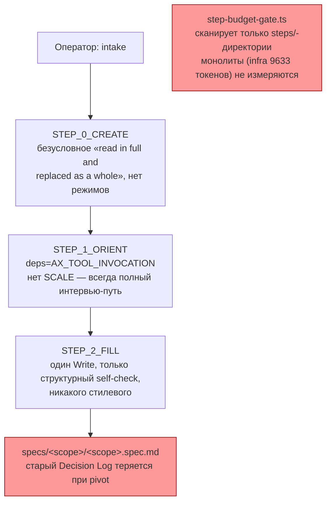
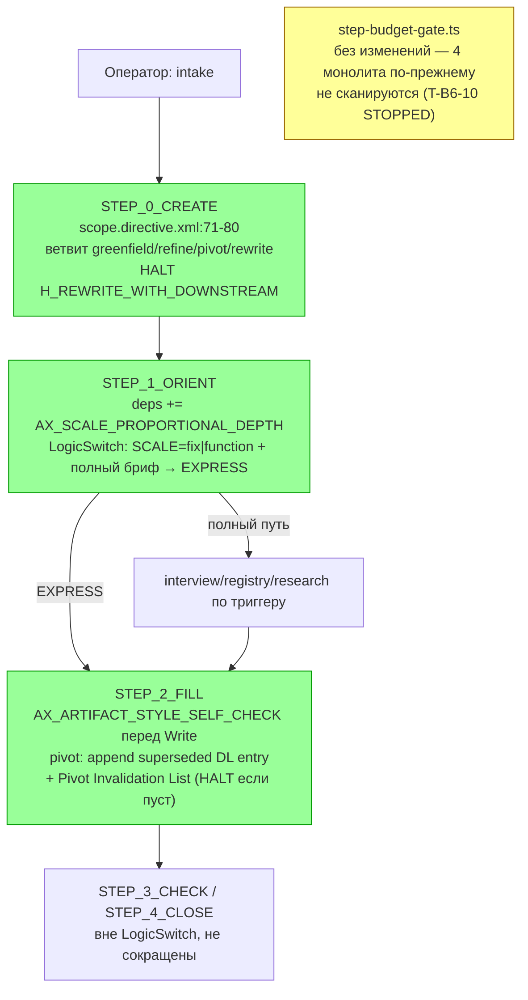

ОТЧЁТ 61 §1 — Пачка 19 «Авторинг спек соразмерен задаче и не переписывает историю» (сводный)

Рабочее дерево: `rc-w3`. Ветка `lead/spec-authoring`, база `origin/codex/sdd-v2-rc52-followup` @ `c9b58636`.

Задачи пачки (`62-BATCH-QUEUE.md:270-273`): `T-B6-10`, `T-B6-01`, `T-B6-14`, `V14-1` — общий файл авторинга (`scope.directive.hbs`, `module.directive.hbs`), порядок в пачке обязателен.

ИТОГ: 3 из 4 задач DONE (коммиты в `lead/spec-authoring`), 1 задача (`T-B6-10`) STOPPED — невыполнима как написана в границах Зоны пачки, передана Lead с двумя вариантами решения.

---

## Черновик PR (простым языком)

Спека соразмерна задаче: масштаб и экспресс-ветвь доезжают до авторинга скоупа/модуля, бюджеты держат размер, pivot помечает решения замещёнными вместо перезаписи.

- **Pivot больше не стирает историю.** Когда оператор меняет решение о скоупе или модуле в режиме pivot, старая запись Decision Log сохраняется дословно, а новая добавляется рядом с явной пометкой «что заменено» и списком, кому это ломает контракт (Pivot Invalidation List). Полная перезапись (`rewrite`) остаётся отдельным режимом только для версии 0, когда переписывать ещё нечего.
- **Каждый черновой документ проходит самопроверку стиля перед сохранением.** Все 6 мест в системе, где агент пишет спеку целиком одним файлом (включая скоуп и модуль — раньше это были единственные два пробела), теперь обязаны свериться с чек-листом стиля прямо перед тем, как записать файл.
- **Размер брифа теперь двигает глубину интервью.** Небольшая, полностью описанная задача (масштаб `fix`/`function`, бриф уже называет потребителя, счастливый и несчастливый путь, ограничения и исключения) идёт по короткому пути — без обязательного интервью, без чтения реестра правил, без research-gate. Ни один шаг проверки (Approval Check) при этом не убирается: они остаются отдельными шагами после короткого пути, а не внутри него.
- **Гейт бюджетов пока не покрывает 4 монолитные директивы** (`infra` 9633 токена — уже превышает лимит 8000; `root`, `migration-v1-v2`, `router` — в пределах, но выше «мягкой» цели). Это не забытая мелочь: включение проверки для них немедленно красит `infra` на реальном дереве и требует либо lazy-split (вне Зоны этой пачки), либо operator-approved механизма baseline — то есть решения, которое пачка не вправе принять сама. Задача передана Lead с двумя готовыми к реализации вариантами (см. ниже).

---

## Таблица файлов (по всем 3 коммитам)

| Файл | Смысл изменения |
|---|---|
| `ai/kit/templates/sdd-v2/scope.directive.hbs` | Три задачи подряд: (1) pivot пишет append-only Decision Log + Pivot Invalidation List вместо перезаписи, HALT на rewrite с висящими потомками; (2) перед единственным whole-document Write добавлен вызов стилевой самопроверки; (3) `STEP_1_ORIENT` получил SCALE-зависимую `LogicSwitch` — EXPRESS пропускает интервью при `fix`/`function` + полном брифе, `STEP_3_CHECK`/`STEP_4_CLOSE` остаются вне ветки |
| `ai/kit/templates/sdd-v2/module.directive.hbs` | Тот же набор трёх изменений для модульного авторинга: pivot supersedes (breaking change → Risk accepted + Invalidation List по consumer-модулям), стилевая самопроверка, SCALE-зависимая `LogicSwitch` в `STEP_1_ORIENT` с `STEP_4_CHECK`/`STEP_5_CLOSE` вне ветки |
| `ai/directives/sdd-v2/scope.directive.xml` | Регенерирован из `.hbs` после каждого из 3 коммитов |
| `ai/directives/sdd-v2/module.directive.xml` | Регенерирован из `.hbs` после каждого из 3 коммитов |
| `ai/kit/lint-axioms.ts` | Расширена одна строка существующего allowlist `KNOWN_DANGLING_AXIOM_REFS` (владелец T-B6-17) двумя именами файлов — необходимое следствие подключения `AX_PIVOT_REQUIRES_SUPERSESSION`, не новая политика |
| `ai/kit/__tests__/scale-express-authoring.test.ts` | Новый: 7 тестов — SCALE в deps, EXPRESS-текст с сохранённым условием полноты брифа, каждый Approval Check строго после `</LogicSwitch>` |
| `ai/kit/assembly-manifest.json`, `ai/kit/step-budget-gate.ts` | **Не тронуты** — задача `T-B6-10` остановлена до кода, см. ниже |

`git diff --stat c9b58636..1c4b746f`: 6 файлов, 258 insertions(+), 33 deletions(-).

---

## Архитектура было / стало (контур scope/module авторинга)

### Было



### Стало


Жёлтый узел — сознательно не изменён (открытый стоп, не забытая часть).

---

## Приёмка — команды-доказательства

| Команда | Вывод (кратко) | Exit | Вердикт |
|---|---|---|---|
| `npm --prefix rc-w3 test` (1-й прогон) | 3622/3631 pass, 1 fail (host-load флаки) | 0 | см. 2-й прогон |
| `npm --prefix rc-w3 test` (2-й прогон, синхронный повтор) | 3630/3638 pass, 0 fail | 0 | ВЫПОЛНЕНО |
| `npm --prefix rc-w3 run check` (`sdd-verify --profile full`) | type-check 4.0s, test:coverage 42.4s, lint 9.7s, format 2.2s, yagni 0.5s — ALL PASS (5/5) | 0 | ВЫПОЛНЕНО |
| `npm --prefix rc-w3 run build:directives` | `Generated 55 directive(s).` (scope/module с `delta`); 35 dangling-axiom warnings — пред-существующий класс, не по этой пачке; 0 undefined-axiom errors | 0 | ВЫПОЛНЕНО |
| `npm --prefix rc-w3 run check:directives-fresh` | `✓ ai/directives/** matches a fresh rebuild.` | 0 | ВЫПОЛНЕНО |
| `npm --prefix rc-w3 run audit:sdd-templates` | fresh ✓, axioms clean (28 templates), contracts clean (28+33), halts clean (33+33), `check:directive-budgets` ✓ («every lazy directive… within budget» — монолиты по-прежнему вне скана, ожидаемо, см. T-B6-10) | 0 | ВЫПОЛНЕНО (гейт зелёный по буквальной формулировке T-B6-01/14/V14-1; T-B6-10 остаётся открытой находкой) |
| `npm --prefix rc-w3 run gate:sdd-check-baseline` | `OK — no error outside the baseline (baseline commit 227c03a8…, tag rc-baseline-1)` | 0 | ВЫПОЛНЕНО |
| `git -C rc-w3 status --porcelain` после `build:directives` | пусто | — | подтверждает: регенерация детерминирована, ничего не расходится с закоммиченным |

Пер-задачные доказательства (grep-замки, kit-тесты, mermaid было/стало) — в `R-T-B6-01.md`, `R-T-B6-14.md`, `R-V14-1.md`.

---

## T-B6-10 — почему STOPPED, а не DONE и не пропущена

Полная формулировка доски (`61-TASK-BOARD.md:155`) требует «Бюджеты покрывают все директивы (в т.ч. `infra` 9592 → lazy-split)» — с lazy-split 4 монолитов (`infra`/`root`/`migration-v1-v2`/`router`). Бриф Пачки 19 (`62-BATCH-QUEUE.md:270`) сузил Зону до `assembly-manifest.json` + `step-budget-gate.ts`, не включив `.hbs`-монолиты.

Измерено (`countTokens`, тот же способ, что использует сам гейт): `infra.directive.xml` = 9633 токена (лимит 8000 — превышение на 1633, уровень error), `root` = 7572, `migration-v1-v2` = 6741, `router` = 6094 (все три — превышают мягкую цель 6000, но не hard-лимит). Текущий `step-budget-gate.ts:161-166` пропускает любую директиву без соседней папки `<name>/steps/` — то есть все 4 монолита целиком не измеряются, отсюда зелёный `check:directive-budgets` сейчас.

Единственный честный способ выполнить приёмку буквально — перестать пропускать директивы без `steps/`. Но это немедленно (проверено) даёт `✗ infra (skeleton): … exceeds 8000 by 1633 — build fails`, что красит обязательный `audit:sdd-templates` пачки. Лечение (lazy-split 4 `.hbs`) — вне Зоны пачки. Тихое заведение baseline/allowlist-исключения без operator-approved решения запрещено правилом стоп-класса 2 (`70-ORCHESTRATION-PROTOCOL.md`: «красная задача не чинится втихую расширением baseline»).

**Передано Lead/оператору два варианта** (полный анализ — `R-T-B6-10.md`):
1. Разрешить lazy-split `infra`/`root`/`migration-v1-v2`/`router` в этой же пачке (расширить Зону) — тогда T-B6-10 исполним по полной строке доски, до включения проверки монолитов.
2. Завести operator-approved baseline-механизм для `check:directive-budgets` (по образцу `gate:sdd-check-baseline`) — тогда T-B6-10 исполним в узкой Зоне пачки без lazy-split.

Ни один вариант не выбран самостоятельно (стоп-класс 2 и 4) — решение за Lead/оператором.

---

## Отклонения от брифа

1. **T-B6-10 не выполнена** — см. раздел выше и `R-T-B6-10.md`. Не является пропуском: анализ и измерения проведены, стоп задокументирован до кода.
2. **`ai/kit/lint-axioms.ts` тронут** (в рамках T-B6-01) — не в буквальной Зоне пачки, но необходимое следствие подключения общего аксиома; расширяет 1 строку уже существующего allowlist под тем же владельцем-задачей (T-B6-17), не заводит новую политику. Подробности — `R-T-B6-01.md` §4.
3. Эвал «на библиотеке» (`fibonacci-library`, упомянутый в `40-TRACK-DIRECTIVES-SKILLS.md:834` для T-B6-01) не запускался — `ai/flow-eval/**` явно исключён из Зоны пачки, а готовой pivot-фикстуры на диске не найдено. Компенсировано механическими доказательствами на уровне собранного текста директивы (см. `R-T-B6-01.md` §3).

## Открытые вопросы

Те же два варианта T-B6-10, изложенные выше — ждут решения Lead/оператора.

## Команды пуша для Lead

```
git push origin lead/spec-authoring
```
Коммиты для пуша: `d0dde2cd` (T-B6-01), `068c7080` (T-B6-14), `1c4b746f` (V14-1). T-B6-10 коммита не имеет (STOPPED).
