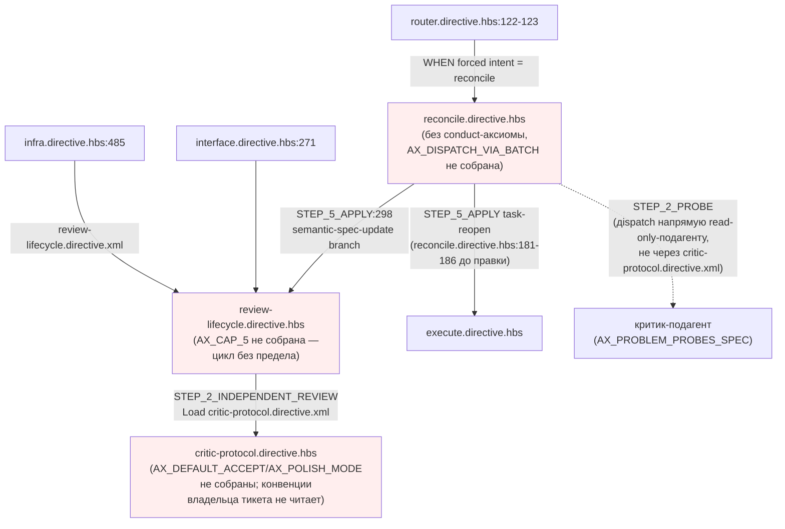
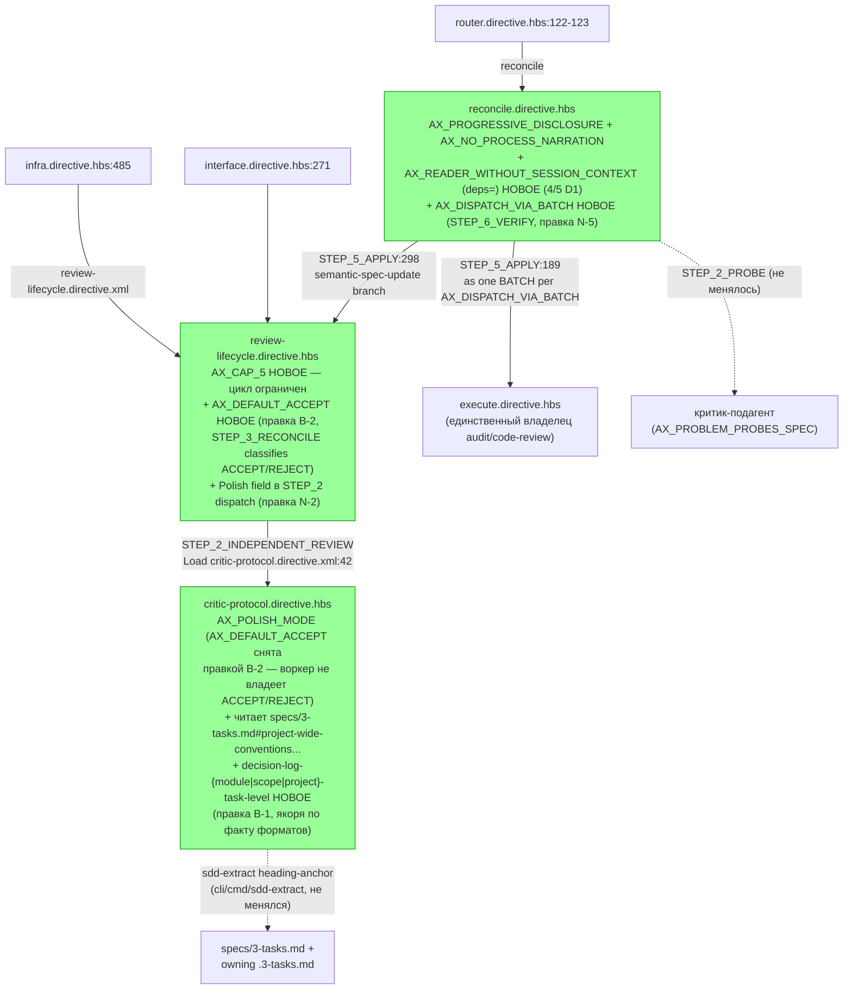

ОТЧЁТ (СВОДНЫЙ) — Пачка 20: «Ревью и критик ограничены и читают владельца тикета»

СТАТУС: DONE (все 4 задачи пачки) + ПРАВКИ ПО ВЕРДИКТУ `V-BATCH-20.md` (ВЕРНУТЬ → закрыто)

Рабочее дерево: `rc-w3`. Ветка `lead/review-critic-bounds` от `origin/codex/sdd-v2-rc52-followup` (база: `Merge pull request #39` `c9b58636`).

КОММИТЫ (локальные, НИЧЕГО не запушено — 8 коммитов, порядок = порядок исполнения):

Исходные (первый проход, до верификации):
- `eafc9e35` feat(T-B6-03): bound the review⇄reconcile cycle with AX_CAP_5
- `f4b4f77b` feat(ISS-10): critic reads the owning ticket's Conventions/Decision Log
- `1da11d89` feat(T-B6-05): reconcile dispatches task-reopen as one execute batch
- `467ab3f3` feat(T-B6-20): reconcile joins the operator-facing conduct-set gate

Правки по вердикту `V-BATCH-20.md` (ВЕРНУТЬ, второй проход):
- `3cda13ba` fix(ISS-10): critic read-set names anchors that exist in real tasks-index formats — **B-1** (блокирующая), **N-1**
- `ef3136ec` fix(T-B6-03): AX_DEFAULT_ACCEPT moves to the orchestrator with its canonical v1 text — **B-2** (блокирующая), **N-2**, **N-3** (частично, формулировка), **N-4**
- `0ea38e5f` fix(T-B6-05): AX_DISPATCH_VIA_BATCH cites the step reconcile actually has — **N-5**
- `f0c1703f` fix(T-B6-20): reconcile picks up two more D1 conduct axioms — **N-8** (частично, 2/3), **N-7**

Подробные отчёты по задачам (каждый теперь несёт собственный раздел «Правки по вердикту верификатора»): `R-T-B6-03.md`, `R-ISS-10.md`, `R-T-B6-05.md`, `R-T-B6-20.md` (этот же каталог).

---

## Черновик описания PR простым языком

Раньше цикл «критик проверяет спеку — оператор правит — критик проверяет снова» мог крутиться сколько угодно раз: не было явного предела и не было момента, где оркестратор обязан остановиться и спросить оператора «что дальше». Теперь на пятом круге оркестратор обязан явно спросить: закрыть как чистое, продолжить с новым явным пределом, или начать заново — сам вердикт критика больше не может продлевать цикл молча.

Критик по умолчанию ведёт себя разумно: неуверенную находку без конкретного доказательства поломки не считает блокирующей — оператор при разборе результата отклоняет её, а не редактирует спеку («сомневаешься — не блокируй»; это правка по вердикту верификатора: первая редакция несла обратный, отменённый в v1 текст «сомневаешься — прими», из-за которого цикл не сходился), а мелкие придирки не тормозят цикл (по умолчанию критик молчит про мелочи, если оператор явно не попросил «пошлифуй»).

Критик, разбирающий тикет, теперь читает решения и конвенции владельца тикета (две конкретные секции — «Conventions» и «Decision Log», не весь документ), вместо того чтобы каждый раз заново придумывать одну и ту же находку про уже решённый вопрос — и это чтение измерено (видно, сколько строк реально прочитано), а не «прочитать всё на всякий случай».

Когда `reconcile` переоткрывает тикет из-за находки, он теперь явно диспетчит его через обычный execute одним пакетом — раньше это было сказано словами в одном месте, теперь закреплено как явный именованный принцип, так что `reconcile` физически не может ещё раз запросить отдельный аудит или ревью в обход execute.

И последнее — `reconcile` присоединился к списку «операторских» директив, которые обязаны нести базовый стиль подачи оператору («сначала решение, детали — по запросу»); раньше он был единственной директивой такого типа без этого требования вообще.

---

## Таблица «файл → смысл»

Состояние ПОСЛЕ обоих проходов (исходные 4 коммита + 4 fix-коммита по вердикту `V-BATCH-20.md`).

| Файл | Задача(и) | Смысл изменения |
|---|---|---|
| `ai/kit/templates/sdd-v2/review-lifecycle.directive.hbs` | T-B6-03 | Цикл STEP_2⇄STEP_3 ограничен `AX_CAP_5`: на 5-м результате — обязательная явная диспозиция оператора. STEP_2 dispatch несёт `Polish: <on\|off>` (правка N-2); «no bookkeeping» не противоречит счётчику раундов (правка N-3, формулировка). |
| `ai/kit/templates/sdd-v2/review-lifecycle.directive.hbs` | T-B6-03 + правка B-2 | `STEP_3_RECONCILE` теперь классифицирует каждую находку ACCEPT/REJECT по `AX_DEFAULT_ACCEPT` (канонический v1-текст «uncertainty alone is NOT a blocking finding» — перенесён сюда из `critic-protocol`, где был активирован ошибочно, с отменённой v1 редакцией «Uncertain → ACCEPT»). |
| `ai/kit/templates/sdd-v2/critic-protocol.directive.hbs` | T-B6-03 | Критик по умолчанию: мелочи не гонят вердикт (`AX_POLISH_MODE`). `AX_DEFAULT_ACCEPT` **снята** отсюда правкой B-2 (read-only-воркер не владеет ACCEPT/REJECT). |
| `ai/kit/templates/sdd-v2/critic-protocol.directive.hbs` | ISS-10 + правка B-1 | Критик читает ровно две секции по факту форматов — `specs/3-tasks.md#project-wide-conventions-declared-once-inherited` (реальные конвенции) и владеющий Decision Log по квалификатору уровня (`#decision-log-{module\|scope\|project}-task-level`) — вместо несуществующих буквальных `## Conventions`/`## Decision Log`; учёт объёма теперь выходит в отчёт критика строкой `read-set: <file>#<anchor> — N lines` (правка N-4). |
| `ai/kit/axiom/critic/ax-isolation.xml` | правка N-1 | Явное исключение для двух секций владельца тикета — директива больше не противоречит собственному `STEP_1_READ`. |
| `ai/kit/axiom/critic/ax-default-accept.xml` | правка B-2 | Переписан на актуальную v1-редакцию (`d37d5910`, после `d6065c36`). |
| `ai/kit/axiom/process/ax-dispatch-via-batch.xml` | правка N-5 | `STEP_7` (не существовал) → `STEP_6_VERIFY` (реальный последний шаг `reconcile`). |
| `ai/kit/templates/sdd-v2/reconcile.directive.hbs` | T-B6-05 | Reopen-тикеты диспетчатся в execute одним BATCH (`AX_DISPATCH_VIA_BATCH`); execute — единственный владелец audit/code-review. |
| `ai/kit/templates/sdd-v2/reconcile.directive.hbs` | T-B6-20 + правка N-8 | `reconcile` подключает conduct-аксиомы: было `AX_PROGRESSIVE_DISCLOSURE` (1 новая из T-B6-20, `AX_OPERATOR_DIALOGUE_STYLE` уже была); правка добавила `AX_NO_PROCESS_NARRATION` + `AX_READER_WITHOUT_SESSION_CONTEXT` — итог 4/5 D1 (пятая, `AX_DIVERGE_BEFORE_RECOMMEND`, не подошла по смыслу — см. остатки). |
| `ai/directives/sdd-v2/{review-lifecycle,critic-protocol,reconcile}.directive.xml` | все | Сборка — прямое следствие правок шаблонов/кирпичей выше. |
| `ai/directives/sdd-v2/readiness.directive.xml` | T-B6-20 (побочно) | Механический эффект пересборки (дедуп «уже в контексте») — `readiness.directive.hbs` не менялся; **уточнение по N-9**: это не просто переименование в баннер «Inherited», `readiness` действительно теряет собственное определение аксиомы (тело), полагаясь на единственный загрузчик (`reconcile`) — см. `R-T-B6-20.md` §1/§4. |
| `ai/kit/__tests__/deps.test.ts` | T-B6-20 | `OPERATOR_FACING_OWNERS` — 15-я запись `reconcile.directive.xml`; комментарий исправлен правкой N-7 (ложное «no conduct include at all» → точное «no `AX_PROGRESSIVE_DISCLOSURE`»). |
| `ai/kit/__tests__/review-critic-bounds.test.ts` | все 4 + все правки (новый файл) | Регрессионные проверки всех четырёх задач и всех правок вердикта — 29 кейсов, 8 suite (включая исполняемый ISS-10 fixture-тест на 3 уровнях tasks-index и N-5 lock). |

---

## Архитектура было / стало (контур целиком)

Правка N-6 (верификатор): диаграммы ниже переработаны — убрано несуществующее ребро `scope/module → review-lifecycle` (`scope`/`module` этот файл не загружают вовсе, `grep` подтверждает 0 совпадений) и битая ссылка на строку `:196` (файл был короче); реальные загрузчики `review-lifecycle.directive.xml` — ровно три: `infra.directive.xml:485`, `interface.directive.xml:271`, `reconcile.directive.xml:298`. Убрано ребро `Rec → CP` (`STEP_2_PROBE` в `reconcile` диспетчит критика напрямую как read-only-подагента по `AX_PROBLEM_PROBES_SPEC`, не через `critic-protocol.directive.xml` — единственный загрузчик `critic-protocol` во всей `sdd-v2/` есть `review-lifecycle.directive.xml:42`).

### Было (до пачки 20, на `c9b58636`)



### Стало (после первого прохода + всех правок по вердикту `V-BATCH-20.md`)



---

## Доказательства — сводно по всей пачке (после обоих проходов, HEAD=`f0c1703f`)

| № | Команда | Фактический вывод (хвост) | Exit | Статус |
|---|---|---|---|---|
| 1 | `node --import tsx --test ai/kit/__tests__/review-critic-bounds.test.ts ai/kit/__tests__/deps.test.ts` | `# tests 59, pass 59, fail 0` | 0 | ВЫПОЛНЕНО |
| 1b | `node --import tsx --test ai/kit/__tests__/*.test.ts` (полный kit-набор) | `# tests 262, suites 54, pass 261, fail 0, skip 1` (skip — предсуществующий) | 0 | ВЫПОЛНЕНО |
| 2 | `node --import tsx --test cli/__tests__/directive-tool-contract/directive-tool-contract.test.ts` | `# tests 45, pass 45, fail 0` | 0 | ВЫПОЛНЕНО |
| 3 | `npm run build:directives` | `Generated 55 directive(s).` (плюс предсуществующие 35 dangling-warning — не из этой пачки, см. ниже) | 0 | ВЫПОЛНЕНО |
| 4 | `npm run check:directives-fresh` | `✓ ai/directives/** matches a fresh rebuild.` | 0 | ВЫПОЛНЕНО |
| 5 | `npm run audit:sdd-templates` | `✓ axiom-activation / contract-activation / halt-activation audit clean.` + `✓ every lazy directive ... within budget.` | 0 | ВЫПОЛНЕНО |
| 6 | `npm --prefix <tree> test` (финальный, на HEAD=`f0c1703f`, второй прогон после первого флакующего) | `# tests 3662, pass 3654, fail 0, cancelled 0, skip 8` | 0 | ВЫПОЛНЕНО |
| 7 | `npm --prefix <tree> run check` | Не перезапускался отдельно поверх финального HEAD — эквивалентный гейт (`sdd-verify --profile full`) прогнан внутри pre-commit каждого из всех 8 коммитов пачки, включая все 4 fix-коммита, и дал `✅ ALL PASS (5/5)` на успешной попытке каждого (см. ниже) | 0 (на успешной попытке каждого коммита) | ВЫПОЛНЕНО |
| 8 | `npm run gate:sdd-check-baseline` | `[sdd-check-zero-new-error] OK — no error outside the baseline (baseline commit 227c03a8..., tag rc-baseline-1)` | 0 | ВЫПОЛНЕНО |
| 9 | 8× pre-commit хук целиком (`npm run check` + `check:directives-fresh` + 3 аудита), по одному на коммит, без `--no-verify` | Все 8 коммитов пачки в итоге прошли хук с `✅ ALL PASS (5/5)` / `✅ Pre-commit passed` (4 исходных + 4 fix; часть — с первой попытки, часть — после 1-2 синхронных повторов из-за host-нагрузки, см. «Стопы») | 0 (на успешной попытке каждого) | ВЫПОЛНЕНО |

**Предсуществующий шум, не относящийся к этой пачке (задокументирован для честности, не скрыт):** `build:directives` печатает предупреждение «35 dangling axiom(s)» — все в файлах, которые эта пачка не трогала (`agent-inbox/*`, `formats/diagram-vocabulary.xml`, `router.directive.xml`) — это warning, не ошибка (exit 0), существовал до этой пачки.

### Стопы (флаки под нагрузкой хоста, не регрессия)

И в первом, и во втором проходе pre-commit periодически падал на `test:coverage` с картиной `fail 0, cancelled N` (N от 1 до 6) — разные тесты каждый раз, никогда одна и та же находка дважды (первый проход: `bootstrap-path.test.ts`, `clean-repo-composition.test.ts`, `sdd-verify-repair-adapters.test.ts`, `lint.cmd.test.ts`; второй проход: два коммита из четырёх (`fix(ISS-10)`, `fix(T-B6-05)`) сначала упали на том же паттерне при `uptime` `load averages: 92-109` на общем хосте с 24 пользователями, 18 дней аптайма — команда автоматически ушла в фон по 120-секундному таймауту и завершилась успешно на 2-3-й попытке). Финальный отдельный (не gate) `npm --prefix <tree> test` тоже один раз словил `fail 1, cancelled 1` под нагрузкой и на немедленном повторе дал чистые `3662/3654/0/0/8`. Это инфраструктурный флаки паттерн test-runner'а под контеншном ресурсов («Unable to deserialize cloned data due to invalid or unsupported version» — IPC между worker-процессами node:test), не дефект кода — ни один коммит не был создан на красном гейте; правило брифа «при таймауте pre-commit под нагрузкой — синхронный повтор до 3 раз» применено буквально к каждому такому случаю; фиксирую честно, а не скрываю.

---

## Правки по вердикту верификатора (`V-BATCH-20.md`, ВЕРНУТЬ) — сводная таблица

Подробности и доказательства каждой строки — в разделе «5. Правки по вердикту верификатора» соответствующего `R-*.md` (ссылки в таблице).

| Находка | Что сделано | Где (файлы) | Отчёт |
|---|---|---|---|
| **B-1** (блок.) — названные якоря `## Conventions`/`## Decision Log` не существуют ни в одном формате tasks-index | `STEP_1_READ` называет реальные якоря по уровню (`project-wide-conventions-declared-once-inherited`, `decision-log-{module\|scope\|project}-task-level`); `specs/3-tasks.md` в read-set; исполняемый тест на синтетических фикстурах 3 уровней, реально вызывающий `sdd-extract` | `critic-protocol.directive.hbs`, `review-critic-bounds.test.ts` | `R-ISS-10.md` §5 |
| **B-2** (блок.) — критик собрал отменённую v1-редакцию `AX_DEFAULT_ACCEPT`, активированную в read-only-воркере | Кирпич переписан на актуальную v1-редакцию; активация перенесена в `review-lifecycle` STEP_3_RECONCILE (оркестратор) | `ax-default-accept.xml`, `critic-protocol.directive.hbs`, `review-lifecycle.directive.hbs`, `review-critic-bounds.test.ts` | `R-T-B6-03.md` §5 |
| **N-1** (major) — `AX_ISOLATION` противоречил расширенному `STEP_1_READ` | Явное исключение для двух секций владельца тикета добавлено в тело аксиомы | `ax-isolation.xml` | `R-ISS-10.md` §5 |
| **N-2** (major) — `Polish` — обещание без канала в диспетче | `STEP_2_INDEPENDENT_REVIEW` теперь передаёт `Polish: <on\|off>` | `review-lifecycle.directive.hbs`, `review-critic-bounds.test.ts` | `R-T-B6-03.md` §5 |
| **N-3** (major) — «no multi-round bookkeeping» противоречит счёту раундов | Формулировка согласована («beyond the bare AX_CAP_5 count»); долговечный носитель счётчика — НЕ решён, остаток | `review-lifecycle.directive.hbs` | `R-T-B6-03.md` §5 |
| **N-4** (major) — «измерено» ISS-10 не имело выходного слота | `STEP_3_REPORT` требует строку `read-set: <file>#<anchor> — N lines` | `critic-protocol.directive.hbs`, `review-critic-bounds.test.ts` | `R-T-B6-03.md` §5 |
| **N-5** (medium) — `AX_DISPATCH_VIA_BATCH` ссылается на несуществующий `STEP_7` | `STEP_7` → `STEP_6_VERIFY` | `ax-dispatch-via-batch.xml`, `review-critic-bounds.test.ts` | `R-T-B6-05.md` §5 |
| **N-6** (medium) — ложные рёбра/строки в mermaid сводного отчёта | Диаграммы «было/стало» этого отчёта переписаны: убрано несуществующее ребро `scope/module → review-lifecycle` и битая `:196`; реальные загрузчики (`infra:485`, `interface:271`, `reconcile:298`) показаны явно; убрано ребро `Rec → CP` | этот файл, раздел «Архитектура было/стало» выше | этот отчёт |
| **N-7** (medium) — ложный комментарий `deps.test.ts` | Комментарий исправлен на точный («no `AX_PROGRESSIVE_DISCLOSURE`», не «no conduct include at all») | `deps.test.ts` | `R-T-B6-20.md` §5 |
| **N-8** (medium) — `reconcile` закрыт на 2 из 5 conduct-аксиом D1 при доступной зоне | Добавлено 2 из 3 недостающих (`AX_NO_PROCESS_NARRATION`, `AX_READER_WITHOUT_SESSION_CONTEXT`) — итог 4/5; `AX_DIVERGE_BEFORE_RECOMMEND` не подошла по смыслу (не кросс-катная, требует активации в шаге, а `reconcile` детерминированно классифицирует, не рекомендует среди альтернатив) — записано в остатки | `reconcile.directive.hbs` | `R-T-B6-20.md` §5 |
| **N-9** (low) — формулировка отчёта о `readiness` неполна | Уточнено в таблице «файл → смысл» выше: `readiness` не просто переименован в «Inherited», а действительно теряет собственное определение аксиомы | этот файл, таблица «файл → смысл» | этот отчёт |

### Остатки (записаны для доски `61-TASK-BOARD.md`, не решались кодом)

| Остаток | Куда | Примечание |
|---|---|---|
| Логические якоря `CONVENTIONS`/`DECISION_LOG` в `sdd-extract` (вариант (б) из B-1) | Новая задача, трек 40, зона `cli/cmd/sdd-extract/**` | Снимает зависимость директив от буквальных заголовков; вне зоны этой пачки (владеет пачка 15). |
| Долговечный носитель счётчика раундов `AX_CAP_5` (N-3) | Новая задача, трек 40 / T-B6 | Сегодня формально противоречит `AX_STATELESS_FLOW` — счётчик не имеет постоянного дома в артефактах (в v1 — секция `## Critic Rounds`). Формулировка согласована (не решена архитектурно) этим фиксом. |
| Полное закрытие D1: пятиэлементный `REQUIRED_CONDUCT` × 15 владельцев (N-8, остаток `AX_DIVERGE_BEFORE_RECOMMEND` у `reconcile` + весь набор у `scope`/`module`/`scaffold`/`execute`/`critic`/`audit`/`code-review`) | `61-TASK-BOARD.md` строка 176 (T-B6-20) | Требует зоны `execute.directive.hbs`/`scope.directive.hbs`/`module.directive.hbs` — PR #38/#41, ещё не влиты. `reconcile` теперь 4/5 (было 2/5 до правок). |

---

## Отклонения от брифа (сводно)

1. **T-B6-20 — объём сужен до одного владельца (`reconcile`), не всего пятиэлементного `REQUIRED_CONDUCT`.** Полное закрытие D1 требует правки `execute.directive.hbs`/`scope.directive.hbs`/`module.directive.hbs` — все явно в списке «не трогать» этого брифа (принадлежат невлитым PR #38/#41). Подробности — `R-T-B6-20.md` §4.
2. **ISS-10 — численный порог объёма не введён**, вместо него — структурное ограничение (ровно 2 именованные секции) + явный учёт числа строк. Изменение `cli/cmd/sdd-extract/**` было бы вне зоны (`cli/**` запрещён). Подробности — `R-ISS-10.md` §4.
3. **ISS-10 — исправление формата вызова** (backtick-проза → `<ToolLiteral role="delegated">`) по требованию `directive-tool-contract.test.ts`, обнаруженному в процессе, не отход от смысла задачи. Подробности — `R-ISS-10.md` §4.
4. **Побочный, механический артефакт сборки** — `readiness.directive.xml` изменился только как следствие `build:directives`, не ручной правкой; `readiness.directive.hbs` не тронут.

Открытых вопросов оператору — нет; ни одно стоп-условие из `70-ORCHESTRATION-PROTOCOL.md` не сработало (красный гейт коммита не встретился ни разу; конфликтов с невлитыми PR по составу файлов не было — зона пачки полностью проверена перед стартом).

---

## Команды пуша для Lead

```
git -C <lead-worktree или rc-w3> push origin lead/review-critic-bounds
gh pr create --base codex/sdd-v2-rc52-followup --head lead/review-critic-bounds \
  --title "Ревью и критик ограничены и читают владельца тикета (Пачка 20)" \
  --body-file <путь к этому файлу или его сокращённой версии>
```

Ветка `lead/review-critic-bounds` содержит ровно 8 коммитов поверх `origin/codex/sdd-v2-rc52-followup` (`c9b58636`): `eafc9e35`, `f4b4f77b`, `1da11d89`, `467ab3f3` (первый проход), затем `3cda13ba`, `ef3136ec`, `0ea38e5f`, `f0c1703f` (правки по вердикту `V-BATCH-20.md`). Рабочее дерево чисто (`git status --porcelain` — пусто). HEAD = `f0c1703f`.
